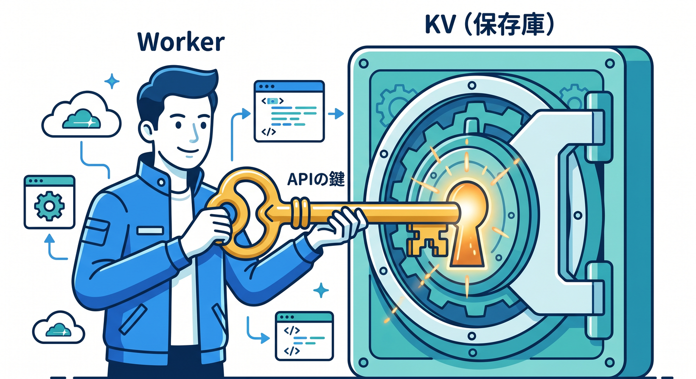
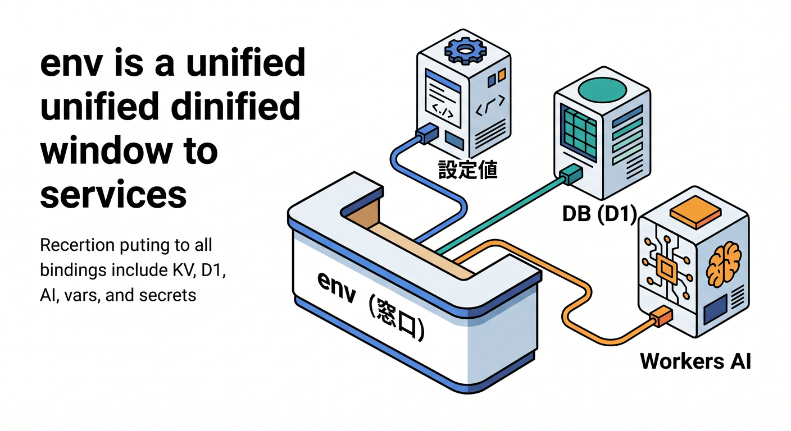
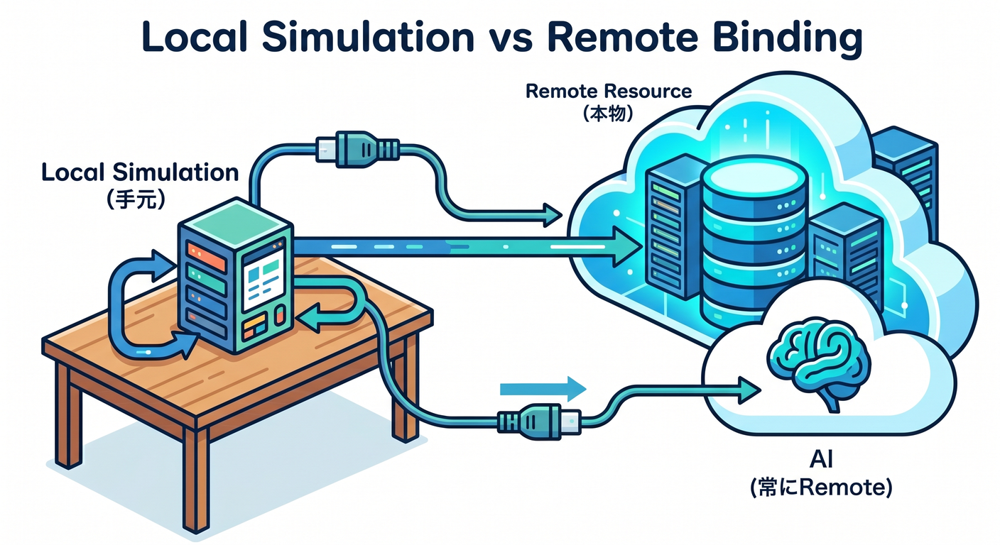
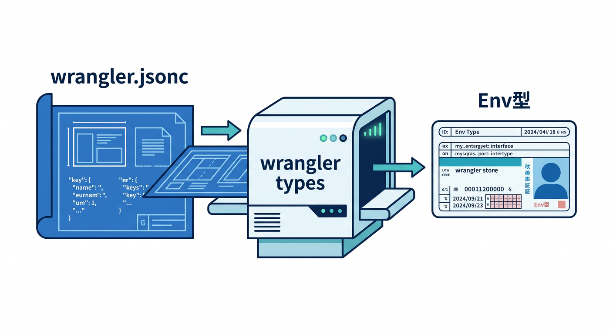
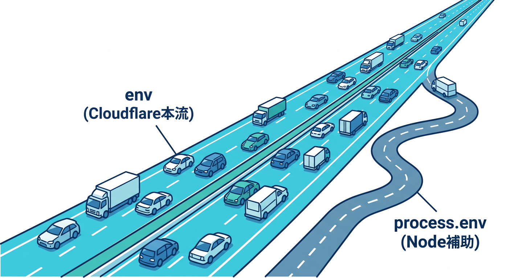
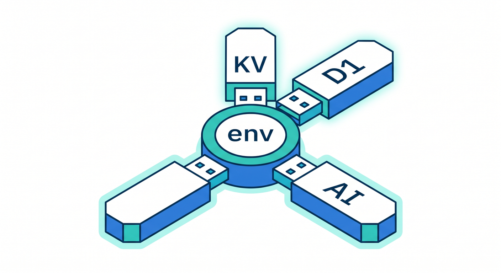
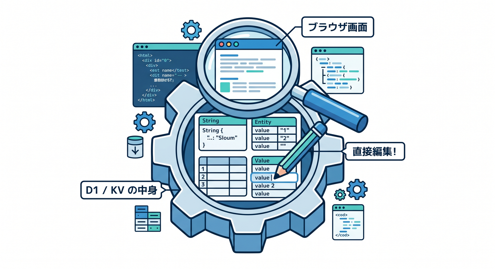

# 第7章　bindings と `env` の感覚をつかもう 🔗☁️🧠✨
この章は、Cloudflare を「ただのサーバーレス実行環境」ではなく、「いろいろな機能へきれいにつながる土台」として見られるようになる章です 🌈
Cloudflare Workers では、KV・R2・D1・Queues・Durable Objects・Workers AI などへ、コードの中から `env.xxx` で触っていきます。しかもローカル開発では、Worker 本体は手元で動かしつつ、bindings はまずローカルにシミュレートされ、必要なものだけ remote 接続へ切り替えるのが基本です。 ([Cloudflare Docs][1])

この章でいちばん大事なのは、「`env` は謎の箱じゃなくて、Cloudflare の機能への入り口なんだ」と腹落ちすることです 😊
さらに、環境変数も secrets も binding の仲間で、Worker から見ると同じ `env` に出てきます。`vars` は平文の設定値向け、secrets は暗号化された機密情報向け、という整理ができると、その後の実装がかなり安定します。 ([Cloudflare Docs][2])

---

## この章のゴール 🎯
* binding が「接続口」であり「権限」でもあるとわかる
* `wrangler.jsonc` に書いた設定が `env` に出てくる流れをつかむ
* ローカル simulation と remote binding の違いを言葉で説明できる
* `vars`・secrets・Workers AI binding を混同しなくなる
* TypeScript では `Env` を手書きせず、`wrangler types` を使う意味がわかる

---

## 7-1. まずは binding をひとことで言うと？ 🪄
binding は、Worker が Cloudflare の各種サービスへ触るための「APIつきの権限」です。
たとえば R2 バケットに書き込む binding を宣言すると、Worker では `env.MY_BUCKET.put(...)` のように使えます。Cloudflare の公式 docs でも、bindings は REST API をたたくより Workers から扱いやすく、制約が少なく、高速に使える入口として説明されています。 ([Cloudflare Docs][1])


つまり感覚としてはこんな感じです 🌱

`wrangler.jsonc` に binding を宣言する
→ Worker にその機能を使う権限がつく
→ コード側では `env.名前` で使える
→ ローカルではまず擬似的に試せる
→ 必要な binding だけ本物へつなげる

この流れが見えたら、この章はかなり成功です 🎉

---

## 7-2. `env` は「設定」だけじゃない ☁️📦
初心者のうちは `env` を「環境変数の箱」だと思いがちですが、Cloudflare ではそれだけではありません。
`env` には plain な環境変数、secrets、KV、R2、D1、Service bindings、Workers AI binding など、いろいろな binding がまとめて入ります。つまり `env` は「設定値の置き場」でもあり、「Cloudflare 機能への窓口」でもあります。 ([Cloudflare Docs][1])


たとえば次のように考えるとわかりやすいです 😊

* `env.APP_NAME` → 文字列の設定
* `env.API_TOKEN` → secret
* `env.CACHE` → KV namespace
* `env.DB` → D1 database
* `env.AI` → Workers AI

見た目は全部 `env.xxx` ですが、中身の役割はかなり違います。
でも入口が統一されているから、Cloudflare の設計がすごく覚えやすいわけです ✨ ([Cloudflare Docs][1])

---

## 7-3. いちばん小さい binding 例を見よう 👀
まずは `vars` だけの最小形です。
Cloudflare では環境変数も binding の一種で、文字列や JSON を Worker に渡せます。ただし `vars` は暗号化されないので、機密情報には使いません。機密情報は secrets を使います。 ([Cloudflare Docs][2])

```jsonc
{
  "$schema": "./node_modules/wrangler/config-schema.json",
  "name": "chapter7-binding-lab",
  "main": "src/index.ts",
  "compatibility_date": "2026-04-15",
  "compatibility_flags": ["nodejs_compat"],
  "vars": {
    "APP_NAME": "Binding Lab",
    "APP_THEME": "sakura"
  }
}
```

```ts
export default {
  async fetch(request: Request, env: Env): Promise<Response> {
    return Response.json({
      appName: env.APP_NAME,
      theme: env.APP_THEME
    });
  }
} satisfies ExportedHandler<Env>;
```

この時点でもう、「設定は `wrangler.jsonc`、利用は `env`」という Cloudflare の基本パターンが見えています 🌸

---

## 7-4. KV や AI も、結局は同じ流れ 🔁
次に、文字列だけでなく「機能 binding」も足してみます。
Bindings の宣言場所は違っても、コードからは結局 `env` に生えてきます。これが Cloudflare の学びやすさです。Workers AI を使う場合も、Wrangler か dashboard で AI binding を作ると `env.AI` で触れます。 ([Cloudflare Docs][1])

```jsonc
{
  "$schema": "./node_modules/wrangler/config-schema.json",
  "name": "chapter7-binding-lab",
  "main": "src/index.ts",
  "compatibility_date": "2026-04-15",
  "compatibility_flags": ["nodejs_compat"],

  "vars": {
    "APP_NAME": "Binding Lab"
  },

  "kv_namespaces": [
    {
      "binding": "CACHE",
      "id": "xxxxxxxxxxxxxxxxxxxxxxxxxxxxxxxx"
    }
  ],

  "ai": {
    "binding": "AI"
  }
}
```

```ts
export default {
  async fetch(request: Request, env: Env): Promise<Response> {
    const url = new URL(request.url);

    if (url.pathname === "/") {
      return new Response(`Hello from ${env.APP_NAME} 🌸`);
    }

    if (url.pathname === "/cache") {
      await env.CACHE.put("hello", "cloudflare");
      const value = await env.CACHE.get("hello");
      return new Response(value ?? "not found");
    }

    if (url.pathname === "/ai") {
      const result = await env.AI.run(
        "@cf/meta/llama-3.1-8b-instruct",
        {
          prompt: "bindings を初心者向けに 1 文で説明して"
        }
      );

      return Response.json(result);
    }

    return new Response("Not Found", { status: 404 });
  }
} satisfies ExportedHandler<Env>;
```

ここで覚えてほしいのは、「Cloudflare の機能を増やす = `env` の仲間を増やす」という感覚です 🌟

---

## 7-5. ローカル開発では、どこまで本物なの？ 🧪🏠☁️
ここはかなり大事です。
2026年4月15日時点の公式 docs では、`wrangler dev` や Vite plugin を使った通常のローカル開発では、Worker のコードはローカルマシンで実行され、bindings はデフォルトでローカル simulation につながります。しかもコードの呼び出し方は本番と同じで、`env.MY_KV.put()` のような API をそのまま使えます。 ([Cloudflare Docs][3])

ただし例外もあります。
AI binding は local simulation がなく、AI モデル自体は常に remote で動きます。また、binding ごとに remote resource へ切り替える「remote binding connections」もあり、Cloudflare はフル remote development よりも「ローカル実行 + 必要な binding だけ remote」のほうを速い反復とデバッグの面で推しています。 ([Cloudflare Docs][3])


初心者向けに超ざっくり言うと、こう覚えるとラクです 😌

* Worker 本体 → まずローカルで動く
* KV / D1 / R2 など → まずローカル simulation
* Workers AI → 最初から remote 寄り
* 本物のデータや本物の DB を触りたいときだけ、一部 binding を remote に寄せる

この「全部いきなり本番」ではなく「基本は手元、必要なところだけ本物」が、Cloudflare 開発の安心ポイントです 🌿 ([Cloudflare Docs][3])

---

## 7-6. `wrangler dev --remote` はどう考える？ 🚦
`wrangler dev --remote` を使うと、Worker コード自体が Cloudflare 側で実行され、bindings も remote resource につながります。
ただしこれは Wrangler 専用で、Vite plugin に同等のフル remote 開発モードはありません。さらに公式 docs では、remote development よりも「local development + remote binding connections」のほうが速い反復とデバッグに向くとして勧められています。 ([Cloudflare Docs][4])

なので第7章の段階では、こう整理しておくのがおすすめです 🧭

* まず `wrangler dev` / `vite dev` で普通にローカル
* 困ったら binding 単位で remote
* フル remote は「どうしても Cloudflare 側で見たい」時の上級寄り手段

これだけで十分です 👍

---

## 7-7. `vars` と secrets の違いをここで固定しよう 🔐✨
ここは混ざりやすいので、はっきり分けます。

`vars` は平文の設定値です。
API のベース URL、画面表示用のアプリ名、機能フラグのような「漏れても即アウトではない設定」に向いています。Cloudflare 公式でも、平文の環境変数は設定値向けで、機密情報には使わないよう明記されています。 ([Cloudflare Docs][2])

secrets は暗号化された binding です。
API キーやトークン、接続文字列のような機密情報はこちらです。Worker から見ると `env` に出てくる点は同じですが、値は Wrangler や dashboard 上で見えない扱いになります。さらに 2026年3月の更新で、`secrets.required` を Wrangler 設定に書けるようになり、ローカル開発時や deploy 時に必要な secret の不足チェックと type generation の元データとして使えるようになりました。 ([Cloudflare Docs][5])

ローカル開発では `.dev.vars` または `.env` を使えますが、両方を同時に混ぜないのがルールです。
もし `.dev.vars` があるなら `.env` は `env` に読み込まれません。さらに環境別の `.dev.vars.staging` や `.env.production` も使えますが、`.dev.vars.<env>` はそのファイル単体で完結、`.env` 系は複数ファイルを優先順位つきでマージ、という違いがあります。 ([Cloudflare Docs][6])

---

## 7-8. Cloudflare Environments と `--env` の考え方 🌍
Wrangler の environments を使うと、同じコードを `dev`・`staging`・`production` のように分けて扱えます。
Cloudflare では environment ごとに実質別 Worker として扱われ、名前も `<name>-<environment>` 形式になります。そして大事なのは、bindings や `vars` は environment に自動継承されないことです。必要なものは各 environment に明示的に書く必要があります。 ([Cloudflare Docs][7])

```jsonc
{
  "$schema": "./node_modules/wrangler/config-schema.json",
  "name": "chapter7-binding-lab",
  "main": "src/index.ts",

  "vars": {
    "APP_NAME": "root-worker"
  },

  "env": {
    "staging": {
      "vars": {
        "APP_NAME": "chapter7-binding-lab-staging"
      }
    },
    "production": {
      "vars": {
        "APP_NAME": "chapter7-binding-lab-production"
      }
    }
  }
}
```

```powershell
npx wrangler dev --env staging
npx wrangler deploy --env production
```

ここでつまずく人がとても多いです 😵
「root に書いた `vars` が staging でも見えるはず」と思い込むとハマります。第7章では、「環境ごとに別物」と覚えてしまうのがいちばん安全です 🚧 ([Cloudflare Docs][8])

---

## 7-9. TypeScript では `Env` を手書きしない 🙅‍♂️🧾
2026年の公式 best practices では、`Env` インターフェースは手で書かず、`wrangler types` で生成するのが推奨です。
理由は単純で、`wrangler.jsonc` とコードの `Env` 定義がズレると、型だけ正しくて実体が違う、という事故が起きやすいからです。binding を追加・変更したら `wrangler types` を再実行する、これを習慣にするだけでかなり強いです。 ([Cloudflare Docs][8])


```powershell
npx wrangler types
```

この章では、次のルールで十分です ✅

* binding を増やした
* 名前を変えた
* environment 構成を変えた
* secrets.required を追加した

このどれかをやったら `npx wrangler types` を回す。
これで TypeScript が「その `env.XYZ` 本当にある？」をかなり早い段階で教えてくれます 💡 ([Cloudflare Docs][8])

---

## 7-10. `process.env` と `env`、どっちを使うの？ 🤔
基本は `env` を使うのがおすすめです。
ただし Node.js compatibility を有効にしている Worker では、互換フラグの条件を満たすと環境変数や secrets が `process.env` にも出ます。これは Node 系ライブラリが `process.env` を前提にしているときに便利です。 ([Cloudflare Docs][5])


でも学習の最初は、こう覚えておくと混乱しません 😊

* Cloudflare らしい本筋 → `env`
* Node ライブラリ都合の補助線 → `process.env`

つまり「Cloudflare の設計を学ぶ」ためには `env` を主役にしておくのがいちばんきれいです 🌼

---

## 7-11. `cloudflare:workers` から `env` を import する書き方もある 📥
最近の docs では、`env` を `cloudflare:workers` から import して、トップレベルや深い関数から使う書き方も案内されています。
これは secret や環境変数をもとに API クライアントを初期化したいときに便利です。ただし注意点もあり、トップレベルではあらゆる I/O ができるわけではありません。たとえば KV の `get()` のような実操作はリクエスト文脈内で行う必要があります。 ([Cloudflare Docs][1])

```ts
import { env } from "cloudflare:workers";

const APP_NAME = env.APP_NAME;

export default {
  async fetch(): Promise<Response> {
    return new Response(`Hello from ${APP_NAME}`);
  }
} satisfies ExportedHandler<Env>;
```

これは便利ですが、第7章の段階では「まずは `fetch(request, env)` の `env` を使う」が基本でOKです。
`cloudflare:workers` の import は、「コードが大きくなってきたら検討する便利機能」くらいの理解で十分です 🌱 ([Cloudflare Docs][1])

---

## 7-12. Workers AI を “binding の仲間” として見る 🤖☁️
Cloudflare の AI 機能も、特別な別世界ではなく binding の延長で使えます。
Workers AI は Wrangler か dashboard で binding を作ると `env.AI` になり、そこから `run()` でモデルを呼びます。さらに AI Gateway と組み合わせると、Workers AI のリクエストに gateway 設定を渡せて、ログ確認や制御の導線も作れます。 ([Cloudflare Docs][9])

```ts
export default {
  async fetch(request: Request, env: Env): Promise<Response> {
    const answer = await env.AI.run(
      "@cf/meta/llama-3.1-8b-instruct",
      {
        prompt: "Cloudflare bindings を初心者向けにやさしく説明して"
      },
      {
        gateway: {
          id: "my-gateway"
        }
      }
    );

    return Response.json(answer);
  }
} satisfies ExportedHandler<Env>;
```


ここで伝えたいのは、「AI 機能も `env` に生える」ということです ✨
KV も D1 も AI も、Cloudflare では“binding を足して `env` から使う”という同じリズムで学べます。これがめちゃくちゃ強いです 🌟 ([Cloudflare Docs][9])

---

## 7-13. Debug 時にめちゃ便利な Local Explorer 🧭🗂️
binding を使い始めると、「いま KV に何が入った？」「D1 に本当に書けた？」を見たくなります。
Cloudflare の Local Explorer は、Wrangler と Cloudflare Vite plugin の両方で使え、ローカル開発セッション中に `e` キーまたは `/cdn-cgi/explorer` で開けます。KV・R2・D1・Durable Objects・Workflows のローカル状態をブラウザから見たり編集したりできるので、第7章とかなり相性がいいです。 ([Cloudflare Docs][10])


しかも Local Explorer には `/cdn-cgi/explorer/api` の OpenAPI があり、AI coding agents がローカル binding 状態をプログラム的に読んだり変更したりできます。
Copilot や AI エージェント時代の Cloudflare 開発では、このへんもかなり面白いポイントです 🤖✨ ([Cloudflare Docs][10])

---

## 7-14. GitHub Copilot に手伝わせるときの聞き方 💬🤝
ここは実践コツです。
Copilot に丸投げするより、「binding と `env` のズレを見つける相棒」にするとすごく使いやすいです。

おすすめの聞き方はこんな感じです ✨

* 「この `wrangler.jsonc` の binding 名と `src/index.ts` の `env` 利用名にズレがないかチェックして」
* 「この Worker で local simulation できる binding と remote に寄せる候補を分けて」
* 「このエラーは `vars` 不足、secret 未設定、binding 名タイポのどれが怪しい？」
* 「`wrangler types` を前提に、型が壊れそうな場所を先に洗い出して」
* 「この `env` 依存をテストしやすい形に小さく分割して」

Cloudflare 開発では、エラーそのものより「binding 宣言とコード利用のズレ」で詰まることが多いので、Copilot には“推理役”をやってもらうとかなり相性がいいです 🕵️‍♂️💡

---

## 7-15. この章の定番つまずきポイント 😵‍💫
1つ目は、`wrangler.jsonc` に書いたつもりで、binding 名のスペルがコード側とズレることです。
`CACHE` と `Cache` みたいな差でも普通にハマります。ここは `wrangler types` がかなり助けてくれます。 ([Cloudflare Docs][8])

2つ目は、`vars` と secrets を混ぜることです。
「とりあえず API キーも `vars` に入れよう」は危険です。機密値は secrets です。 ([Cloudflare Docs][5])

3つ目は、environment を作ったのに binding を再定義していないことです。
Cloudflare environments では `vars` や bindings は自動継承されません。これ、本当に大事です。 ([Cloudflare Docs][8])

4つ目は、「ローカルなのに AI が完全にローカルで動く」と思い込むことです。
AI binding は local simulation ではなく remote 前提です。 ([Cloudflare Docs][3])

---

## 7-16. この章のミニ演習 🧪🎓
### 演習1　`vars` を返すだけの Worker を作る 🌸
`APP_NAME` と `APP_THEME` を `vars` に置いて、`/` へアクセスしたら JSON で返してください。
ゴールは「設定が `env` に出る」を体で覚えることです。

### 演習2　KV binding を 1本足す 📦
`/save` で `env.CACHE.put()`、`/load` で `env.CACHE.get()` を試してください。
保存できたかは Local Explorer で確認してみましょう 👀 ([Cloudflare Docs][10])

### 演習3　Workers AI を 1回だけ呼ぶ 🤖
`env.AI.run()` で、短い説明文を生成して返してください。
「AI も binding の仲間なんだ」と感じられたら成功です。 ([Cloudflare Docs][9])

### 演習4　`staging` 環境を作る 🌍
`APP_NAME` を `staging` だけ別値にして、`npx wrangler dev --env staging` で表示が変わるか確認してください。
ここで「environment は別 Worker」という感覚がかなり固まります。 ([Cloudflare Docs][7])

---

## 7-17. この章のまとめ 🏁✨
この章で覚えることは、実はそんなに多くありません 😊
でも、めちゃくちゃ重要です。

* Cloudflare の機能は binding としてつながる
* コードでは `env.xxx` で使う
* ローカルではまず simulation
* 必要なら binding 単位で remote
* `vars` は設定、secrets は機密
* TypeScript では `wrangler types` を回す
* AI も `env.AI` という binding の仲間

ここまで見えてくると、Cloudflare の docs を読んだときにも「これは新機能」ではなく「新しい binding が増えた話なんだな」と読めるようになります 📚✨
それができるようになると、D1 でも R2 でも Workers AI でも、怖さがかなり減ります。 ([Cloudflare Docs][1])

次の章では、この binding 感覚を使って、外部 API や実データとのつなぎ方をもう少し実践寄りにしていくと、学習の流れがとてもきれいです 🌈

必要ならこのまま続けて、同じトーンで
**「第8章　外部APIとのつなぎ方をローカルで練習しよう 🌍📡」**
も詳細版でそのまま作れます。

[1]: https://developers.cloudflare.com/workers/runtime-apis/bindings/ "Bindings (env) · Cloudflare Workers docs"
[2]: https://developers.cloudflare.com/workers/configuration/environment-variables/ "Environment variables · Cloudflare Workers docs"
[3]: https://developers.cloudflare.com/workers/development-testing/ "Development & testing · Cloudflare Workers docs"
[4]: https://developers.cloudflare.com/workers/development-testing/bindings-per-env/ "Supported bindings per development mode · Cloudflare Workers docs"
[5]: https://developers.cloudflare.com/workers/configuration/secrets/ "Secrets · Cloudflare Workers docs"
[6]: https://developers.cloudflare.com/workers/development-testing/environment-variables/ "Environment variables and secrets · Cloudflare Workers docs"
[7]: https://developers.cloudflare.com/workers/wrangler/environments/ "Environments · Cloudflare Workers docs"
[8]: https://developers.cloudflare.com/workers/best-practices/workers-best-practices/ "Workers Best Practices · Cloudflare Workers docs"
[9]: https://developers.cloudflare.com/workers-ai/configuration/bindings/ "Workers Bindings · Cloudflare Workers AI docs"
[10]: https://developers.cloudflare.com/workers/development-testing/local-explorer/ "Local Explorer · Cloudflare Workers docs"
