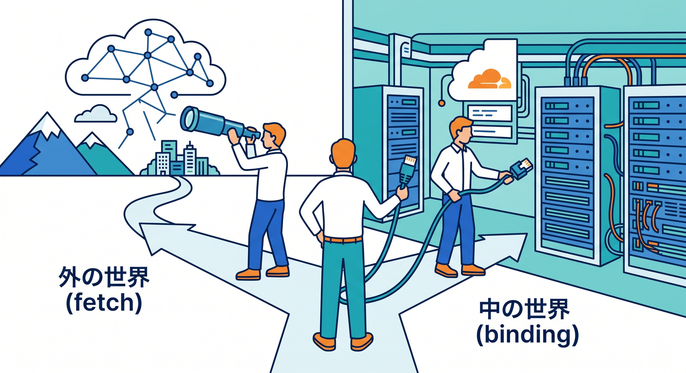
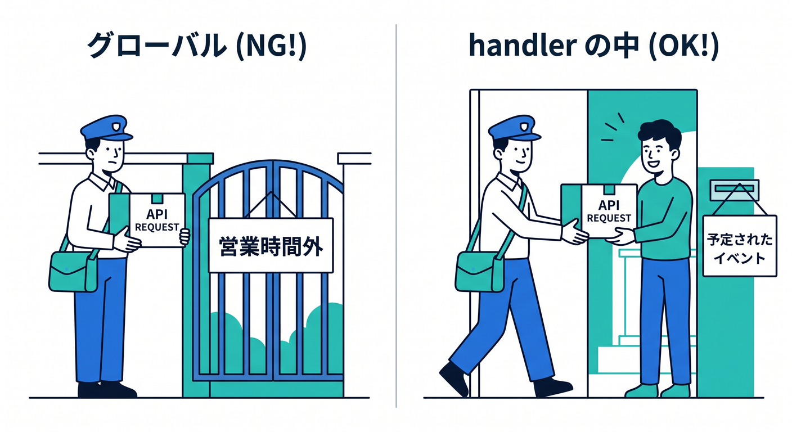
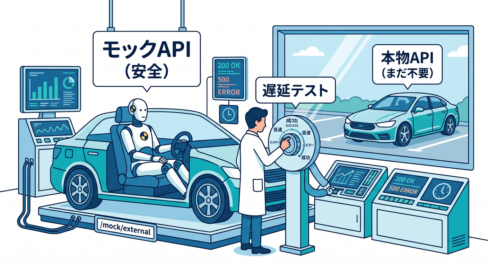
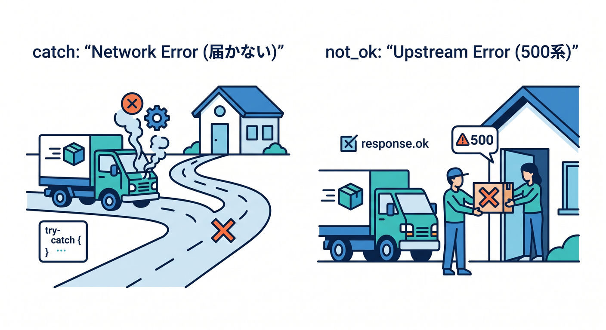
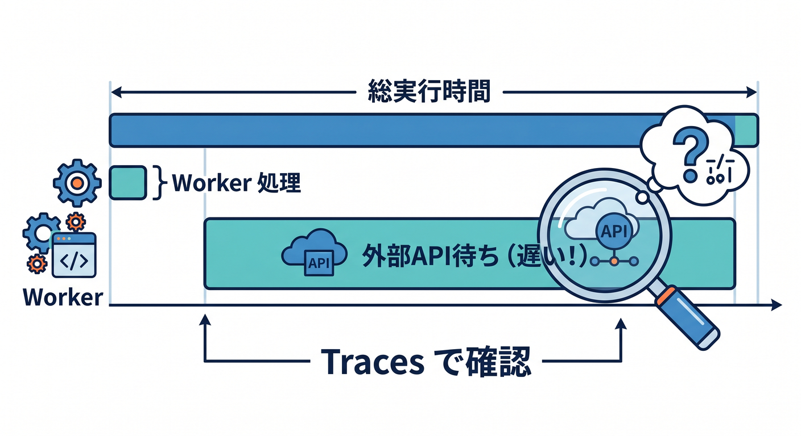
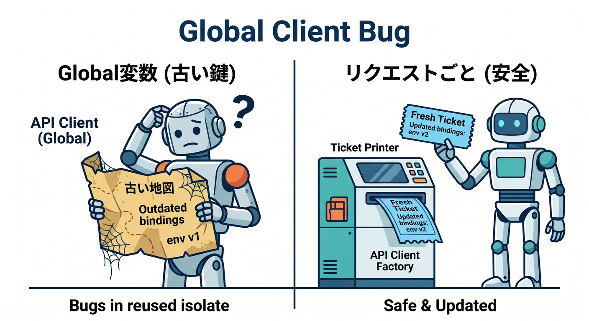
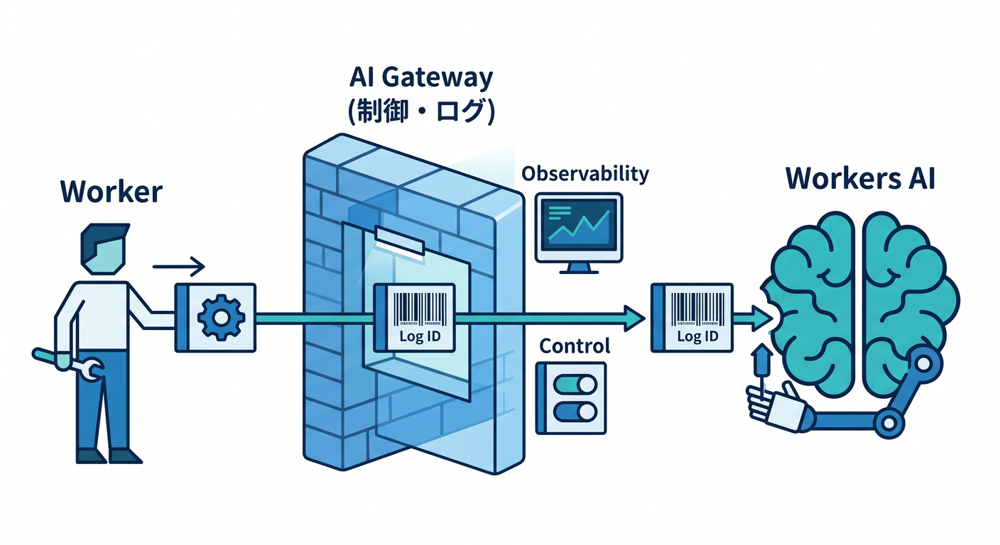

# 第8章　外部APIとのつなぎ方をローカルで練習しよう 🌍📡✨
この章では、Worker から外の API へアクセスする基本を、**ローカルで安全に練習する流れ**として身につけます 😊
Cloudflare Workers で外部 API と連携するときの基本は `fetch()` です。そしてローカル開発は、Miniflare を通じて本番と同じ `workerd` 系の実行環境にかなり近い形で試せます。さらに Cloudflare は、ログ・トレース・AI binding・AI Gateway・MCP まで、外部連携を育てやすい道具がかなり揃っています。 ([Cloudflare Docs][1])

## この章のゴール 🎯
この章が終わるころには、次の感覚がついていれば十分です 🌸

* 外部 API はまず `fetch()` でつなぐ
* API キーや URL はコードに直書きしない
* ローカルで **成功・失敗・遅延・変なレスポンス** を試す
* Cloudflare の Logs / Traces で「何が起きたか」を追う
* AI を使うときは、外部 LLM API だけでなく **Workers AI + AI Gateway** という選択肢もある

## まず、頭の中の地図を作ろう 🗺️
Cloudflare 開発では、つなぎ先によって考え方を分けると混乱しにくいです。


**外のサービス**につなぐなら、基本は `fetch()` です。
**Cloudflare の中のサービス**につなぐなら、KV・R2・D1・Workers AI などの **binding** を `env` 経由で使うのが基本です。Cloudflare 公式も、Cloudflare 資源に対しては REST API より bindings のほうが性能面・制約面で有利だと案内しています。 ([Cloudflare Docs][2])

## なぜローカルで先にやるの？ 🧪💡
Cloudflare のローカル開発では、**Worker 自体はローカルで動かしつつ**、bindings は通常ローカルのシミュレーションにつながります。必要なら binding ごとに `remote: true` で本物のリソースへ寄せることもできます。なお **AI bindings は例外で、常にリモート実行**です。
この仕組みのおかげで、いきなり本番 API へ依存しすぎず、まずは手元で失敗パターンを試しやすいわけです。 ([Cloudflare Docs][1])

## 外部API連携で最初に覚えるルール 4つ ✍️
1つ目。外部 API 呼び出しは `fetch()` でやります。

2つ目。`fetch()` のような非同期処理は **handler の中**で実行します。グローバルスコープで呼ぶとエラーになります。
3つ目。最初は重い SDK より、**素直な `fetch()`** から始めるのが安全です。Cloudflare 公式でも、Node 互換ライブラリの多くは動く一方で、`fs`・`http/net`・`window` に依存するものは Workers ランタイムへそのまま持ち込みにくいと説明しています。
4つ目。失敗は必ず起こる前提で、`try...catch` と `response.ok` の両方を見る癖をつけます。 ([Cloudflare Docs][3])

---

## この章で作るミニ教材 📦✨
この章では、次の 3 ルートを持つ小さな Worker を作る想定にします。


* `/mock/external`
  ローカル用の「なんちゃって外部 API」です
* `/api/proxy`
  外部 API を呼ぶ本番っぽい入口です
* `/api/ai-summary`
  取得結果を Workers AI で要約する発展ルートです

この構成のいいところは、**最初は完全ローカルで練習できて**、慣れたら `UPSTREAM_BASE_URL` を本物の API に差し替えるだけで次の段階へ進めることです 😎

---

## 1. まずは設定を書こう ⚙️
## `wrangler.jsonc`
```jsonc
{
  "name": "chapter8-external-api-practice",
  "main": "src/index.ts",
  "compatibility_date": "2026-04-15",
  "observability": {
    "enabled": true,
    "traces": {
      "enabled": true
    }
  },
  "ai": {
    "binding": "AI"
  }
}
```

この設定で、Workers Logs / Traces を見やすくしつつ、`env.AI` で Workers AI を呼べる形にしています。Workers Logs は新規 Worker で observability が有効になっている案内もありますが、教材では設定を明示しておくほうがわかりやすいです。Traces を有効にすると、`fetch` を含む外向き通信の計測も自動で取りやすくなります。 ([Cloudflare Docs][4])

## ローカル変数ファイル
```dotenv
## 本物APIをまだ使わないなら空でもOKUPSTREAM_BASE_URL=

## 必要ならあとで設定UPSTREAM_TOKEN=

## AI Gateway を使うときだけ設定AI_GATEWAY_ID=
```

Cloudflare では、ローカル開発用の値を `.dev.vars` または `.env` で扱えます。ただし **両方を同時に使うのではなく、どちらか一方**です。さらに、これらは Git に入れないのが基本です。
また、通常の environment variables は暗号化されない設定値向けです。認証情報のような重要値は、デプロイ先では `wrangler secret put` を使って secrets として管理する流れが基本です。 ([Cloudflare Docs][5])

例:

```bash
wrangler secret put UPSTREAM_TOKEN
```

---

## 2. Worker 本体を書こう 🧩
```ts
interface Env {
  UPSTREAM_BASE_URL?: string;
  UPSTREAM_TOKEN?: string;
  AI_GATEWAY_ID?: string;
  AI: {
    run: (
      model: string,
      input: unknown,
      options?: unknown
    ) => Promise<unknown>;
    aiGatewayLogId?: string;
  };
}

export default {
  async fetch(request: Request, env: Env): Promise<Response> {
    const url = new URL(request.url);

    if (url.pathname === "/mock/external") {
      return handleMockExternal(url);
    }

    if (url.pathname === "/api/proxy") {
      return handleProxy(request, env);
    }

    if (url.pathname === "/api/ai-summary") {
      return handleAiSummary(request, env);
    }

    return Response.json({
      message: "chapter8 external api practice",
      routes: [
        "/mock/external?mode=ok",
        "/mock/external?mode=slow",
        "/mock/external?mode=error",
        "/mock/external?mode=bad-json",
        "/api/proxy?mode=ok",
        "/api/ai-summary?mode=ok"
      ]
    });
  }
} satisfies ExportedHandler<Env>;

async function handleMockExternal(url: URL): Promise<Response> {
  const mode = url.searchParams.get("mode") ?? "ok";

  if (mode === "slow") {
    await delay(1500);
  }

  if (mode === "error") {
    return Response.json(
      { ok: false, message: "mock upstream failed" },
      { status: 500 }
    );
  }

  if (mode === "bad-json") {
    return new Response("this is not json", {
      headers: {
        "content-type": "text/plain; charset=utf-8"
      }
    });
  }

  return Response.json({
    ok: true,
    source: "mock",
    mode,
    items: [
      { id: 1, title: "Cloudflare" },
      { id: 2, title: "Workers" },
      { id: 3, title: "External API practice" }
    ]
  });
}

async function handleProxy(request: Request, env: Env): Promise<Response> {
  const reqUrl = new URL(request.url);
  const mode = reqUrl.searchParams.get("mode") ?? "ok";

  const upstreamUrl = buildUpstreamUrl(request, env, mode);

  const headers = new Headers({
    accept: "application/json"
  });

  if (env.UPSTREAM_TOKEN) {
    headers.set("authorization", `Bearer ${env.UPSTREAM_TOKEN}`);
  }

  const startedAt = Date.now();

  try {
    const upstreamRes = await fetch(upstreamUrl, {
      method: "GET",
      headers
    });

    const elapsedMs = Date.now() - startedAt;
    const contentType = upstreamRes.headers.get("content-type") ?? "";
    const rawText = await upstreamRes.text();

    let upstreamBody: unknown = rawText;

    if (contentType.includes("application/json")) {
      try {
        upstreamBody = JSON.parse(rawText);
      } catch {
        upstreamBody = {
          parseError: true,
          rawText
        };
      }
    }

    if (!upstreamRes.ok) {
      return Response.json(
        {
          ok: false,
          phase: "upstream",
          status: upstreamRes.status,
          elapsedMs,
          upstream: upstreamBody
        },
        { status: 502 }
      );
    }

    return Response.json({
      ok: true,
      elapsedMs,
      upstream: upstreamBody
    });
  } catch (error) {
    return Response.json(
      {
        ok: false,
        phase: "network",
        message: toErrorMessage(error)
      },
      { status: 502 }
    );
  }
}

async function handleAiSummary(request: Request, env: Env): Promise<Response> {
  const proxyRes = await handleProxy(request, env);

  if (!proxyRes.ok) {
    return proxyRes;
  }

  const proxyData = (await proxyRes.json()) as {
    ok: true;
    elapsedMs: number;
    upstream: unknown;
  };

  const gatewayOptions = env.AI_GATEWAY_ID
    ? {
        gateway: {
          id: env.AI_GATEWAY_ID
        }
      }
    : undefined;

  const result = await env.AI.run(
    "@cf/meta/llama-3.1-8b-instruct",
    {
      prompt:
        "次のJSONを日本語でやさしく2文に要約してください。\n\n" +
        JSON.stringify(proxyData.upstream)
    },
    gatewayOptions
  );

  return Response.json({
    ok: true,
    elapsedMs: proxyData.elapsedMs,
    upstream: proxyData.upstream,
    summary: result,
    aiGatewayLogId: env.AI.aiGatewayLogId ?? null
  });
}

function buildUpstreamUrl(
  request: Request,
  env: Env,
  mode: string
): string {
  if (env.UPSTREAM_BASE_URL && env.UPSTREAM_BASE_URL.trim() !== "") {
    const realUrl = new URL(env.UPSTREAM_BASE_URL);
    realUrl.searchParams.set("mode", mode);
    return realUrl.toString();
  }

  const localUrl = new URL("/mock/external", request.url);
  localUrl.searchParams.set("mode", mode);
  return localUrl.toString();
}

function delay(ms: number): Promise<void> {
  return new Promise((resolve) => setTimeout(resolve, ms));
}

function toErrorMessage(error: unknown): string {
  if (error instanceof Error) {
    return error.message;
  }
  return "unknown error";
}
```

---

## 3. この教材コードの見どころ 👀✨
このコードで大事なのは、**いきなり本物 API に頼っていない**ことです。
`UPSTREAM_BASE_URL` が空なら `/mock/external` を呼ぶので、まずはローカルだけで「成功」「遅い」「500エラー」「JSONじゃないレスポンス」を全部再現できます。これができると、外部 API の学習が一気に楽になります 😊


それから、外部連携の基本は「通信失敗」と「HTTP失敗」を分けて考えることです。
`catch` に入るのはネットワーク失敗など、`!response.ok` は HTTP 的には返ってきたけれど中身が失敗しているケースです。Cloudflare で third-party API を統合するときの基本として、公式も `fetch()` とレスポンス処理、認証情報の secrets 管理、キャッシュ活用を案内しています。 ([Cloudflare Docs][2])

---

## 4. 実行して確認しよう 🚀
ローカル実行はこんな感じです。

```bash
npx wrangler dev
```

まずは次を順番に試すのがおすすめです 🌟

* `/mock/external?mode=ok`
* `/mock/external?mode=slow`
* `/mock/external?mode=error`
* `/mock/external?mode=bad-json`
* `/api/proxy?mode=ok`
* `/api/proxy?mode=slow`
* `/api/ai-summary?mode=ok`

ここで大事なのは、**成功だけで満足しないこと**です。
「遅いときどう見えるか」「壊れた JSON をどう返すか」「上流 500 を自分の API ではどう包み直すか」を先に見ると、本番で慌てにくくなります 😌

---

## 5. Logs と Traces の見方もセットで覚えよう 📈🔍
Cloudflare Workers には Logs と Traces の観測系があり、Logs はダッシュボードで収集・保存・分析でき、Traces はリクエストの流れを end-to-end で追えます。特に Traces は、**外向き `fetch` 呼び出しの timing や status を自動計測**してくれるので、外部 API が遅いのか、自分の処理が遅いのかを見分けやすいです。 ([Cloudflare Docs][6])


この章では、次の見方ができれば十分です 👇

* `mode=slow` で `elapsedMs` が伸びる
* Traces で subrequest の時間が見える
* 500 エラー時にどこで失敗したかを追える
* AI 要約ルートを通したとき、外部 API 部分と AI 部分を分けて考えられる

---

## 6. この章でありがちなハマりどころ 😵‍💫
## その1: `fetch()` をトップレベルで呼んでしまう
これはダメです。Cloudflare の `fetch()` は handler の中で実行します。 ([Cloudflare Docs][3])

## その2: APIキーをコードに直書きする
ローカルでは `.dev.vars` または `.env`、デプロイ先では secrets を使います。 `.dev.vars` と `.env` は両方同時ではなくどちらか一方、そして Git 管理対象から外します。 ([Cloudflare Docs][5])

## その3: SDK を雑に入れて動かなくなる
Workers では多くの Node 互換ライブラリが使えますが、`fs`・`http/net`・`window` 前提のものはそのままでは厳しい場合があります。外部 API 連携はまず `fetch()` ベースから始めるのが堅いです。 ([Cloudflare Docs][7])

## その4: 秘密情報を使うクライアントをグローバルに固定する

Cloudflare では bindings 変更時に既存 isolate を再利用することがあり、`env` をもとに作ったクライアントをグローバルに持つと、値更新後も古い情報を握ることがあります。最初のうちは **リクエストごとに作る**意識が安全です。 ([Cloudflare Docs][8])

## その5: Cloudflare ネイティブ機能まで外部 REST API で叩こうとする
Cloudflare の中の資源は bindings のほうが自然です。AI・KV・R2・D1 などは `env` から触る設計をまず覚えたほうが、あとで楽になります。 ([Cloudflare Docs][8])

---

## 7. Cloudflare AI をこの章にどう混ぜるか 🤖☁️
ここ、かなり大事です ✨

「外部 API 連携」というと、すぐ OpenAI など外部 LLM API を思い浮かべがちですが、Cloudflare では **Workers AI を binding として直接呼ぶ**導線があります。`wrangler.jsonc` に AI binding を足すと `env.AI` で使えます。さらに AI Gateway を組み合わせると、Gateway ID を指定してリクエストを通し、ログ ID も扱えます。 ([Cloudflare Docs][9])

しかもローカル開発の考え方としては、普通の binding はローカル寄り・必要なら remote に切り替え、**AI binding は最初からリモート**という点も覚えておくと整理しやすいです。 ([Cloudflare Docs][1])


この章の理解としては、こう考えるとわかりやすいです 🌈

* 外の一般 API → `fetch()`
* Cloudflare の AI → `env.AI.run(...)`
* AI の観測や制御を厚くしたい → AI Gateway も使う

---

## 8. GitHub Copilot をこの章の相棒にする方法 🧠💬
GitHub Copilot の MCP 活用は、今の Cloudflare 学習とかなり相性がいいです。GitHub 公式では、Copilot の agent mode で MCP を使う前提として、**VS Code など MCP 対応 IDE、agent mode の有効化、必要な MCP サーバーへのアクセス**を挙げています。MCP 自体は、Copilot をいろいろなツールやデータソースとつなぐための標準です。 ([GitHub Docs][10])

Cloudflare 側もかなり進んでいて、公式 docs では **cloudflare-docs MCP** と **cloudflare-observability MCP** をつないで、Workers の知識を教えたり、ログや例外を見たりできる案内があります。さらに Cloudflare は OAuth で接続できる managed remote MCP servers も提供していて、Cloudflare API MCP server から広い範囲の Cloudflare API へアクセスする導線もあります。 ([Cloudflare Docs][11])

たとえば VS Code + Copilot では、こんな依頼がかなり相性いいです ✨

* 「この `fetch()` エラー処理を network error / upstream error に分けて」
* 「この Worker に型を足して」
* 「`/api/proxy` の Vitest 用テストケースを 4 つ作って」
* 「Cloudflare Observability で遅い subrequest を追う観点を説明して」

---

## 9. 発展課題 🚀
この章の演習としては、次の順番がすごくおすすめです。

1. `mode=ok / slow / error / bad-json` を全部試す
2. `UPSTREAM_BASE_URL` に本物の API を入れて差し替える
3. `UPSTREAM_TOKEN` が必要な API にして secrets 運用へ進む
4. `/api/ai-summary` に AI Gateway を足す
5. Logs / Traces を見ながら、どこが遅いか言葉で説明してみる

余裕があれば、さらに **Cache API** や `ctx.waitUntil()` を使って「待たせない保存」を学ぶと、かなり実践寄りになります。Cloudflare 公式でも、Cache API 活用や `waitUntil()` の非ブロッキング処理が案内されていますが、`waitUntil()` は 30 秒制限があるので、確実な後処理が必要なら Queues が向いています。 ([Cloudflare Docs][2])

---

## この章のまとめ 🎉
第8章の本質は、**外部 API とつなぐことそのもの**より、**つないだあとにローカルでどう確かめるか**です。

`fetch()` で呼ぶ → `env` で設定を分ける → 失敗を分類する → Logs / Traces で見る → 必要なら AI にも広げる。
この流れができると、Cloudflare 開発が一気に「怖くない作業」になります ☁️💪✨

次の章では、この「目で確かめる」をさらに一歩進めて、**テストとして残す**方向へつなげると、とてもきれいです。

[1]: https://developers.cloudflare.com/workers/development-testing/ "Development & testing · Cloudflare Workers docs"
[2]: https://developers.cloudflare.com/workers/configuration/integrations/apis/ "APIs · Cloudflare Workers docs"
[3]: https://developers.cloudflare.com/workers/runtime-apis/fetch/ "Fetch · Cloudflare Workers docs"
[4]: https://developers.cloudflare.com/workers/observability/logs/workers-logs/ "Workers Logs · Cloudflare Workers docs"
[5]: https://developers.cloudflare.com/workers/configuration/environment-variables/ "Environment variables · Cloudflare Workers docs"
[6]: https://developers.cloudflare.com/workers/observability/ "Observability · Cloudflare Workers docs"
[7]: https://developers.cloudflare.com/workers/configuration/integrations/external-services/ "External Services · Cloudflare Workers docs"
[8]: https://developers.cloudflare.com/workers/runtime-apis/bindings/ "Bindings (env) · Cloudflare Workers docs"
[9]: https://developers.cloudflare.com/ai-gateway/integrations/worker-binding-methods/ "AI Gateway Binding Methods · Cloudflare AI Gateway docs"
[10]: https://docs.github.com/en/copilot/tutorials/enhance-agent-mode-with-mcp "Enhancing GitHub Copilot agent mode with MCP - GitHub Docs"
[11]: https://developers.cloudflare.com/workers/get-started/prompting/ "Prompting · Cloudflare Workers docs"
