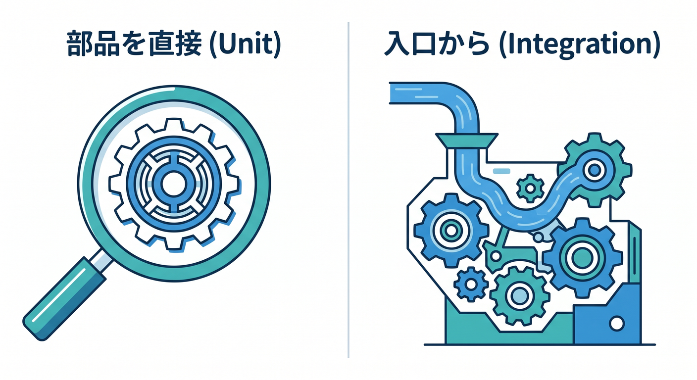
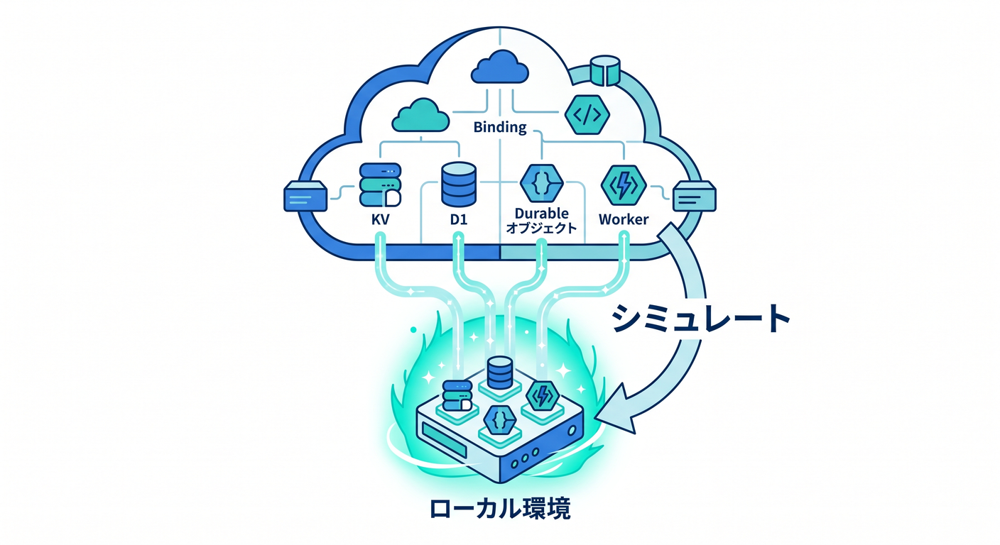
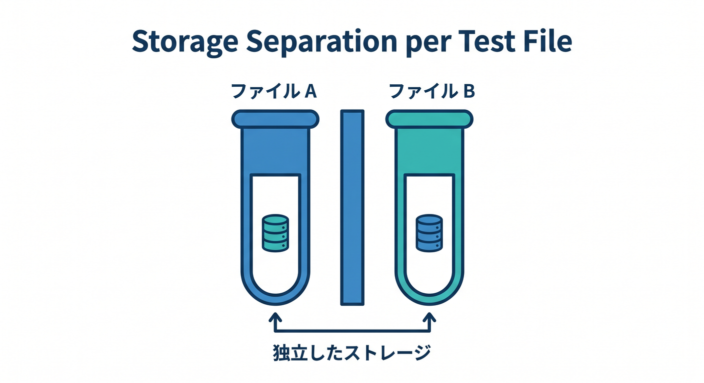

# 第9章　Cloudflare流のテスト入門を始めよう ✅🧪☁️
この章では、いよいよ **「動いた！」を「壊れていない！」へ進化させる** ところに入ります 🎉
2026年4月15日時点の Cloudflare 公式では、Workers や Pages Functions のテスト方法として **Workers Vitest integration** が中心で、Cloudflare はこれを「ほとんどのユーザー向けの推奨ルート」としています。これは Cloudflare 独自の custom pool によって、Vitest のテストを **Workers runtime の中で** 動かせる仕組みで、unit test と integration test の両方に対応し、bindings も直接扱え、テストファイルごとのストレージ分離もあります。しかもローカル実行は Miniflare ベースなので、かなり Cloudflare らしい形で試せます。 ([Cloudflare Docs][1])

## この章のゴール 🎯
この章のゴールは、難しいテスト理論を丸暗記することではありません 😊
まずは次の3つができれば十分です。
1つ目は、**unit test と integration test の違いをふんわり理解すること**。
2つ目は、**Worker に対して最低1本ずつテストを書けること**。
3つ目は、**Cloudflare 特有の注意点にひっかからないこと**です。
特に Cloudflare では、単なる Node.js のテストではなく、Workers runtime を意識したテストの流れが大事になります。 ([Cloudflare Docs][1])

## まず、unit test と integration test をやさしく整理しよう 🧠✨
この章では、次の感覚で覚えるのがいちばんラクです 🌸

* **unit test**
  小さい部品の確認です。`fetch` ハンドラや関数を直接呼んで、「この入力ならこの出力になるよね？」を見るテストです。Cloudflare 公式の最初の例でも、Worker を import して `createExecutionContext()` と `waitOnExecutionContext()` を使いながら `worker.fetch()` を直接試しています。 ([Cloudflare Docs][2])

* **integration test**
  Worker の入口に近い形で確認するテストです。Cloudflare 公式では `cloudflare:workers` の `exports` を使い、`exports.default.fetch()` でメイン Worker の default export handler を呼ぶ流れが紹介されています。 ([Cloudflare Docs][2])


初心者のうちは、**「部品を直接たたくのが unit」「入口から通してみるのが integration」** で十分です 👍

## なぜ Cloudflare ではこの流れがうれしいの？ ☁️🔍

Cloudflare のローカル開発では、`wrangler dev` や Vite plugin を使うと、Worker のコード自体はローカルマシンで動き、bindings は原則ローカルでシミュレートされます。つまり、**本番に近い API で手元確認できる**のが大きな強みです。Workers Vitest integration もこの流れに乗っていて、設定の読み込みは Node.js 側で行いつつ、実際のテストファイルは `workerd` 内で走ります。 ([Cloudflare Docs][3])

---

## この章で使う基本セット 🧰✨
Cloudflare 公式の「最初の1本」ルートでは、前提として **ES Modules 形式**、`compatibility_date` が `2022-10-31` 以降、そして `vitest@^4.1.0` 以上と `@cloudflare/vitest-pool-workers` の導入が案内されています。設定は `vitest.config.ts` で `cloudflareTest()` を使い、`wrangler.jsonc` を参照する形が基本です。さらにテスト用 `tsconfig.json` では `@cloudflare/vitest-pool-workers` の型と、`wrangler types` の出力を読み込む形が案内されています。 ([Cloudflare Docs][2])

## まずは設定を書いてみよう ✍️📦
`vitest.config.ts`

```ts
import { defineConfig } from "vitest/config";
import { cloudflareTest } from "@cloudflare/vitest-pool-workers";

export default defineConfig({
  plugins: [
    cloudflareTest({
      wrangler: {
        configPath: "./wrangler.jsonc",
      },
    }),
  ],
  test: {
    include: ["test/**/*.spec.ts"],
  },
});
```

`test/tsconfig.json`

```json
{
  "extends": "../tsconfig.json",
  "compilerOptions": {
    "moduleResolution": "bundler",
    "types": ["@cloudflare/vitest-pool-workers"]
  },
  "include": [
    "./**/*.ts",
    "../worker-configuration.d.ts"
  ]
}
```

`package.json` の scripts 例

```json
{
  "scripts": {
    "test": "vitest",
    "test:run": "vitest run",
    "test:watch": "vitest"
  }
}
```


ここで大事なのは、**Vitest を普通の Node 専用テストとして組むのではなく、Cloudflare 用のプラグイン設定に乗せること**です。なお Cloudflare 公式では、この integration 使用時は **custom Vitest environments や custom runners は非対応** とされています。最初は凝らず、まず標準レールに乗るのが安全です。 ([Cloudflare Docs][4])

---

## 練習用の小さな Worker を用意しよう 🌱
`src/index.ts`

```ts
export default {
  async fetch(request: Request): Promise<Response> {
    const url = new URL(request.url);

    if (url.pathname === "/health") {
      return Response.json({ ok: true });
    }

    if (url.pathname === "/hello") {
      const name = url.searchParams.get("name")?.trim() || "world";
      return Response.json({ message: `Hello, ${name}!` });
    }

    return new Response("Not found", { status: 404 });
  },
} satisfies ExportedHandler;
```

このくらい小さな Worker が、最初のテスト学習にはちょうどいいです 😊
いきなり D1 や R2 や AI まで全部入れるより、**まずはルーティングとレスポンスの確認**に集中したほうが、テストの意味がよく見えます。

---

## unit test を1本書いてみよう 🧪💡
`test/unit.spec.ts`

```ts
import { describe, it, expect } from "vitest";
import { env } from "cloudflare:workers";
import { createExecutionContext, waitOnExecutionContext } from "cloudflare:test";
import worker from "../src/index";

describe("unit test", () => {
  it("GET /hello returns greeting JSON", async () => {
    const request = new Request("https://example.com/hello?name=Komi");
    const ctx = createExecutionContext();

    const response = await worker.fetch(request, env, ctx);
    await waitOnExecutionContext(ctx);

    expect(response.status).toBe(200);
    await expect(response.json()).resolves.toEqual({
      message: "Hello, Komi!",
    });
  });
});
```

ここで見てほしいのは 3つです 👀✨
`env` は `cloudflare:workers` から取ること、`createExecutionContext()` で `ctx` を作ること、そして `waitOnExecutionContext()` で `waitUntil()` 系の処理まで待てることです。Cloudflare 公式の unit test 例もこの考え方で組まれています。 ([Cloudflare Docs][2])

---

## integration test も1本書いてみよう 🚪✅
`test/integration.spec.ts`

```ts
import { describe, it, expect } from "vitest";
import { exports } from "cloudflare:workers";

describe("integration test", () => {
  it("GET /health returns ok", async () => {
    const response = await exports.default.fetch("https://example.com/health");

    expect(response.status).toBe(200);
    await expect(response.json()).resolves.toEqual({ ok: true });
  });

  it("unknown path returns 404", async () => {
    const response = await exports.default.fetch("https://example.com/unknown");

    expect(response.status).toBe(404);
    expect(await response.text()).toBe("Not found");
  });
});
```

integration test では、**「Worker の入口に近いところから確かめる」** 感覚が大事です 🚀
Cloudflare 公式では `exports.default.fetch()` がメイン Worker の default export handler を呼ぶ形として案内されています。まずはこの書き方を覚えると、かなり進めやすいです。なお、これはテストランナーと同じ isolate / context を共有するので、もっと本番に寄せたい高度なケースでは auxiliary Worker という発展形もありますが、第9章ではここまでで十分です。 ([Cloudflare Docs][2])

---

## この章で絶対に知っておきたい Cloudflare 特有の注意点 ⚠️☁️
**1. テストファイルごとにストレージが分離される**

Workers Vitest integration では、**ストレージ分離は test file 単位**です。別ファイルに書いたデータは見えません。しかも既定では test files は並列実行です。共有状態に依存する設計は、初心者ほど混乱しやすいです。 ([Cloudflare Docs][5])

**2. テストは通ったのに本番で落ちることがある**
これはかなり大事です 😵‍💫
Cloudflare 公式は、Vitest Pool Workers がテスト実行のために `nodejs_compat` 系フラグを自動注入することがあり、そのため **Node.js API を使ったコードがテストでは通っても、本番設定にその互換フラグが無ければ deploy や本番実行で問題になる** と警告しています。つまり、**「テスト緑＝本番安全」ではないことがある**んです。 ([Cloudflare Docs][5])

**3. coverage は最初から欲張りすぎない**
Cloudflare 公式では、Workers Vitest pool は **open beta** で、coverage は V8 の native coverage ではなく **Istanbul の instrumented coverage** を使う必要があると案内されています。第9章では coverage に深入りするより、まず「壊れやすいところに1本書く」ほうがずっと大事です。 ([Cloudflare Docs][6])

---

## AI を使う Worker のテストはどう考える？ 🤖🌈
Cloudflare では Workers AI を **binding** として Worker へつなげられ、`env.AI.run()` でモデルを実行できます。さらに AI Gateway を使うと、同じ `env.AI.run()` 呼び出しに gateway 情報を足して、分析・キャッシュ・制御をまとめやすくできます。 ([Cloudflare Docs][7])

ただし、ここに Cloudflare らしいポイントがあります ☁️

通常のローカル開発では bindings はローカルシミュレーションが基本ですが、**AI bindings だけは常にリモート実行**です。なので AI まで含めたテストを毎回「基本の緑バー」にしてしまうと、ネットワークや外部要因で不安定になりやすいです。Cloudflare の recipes には **Workers AI や Vectorize bindings を unit test で mock する例**もあります。第9章では、**AI 呼び出しは薄い関数に切り出し、unit test では mock、integration では Worker 側の流れを確認**くらいの整理がいちばんきれいです。 ([Cloudflare Docs][3])

たとえば考え方はこんな感じです 😊

* 普通のロジック
  → unit test でしっかり確認 ✅
* ルーティングやレスポンス構造
  → integration test で確認 ✅
* Workers AI の実呼び出し
  → 最小限の確認にとどめる ✅
* 解析や記録
  → AI Gateway をあとで足す ✅

---

## GitHub Copilot の使いどころ 🤝✨
VS Code 上の GitHub Copilot では、現在の公式機能として **Ask / Plan / Agent mode** があり、Agent mode では複数ファイル編集やターミナルコマンド提案まで含めて自律的に進める流れが用意されています。テスト学習では、いきなり全部任せるよりも、まずは **Ask モードで「この Worker に対する最小 unit test を1本作って」**、次に **Plan モードで「/hello と /health のテスト戦略を3本で整理して」** のように使うと、とても相性がいいです。 ([GitHub Docs][8])

この章での Copilot の使い方は、こんな温度感がちょうどいいです 💬✨

* エラー文の意味を要約させる
* テストケース候補を3つ出させる
* 期待値の抜け漏れを見つけさせる
* 自動生成されたテストを**自分で読んで採用判断する**

AI は便利ですが、テストでは **「通るコード」より「守りたい仕様」** が主役です 🌟

---

## この章の演習課題 📚🔥
1. `/hello?name=Komi` が 200 を返す unit test を書く。
2. `/health` が `{ ok: true }` を返す integration test を書く。
3. 未知のパスが 404 になる test を書く。
4. `/hello?name=` の空文字ケースを追加し、`world` にフォールバックすることを確認する。
5. 余力があれば、AI 呼び出し関数を別ファイルに切り出し、mock 前提で unit test の設計だけ作ってみる。

この5本くらいまで書けると、**「テストって難しい儀式」ではなく「確認の型」** に変わってきます 😊🪄

---

## この章のまとめ 🎉
第9章でいちばん大事なのは、**Cloudflare では Cloudflare らしいテストの入口に乗ること**です。
2026年時点では、その入口はかなり明確で、**Workers Vitest integration を中心にする**のが自然です。unit test では `worker.fetch()` を直接呼び、integration test では `exports.default.fetch()` で入口から確認する。この2本柱だけで、ローカル開発の安心感がぐっと増します。さらに Cloudflare 特有の **bindings・AI・workerd・Node.js互換の罠** まで軽く意識できると、この先の D1・KV・Workers AI・AI Gateway へ進んでもかなり強いです。 ([Cloudflare Docs][1])

次の第10章では、このテストを **「書ける」から「止めて中を見られる」へ進める**と、とてもきれいにつながります 🪲🔎

[1]: https://developers.cloudflare.com/workers/testing/vitest-integration/ "Vitest integration · Cloudflare Workers docs"
[2]: https://developers.cloudflare.com/workers/testing/vitest-integration/write-your-first-test/ "Write your first test · Cloudflare Workers docs"
[3]: https://developers.cloudflare.com/workers/development-testing/ "Development & testing · Cloudflare Workers docs"
[4]: https://developers.cloudflare.com/workers/testing/vitest-integration/configuration/ "Configuration · Cloudflare Workers docs"
[5]: https://developers.cloudflare.com/workers/testing/vitest-integration/isolation-and-concurrency/ "Isolation and concurrency · Cloudflare Workers docs"
[6]: https://developers.cloudflare.com/workers/testing/vitest-integration/known-issues/ "Known issues · Cloudflare Workers docs"
[7]: https://developers.cloudflare.com/workers-ai/configuration/bindings/ "Workers Bindings · Cloudflare Workers AI docs"
[8]: https://docs.github.com/en/copilot/get-started/features "GitHub Copilot features - GitHub Docs"
