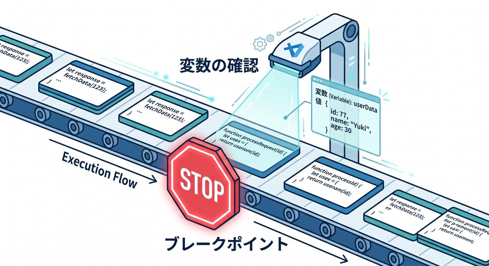
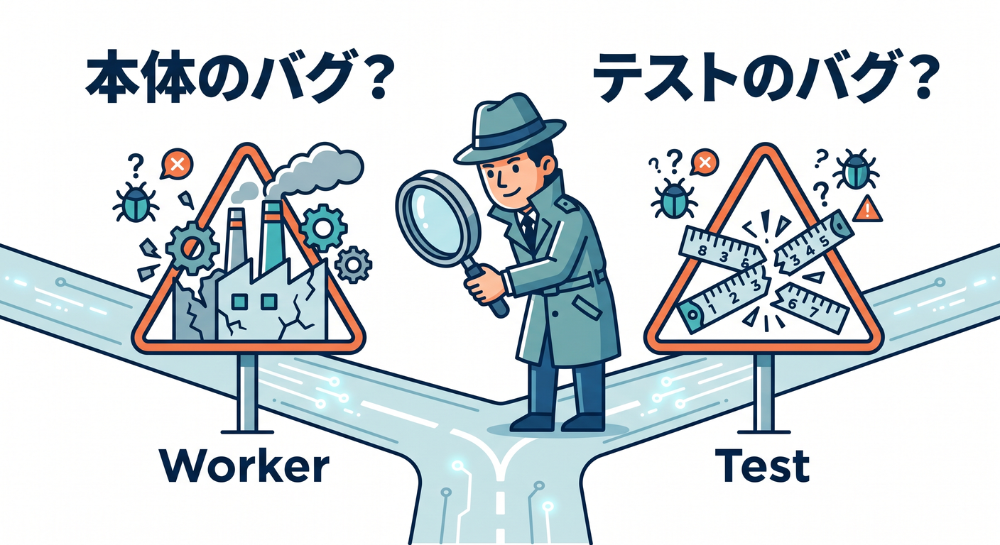
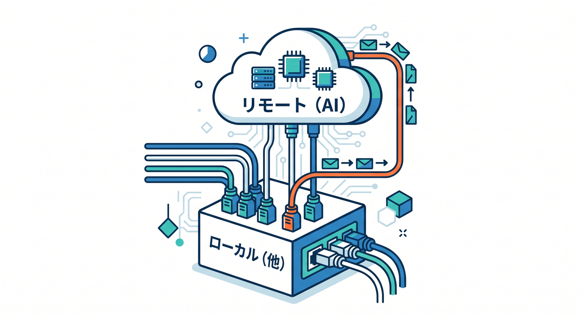
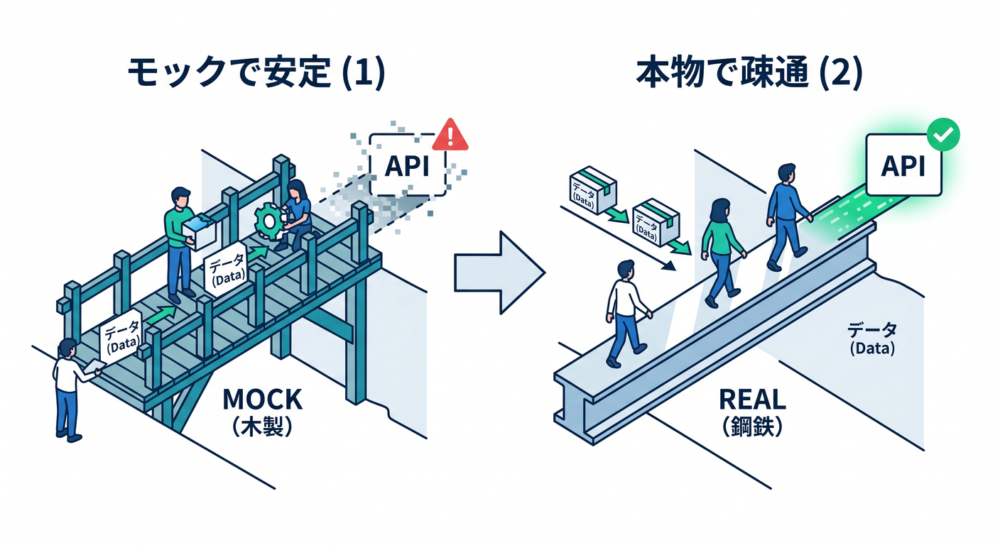

# 第10章　テストをデバッグできるようになろう 🧠🛠️🔍✨
この章では、前章で書いたテストを「ただ回す」だけで終わらせず、**止めて・見て・原因を切り分ける**ところまで進みます 😊
本日時点の公式導線では、Cloudflare は **Workers Vitest integration** を中心に案内していて、テストは Workers runtime 内で動きます。しかもローカル実行は Miniflare によって、production と同じ `workerd` 系の実行環境にかなり近い形で試せます。だから、Cloudflare らしい binding や runtime の癖も、ローカルでかなり実戦的に追いやすいです。 ([Cloudflare Docs][1])


この章の合言葉は、**「テストもコード。だからデバッグして当然」**です 😌
初心者のうちは、テストが落ちたときに「アプリ本体が悪いのか」「テストの書き方が悪いのか」「設定が悪いのか」がごちゃっと混ざりやすいです。ここを落ち着いて分けられるようになると、Cloudflare 開発の安心感がぐっと増えます 🌸

---

## この章でできるようになりたいこと 🎯
1. テスト失敗時に、勘ではなくブレークポイントで原因を追えるようになる。
2. VS Code から Workers テストを止めて、変数・呼び出し順・レスポンスを確認できるようになる。
3. 「Worker 本体のバグ」と「テストコード側のバグ」を分けて考えられるようになる。
4. Workers AI を使うコードでも、**まずはロジックを安定してデバッグする考え方**を持てるようになる 🤖

---

## 1. まずは「今の公式ルート」をつかもう 🚦
現在の Cloudflare 公式では、Workers のテスト方法として **Vitest integration** が強く推されています。これは `@cloudflare/vitest-pool-workers` を使い、Vitest のテストを Workers runtime 内で走らせる仕組みです。unit test と integration test の両方に対応し、bindings や Workers runtime API に直接触れられ、さらにローカルでは Miniflare を使って高速に回せます。 ([Cloudflare Docs][2])

さらに、Workers テストのデバッグは専用ページが用意されていて、**`vitest --inspect --no-file-parallelism`** を起点に、VS Code から attach して追う流れが公式に整理されています。なお、このデバッグ機能は `@cloudflare/vitest-pool-workers` の **v0.7.5 以降**で使えます。 ([Cloudflare Docs][3])

また、現行の導入ガイドでは `@cloudflare/vitest-pool-workers` と一緒に **Vitest 4.1 以上**が必要とされています。ここは古い記事との差が出やすいので、教材でも新しい流れに寄せておくのが大事です 📚✨ ([Cloudflare Docs][4])

---

## 2. テスト用の基本設定を整えよう 🧩
第9章で作ったテスト環境がある前提ですが、ここで最低限のおさらいをしておきます。`vitest.config.ts` では `cloudflareTest()` プラグインを使い、`wrangler.jsonc` を参照させるのが基本です。Cloudflare 公式でもこの形が最初の設定例として案内されています。 ([Cloudflare Docs][4])

```ts
// vitest.config.ts
import { defineConfig } from "vitest/config";
import { cloudflareTest } from "@cloudflare/vitest-pool-workers";

export default defineConfig({
  plugins: [
    cloudflareTest({
      wrangler: { configPath: "./wrangler.jsonc" },
    }),
  ],
});
```

TypeScript を使うなら、`wrangler types` を実行して Workers runtime と `Env` の型を生成し、テスト側でもその型を参照できるようにしておくのが大事です。公式のテスト導線でも、`wrangler types` の出力を `include` に入れ、`@cloudflare/vitest-pool-workers` の型を足す形が案内されています。型が崩れていると、デバッグ以前に「何を見ているのか」がぼやけやすいので、ここは地味に大切です 🔧 ([Cloudflare Docs][4])

---

## 3. デバッグ練習用の小さな Worker を作ろう ☁️🧪
まずは、**わざと小さなミスを入れた Worker** を作ります。テストが落ちる理由を、目で追って確認するためです 👀

```ts
// src/index.ts
export default {
  async fetch(request: Request): Promise<Response> {
    const url = new URL(request.url);

    // わざとミス: "name" ではなく "namae" を見ている
    const name = url.searchParams.get("namae") ?? "world";

    return Response.json({
      message: `Hello, ${name}!`,
    });
  },
};
```

この Worker に対して、integration 寄りのテストを書きます。Cloudflare の現行 Test APIs では、`cloudflare:workers` から `exports` を使い、`exports.default.fetch()` で main Worker の `fetch` を叩く流れが案内されています。これは、以前の `SELF` 系の感覚より、今の公式導線に寄った書き方です。 ([Cloudflare Docs][5])

```ts
// test/hello.spec.ts
import { describe, it, expect } from "vitest";
import { exports } from "cloudflare:workers";

describe("Hello Worker", () => {
  it("name クエリがあると、その名前で返す", async () => {
    const response = await exports.default.fetch("https://example.com/?name=komiyan");
    const data = await response.json<{ message: string }>();

    expect(data).toEqual({
      message: "Hello, komiyan!",
    });
  });
});
```

この状態ではテストは落ちます 💥
でも今回はそれで正解です。大事なのは、**「なぜ world になったのか」をデバッガで見つけること**です。

---

## 4. VS Code でテストを止める準備をしよう 🎯🪲
Cloudflare の公式デバッグ手順では、まず Vitest を inspect モードで起動し、**デバッガをポート 9229 に接続**します。そのとき **`--no-file-parallelism`** を付けるのがポイントです。テストを並列で走らせたままだと、初心者には追跡がかなり分かりにくくなるからです。 ([Cloudflare Docs][3])

```bash
npx vitest --inspect --no-file-parallelism
```


もし 9229 が埋まっていたら、公式どおり **`--inspect=3456 --no-file-parallelism`** のように変えても OK ですし、`vitest.config.ts` 側の `test.inspector.port` で変更する方法もあります。 ([Cloudflare Docs][3])

VS Code 側では、`.vscode/launch.json` に **Vitest を inspect 付きで起動する設定**と、**Workers runtime へ attach する設定**の 2 本を作り、最後に compound でまとめると扱いやすいです。Cloudflare 公式もこの 2段構成を案内しています。 ([Cloudflare Docs][3])

```json
{
  "version": "0.2.0",
  "configurations": [
    {
      "name": "Vitestをinspectで起動",
      "type": "node",
      "request": "launch",
      "program": "${workspaceFolder}/node_modules/vitest/vitest.mjs",
      "console": "integratedTerminal",
      "args": ["--inspect=9229", "--no-file-parallelism"]
    },
    {
      "name": "Workers Runtimeに接続",
      "type": "node",
      "request": "attach",
      "port": 9229,
      "cwd": "/",
      "resolveSourceMapLocations": null,
      "attachExistingChildren": false,
      "autoAttachChildProcesses": false
    }
  ],
  "compounds": [
    {
      "name": "Workersテストをデバッグ",
      "configurations": ["Vitestをinspectで起動", "Workers Runtimeに接続"],
      "stopAll": true
    }
  ]
}
```

起動したら、**テストファイルの `expect()` の直前**と、**Worker 側の `url.searchParams.get(...)` の行**にブレークポイントを置いてみましょう。VS Code では Run and Debug 画面から、変数、呼び出しスタック、Watch を見ながら追えます。JavaScript / TypeScript / Node.js のデバッグは VS Code に標準で入っているので、余計な拡張を増やさず進めやすいのもありがたいところです 🙌 ([Cloudflare Docs][3])

---

## 5. 実際にどう追うのか、順番で見てみよう 👣✨
## ① 先にテスト側で止める
最初の停止地点では、`response` がちゃんと返ってきているか、`await response.json()` の結果が何かを見るだけで十分です。
ここで `message: "Hello, world!"` になっていれば、「レスポンスは返っているけど値が違う」と分かります。

## ② 次に Worker 側で止める
`const name = url.searchParams.get("namae") ?? "world";` の行で止めて、`url.searchParams.get("name")` と `url.searchParams.get("namae")` を見比べます。
すると `"name"` には `"komiyan"` が入るのに、コードは `"namae"` を見ているため `null` になり、結果として `"world"` が採用されている、と見抜けます 😊

## ③ 修正して再実行する
`"namae"` を `"name"` に直して、もう一度 same debug 構成で実行します。
今度は `name` が `"komiyan"` になり、最後の `expect()` も通ります 🎉


この流れで大事なのは、**「1回で全部理解しようとしない」**ことです。
まずは **入力**, **途中の値**, **最終結果** の 3点だけ見る。これだけでかなり強くなれます 🌱

---

## 6. integration テストと direct call を使い分けよう 🔀
今の Cloudflare テスト API では、`exports.default.fetch()` で main Worker をそのまま叩く integration っぽい確認ができます。一方で、もっと細かく見たいときは `cloudflare:test` の `createExecutionContext()` や `waitOnExecutionContext()` を使って、handler を直接呼び出す形も取れます。公式でもその helper が用意されています。 ([Cloudflare Docs][5])

たとえば「`ctx.waitUntil()` の中の処理まで確認したい」「`env` と `ctx` を自分で明示してテストしたい」なら、direct call のほうが追いやすいです。逆に「ルーティングからレスポンスまで、ひとまず全体で見たい」なら `exports.default.fetch()` が分かりやすいです。
初心者向けには、**最初は `exports.default.fetch()`、詰まったら direct call** という順番がおすすめです 🌼

---

## 7. GitHub Copilot を“考える補助輪”として使おう 🤖💬
VS Code の公式ドキュメントでも、**Copilot は `launch.json` の生成を手伝える**と案内されています。なので、この章では Copilot を「魔法の自動修正」ではなく、**デバッグ設定の下書き作成係**として使うのが相性よいです。 ([Visual Studio Code][6])

たとえば Copilot Chat には、こんな感じで頼めます ✨

* 「Cloudflare Workers の Vitest integration 用に、inspect 9229 と attach を含む `launch.json` を作って」
* 「この failing test を読んで、確認すべき変数を 3つだけ挙げて」
* 「この assertion failure から、アプリ側のバグ候補とテスト側のバグ候補を分けて」

こうすると、**自分で読む力を残したまま**、調査の出発点だけ速くできます。
AI には“答えを決めてもらう”より、“観察ポイントを増やしてもらう”ほうが、教材としてずっと強いです 🌟

---

## 8. Cloudflare AI を使うテストはどう考える？ 🤖☁️🧪
ここは今っぽくて大事です。Cloudflare のローカル開発では、多くの bindings はローカルシミュレーションで扱えますが、**AI bindings は例外**で、AI モデル自体は常にリモートで動きます。

公式にも、Workers AI には現時点でローカルシミュレーションがなく、`remote: true` を使う形が案内されています。 ([Cloudflare Docs][7])

Workers AI を使うときは、Wrangler 側で AI binding を定義し、Worker からは `env.AI.run()` でモデルを呼びます。これは本日時点でも公式の基本形です。 ([Cloudflare Docs][8])

```json
// wrangler.jsonc
{
  "ai": {
    "binding": "AI",
    "remote": true
  }
}
```

```ts
// 例: Worker 内
const result = await env.AI.run("@cf/meta/llama-3.1-8b-instruct", {
  prompt: "Hello from Cloudflare",
});
```

ただし、**この章の主役は「テストをデバッグする力」**です。なので教材としては、AI を使う機能でも、最初の数本は **モックした戻り値でロジックを固める**のがおすすめです。Cloudflare の Recipes にも、**Workers AI と Vectorize の binding をモックする unit test 例**が用意されています。 ([Cloudflare Docs][9])

さらに、本物の AI リクエストを観測したいときは **AI Gateway** がかなり便利です。AI Gateway は analytics・logging・caching・rate limiting・retry・fallback などを提供し、Workers AI と組み合わせた binding では `env.AI.aiGatewayLogId` で直近ログ ID を取れたり、`gateway.getLog()` でログ詳細を取得できたりします。つまり、**AI の失敗や遅さも “見る” 対象にできる**わけです 👀✨ ([Cloudflare Docs][10])

この章の学びに引き寄せると、AI を含むテストはこう考えるのがきれいです。


1. まずはモックでロジックをデバッグする。
2. 次に 1 本だけ実 AI で疎通確認する。
3. 本物の観測は AI Gateway で追う。

この順番にすると、テストが「AI の気分」で不安定になるのをかなり防げます 🌈

---

## 9. ハマりやすい落とし穴も先に知っておこう ⚠️
Workers Vitest pool は **現在 open beta** です。つまり、かなり実用的ではあるけれど、まだ注意点があります。教材ではここを最初から隠さないほうが親切です。 ([Cloudflare Docs][11])

まず、**coverage は V8 ネイティブではなく Istanbul を使う**必要があります。なので「coverage 設定がそのまま動かない」ときは、Cloudflare 側の制約を疑う視点も大切です。 ([Cloudflare Docs][11])

次に、**Vitest の fake timers は KV・R2・Cache のシミュレータには効きません**。なので「時間を進めたのに KV の期限切れが再現しない」みたいな混乱が起きます。 ([Cloudflare Docs][11])

また、`exports.default.fetch()` を使う integration テストでは、**`export default { ... }` の中での dynamic import がうまく動かない**ケースがあります。その場合は handler を直接 import して呼ぶか、static import に寄せるほうが安全です。 ([Cloudflare Docs][11])

さらに、storage isolation は **テストファイル単位**です。Cloudflare 公式は、ストレージ操作の Promise をちゃんと `await` すること、そして `fetch()` や `R2.get()` で得たレスポンスは、内容を検証しなくても **body を最後まで消費する**ことを勧めています。ここを雑にすると、「なんか次のテストが変」「たまにだけ失敗する」が起きやすいです 😵‍💫 ([Cloudflare Docs][11])

もし `ctx.exports` に必要な export が出てこないなら、複雑な re-export 構成の影響かもしれません。その場合は `additionalExports` の指定、モジュール解決エラーなら `deps.optimizer` の見直し、global setup で workerd 向け解決が壊れるなら wrapper 方式、という逃げ道が公式に案内されています。 ([Cloudflare Docs][11])

---

## 10. この章のおすすめ演習 ✍️🎓
## 演習1　わざと壊した Worker を直す
上の `namae` バグ入り Worker を使って、ブレークポイントで原因を見つけて直してみましょう。
**目標**は「修正すること」より、**変数を見て原因を言葉にできること**です。

## 演習2　inspect ポートを変えてみる
9229 ではなく 3456 に変更して、`launch.json` も合わせて動かしてみましょう。
**目標**は「ポート番号が変わっても落ち着いて設定をそろえられること」です。 ([Cloudflare Docs][3])

## 演習3　direct call 版のテストを書く
`exports.default.fetch()` ではなく、handler を直接 import して `createExecutionContext()` を使うテストを書いてみましょう。
**目標**は「integration 風」と「より細かい unit 風」を使い分ける感覚をつかむことです。 ([Cloudflare Docs][5])

## 演習4　AI を含む処理を“まずはモック”で確かめる
Workers AI を呼ぶ関数を 1つ作り、最初は固定戻り値でテストし、最後に 1本だけ実 AI 疎通へ広げてみましょう。
**目標**は「AI を使っても、テストの安定性を先に守る」ことです。 ([Cloudflare Docs][9])

---

## まとめ 🌟
この章のいちばん大事な収穫は、**テストが落ちても慌てなくなること**です 😊
Cloudflare の今の公式導線では、Workers Vitest integration を使って Workers runtime にかなり近い形でテストでき、さらに inspect と VS Code の attach で、テストも Worker 本体も止めて見られます。ここまで来ると、「なんとなく直す」からかなり卒業できます。 ([Cloudflare Docs][2])

そして 2026 年の Cloudflare 学習らしく言うなら、ここで身につくのは単なるテスト技術ではありません。**bindings を持つ Worker、AI を呼ぶ Worker、観測しながら育てる Worker** を、落ち着いて直せる力です。次の章の Observability や Logs とつながる、かなりいい土台になります ☁️🔎💪 ([Cloudflare Docs][7])

[1]: https://developers.cloudflare.com/workers/testing/vitest-integration/?utm_source=chatgpt.com "Vitest integration · Cloudflare Workers docs"
[2]: https://developers.cloudflare.com/workers/testing/vitest-integration/ "Vitest integration · Cloudflare Workers docs"
[3]: https://developers.cloudflare.com/workers/testing/vitest-integration/debugging/ "Debugging · Cloudflare Workers docs"
[4]: https://developers.cloudflare.com/workers/testing/vitest-integration/write-your-first-test/ "Write your first test · Cloudflare Workers docs"
[5]: https://developers.cloudflare.com/workers/testing/vitest-integration/test-apis/ "Test APIs · Cloudflare Workers docs"
[6]: https://code.visualstudio.com/docs/debugtest/debugging "Debug code with Visual Studio Code"
[7]: https://developers.cloudflare.com/workers/development-testing/ "Development & testing · Cloudflare Workers docs"
[8]: https://developers.cloudflare.com/workers-ai/configuration/bindings/ "Workers Bindings · Cloudflare Workers AI docs"
[9]: https://developers.cloudflare.com/workers/testing/vitest-integration/recipes/ "Recipes and examples · Cloudflare Workers docs"
[10]: https://developers.cloudflare.com/ai-gateway/ "Overview · Cloudflare AI Gateway docs"
[11]: https://developers.cloudflare.com/workers/testing/vitest-integration/known-issues/ "Known issues · Cloudflare Workers docs"
