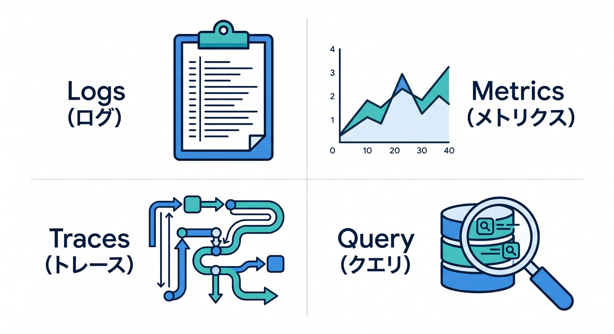
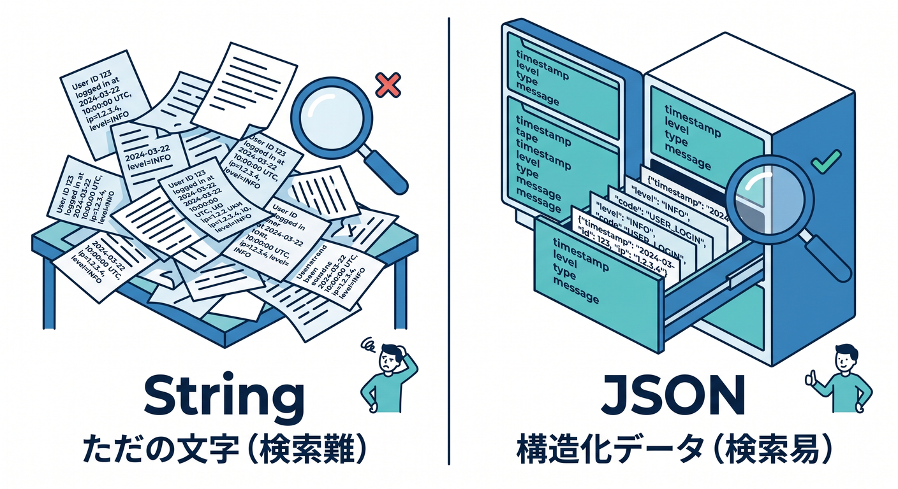
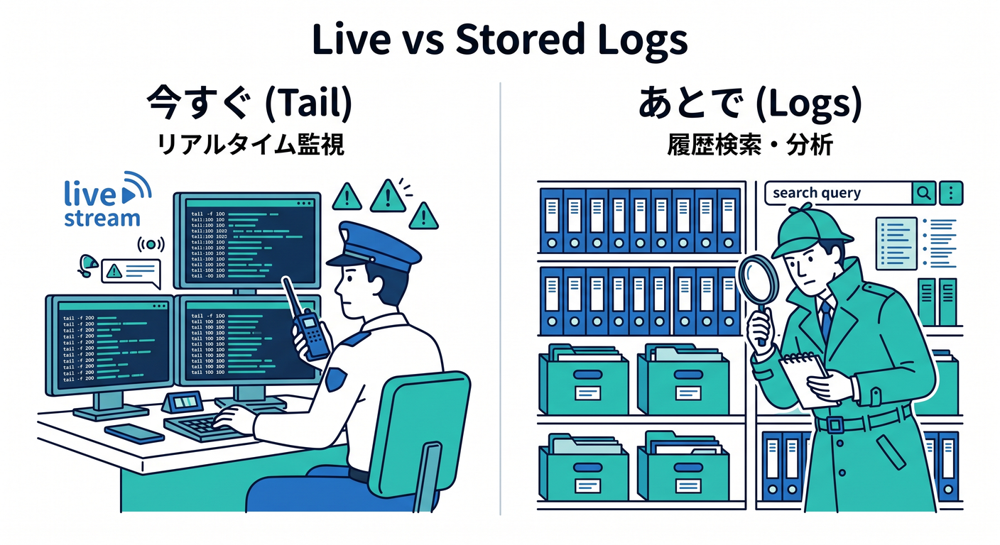
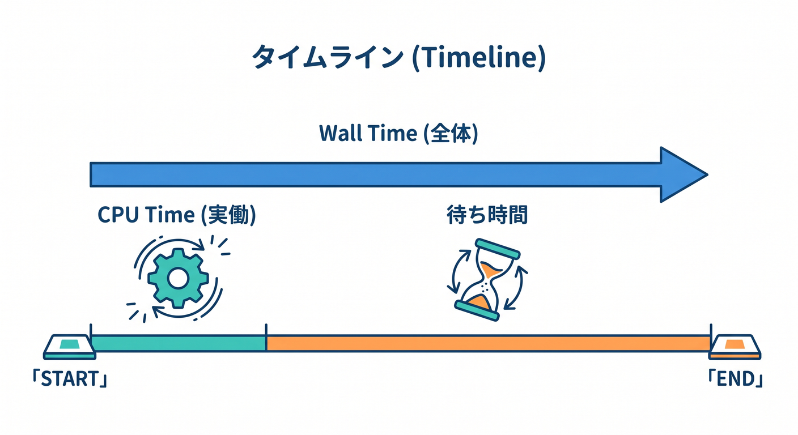
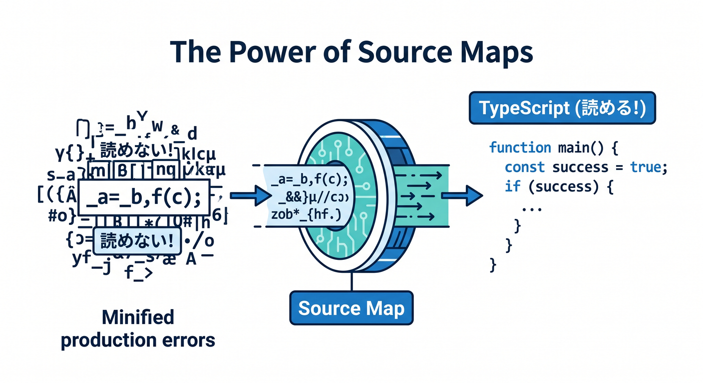

# 第11章　Observability と Logs で「見る力」を育てよう 📈👀☁️
この章では、Cloudflare Workers を「ただ動かす」段階から、「動き方を見ながら直す」段階へ進みます ✨
Cloudflare の Workers には、**Logs・Metrics・Traces・Query Builder** といった観測機能がまとまっていて、ログの確認、エラー原因の追跡、処理の重さの把握、リクエストの流れの分析まで段階的に行えます。特にメトリクスでは request 数、error、CPU time、wall time、execution duration などを見られ、Query Builder では Workers Logs に保存されたログを検索・集計できます。 ([Cloudflare Docs][1])

この章のゴールは、とてもシンプルです 😊
**「失敗したらログを見る」「重いならメトリクスを見る」「複雑な流れはトレースで追う」** という基本の型を身につけることです。ここができると、本番公開後も怖くなくなります 🌱

---

## この章で身につけたいこと 🎯
この章を終えるころには、次の状態を目指します。

* Workers Logs を有効にして、保存されるログとライブログの違いがわかる
* `console.log()` を雑に使うのではなく、**検索しやすい構造化ログ**として書ける
* Requests / Errors / CPU time / Wall time を見て、どこが怪しいか当たりをつけられる
* Query Builder で「どのURLが失敗しやすいか」「どの処理が重いか」を探れる
* AI Gateway を使うと、AI リクエストの観測まで一気につながる

---

## 1. Observability って、結局なに？ 🤔🔭
Observability は、ざっくり言うと **「動いているアプリをあとから観察できるようにする仕組み」** です。Cloudflare Workers では、ログだけでなく、メトリクスやトレースも公式に整理されています。Cloudflare 自身も、Observability の中心機能として **logs / metrics / traces / query builder** を案内しています。 ([Cloudflare Docs][1])


初心者のうちは、まずこの4つをこう覚えるとかなり楽です 🌸

**Logs** は「その場で何が起きたかの記録」です。`console.log()` で残した内容、例外、呼び出し情報などを追えます。Workers Logs には invocation logs・custom logs・errors・uncaught exceptions が入ります。 ([Cloudflare Docs][2])

**Metrics** は「全体の傾向」です。何回呼ばれたか、失敗は増えているか、CPU time が重いか、wall time が長いか、といった“数字の流れ”を見ます。 ([Cloudflare Docs][3])

**Traces** は「1回のリクエストの流れ」です。どの処理で時間がかかったか、どの外部処理や binding が遅いか、といった道筋をたどれます。 ([Cloudflare Docs][4])

**Query Builder** は「保存されたログをあとから掘る道具」です。Workers Logs に入っているログを、フィルタ・集計・グループ化して調べられます。 ([Cloudflare Docs][5])

---

## 2. まずは設定を入れよう 🔧📝
Cloudflare では新しく作った Worker は observability がデフォルト有効になる案内がありますが、Wrangler を使う開発では **`wrangler.jsonc` を source of truth として明示しておく** のがいちばん安心です。Cloudflare も Wrangler 設定ファイルを source of truth として扱うことを推奨しています。 ([Cloudflare Docs][2])

まずは第11章の学習用として、こんな設定にしておくと見通しがよいです 👇

```jsonc
{
  "$schema": "./node_modules/wrangler/config-schema.json",
  "name": "chapter11-observability-demo",
  "main": "src/index.ts",
  "compatibility_date": "2026-04-15",

  "observability": {
    "enabled": true,
    "logs": {
      "invocation_logs": true,
      "head_sampling_rate": 1
    },
    "traces": {
      "enabled": true,
      "head_sampling_rate": 1
    }
  },

  "upload_source_maps": true
}
```

Workers Logs は `observability.enabled` を使って有効化でき、`head_sampling_rate` で記録する割合を調整できます。Query Builder でも、Workers Logs を使う前提で `observability` 設定を Wrangler に入れて再デプロイする案内があります。Traces は現時点では **別途 `observability.traces.enabled = true` が必要** で、`observability.enabled = true` だけでは自動では有効になりません。さらに `upload_source_maps: true` を入れると、本番の例外スタックを元の TypeScript に近い形で見やすくできます。 ([Cloudflare Docs][2])

最初の学習では `head_sampling_rate: 1`、つまり全部記録で大丈夫です 💯
ただし高トラフィックになってきたら、Cloudflare も sampling でログ量とコストを調整する考え方を案内しています。 ([Cloudflare Docs][2])

---

## 3. ログは「文章」より「構造」で残そう 🧱📋
Workers Logs では、**JSON 形式でログを残すのが推奨** されています。理由は、Cloudflare 側がフィールドを抽出してインデックスしやすくなり、あとで `user_id` や `route` や `requestId` で絞り込みやすくなるからです。文字列ベタ書きより、オブジェクトで出したほうが後から圧倒的に楽です。 ([Cloudflare Docs][2])


たとえば、最初の観測用 Worker はこんな感じで十分です 😊

```ts
type Env = {
  AI: any;
};

export default {
  async fetch(request: Request, env: Env): Promise<Response> {
    const requestId = crypto.randomUUID();
    const url = new URL(request.url);
    const startedAt = Date.now();

    console.log({
      level: "info",
      event: "request.start",
      requestId,
      method: request.method,
      path: url.pathname
    });

    try {
      if (url.pathname === "/ai") {
        const result = await env.AI.run(
          "@cf/<your-model>",
          { prompt: "Cloudflare Workers の学習ポイントを3つ教えて" },
          {
            gateway: {
              id: "<your-gateway-id>",
              metadata: {
                feature: "chapter11",
                route: "/ai",
                test: true
              }
            }
          }
        );

        console.log({
          level: "info",
          event: "ai.success",
          requestId,
          elapsedMs: Date.now() - startedAt
        });

        return Response.json({ ok: true, requestId, result });
      }

      console.log({
        level: "info",
        event: "request.end",
        requestId,
        elapsedMs: Date.now() - startedAt
      });

      return Response.json({ ok: true, requestId });
    } catch (error) {
      console.error({
        level: "error",
        event: "request.error",
        requestId,
        elapsedMs: Date.now() - startedAt,
        message: error instanceof Error ? error.message : String(error)
      });

      return Response.json(
        { ok: false, requestId, error: "internal_error" },
        { status: 500 }
      );
    }
  }
};
```

Cloudflare の `console` 系メソッドは、ローカル開発ではコンソールに出力され、デプロイ後は live logs や `wrangler tail`、Tail Workers、Logpush 側にも流せます。さらに Workers Logs では `console.log()` の custom logs も保存対象になります。 ([Cloudflare Docs][6])

ここで大事なのは、**最低でも `event`・`requestId`・`path`・`elapsedMs` をそろえる**ことです ✨
この4つがあるだけで、「どのリクエストの」「どの処理が」「どれくらいかかったか」をかなり追いやすくなります。これは教材としても、実務の最初の一歩としてもかなり強い型です。 ([Cloudflare Docs][2])

---

## 4. ライブで見るログと、保存して掘るログは別物だよ 👀⚡
Cloudflare には、似ているようで役割が違うログの見方がいくつかあります。ここを混同しないことが第11章の大事ポイントです 🌟

**Real-time logs** は「今まさに流れているログを見る」ためのものです。ダッシュボードの Live でも見られますし、ターミナルでは `npx wrangler tail` で追えます。ログは structured JSON として見えます。 ([Cloudflare Docs][7])

```bash
npx wrangler tail
```

ただし Real-time logs は **保存用ではありません**。高トラフィック時には sampling mode に入って一部メッセージが落ちることがあり、同時に見られるクライアント数にも上限があります。Cloudflare は「保存したいなら Workers Logs を使ってね」とはっきり案内しています。 ([Cloudflare Docs][7])

一方の **Workers Logs** は、ログを Cloudflare アカウント内に保存して、あとからフィルタ・検索・分析するための仕組みです。invocation logs、custom logs、errors、uncaught exceptions が入り、Query Builder からもこの保存済みログを検索します。 ([Cloudflare Docs][2])


学習の感覚としては、こう分けると迷いません 😊

* **今すぐ見たい** → Real-time logs / `wrangler tail`
* **あとで原因を掘りたい** → Workers Logs
* **独自転送や独自加工をしたい** → Tail Workers
* **外部監視基盤へ送りたい** → OTel export / Logpush

この整理は Cloudflare の Observability 導線そのものにかなり沿っています。 ([Cloudflare Docs][1])

---

## 5. Metrics は「ログを読む前の地図」だと思おう 🗺️📊
ログを1件ずつ追い始める前に、まず Metrics を見ると効率が上がります。Workers metrics では、**Requests / Success / Errors / Subrequests / Wall time / CPU time / Execution duration** などを見られます。 ([Cloudflare Docs][3])

まず見るべきは **Requests と Errors** です。Workers metrics では、成功・失敗・subrequests が分かれて表示されます。さらに Invocation statuses では、成功か失敗かだけでなく、`Worker threw exception`、`Exceeded resources`、`Internal error` などの種類まで区別されます。しかもこれは **HTTP status code と同じ意味ではありません**。Worker の実行自体は成功していても、別の場所で HTTP 的には失敗するケースもあります。 ([Cloudflare Docs][3])


次に見るべきは **CPU time と Wall time** です。Wall time は Worker の実行開始から「もう JavaScript を回さなくてよい」とランタイムが判断するまでの経過時間で、I/O待ちや `waitUntil()` の時間も含みます。CPU time は実際に CPU を使っていた重さの指標です。なので、**CPU time は低いのに Wall time だけ長い** なら、外部 API や DB、KV、R2 などの待ち時間を疑う、という読み方ができます。 ([Cloudflare Docs][3])

Execution duration や Request duration もありますが、最初は「CPU が重いのか、待ちが長いのか」を分けられれば十分です。なお Request duration は Smart Placement が有効な Worker で見られる指標です。 ([Cloudflare Docs][3])

Metrics は過去3か月まで確認できるので、「昨日からおかしい」「今週から重い」といった変化を見るのにも向いています。 ([Cloudflare Docs][3])

---

## 6. Query Builder は「保存済みログを検索する主役」だよ 🔎🧠
Query Builder は、Workers Observability dataset を検索するための UI で、**現在は Workers Logs に保存されたログが対象** です。フィルタ、group by、order、limit、可視化を使って、ログをかなり気持ちよく掘れます。 ([Cloudflare Docs][5])

しかも Count、Count Distinct、Min、Max、Sum、Average といった集計が使えるので、「どの path が多いか」「どのイベントが失敗しやすいか」「elapsedMs の平均が高い route はどれか」みたいな見方ができます。 ([Cloudflare Docs][5])

この章では、難しいクエリ構文を覚えるより、次のような問いを立てられるようになるのが大切です 💡

* `event = "request.error"` が多いのはどの path？
* `elapsedMs` が大きいのは `/api/search` と `/ai` のどっち？
* `test = true` の AI リクエストだけ見ると失敗率はどう？
* `requestId` 単位で追うと、どのログが同じ処理のまとまり？

この「問いを立てて、保存済みログから掘る」感覚がつくと、ログはただの文字列ではなくなります ✨

---

## 7. TypeScript の本番エラーは source maps でかなり救われる 🧷🗂️
Workers は TypeScript をバンドル・変換して本番へ出すことが多いので、source map がないとスタックトレースがかなり読みにくくなりがちです。Cloudflare では `upload_source_maps: true` を入れて deploy すると、source map をアップロードして、未処理例外のスタックを元のソースコードに近い行番号へ戻して表示できます。しかもそのスタックは real-time logs や Tail Workers で確認できます。 ([Cloudflare Docs][8])


つまり、**第11章でログを見るなら、source map までセットで入れておくのがほぼ必須**です。特に VS Code・TypeScript・Wrangler の流れで学ぶなら、ここを先に入れておくと第12章以降もかなり楽になります 😊 ([Cloudflare Docs][8])

---

## 8. AI を使うなら、この章はさらに重要になる 🤖☁️💬
Cloudflare の AI 系を使う場合、この章の価値は一気に上がります。特に **AI Gateway** は observability がかなり強く、ログでは individual request ごとに **prompt、model response、provider、timestamp、request status、token usage、cost、duration** まで見られます。分析画面では requests、tokens、errors、cached responses、cost なども確認できます。 ([Cloudflare Docs][9])

さらに AI Gateway では **custom metadata** をつけられて、それがログに出ます。`team`、`user`、`test` などをタグとして持たせると、あとでフィルタしやすくなります。Workers binding 経由でも metadata を渡せます。なお metadata は最大5件まで保存対象です。 ([Cloudflare Docs][10])

つまり AI 開発では、こんな見方ができるわけです ✨

* `test: true` のリクエストだけ抜き出す
* `feature: "chapter11"` の実験だけ集計する
* prompt は通っているのに duration が長いケースを探す
* token usage と cost を route ごとに眺める

これは「AI を使った Worker を作る」ときに本当に効きます。
ただモデル結果を見るだけではなく、**どの呼び出しが高い・遅い・失敗しやすいか** を観測できるからです。 ([Cloudflare Docs][9])

---

## 9. もう一歩先へ：Traces と OpenTelemetry 🌉📡
Cloudflare Workers の tracing は現時点で **open beta** です。`observability.traces.enabled = true` で有効化でき、sampling も `head_sampling_rate` で調整できます。 ([Cloudflare Docs][11])

Traces を入れると、リクエストの流れをもう少し立体的に見られます。そして Cloudflare Workers は OpenTelemetry 準拠の telemetry export に対応していて、**logs と traces** を OTel endpoint のある外部基盤へ送れます。ただし **metrics と custom metrics の export はまだ未対応** です。 ([Cloudflare Docs][11])

一方で、beta らしい注意点もあります。Cloudflare は、外部プラットフォームへ export したとき **trace IDs がまだ他サービスへ伝播しない** ため、既存システムとの完全な end-to-end trace 連携はまだ発展途中だと案内しています。Service Bindings や Durable Objects も、現時点では別 trace として見えることがあります。 ([Cloudflare Docs][12])

なので第11章では、traces は **「入門として触る」くらいで十分** です。主役はあくまで Logs と Metrics。Traces はその次の一歩、と考えるとちょうどよいです 🌿

---

## 10. Tail Workers はどんなときに使うの？ 🧰📮
Tail Workers は、別の Worker の実行結果を受け取って、独自加工や独自転送ができる仕組みです。HTTP status、`console.log()` の内容、未処理例外などを受け取り、HTTP endpoint へ転送したり、KV や DB に書いたりできます。Cloudflare は Tail Workers を **advanced-mode option** と位置づけていて、もっとカスタムな観測をしたいとき向けです。 ([Cloudflare Docs][13])

また Tail Workers は Paid / Enterprise 向けで、課金も request 数ではなく CPU time ベースです。Sentry や Honeycomb などへ送りたいだけなら、Cloudflare は Tail Workers より OTel export を先に検討する案内も出しています。 ([Cloudflare Docs][13])

つまり初心者向けには、こう整理すれば十分です 😊

* 第11章では **まだ主役ではない**
* でも「Cloudflare には独自のログ加工ルートもある」と知っておく
* 将来、通知・分析・外部転送を自前で組みたくなったら候補になる

---

## 11. この章のおすすめ演習 ✍️🧪
演習は、派手なものより「見えるようにする」練習が大事です 🌼

**演習1**
`wrangler.jsonc` に `observability` と `upload_source_maps` を追加して deploy する。Workers Logs と traces の入口を作る。 ([Cloudflare Docs][2])

**演習2**
Worker に `request.start` / `request.end` / `request.error` の structured log を入れる。`requestId` と `elapsedMs` を必ず含める。JSON 形式で残すと Query Builder で掘りやすくなります。 ([Cloudflare Docs][2])

**演習3**
`npx wrangler tail` で live logs を見る。次に dashboard 側の Workers Logs を開いて、「今だけ見るログ」と「保存されるログ」の違いを体験する。 ([Cloudflare Docs][7])

**演習4**
Metrics 画面で Requests / Errors / CPU time / Wall time を確認する。CPU が低いのに Wall が高いケースを作れたら、外部待ちの匂いを感じ取る練習になる。 ([Cloudflare Docs][3])

**演習5**
AI Gateway を通して AI 呼び出しを1本作り、metadata に `feature`, `route`, `test` を付ける。あとから AI Gateway の logs / analytics で、token usage や errors、duration を見てみる。 ([Cloudflare Docs][9])

---

## 12. 初心者がハマりやすいポイント 😵‍💫➡️🙂
ありがちな失敗は、だいたいこのへんです。

**1つ目は、ログを文章でベタ書きしすぎること。**
たとえば `"user_id: 123"` だけだと、あとで検索しづらいです。`{ user_id: 123 }` のような構造化ログのほうが圧倒的に扱いやすいです。 ([Cloudflare Docs][2])

**2つ目は、live logs を保存ログだと思ってしまうこと。**
Real-time logs は即時確認には便利ですが、保存用ではありません。高トラフィック時には sampling に入ることもあります。 ([Cloudflare Docs][7])

**3つ目は、HTTP 500 と Worker の invocation error を同じだと思うこと。**
Workers metrics の invocation statuses は、HTTP status code とは別の見方です。ここを分けて考えられると、原因切り分けがぐっと上達します。 ([Cloudflare Docs][3])

**4つ目は、source map を入れずに本番例外を追おうとすること。**
TypeScript のまま気持ちよく追いたいなら、`upload_source_maps` はかなり重要です。 ([Cloudflare Docs][8])

**5つ目は、AI 呼び出しを“結果だけ”で見てしまうこと。**
AI Gateway を使うと、duration、errors、tokens、cost、metadata まで見えるので、AI 開発も普通の observability の延長で扱いやすくなります。 ([Cloudflare Docs][9])

---

## この章のまとめ 🏁✨
第11章の主役は、**「見る力」** です。
Cloudflare Workers では、Workers Logs でログを保存・分析し、Real-time logs や `wrangler tail` でその場の動きを見て、Metrics で傾向をつかみ、必要なら Traces で流れを深掘りできます。しかも Query Builder で保存済みログを掘れます。AI Gateway を使えば、AI リクエストの prompt / provider / tokens / cost / duration まで観測の対象にできます。 ([Cloudflare Docs][2])

この章で本当に大事なのは、次の順番を体に入れることです 😊

**まず Metrics で全体を見る → 次に Logs で個別を見る → 複雑なら Traces へ進む。**

この順番が身につくと、Cloudflare 開発はかなり落ち着いて進められるようになります 🌈
続く章では、こうした観測結果をもとに、AI や外部ツールも使いながら、さらに“直せる開発”へ進んでいけます。

[1]: https://developers.cloudflare.com/workers/observability/?utm_source=chatgpt.com "Observability - Workers"
[2]: https://developers.cloudflare.com/workers/observability/logs/workers-logs/ "Workers Logs · Cloudflare Workers docs"
[3]: https://developers.cloudflare.com/workers/observability/metrics-and-analytics/ "Metrics and analytics · Cloudflare Workers docs"
[4]: https://developers.cloudflare.com/workers/observability/traces/?utm_source=chatgpt.com "Traces - Workers"
[5]: https://developers.cloudflare.com/workers/observability/query-builder/ "Query Builder · Cloudflare Workers docs"
[6]: https://developers.cloudflare.com/workers/runtime-apis/console/ "Console · Cloudflare Workers docs"
[7]: https://developers.cloudflare.com/workers/observability/logs/real-time-logs/ "Real-time logs · Cloudflare Workers docs"
[8]: https://developers.cloudflare.com/workers/observability/source-maps/ "Source maps and stack traces · Cloudflare Workers docs"
[9]: https://developers.cloudflare.com/ai-gateway/observability/logging/ "Logging · Cloudflare AI Gateway docs"
[10]: https://developers.cloudflare.com/ai-gateway/observability/custom-metadata/ "Custom metadata · Cloudflare AI Gateway docs"
[11]: https://developers.cloudflare.com/workers/observability/traces/ "Traces · Cloudflare Workers docs"
[12]: https://developers.cloudflare.com/workers/observability/traces/known-limitations/ "Known limitations · Cloudflare Workers docs"
[13]: https://developers.cloudflare.com/workers/observability/logs/tail-workers/ "Tail Workers · Cloudflare Workers docs"
