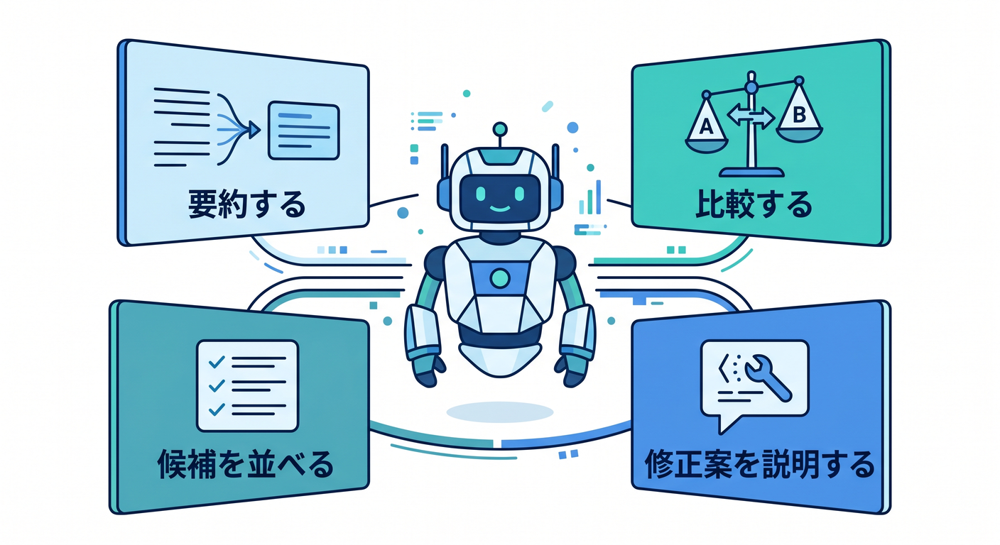
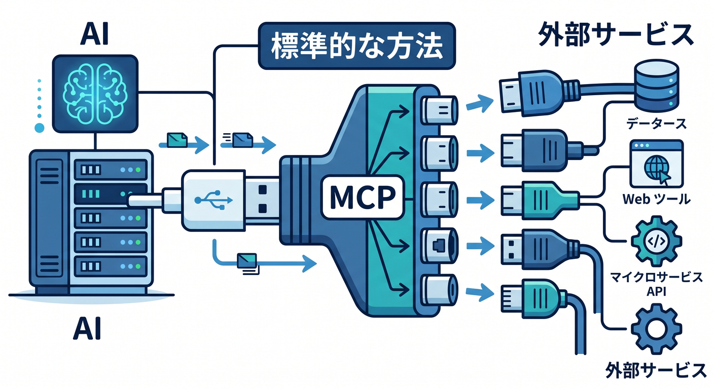
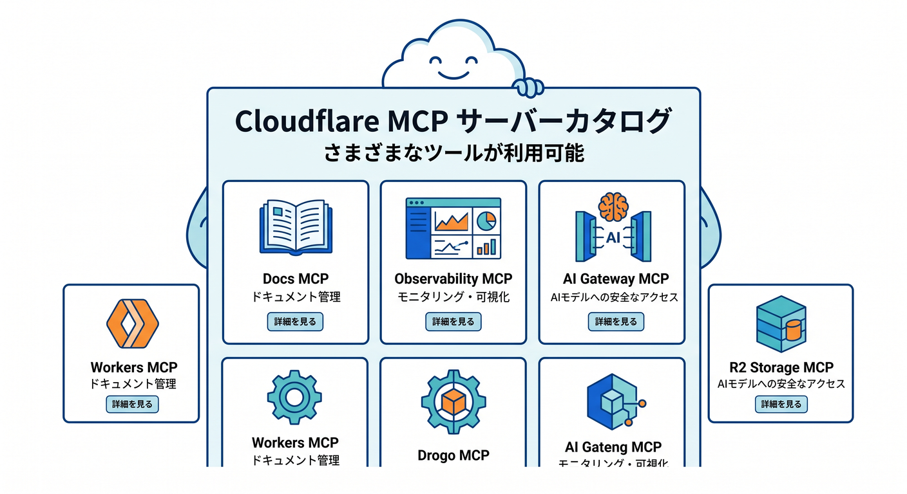
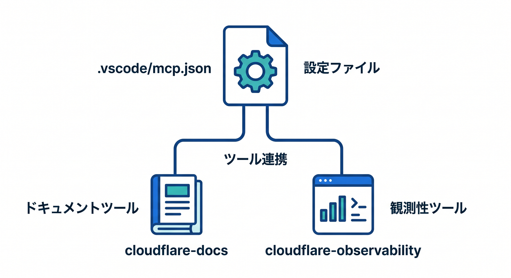

# 第12章　GitHub Copilot と MCP をデバッグの相棒にしよう 🤖💬🛠️
この章では、AI を「なんでも自動で直してくれる魔法の箱」としてではなく、**エラーの整理役・調査役・比較役**として使えるようになることを目指します ✨
2026年4月15日時点では、VS Code 上の GitHub Copilot はエージェント機能と MCP サーバー連携を使える流れがかなり整っていて、Cloudflare 側も自前の managed remote MCP servers を複数公開しています。特に Cloudflare Docs では、**Docs MCP** と **Observability MCP** をエージェントに接続して Workers の情報やログ確認に使うことが案内されています。 ([GitHub Docs][1])

---

## この章のゴール 🎯🌈
この章を終えるころには、こんなことができるようになります。

* Copilot にエラー文を読ませて、**「何が起きているか」**を短く整理させる
* MCP を使って、Copilot に **Cloudflare の最新ドキュメント** を参照させる
* 必要に応じて **ログや例外の観測結果** も AI に渡して、原因候補を絞らせる
* 「AIに修正させる前に、まず説明させる」という安全な進め方ができる

ここで大事なのは、**AIを使うこと**そのものではなく、**自分の理解を速めること**です 😊

---

## 1. まずは役割分担をはっきりさせよう 🙌🧠
この章での Copilot の役割は、主にこの4つです。

1. **要約する**
   長いエラーメッセージを、短く言い換える

2. **比較する**
   今の設定ファイルと、公式ドキュメントの正しい形を比べる

3. **候補を並べる**
   原因が1つに決めきれないとき、ありそうな原因を優先順で出す

4. **修正案を説明する**
   いきなり変更するのでなく、「なぜその修正なのか」を言葉にする



VS Code のエージェントはローカルで対話的に使うこともでき、クラウド側でバックグラウンド実行させることもできます。VS Code の公式整理では、**ローカル agent はワークスペースやツールにフルアクセスしながら対話的に進める用途**に向いていて、**cloud agent はよく定義された作業を裏で進める用途**に向いています。Cloudflare のデバッグ学習では、すぐその場で聞き返せるので、まずは **ローカル agent** が相性よしです 🔍💡 ([Visual Studio Code][2])

---

## 2. MCP って、結局なに？ 🔌🤖
MCP は、AI が外の道具や情報源とつながるための共通ルールです。Cloudflare は MCP を「AI にとっての USB-C みたいなもの」と説明していて、**AI と外部サービスを標準的な方法でつなぐ仕組み**として位置づけています。Cloudflare の説明では、MCP には大きく **remote** と **local** があり、remote はインターネット越しに Streamable HTTP と OAuth でつながり、local は同じマシン上で stdio を使って動きます。 ([Cloudflare Docs][3])



ここで Windows 学習者にとって大事なのが、**local MCP の扱いは少し慎重にしたほうがよい**ことです。VS Code の sandbox 機能は **macOS と Linux の local stdio サーバー向け**で、Windows ではその保護を前提にしにくいです。さらに Cloudflare は、現代的なセキュリティ姿勢のためには **local より remote MCP server の利用を推奨**しています。なので、この教材では最初は **remote MCP を中心**に使うのがおすすめです 🛡️🪟 ([Visual Studio Code][4])

---

## 3. Cloudflare 学習と MCP の相性がいい理由 ☁️💙
Cloudflare はすでに **managed remote MCP servers のカタログ**を持っていて、Cloudflare API MCP server のほか、Documentation server、Observability server、Workers Builds server、Browser Rendering server、AI Gateway server などを公開しています。つまり、Cloudflare 開発は「AI とつなぐ前提の道具立て」がかなり整ってきています。 ([Cloudflare Docs][5])



しかも Cloudflare の Workers ドキュメント自身が、エージェントに Workers を教える方法として **Docs MCP** を、ログや例外を見て原因調査させる方法として **Observability MCP** を案内しています。第11章で触れた observability の延長として、その観測結果を AI に読ませる流れはかなり自然です 👀🤝 ([Cloudflare Docs][6])

Workers 側の observability では、アプリの状態理解や問題診断のための仕組みがまとまっていて、Workers Logs には **invocation logs / custom logs / errors / uncaught exceptions** が入り、Real-time logs は新しいデプロイ直後の確認のような**すぐ見たい場面**に向いています。 `wrangler tail` でもリアルタイムログを見られます。なので、**ログを見る → AI に整理させる → 公式資料で裏取りする**という流れが作りやすいのです 📈🧭 ([Cloudflare Docs][7])

---

## 4. VS Code での基本セットアップ 🧰✨
GitHub の公式ドキュメントでは、Copilot と MCP を VS Code で使うには **Copilot へのアクセス**と、**VS Code 1.99 以降**が前提です。VS Code 側でも agent 機能は 1.99 以降が前提になっています。また、より良い Copilot 体験のために **最新の安定版 IDE と Copilot 拡張**の利用が推奨されています。 ([GitHub Docs][8])

MCP サーバーの登録方法は大きく2つあります。

* 拡張ビューで `@mcp` を検索して追加する
* `.vscode/mcp.json` またはユーザープロファイル側の `mcp.json` に手動で書く

VS Code 公式では、ワークスペース側の `.vscode/mcp.json` に置けば**チーム共有しやすく**、ユーザープロファイル側に置けば**どのワークスペースでも使える**と案内しています。さらに `MCP: Add Server` でガイドつき追加もできます。 ✍️📁 ([Visual Studio Code][9])

Cloudflare 学習用としては、最初はワークスペース側に置くのがわかりやすいです。
理由は、**「このプロジェクトではこの道具を使う」**が見えやすいからです 😊



---

## 5. 最初に入れたい MCP はこの2つ 👍📚📊
最初のおすすめは、次の2つです。

* **cloudflare-docs**
  Cloudflare の最新ドキュメントを AI が参照しやすくなる
* **cloudflare-observability**
  ログや例外の確認に役立つ

Cloudflare の公式ページでは、この2つが Workers 学習と調査にとても相性がよい形で案内されています。特に Docs MCP は最新のリファレンス確認、Observability MCP はログと例外の調査向けです。 ([Cloudflare Docs][6])

たとえば `.vscode/mcp.json` は、こんな最小構成から始めやすいです 👇

```json
{
  "servers": {
    "cloudflare-docs": {
      "type": "http",
      "url": "https://docs.mcp.cloudflare.com/mcp"
    },
    "cloudflare-observability": {
      "type": "http",
      "url": "https://observability.mcp.cloudflare.com/mcp"
    }
  }
}
```

この `mcp.json` 形式は VS Code 公式の構造に沿った書き方で、HTTP 型サーバーでは `type` と `url` を指定します。Cloudflare 側の server URL も公式に公開されています。 ([Visual Studio Code][4])

---

## 6. GitHub MCP もどう使う？ 🐙💬
GitHub MCP server は GitHub 提供・管理の MCP server で、GitHub Docs では **remote の GitHub MCP server が多くの人向けに推奨**されています。VS Code からは拡張ビューで `@mcp github` と検索して追加する流れが案内されています。また、Copilot Chat の **Agent** モードから使うと、ツール一覧を見ながら GitHub 関連の操作ができます。 ([GitHub Docs][10])

ただし、この章では GitHub MCP を主役にしすぎなくて大丈夫です。
この章の中心はあくまで **Cloudflare のエラー調査と設定確認** だからです 🌱

GitHub MCP は、たとえばこんな補助役で使うと便利です。

* issue の文面を読み直して作業意図を整理する
* 直近の PR で何を変えたかを見る
* エラーが出始めた変更点をたどる

---

## 7. Copilot Chat ではどう使うの？ 💬🧭
MCP をつないだあと、Copilot Chat で **Agent** を選ぶと、ツールアイコンから利用可能な MCP サーバーとツール一覧を確認できます。VS Code / GitHub Docs の案内でも、Agent を選び、ツール一覧を開いて MCP サーバーを確認する流れが示されています。 ([GitHub Docs][8])

ここで大事なのは、**いきなり「直して」ではなく、まず「説明して」**です。
たとえばこんな聞き方が強いです ✨

* 「このエラーを3行で要約して」
* 「原因候補を、可能性が高い順に3つ出して」
* 「Cloudflare Docs MCP を使って、今の設定と公式例の差分を教えて」
* 「Observability の情報から、失敗地点を推定して」
* 「修正案を1つずつ出して。各案のメリット・デメリットも添えて」

この順番にすると、**理解 → 比較 → 修正** の流れが崩れにくいです 🌸

---

## 8. 章の中心ハンズオン：AI を“説明係”として使う流れ 🧪🤖
ここでは、ありがちなつまずきを1つ想定して流れを作ります。

## 例：Worker がうまく動かない。ログには例外が出ている 😵‍💫
まずやることは、AI に丸投げではなく、材料集めです。

1. `wrangler dev` やローカル実行で再現する
2. どの URL で失敗するか確認する
3. ログやエラーメッセージを集める
4. 必要ならデプロイ済み Worker の Logs / Live / `wrangler tail` でも確認する

Cloudflare の real-time logs は、グローバルで発生するログを near real-time に見られ、新しいデプロイ直後の確認に向いています。 `wrangler tail` でも同様に確認できます。 ([Cloudflare Docs][11])

そのうえで Copilot に、次の順で頼みます。

## ステップA：要約
「このエラー文を初心者向けに言い換えて」

## ステップB：分類
「これは設定ミス、型の問題、実行時エラーのどれに近い？」

## ステップC：公式確認
「Cloudflare Docs MCP を使って、関連する設定項目と正しい書き方を探して」

## ステップD：観測結果と照合
「Observability の情報から、どの処理の直前で失敗しているか推定して」

## ステップE：修正案
「最も安全な修正案を1つだけ出して。変更理由も説明して」

この流れの良いところは、**自分の頭の中の順番を AI に代行させる**のではなく、**自分の順番を AI に補強させる**ところです 🧠✨


---

## 9. この章でのおすすめ運用ルール 🔐🪄
## ルール1：最初は Docs MCP と Observability MCP だけで十分
Cloudflare には API MCP server もあり、アカウント設定を読んだり変更提案までできる強力な仕組みがあります。でも、最初から強い道具を増やしすぎると混乱しやすいです。まずは **読む系** を中心に始めるのが安全です。 ([Cloudflare Docs][5])

## ルール2：秘密情報を直書きしない
VS Code は、MCP 設定で API キーなどを直書きせず、**input variables や environment files を使う**ことを勧めています。 ([Visual Studio Code][9])

## ルール3：local stdio サーバーは信頼できるものだけ
VS Code 公式は、local MCP servers は**マシン上で任意コードを実行しうる**ので、信頼できるものだけを入れるよう注意しています。Windows 前提の学習では、ここは特に慎重でよいです。 ([Visual Studio Code][9])

## ルール4：Cloud agent はこの章では主役にしない
GitHub Copilot cloud agent は便利ですが、GitHub Docs では **remote OAuth 型 MCP server をまだサポートしていない**こと、さらに **MCP の tools は使えるが resources / prompts は未対応**とされています。Cloudflare 系 MCP を使った対話的デバッグでは、現時点では **VS Code 上の local agent のほうが扱いやすい**と考えてよいです。 ([GitHub Docs][12])

---

## 10. つまずいたときの対処メモ 🧯📝
うまく動かないときは、次の確認が効きます。

* Agent モードになっているか
* ツール一覧に MCP server が見えているか
* 同じ server を workspace と user profile の両方で二重登録していないか
* ツール一覧が古いなら `MCP: Reset Cached Tools` を試す
* 信頼状態がおかしければ `MCP: Reset Trust` を試す

VS Code 公式には、`MCP: Open Workspace Folder MCP Configuration`、`MCP: Open User Configuration`、`MCP: Reset Cached Tools`、`MCP: Reset Trust` などのコマンドが用意されています。 🔧 ([Visual Studio Code][4])

---

## 11. この章の演習課題 ✍️🎓
## 演習1　Docs MCP をつないでみよう 📚
`.vscode/mcp.json` を作って、`cloudflare-docs` を追加します。
そのあと Copilot にこう聞いてみます。

> 「Cloudflare Workers の `wrangler.jsonc` で初心者が最初に意識すべき設定を3つ、やさしく説明して」

**ねらい**
AI に“答え”を出させるのでなく、**公式を読ませて、整理してもらう**感覚に慣れること。

---

## 演習2　Observability MCP ありきの質問にしてみよう 📊
エラーが1つ出た場面を想定して、Copilot にこう聞いてみます。

> 「Observability の情報を前提に、どの処理段階で失敗している可能性が高いか教えて。設定・入力・外部通信の3分類で整理して」

**ねらい**
ログをそのまま眺めるのでなく、**AI に分類させる**練習をすること。

---

## 演習3　“修正して”より“比較して”を優先しよう ⚖️
Copilot に次の順で聞きます。

1. 「このエラーの意味を3行で」
2. 「原因候補を3つ」
3. 「公式ドキュメントとの差分を説明して」
4. 「最小修正案を1つ」

**ねらい**
AI をいきなり編集役にしないクセをつけること。

---

## 12. この章の成果物 📦🌟
この章が終わったら、手元には最低でも次の3つが残っていれば OK です。

* `.vscode/mcp.json` の基本形
* Copilot に投げるための「調査プロンプト」ひな形
* 自分なりのデバッグ手順メモ
  例：
  **再現 → ログ確認 → AI要約 → 公式照合 → 最小修正 → 再テスト**

これが残ると、以後の章で Cloudflare の設定や AI 機能に触れても、かなり落ち着いて進められます 😊

---

## 13. この章のまとめ 🎉☁️
この章の本質は、**AI を使うこと**ではなく、**デバッグの思考順序を崩さないこと**です。
Copilot と MCP が便利なのは、Cloudflare の最新 Docs や observability 情報を、いちいち自分で全部探し回らなくても、**会話の中で整理しやすくなる**からです。 ([Cloudflare Docs][6])

そして 2026年時点の Cloudflare は、Documentation / Observability / AI Gateway / Browser Rendering などの product-specific MCP servers をそろえていて、GitHub Copilot や VS Code 側も MCP をかなり扱いやすくしてきています。つまり今の Cloudflare 学習では、**AI はおまけではなく、調査導線の一部**として考えるとちょうどよいです 🚀🤖☁️ ([Cloudflare Docs][5])

次の第13章では、ここで身につけた「AIを調査相棒にする感覚」をそのまま使って、**Workers AI と AI Gateway を“テストを助けるAI”として触る**流れに進むと、とても自然です ✨
Cloudflare の product-specific MCP servers には **AI Gateway server** も含まれているので、次章ときれいにつながります。 ([Cloudflare Docs][5])

必要なら次に、この第12章をさらに教材用にして、**「学習目標」「ハンズオン手順」「確認問題」「模範プロンプト集」付きの完成版**へ整えることもできます。

[1]: https://docs.github.com/en/copilot/tutorials/enhance-agent-mode-with-mcp "Enhancing GitHub Copilot agent mode with MCP - GitHub Docs"
[2]: https://code.visualstudio.com/docs/copilot/agents/overview "Using agents in Visual Studio Code"
[3]: https://developers.cloudflare.com/agents/model-context-protocol/?utm_source=chatgpt.com "Model Context Protocol (MCP)"
[4]: https://code.visualstudio.com/docs/copilot/reference/mcp-configuration "MCP configuration reference"
[5]: https://developers.cloudflare.com/agents/model-context-protocol/mcp-servers-for-cloudflare/ "Cloudflare's own MCP servers · Cloudflare Agents docs"
[6]: https://developers.cloudflare.com/workers/get-started/prompting/ "Prompting · Cloudflare Workers docs"
[7]: https://developers.cloudflare.com/workers/observability/ "Observability · Cloudflare Workers docs"
[8]: https://docs.github.com/en/enterprise-cloud%40latest/copilot/how-tos/provide-context/use-mcp/extend-copilot-chat-with-mcp "Extending GitHub Copilot Chat with Model Context Protocol (MCP) servers - GitHub Enterprise Cloud Docs"
[9]: https://code.visualstudio.com/docs/copilot/customization/mcp-servers "Add and manage MCP servers in VS Code"
[10]: https://docs.github.com/en/copilot/how-tos/provide-context/use-mcp-in-your-ide/set-up-the-github-mcp-server "Setting up the GitHub MCP Server - GitHub Docs"
[11]: https://developers.cloudflare.com/workers/observability/logs/real-time-logs/ "Real-time logs · Cloudflare Workers docs"
[12]: https://docs.github.com/en/copilot/how-tos/use-copilot-agents/coding-agent/extend-coding-agent-with-mcp "Extending GitHub Copilot cloud agent with the Model Context Protocol (MCP) - GitHub Docs"
