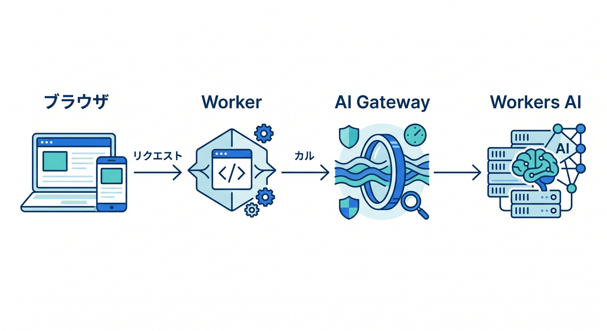
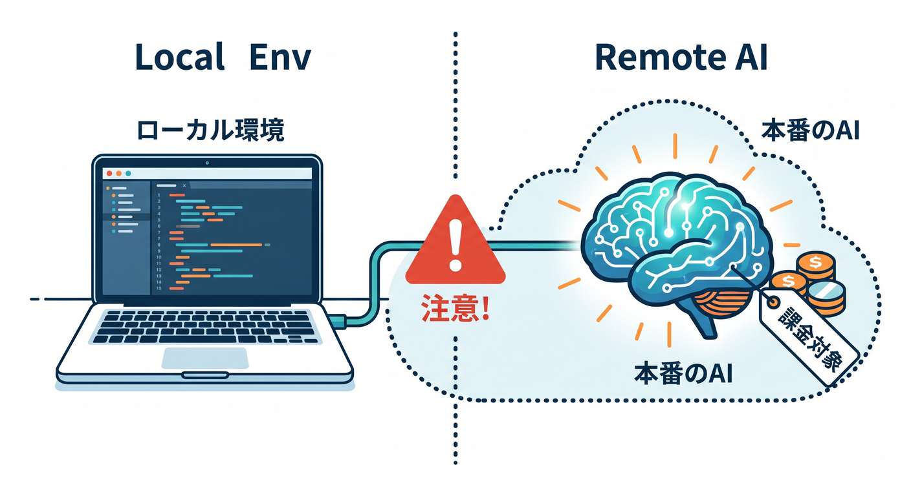
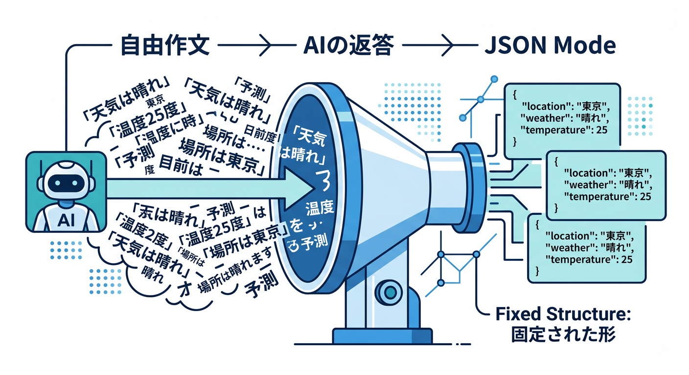
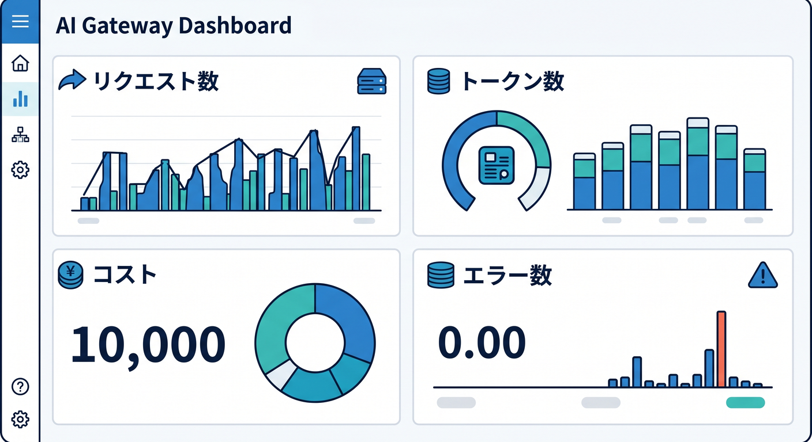
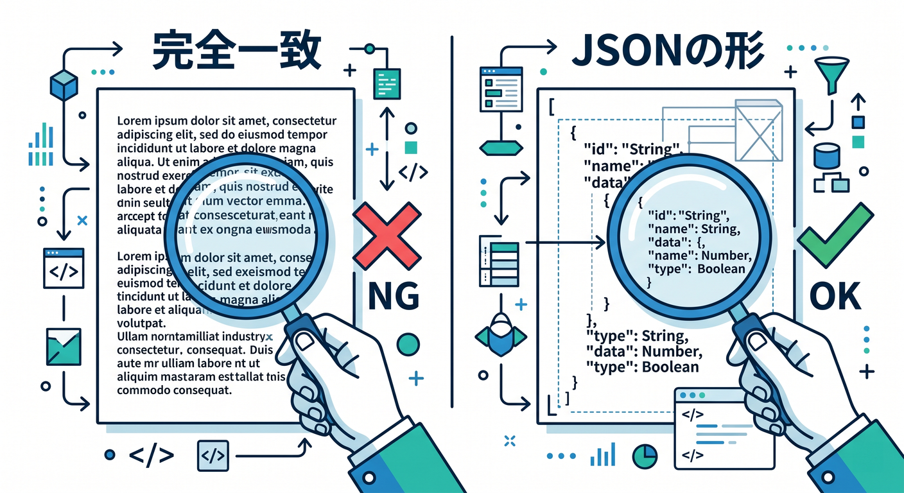

# 第13章　Workers AI と AI Gateway で“テストを助けるAI”も触ろう 🤖☁️🧪
この章では、Cloudflare の AI 機能を「すごい文章を作る道具」としてではなく、**ローカル開発・デバッグ・テストを助ける実用品**として使ってみます ✨
2026年4月15日時点では、Workers AI は Worker から binding 経由で呼べて、AI Gateway はそのリクエストに対して **分析・ログ・キャッシュ・レート制限・リトライ・フォールバック** などをまとめて扱える位置づけです。Cloudflare のローカル開発は Worker 本体は手元で動かしつつ、binding ごとに実リソースへつなぐ考え方が整理されています。 ([Cloudflare Docs][1])

## この章のゴール 🎯
この章のゴールは、次の4つです 😊

* Worker から Workers AI を呼ぶ流れをつかむ
* AI Gateway をはさんで「見える化」する
* AI を**テストケース案づくり**や**分類のたたき台**に使う
* AI を使ってもテストがブレにくい形に整える

## まず全体像をつかもう 🗺️☁️
この章の主役は3人です 😄

* **Worker** … ふだんのアプリ本体
* **Workers AI** … 推論を実行するところ
* **AI Gateway** … そのAI呼び出しを観測・制御するところ

イメージはこんな感じです 👇

```
ブラウザ / React / Next.js
          ↓
        Worker
          ↓
   env.AI.run(...)
          ↓
      Workers AI
          ↓
      AI Gateway
   （ログ / 分析 / キャッシュ /
    レート制限 / リトライ / フォールバック）
```



Cloudflare の公式整理でも、Workers AI は Worker から binding で使え、AI Gateway は AI アプリの可視化と制御を担当します。AI Gateway では analytics・logging に加えて、caching、rate limiting、request retries、model fallback まで扱えます。 ([Cloudflare Docs][2])

## ローカル開発で超大事な注意点 ⚠️💸
ここはかなり大事です 📌
Cloudflare のローカル開発では、**Worker のコード自体は手元で動きます**。ただし binding は別で、Workers AI は **ローカルシミュレーションなし / remote 接続あり** の扱いです。つまり、AI 呼び出しは「ローカルで遊んでいるつもり」でも、実際には Cloudflare 側の AI を使っています。しかも公式ドキュメントでは、**Wrangler のローカル実行中の推論でも usage charges が発生し、limits にもカウントされる**と明記されています。ここを知らずに連打すると、「あれ、ローカルなのに消費してる？」となりやすいです 😵‍💫 ([Cloudflare Docs][1])



## この章で作るミニ教材 🧪🤖
今回は、**「仕様文からテストケースのたたき台を JSON で返す Worker」** を作ります 🌟
ポイントは、AI に自由作文させるのではなく、**JSON Mode** を使って返却形式をある程度固定することです。Workers AI は JSON Mode に対応していて、`response_format` に JSON Schema を渡せます。これを使うと、自然文よりずっとテストしやすい形に寄せられます。対応モデルの一覧も公式にあり、たとえば `@cf/meta/llama-3.1-8b-instruct-fast` や `@cf/meta/llama-3.3-70b-instruct-fp8-fast` などが載っています。 ([Cloudflare Docs][3])



## まずは Gateway を1つ作ろう 🚪📊
AI Gateway はダッシュボードからすぐ作れます。手順は **Cloudflare dashboard → AI → AI Gateway → Create Gateway** です。Gateway 名はあとで Worker から使うので、わかりやすい名前にしておくと楽です。AI Gateway は全プランで使え、現時点の core features として dashboard analytics・caching・rate limiting は無料提供です。試しやすいのがうれしいですね 🌈 ([Cloudflare Docs][4])

## 実装してみよう ① `wrangler.jsonc` 🛠️
まずは AI binding を追加します。設定ファイルを変えたら、あとで `npx wrangler types` を実行して `env` の型を更新するのが公式の流れです。 ([Cloudflare Docs][5])

```
{
  "$schema": "node_modules/wrangler/config-schema.json",
  "name": "chapter13-ai-helper",
  "main": "src/index.ts",
  "compatibility_date": "2026-04-15",
  "ai": {
    "binding": "AI"
  }
}
```

## 実装してみよう ② `src/index.ts` ✍️🤖
下の例では、クエリ文字列で受け取った機能名をもとに、AI にテストケース案を JSON で作らせます。
デバッグしやすいように、返り値に `aiGatewayLogId` も含めています。AI Gateway を通して `env.AI.run()` する場合、公式の binding 例のように `gateway.id` を指定できます。さらに最新のログIDは `env.AI.aiGatewayLogId` で取れます。 ([Cloudflare Docs][5])

```
export interface Env {
  AI: Ai;
}

const responseSchema = {
  type: "object",
  properties: {
    purpose: { type: "string" },
    normalCases: {
      type: "array",
      items: { type: "string" }
    },
    edgeCases: {
      type: "array",
      items: { type: "string" }
    },
    invalidCases: {
      type: "array",
      items: { type: "string" }
    }
  },
  required: ["purpose", "normalCases", "edgeCases", "invalidCases"]
};

export default {
  async fetch(request: Request, env: Env): Promise<Response> {
    const url = new URL(request.url);
    const target =
      url.searchParams.get("target") ?? "ログイン画面でメールアドレスとパスワードを入力する機能";

    try {
      const aiResult = await env.AI.run(
        "@cf/meta/llama-3.1-8b-instruct-fast",
        {
          messages: [
            {
              role: "system",
              content:
                "あなたはソフトウェアテスト設計の補助AIです。日本語で返答し、必ずJSON Schemaに従ってください。"
            },
            {
              role: "user",
              content:
                `次の対象について、テストケースのたたき台を作ってください: ${target}`
            }
          ],
          response_format: {
            type: "json_schema",
            json_schema: responseSchema
          }
        },
        {
          gateway: {
            id: "chapter13-gateway",
            skipCache: true
          }
        }
      );

      return Response.json({
        ok: true,
        target,
        ai: aiResult,
        aiGatewayLogId: env.AI.aiGatewayLogId ?? null
      });
    } catch (error) {
      return Response.json(
        {
          ok: false,
          message: error instanceof Error ? error.message : "Unknown AI error"
        },
        { status: 500 }
      );
    }
  }
} satisfies ExportedHandler<Env>;
```

## ローカルで動かしてみよう ▶️🏠
実行はいつもの流れでOKです 😊

```
npx wrangler types
npx wrangler dev
```

そのあと、たとえば次にアクセスします。

```
http://localhost:8787/?target=会員登録フォーム
```

Cloudflare の公式チュートリアルでも、Workers AI を組み込んだ Worker は `wrangler dev` でローカル確認できます。ただしさっき触れた通り、**Workers AI はローカルでも実アカウントへアクセスし、課金や制限の対象になります**。この章では、何度も連打するより、まず数回だけ試して結果とログを見比べるのがおすすめです 👍 ([Cloudflare Docs][6])

## AI Gateway では何を見るの？ 👀📈
AI Gateway をはさむと、**Requests / Tokens / Costs / Errors / Cached Responses** をダッシュボードで見られます。しかも個別ログでは、**prompt、model response、provider、timestamp、status、token usage、cost、duration** まで確認できます。
つまり第11章でやった「観測する力」を、AI 呼び出しにもそのまま広げられるわけです 🔭✨ ([Cloudflare Docs][7])



ここでひとつ注意です ⚠️
AI Gateway のログには prompt や model response も載るので、**本物の個人情報・秘密情報・生の本番データをそのまま流さない**意識がとても大切です。ログが強力だからこそ、教材段階ではダミーデータ中心で進めるのが安全です。 ([Cloudflare Docs][8])

さらに発展として、AI Gateway は OpenTelemetry 互換バックエンドへの trace export もサポートしています。大きい開発になると、ふつうのアプリ監視と AI リクエスト監視を並べて見られるのが強いです。 ([Cloudflare Docs][9])

## この章での「正しいテストの使い方」🧠✅
ここ、かなり大事です 🌱
AI を使うときは、**AI の文章そのものを正解にしない**ほうが安全です。
おすすめは次の考え方です。

* 正解にするのは「文面」ではなく「JSON の形」
* `normalCases` が配列になっているか
* `edgeCases` が最低1件あるか
* 必須キーが欠けていないか
* 返ってきた案を人間がレビューして採用するか決める



Cloudflare の Workers テストでは、公式にも **Vitest integration** が推奨されています。なのでこの章では、「AI からの返答を完全一致で比べる」のではなく、**Worker の振る舞い・JSON 形状・エラー処理** を Vitest で押さえるのが現実的です。AI は“答えを決める装置”より、**たたき台生成機**として使うほうが安定します 🙌 ([Cloudflare Docs][10])

## `skipCache: true` を付けた理由 🧼🔁
今回のサンプルでは `gateway.skipCache: true` を付けています。
これは、デバッグ中に「前の結果がキャッシュから返ってきてるのか、新しく推論したのか」が混ざると学習しづらいからです。AI Gateway のキャッシュは**同一リクエスト**に対して有効で、text と image response で使えます。慣れてきたら `skipCache` を外して、**キャッシュあり / なしで速度やコストの差を見る**練習をするとかなり勉強になります 🚀 ([Cloudflare Docs][11])

## 本日時点の最新トピックも押さえておこう 🆕✨
2026年4月15日時点で見ると、Workers AI のモデルカタログはかなり広がっていて、テキスト生成だけでなく embeddings・speech-to-text・vision・image 系も見えてきています。最近の追加例としては **Gemma 4 26B A4B** が 2026-04-04、**Kimi K2.5** が 2026-03-19 に案内されています。 ([Cloudflare Docs][12])

AI Gateway 側も進化が続いていて、**2026-04-02 には upstream provider failure に対する gateway-level automatic retries** が追加されました。設定では retry count は最大5回、delay と backoff 方式も選べます。つまり最近は、「アプリ側で全部がんばる」より、**Gateway 側で resiliency を持たせる**設計がしやすくなっています 💪☁️ ([Cloudflare Docs][13])

## 発展ポイント 🌟
余裕があれば、次の発展もおすすめです 😄

* **ログIDを保存**して、あとで「この応答は良かった / 微妙だった」を手動で評価する
* **retry** を Gateway 側で入れて、失敗時の回復を観察する
* **fallback / dynamic routing** を使って、将来的に別モデルへ逃がせる設計を知る
* **OpenAI-compatible endpoint** もあるので、後で React / Next.js 側から既存のAI SDKっぽい書き方へ広げるイメージを持つ

Workers AI は AI Gateway 経由でも Workers binding 経由でも使えますし、OpenAI 互換の chat completions / embeddings エンドポイントもあります。AI Gateway の dynamic routing は、アプリコードを触らずにルーティング方針を変えやすいのが魅力です。 ([Cloudflare Docs][14])

## この章のまとめ 🏁🎉
この章で覚えてほしいことは、ひとことで言うとこれです ✨

**AI は「本番でいきなり賢く使うもの」ではなく、まず「ローカルで観察しながら、安全に試すもの」** です。

Workers AI を使うと、Worker からかなり自然に AI を呼べます。AI Gateway をはさむと、その呼び出しを「見える・絞れる・守れる」ようになります。
そして学習段階では、AI を**自由作文マシン**として扱うより、**JSON で返すテスト補助役**として使うほうが、ずっと実務に強いです 🌸
この感覚がつくと、第15章のミニ作品でも「AIをちょっと足す」がだいぶ現実的になります。 ([Cloudflare Docs][2])

次は、この第13章に合わせて **「学習目標・演習課題・成果物・想定学習時間」付きの教材設計版** に落とし込むこともできます。

[1]: https://developers.cloudflare.com/workers/development-testing/ "Development & testing · Cloudflare Workers docs"
[2]: https://developers.cloudflare.com/workers-ai/configuration/bindings/ "Workers Bindings · Cloudflare Workers AI docs"
[3]: https://developers.cloudflare.com/workers-ai/features/json-mode/ "JSON Mode · Cloudflare Workers AI docs"
[4]: https://developers.cloudflare.com/ai-gateway/configuration/manage-gateway/ "Manage gateways · Cloudflare AI Gateway docs"
[5]: https://developers.cloudflare.com/ai-gateway/integrations/worker-binding-methods/ "AI Gateway Binding Methods · Cloudflare AI Gateway docs"
[6]: https://developers.cloudflare.com/ai-gateway/integrations/aig-workers-ai-binding/ "Workers AI · Cloudflare AI Gateway docs"
[7]: https://developers.cloudflare.com/ai-gateway/observability/analytics/ "Analytics · Cloudflare AI Gateway docs"
[8]: https://developers.cloudflare.com/ai-gateway/observability/logging/ "Logging · Cloudflare AI Gateway docs"
[9]: https://developers.cloudflare.com/ai-gateway/observability/otel-integration/ "OpenTelemetry · Cloudflare AI Gateway docs"
[10]: https://developers.cloudflare.com/workers/testing/ "Testing · Cloudflare Workers docs"
[11]: https://developers.cloudflare.com/ai-gateway/features/caching/ "Caching · Cloudflare AI Gateway docs"
[12]: https://developers.cloudflare.com/workers-ai/models/ "Models · Cloudflare Workers AI docs"
[13]: https://developers.cloudflare.com/changelog/product-group/ai/ "AI Changelog | Cloudflare Docs"
[14]: https://developers.cloudflare.com/ai-gateway/usage/providers/workersai/ "Workers AI · Cloudflare AI Gateway docs"
