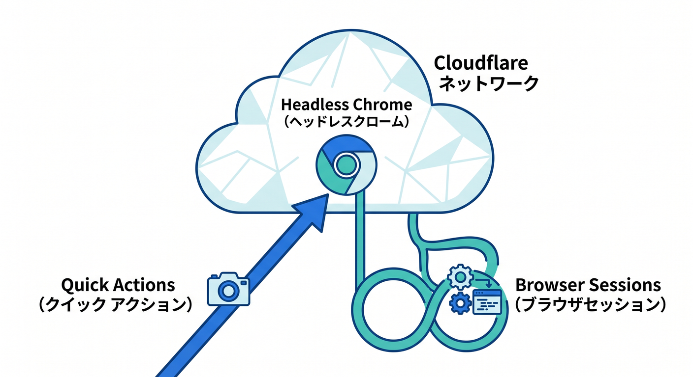
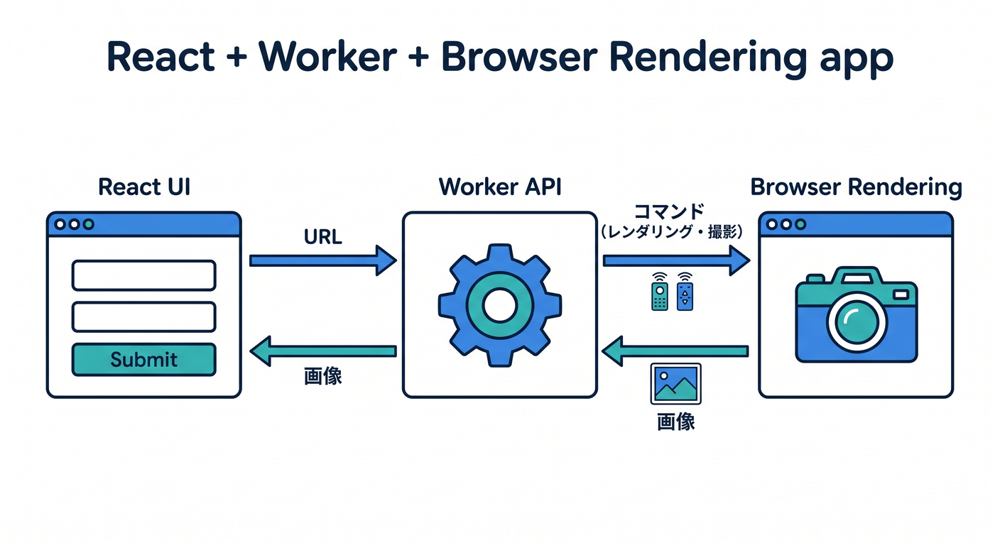
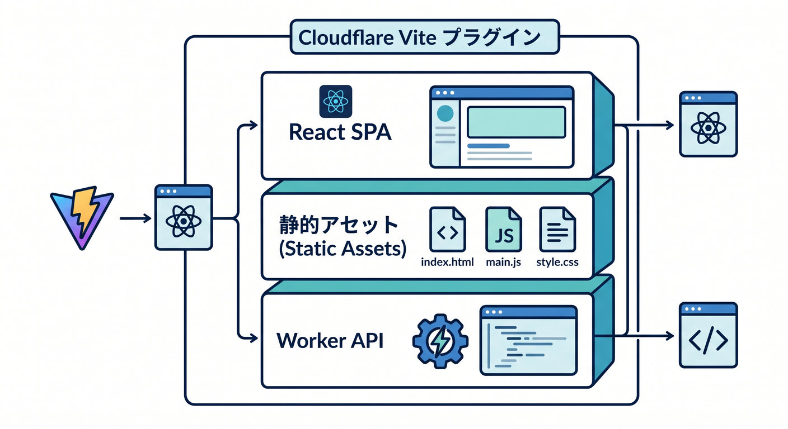
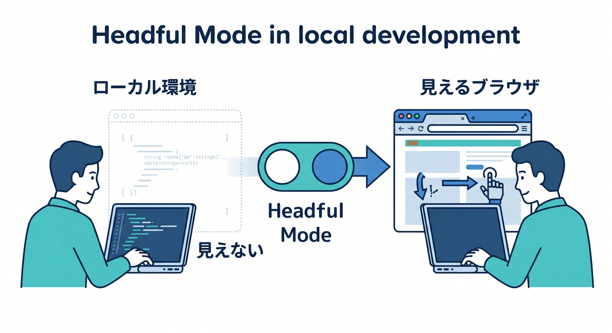
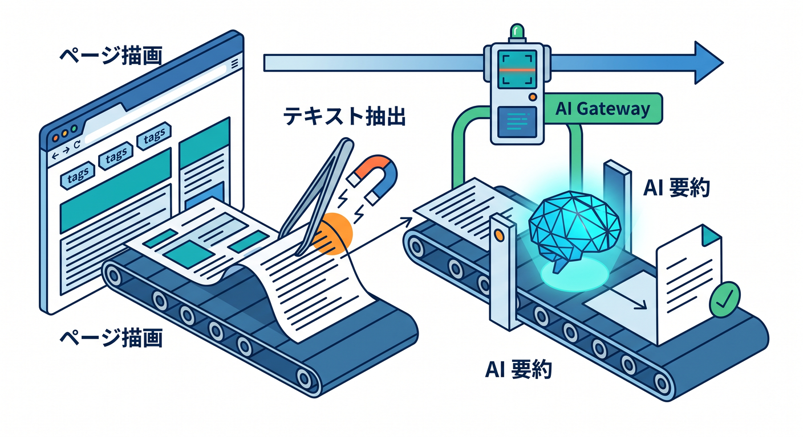

# 第14章　Browser Rendering と軽いフロント連携を試そう 🌐🖼️✨
この章では、Cloudflare の世界で「画面をちゃんと確かめる」体験をします 😊
ここまでの章では、Worker のロジック、ログ、デバッグ、テストを中心に見てきました。第14章ではそこから少しだけ視野を広げて、**ブラウザそのものを Cloudflare 側で動かしながら、画面・描画・自動操作を確認する**流れへ進みます。Cloudflare Browser Rendering は、Cloudflare のグローバルネットワーク上で headless Chrome を動かせる仕組みで、スクリーンショット、PDF生成、自動操作、画面検証などに使えます。しかも Free / Paid の両プランで使えます。 ([Cloudflare Docs][1])

2026年4月時点では、この機能は「スクショを撮るだけ」の話ではありません。Cloudflare は Browser Rendering に **CDP（Chrome DevTools Protocol）** と **MCP client 連携**を追加していて、既存の Puppeteer / Playwright スクリプトを Cloudflare 側ブラウザへつなぎやすくし、AI コーディングエージェントからのブラウザ操作にも広げています。つまり第14章は、軽いフロント連携の章であると同時に、**Cloudflare 上で UI テスト・ブラウザ自動化・AI 補助つき検証へ入る入口**でもあります。 ([Cloudflare Docs][2])

## この章のゴール 🎯
この章の学習ゴールは、次の5つです。

1. Browser Rendering が何者なのかをざっくり説明できること。
2. **Quick Actions** と **Browser Sessions** の使い分けがわかること。
3. Worker からブラウザを起動し、ページのスクリーンショットを返せること。
4. React の小さな画面から、その Worker API を呼び出せること。
5. 余力があれば、Workers AI や AI Gateway を足して「画面確認を助けるAI」へ広げられること。 ([Cloudflare Docs][3])

---

## 14-1. Browser Rendering って何？ 🤔🌍
Browser Rendering は、Cloudflare 上で headless Chrome を動かす機能です。できることはかなり素直で、たとえば次のような用途があります。

* ページのスクリーンショットを撮る 📸
* PDF を作る 📄
* JavaScript 実行後の HTML を取得する 🧾
* ログイン後の画面を自動で開く 🔐
* テスト用にページを巡回する 🚶
* AI エージェントからブラウザを操作する 🤖

Cloudflare 公式の整理では、Browser Rendering の入口は大きく **Quick Actions** と **Browser Sessions** の2系統です。Quick Actions は、スクリーンショットやPDF、HTML抽出のような単発処理向けで、**コードをデプロイしなくても単一のHTTPリクエストで使いやすい**のが特徴です。いっぽう Browser Sessions は、Puppeteer / Playwright / CDP / Stagehand でブラウザを直接制御する方式で、**ちゃんとスクリプトを書いて自動操作したいとき**に向いています。 ([Cloudflare Docs][3])



この教材では、初心者向けとしては **最初に「画面が返ってくる」成功体験を作りやすい Quick Actions 的な感覚**を持ちつつ、実際の実装は **Browser Sessions + Worker API** で行うのがおすすめです 😊
理由は、後で React 画面やテスト、認証、AI 連携へ伸ばしやすいからです。 ([Cloudflare Docs][3])

---

## 14-2. この章で作るもの 🧩🛠️
この章では、次のような小さな作品を作る想定にします。

* React の入力欄に URL を入れる 🌐
* 「キャプチャ」ボタンを押す 👆
* Worker の `/api/screenshot` が Browser Rendering を使ってページを開く
* 画面にそのスクリーンショットを表示する 🖼️
* 余力があれば `/api/summary` で Workers AI に要約させる ✨



つまり構成は、**React の軽い見た目 + Worker API + Browser Rendering** です。Cloudflare 公式でも、React + Vite でフルスタック構成を作り、Cloudflare Vite plugin と Worker API を組み合わせる導線が用意されています。Cloudflare Vite plugin は Worker コードを `workerd` 内で動かし、HMR や `vite preview` も含めて、デプロイ前の確認を本番に近い形で行いやすくしています。 ([Cloudflare Docs][4])

ここで大事なのは、「フロントエンドの章」になりすぎないことです。主役はあくまで Cloudflare です。React は **操作用の薄い画面** として使うくらいでちょうどいいです 🌸

---

## 14-3. React + Vite を土台にする理由 ⚛️⚡
第14章では、Next.js よりも **React + Vite** のほうが向いています。Cloudflare 公式は C3 から React + Vite のフルスタック構成を用意していて、React SPA と Workers API を自然につなげられます。 ([Cloudflare Docs][5])

作成コマンドの基本形はこんな感じです。

```bash
npm create cloudflare@latest my-react-app --framework=react
```



この流れは Cloudflare 公式の React + Vite ガイドに沿っています。いまの Cloudflare 開発では、**Vite plugin + Static Assets + Worker API** の流れがかなり自然です。逆に、昔の Workers Sites は Wrangler v4 で deprecated 扱いになっていて、Cloudflare Vite plugin も Workers Sites をサポートしていません。新規教材では、ここを今の流れに合わせて避けるのが大事です。 ([Cloudflare Docs][5])

---

## 14-4. Browser Rendering の設定を足そう 🔧🌐
Worker から Browser Rendering を使うには、Wrangler 設定へ **browser binding** を追加します。Cloudflare 公式では、Browser Rendering 用の binding を定義し、Node.js compatibility flag を有効にする流れが案内されています。さらに、**ローカル開発で本物の headless browser と話したい場合は `remote: true`** を入れます。 ([Cloudflare Docs][3])

教材用の最小イメージはこんな感じです。

```jsonc
{
  "$schema": "./node_modules/wrangler/config-schema.json",
  "name": "my-react-app",
  "main": "src/worker.ts",
  "compatibility_date": "2026-04-15",
  "compatibility_flags": ["nodejs_compat_v2"],
  "browser": {
    "binding": "BROWSER",
    "remote": true
  },
  "ai": {
    "binding": "AI"
  }
}
```

この `ai` binding は、あとで Workers AI を足すときに使えます。Cloudflare 公式では `env.AI.run()` を呼ぶために `ai.binding = "AI"` を設定する形が案内されています。 ([Cloudflare Docs][6])

---

## 14-5. まずは Worker でスクリーンショットを返してみよう 📸
ここでは、URL を受け取って PNG を返すだけの最小 API を作ります。
考え方はとても単純です。

1. クエリ文字列から `url` を受け取る
2. Puppeteer で Cloudflare 側ブラウザを起動する
3. 指定URLへ移動する
4. スクリーンショットを撮る
5. `image/png` で返す

サンプルはこんな感じです。

```ts
import puppeteer from "@cloudflare/puppeteer";

export default {
  async fetch(request: Request, env: any): Promise<Response> {
    const reqUrl = new URL(request.url);

    if (reqUrl.pathname !== "/api/screenshot") {
      return new Response("Not Found", { status: 404 });
    }

    const target = reqUrl.searchParams.get("url");
    if (!target) {
      return Response.json({ error: "url が必要です" }, { status: 400 });
    }

    const browser = await puppeteer.launch(env.BROWSER);

    try {
      const page = await browser.newPage();

      await page.goto(target, {
        waitUntil: "networkidle2"
      });

      const image = await page.screenshot({
        type: "png",
        fullPage: true
      });

      return new Response(image, {
        headers: {
          "content-type": "image/png",
          "cache-control": "no-store"
        }
      });
    } finally {
      await browser.close();
    }
  }
};
```

ここでは `waitUntil: "networkidle2"` を使っています。理由は、React や SPA 系のページは `domcontentloaded` の時点だとまだ描画が足りないことがあるからです。Cloudflare の FAQ でも、JavaScript-heavy なページや SPA では `networkidle2` や `waitForSelector` を使うほうがよい、と案内されています。 ([Cloudflare Docs][7])

---

## 14-6. React から呼び出して画面で見る 👀✨
次は React 側です。やることはすごく軽いです。URL を入力して、`/api/screenshot?url=...` を `` の `src` に入れるだけでも、ちゃんと「Cloudflare 側ブラウザで描画した結果」を見られます。

```tsx
import { useState } from "react";

export default function App() {
  const [url, setUrl] = useState("https://example.com");
  const [imageUrl, setImageUrl] = useState("");

  function handleSubmit(e: React.FormEvent) {
    e.preventDefault();
    setImageUrl(`/api/screenshot?url=${encodeURIComponent(url)}`);
  }

  return (
    <main style={{ padding: 24 }}>
      <h1>Browser Rendering おためし</h1>

      <form onSubmit={handleSubmit} style={{ display: "grid", gap: 12 }}>
        <input
          value={url}
          onChange={(e) => setUrl(e.target.value)}
          placeholder="https://example.com"
        />
        <button type="submit">キャプチャする</button>
      </form>

      {imageUrl && (
        <div style={{ marginTop: 24 }}>
          
        </div>
      )}
    </main>
  );
}
```

この形のよいところは、**フロントは薄く、主役は Worker API** のままでいられることです。Cloudflare 公式の React + Vite 導線も、React SPA と Cloudflare Workers API を組み合わせる考え方になっています。 ([Cloudflare Docs][5])

---

## 14-7. ローカル開発での見え方を強くしよう 🔍🧪
Browser Rendering はローカル開発でも使えますが、初心者が詰まりやすいポイントがいくつかあります。

まず、**ローカルで実ブラウザ相手に試したいなら `remote: true`** が重要です。Cloudflare 公式でも、ローカル開発中に real headless browser とやり取りするには browser binding に `remote: true` を設定するよう案内しています。 ([Cloudflare Docs][3])

さらに、**見えるブラウザで確認したいなら headful mode** が使えます。`X_BROWSER_HEADFUL=true npx wrangler dev` で、ローカル開発中だけ Chrome を visible モードで立ち上げられます。これは UI の崩れや遷移の失敗を目視したいときにかなり便利です。なお、これはローカル専用の実験的機能です。 ([Cloudflare Docs][8])



```bash
X_BROWSER_HEADFUL=true npx wrangler dev
```

また、Cloudflare 公式 FAQ では、**ローカル開発には「1MB を超えるリクエストは未対応」という制限**も案内されています。巨大HTMLや大きすぎる入力をそのまま投げる教材にはしないほうが安全です。 ([Cloudflare Docs][7])

---

## 14-8. つまずきやすいポイント 😵‍💫➡️🙂
この章で特につまずきやすいのは、次の4つです。

**① SPA の描画が途中で止まって見える**
これはかなり多いです。初期HTMLだけ読めて、JavaScript の後描画が終わる前に撮ってしまうパターンです。Cloudflare 公式は `networkidle2` や `waitForSelector` を案内しています。React/Next 系ページほど起きやすいです。 ([Cloudflare Docs][7])

**② 自分のサイトなのにアクセスがはじかれる**
Browser Rendering のリクエストは、Cloudflare 上では **bot traffic として識別される** と FAQ にあります。自分の Cloudflare 保護下サイトを検証するとき、Bot/WAF 側の設定に引っかかることがあります。 ([Cloudflare Docs][7])

**③ 無料枠で急に 429 が出る**
Cloudflare FAQ には、Workers Free plan では Browser Rendering のブラウザ使用時間に日次上限があり、超えると 429 が返るとあります。教材では、まず短時間・少ページで試すのが安全です。 ([Cloudflare Docs][7])

**④ 何でも Next.js にしたくなる**
Next.js は Cloudflare Workers 上で OpenNext adapter により扱えますし、多くの機能がサポートされています。でも第14章では、そこへ深く入るより、**React + Vite で軽く UI を付ける**ほうが学習の主軸を保ちやすいです。Next.js は「こういう道もあるよ」程度で十分です。 ([Cloudflare Docs][9])

---

## 14-9. AI を少しだけ足すと、この章が今っぽくなる 🤖✨
ここで Cloudflare の AI サービスを軽く混ぜると、かなり現代的な教材になります。

Workers AI は Worker から binding 経由で呼べて、`env.AI.run()` でモデル実行できます。さらに AI Gateway を通すと、**分析、ログ、キャッシュ、レート制御、リトライ、フォールバック**などをまとめて扱いやすくなります。Workers AI は AI Gateway と environment binding でも自然につながります。 ([Cloudflare Docs][6])

たとえば、この章の発展課題としてはこんな形がきれいです。

* Browser Rendering でページを開く 🌐
* タイトルや本文の一部を抜き出す 📝
* Workers AI で「この画面は何のページか」を一言要約させる 🤖
* AI Gateway でリクエストを観測する 📊

イメージはこんな感じです。



```ts
const result = await env.AI.run(
  "@cf/meta/llama-3.1-8b-instruct",
  {
    prompt: `次のページ情報を1文で要約してください: ${pageText}`
  },
  {
    gateway: {
      id: "ui-lab",
      skipCache: false,
      cacheTtl: 300
    }
  }
);
```

この段階では、AI を主役にしなくて大丈夫です。
役割はあくまで **「画面確認を助ける補助係」** です 🌈

---

## 14-10. MCP と Copilot の位置づけも軽く触れておこう 🧠🔌
2026年4月時点の Cloudflare Browser Rendering は、**CDP endpoint を外部環境から直接使える**だけでなく、`chrome-devtools-mcp` を通じて MCP client とつなぐ公式導線もあります。Cloudflare の説明では、MCP client を組み合わせると、AI coding agent がページ遷移、スクリーンショット、パフォーマンス監査、JavaScript デバッグまで行えます。さらに Cloudflare の `@cloudflare/playwright-mcp` は、スクリーンショット前提ではなく **accessibility tree ベースの structured snapshot** を扱う設計です。 ([Cloudflare Docs][10])

GitHub 側でも MCP は Copilot の機能拡張に使われる仕組みとして案内されていて、VS Code では MCP サーバーを gallery / registry 経由で追加できます。公式には GitHub MCP server の remote 構成が一般的な推奨です。ここから言えるのは、**Browser Rendering と MCP の考え方に慣れておくと、Copilot を含む AI 開発体験とも噛み合いやすい**ということです。これは Cloudflare と GitHub の公式情報を並べた上での実務的な読みです。 ([GitHub Docs][11])

---

## 14-11. Next.js はどう触れるとちょうどいい？ ▲☁️
この教材では Next.js を主役にしません。ただし、「Cloudflare で Next.js が無理」ではありません。Cloudflare 公式は、Workers 上で Next.js を **OpenNext adapter** 経由でデプロイする導線を出していて、SSR や CSR、Partial Prerendering の説明もあります。 ([Cloudflare Docs][9])

でも第14章での扱いは、これくらいで十分です。

* React + Vite の軽量構成で Browser Rendering の感覚をつかむ
* 画面確認と Worker API の接続を先に体験する
* Next.js は後で「Cloudflare 上の別ルート」として紹介する

この順番のほうが、初学者にはずっとやさしいです 😊

---

## 14-12. この章の演習課題 📝🎮
**演習1：URLキャプチャ画面を作る**
入力したURLのスクリーンショットを表示する React + Worker アプリを作る。

**演習2：遅延読み込みページを撮る**
`waitUntil: "networkidle2"` を外したときと入れたときで、キャプチャ結果の違いを比較する。

**演習3：headful mode で観察する**
`X_BROWSER_HEADFUL=true` で起動し、ページ遷移やクリックの流れを目視で確認する。

**演習4：AIで要約する**
スクリーンショットではなく、ページタイトルや本文テキストを Workers AI に要約させる。

**演習5：自分のサイトで試してみる**
自分のサイトが Cloudflare 保護下にある場合、bot 判定や待機条件でどんな差が出るか確認する。 ([Cloudflare Docs][7])

---

## 14-13. この章のまとめ 🌟
第14章のいちばん大事なポイントは、**Cloudflare の学習が「HTTPレスポンスを返す」だけで終わらない**と体感することです。Browser Rendering を使うと、Cloudflare 上でブラウザそのものを扱えるので、画面検証、自動化、スクレイピング、PDF生成、軽いUIテストまで一気に視野が広がります。しかも今は CDP や MCP 連携まで公式に伸びていて、AI エージェント時代の開発体験にもつながっています。 ([Cloudflare Docs][2])

そして学習の順番としては、**React は薄く、Cloudflare を太く**が正解です 💡
React + Vite で軽い画面を作り、Worker API から Browser Rendering を呼び、必要に応じて Workers AI や AI Gateway を足す。この流れなら、第1章から積み上げてきた「ローカル実行・デバッグ・テスト」の軸を崩さずに、ちゃんと“今っぽい広がり”まで見せられます。 ([Cloudflare Docs][4])

必要なら次に、この第14章をさらに教材化して、
**「学習目標・前半講義・ハンズオン手順・演習・確認テスト・成果物」つきの完成版**として整えます。

[1]: https://developers.cloudflare.com/browser-rendering/ "Browser Rendering · Cloudflare Browser Rendering docs"
[2]: https://developers.cloudflare.com/changelog/post/2026-04-10-browser-rendering-cdp-endpoint/ "Browser Rendering adds Chrome DevTools Protocol (CDP) and MCP client support · Changelog"
[3]: https://developers.cloudflare.com/browser-rendering/get-started/ "Get started · Cloudflare Browser Rendering docs"
[4]: https://developers.cloudflare.com/workers/vite-plugin/ "Vite plugin · Cloudflare Workers docs"
[5]: https://developers.cloudflare.com/workers/framework-guides/web-apps/react/ "React + Vite · Cloudflare Workers docs"
[6]: https://developers.cloudflare.com/workers-ai/configuration/bindings/ "Workers Bindings · Cloudflare Workers AI docs"
[7]: https://developers.cloudflare.com/browser-rendering/faq/?utm_source=chatgpt.com "Browser Rendering - FAQ"
[8]: https://developers.cloudflare.com/browser-rendering/reference/wrangler/?utm_source=chatgpt.com "Wrangler - Browser Rendering"
[9]: https://developers.cloudflare.com/workers/framework-guides/web-apps/nextjs/ "Next.js · Cloudflare Workers docs"
[10]: https://developers.cloudflare.com/browser-rendering/cdp/mcp-clients/ "Using with MCP clients (CDP) · Cloudflare Browser Rendering docs"
[11]: https://docs.github.com/en/copilot/concepts/context/mcp "About Model Context Protocol (MCP) - GitHub Docs"
