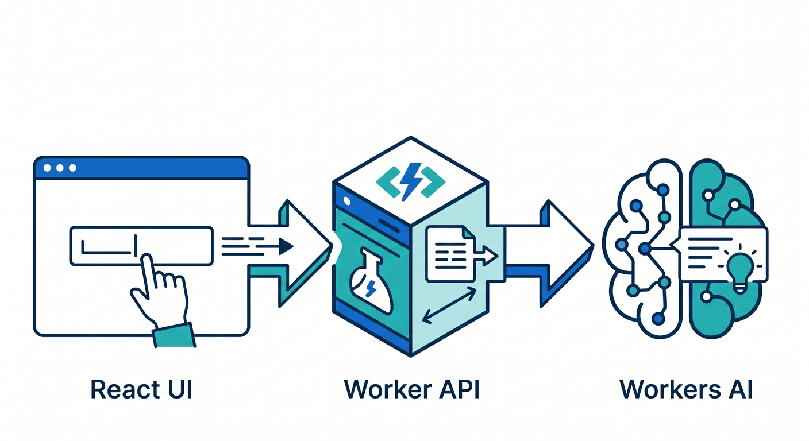
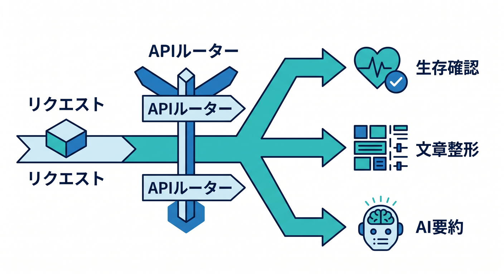
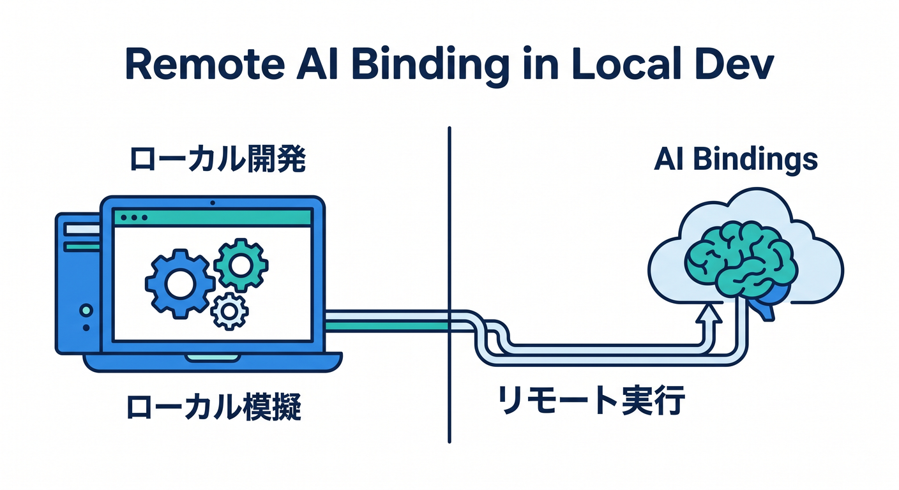
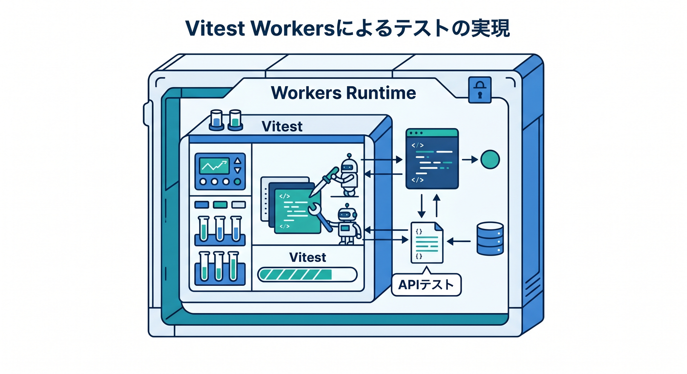
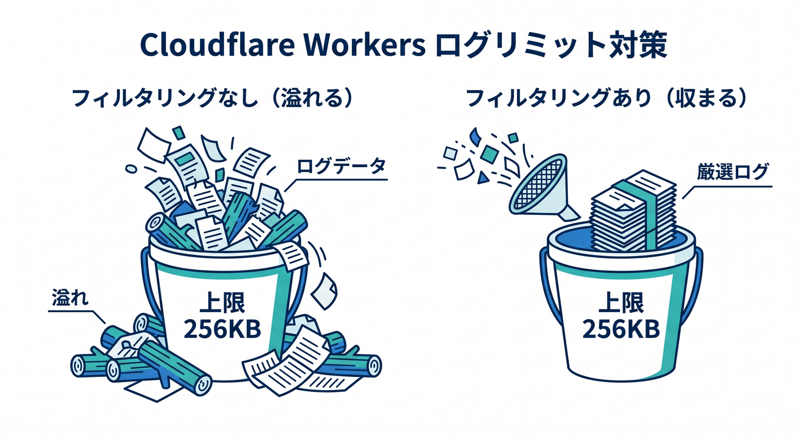
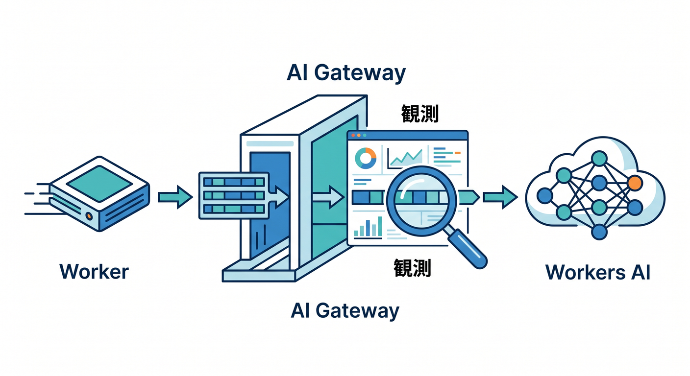
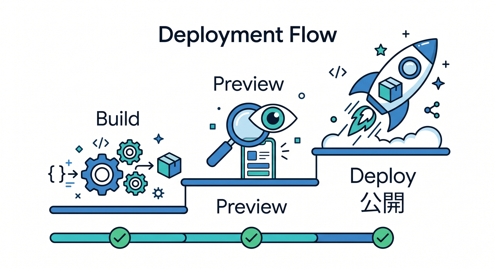

# 第15章　ミニ作品で総仕上げしよう 🏁🎉☁️🤖
2026年4月15日時点の公式情報で見ると、いまの Cloudflare 学習の王道は、**C3 で土台を作る → ローカルでは Wrangler か Cloudflare Vite plugin で動かす → テストは Workers Vitest integration → ログは Workers Logs → 必要に応じて Workers AI と AI Gateway を足す**、という流れです。しかも React 用の公式テンプレートは、**React SPA + Worker API + Cloudflare Vite plugin** という形で最初からかなり学習しやすく、総仕上げの題材にぴったりです。([Cloudflare Docs][1])

この章では、**「AI文章しごとメモ」** という小さな作品を作ります ✨
ブラウザで文章を入力すると、Worker がそれを受け取り、**整形**したり、**要約**したり、結果を画面へ返したりします。さらに、**ログを見る・テストを書く・公開前に preview する**ところまでまとめて体験します。
「大きな作品を作る」ことよりも、**安全に確認しながら育てる流れを自分の手で1周できること**が、この章のいちばん大事なゴールです 🌸

## この章で作るもの 🎨🧩
完成イメージはこんな感じです。

1. React の画面で文章を入力する ✍️
2. Worker の **/api/format** に送って、文を整える 🧹
3. Worker の **/api/summary** に送って、Workers AI で要約する 🤖
4. 失敗したらログで追う 🔎
5. Vitest で最低限の安心を作る ✅
6. preview してから deploy する 🚀

この題材がよいのは、**画面・API・bindings・AI・ログ・テスト**を全部、小さなサイズで触れるからです。Cloudflare の React テンプレートは、Worker API と SPA をまとめたフルスタック構成を C3 から作れますし、ローカル開発でも Vite plugin によって Workers runtime にかなり近い形で確認できます。さらに、通常の bindings はローカルでシミュレートされますが、**AI binding だけは常にリモート実行**になるので、「どこまでローカルで、どこから本物か」を学ぶ題材としてもすごく優秀です。([Cloudflare Docs][2])



## この章の到達目標 🎯📘
この章を終えるころには、次の状態を目指します。

* C3 で Cloudflare 向けの小さな作品を作れる
* React 画面から Worker API を呼べる
* Workers AI を binding 経由で使える
* Vitest で最低限の確認を書ける
* ログを見て失敗を追える
* preview と deploy の違いを理解して公開できる

## 成果物 📦🌟
この章の成果物は、こんなセットです。

* React の入力画面
* Worker の API 3本

  * **/api/health**
  * **/api/format**
  * **/api/summary**
* Workers AI binding
* 観測用のログ
* 最低2本のテスト
* 公開前チェックリスト

---

## 15-1　まずは土台を作ろう 🛠️🌱
今回の作品は、React を使うので、公式の React テンプレートから始めるのがいちばん素直です。Cloudflare 公式ガイドでも、React + Vite の構成は **React SPA + Cloudflare Workers API + Cloudflare Vite plugin** をまとめて scaffold する形になっています。フロント中心の開発では Vite plugin が特に相性よく、HMR も効いて気持ちよく進められます。([Cloudflare Docs][2])

```bash
npm create cloudflare@latest -- ai-text-lab --framework=react
cd ai-text-lab
npm run dev
```

このテンプレートでは、ローカル開発時に Vite を使いつつ、Worker 側は Workers runtime の中で動きます。つまり、ただの「見た目だけの開発サーバー」ではなく、Cloudflare 本番にかなり近い感覚で進められます。([Cloudflare Docs][2])

---

## 15-2　生成されたファイルをざっくり読もう 🗂️👀
React テンプレートの簡略イメージはこんな感じです。

```text
ai-text-lab/
  src/
    App.tsx
  worker/
    index.ts
  index.html
  vite.config.ts
  wrangler.jsonc
```

役割はとてもシンプルです 😊

* **src/App.tsx**
  画面側。入力欄やボタンを書く場所です。
* **worker/index.ts**
  バックエンド API。React から呼ばれる本体です。
* **vite.config.ts**
  Cloudflare Vite plugin を読み込む設定です。
* **wrangler.jsonc**
  Worker 名、entry、bindings、observability などを書く中心ファイルです。

Cloudflare 公式の React ガイドでは、**worker/index.ts がバックエンド API**、**src/App.tsx がそれを呼ぶフロント**、**vite.config.ts が Cloudflare Vite plugin を使う設定**、という構成が示されています。さらに SPA ルーティング用の設定も入っていて、フロントのルート処理と Worker API の役割分担がしやすくなっています。([Cloudflare Docs][2])

---

## 15-3　Worker API を作ろう ☁️⚙️
ここでは Worker 側に3つの入口を作ります。

* **/api/health**：生存確認
* **/api/format**：文章整形
* **/api/summary**：AI 要約



まずは **worker/index.ts** をこんな感じにします。

```ts
type Env = {
  AI: {
    run: (model: string, input: Record<string, unknown>) => Promise<any>;
  };
};

function normalizeText(text: string): string {
  return text
    .replace(/\r\n/g, "\n")
    .split("\n")
    .map((line) => line.trim())
    .filter((line) => line.length > 0)
    .join("\n")
    .replace(/[ \t]+/g, " ")
    .trim();
}

function localFallbackSummary(text: string): string {
  const parts = text
    .split(/[。.!?]/)
    .map((v) => v.trim())
    .filter(Boolean)
    .slice(0, 3);

  return parts.length > 0 ? parts.join(" / ") : "要約できる文章がありません。";
}

export default {
  async fetch(request: Request, env: Env): Promise<Response> {
    const url = new URL(request.url);

    console.log("request_path", url.pathname);

    if (url.pathname === "/api/health") {
      return Response.json({
        ok: true,
        message: "worker is running",
      });
    }

    if (url.pathname === "/api/format" && request.method === "POST") {
      const body = (await request.json()) as { text?: string };
      const cleaned = normalizeText(String(body.text ?? ""));

      return Response.json({
        cleaned,
        length: cleaned.length,
      });
    }

    if (url.pathname === "/api/summary" && request.method === "POST") {
      const body = (await request.json()) as { text?: string };
      const cleaned = normalizeText(String(body.text ?? ""));

      if (!cleaned) {
        return Response.json(
          { error: "文章を入力してください。" },
          { status: 400 }
        );
      }

      try {
        const result = await env.AI.run("@cf/meta/llama-3.1-8b-instruct", {
          prompt:
            "次の文章を日本語で3行以内に要約してください。箇条書きではなく自然文で返してください。\n\n" +
            cleaned,
        });

        const summary =
          typeof result === "string"
            ? result
            : typeof result?.response === "string"
            ? result.response
            : JSON.stringify(result);

        return Response.json({
          summary,
          source: "workers-ai",
        });
      } catch (error) {
        console.error("ai_summary_failed", error);

        return Response.json({
          summary: localFallbackSummary(cleaned),
          source: "local-fallback",
        });
      }
    }

    return new Response("Not Found", { status: 404 });
  },
};
```

Workers AI は **binding を作ると env.AI から呼べる**形になっていて、公式 docs でも **env.AI.run()** でモデルを実行する流れが示されています。また、Cloudflare のローカル開発では多くの bindings はローカルシミュレーションですが、**AI bindings だけはリモートで実行**されます。



なので、今回の **/api/summary** は「ローカルで動かしているのに AI だけ本物に飛ぶ」という、Cloudflare らしい学びになります。([Cloudflare Docs][3])

---

## 15-4　wrangler.jsonc に AI と observability を足そう 🔧🤖📈
React テンプレートの **wrangler.jsonc** に、学習用として次の2つを明示しておくのがおすすめです。

* **observability.enabled**
* **ai.binding**

```json
{
  "$schema": "./node_modules/wrangler/config-schema.json",
  "name": "ai-text-lab",
  "main": "worker/index.ts",
  "compatibility_date": "2026-04-15",
  "observability": {
    "enabled": true
  },
  "ai": {
    "binding": "AI"
  }
}
```

Wrangler 設定では **observability** や **assets**、各種 bindings をまとめて扱えます。Workers Logs は新規 Worker で既定有効ですが、教材では明示しておくと「何を有効にしたのか」が見えやすくて学びやすいです。Workers AI も **wrangler ファイルまたはダッシュボードから binding を作る**形が公式導線です。([Cloudflare Docs][4])

---

## 15-5　React 画面から API を呼ぼう 🌐💬
つぎに **src/App.tsx** をシンプルに作ります。
「入力 → 整形」「入力 → AI 要約」の2ボタンがあれば十分です。

```tsx
import { useState } from "react";

export default function App() {
  const [text, setText] = useState("");
  const [result, setResult] = useState("");
  const [loading, setLoading] = useState(false);

  async function callApi(path: string) {
    setLoading(true);
    setResult("");

    try {
      const response = await fetch(path, {
        method: "POST",
        headers: {
          "content-type": "application/json",
        },
        body: JSON.stringify({ text }),
      });

      const data = await response.json();

      if (!response.ok) {
        setResult(data.error ?? "エラーが発生しました。");
        return;
      }

      if (path === "/api/format") {
        setResult(data.cleaned);
      } else {
        setResult(data.summary);
      }
    } catch (error) {
      setResult("通信に失敗しました。");
      console.error(error);
    } finally {
      setLoading(false);
    }
  }

  return (
    <main style={{ maxWidth: 800, margin: "40px auto", padding: 16 }}>
      <h1>AI文章しごとメモ ☁️🤖</h1>
      <p>文章を整形したり、要約したりする小さな Cloudflare 作品です。</p>

      <textarea
        value={text}
        onChange={(e) => setText(e.target.value)}
        rows={12}
        style={{ width: "100%", marginTop: 12 }}
        placeholder="ここに文章を入れてください"
      />

      <div style={{ display: "flex", gap: 12, marginTop: 12 }}>
        <button onClick={() => callApi("/api/format")} disabled={loading}>
          整形する 🧹
        </button>
        <button onClick={() => callApi("/api/summary")} disabled={loading}>
          AIで要約する 🤖
        </button>
      </div>

      <section style={{ marginTop: 24 }}>
        <h2>結果</h2>
        <pre style={{ whiteSpace: "pre-wrap" }}>{result}</pre>
      </section>
    </main>
  );
}
```

この形にしておくと、**Worker API を先に作って、画面はあとから載せる**という順番でも進められます。初心者が詰まりにくいのは、実はこの順番です 😊

---

## 15-6　ローカル確認の流れを1本にしよう 🔄🧪
動かすときの基本ループはこれです。

1. **npm run dev** で立ち上げる
2. 画面から **/api/format** を試す
3. 画面から **/api/summary** を試す
4. ターミナルのログを見る
5. 詰まったらコードを少しだけ直す
6. もう一度試す

Cloudflare Vite plugin は HMR を使えるので、React 側の変更がすばやく反映されます。しかも Worker は Workers runtime で動くので、ローカルでも「Cloudflare っぽさ」をかなり保ったまま確認できます。さらに Vite plugin は **vite preview** にも対応しているので、**build 結果を本番前に確認**しやすいのも強みです。([Cloudflare Docs][5])

ここでのコツは、いきなり AI から触らないことです 🌱
まず **/api/health**、次に **/api/format**、最後に **/api/summary** の順で試すと、失敗箇所がかなり切り分けやすくなります。

---

## 15-7　テストを2本だけ書こう ✅🧠
Cloudflare 公式は、いまの Workers / Pages Functions のテスト方法として **Workers Vitest integration** を強くおすすめしています。これは Cloudflare の custom pool を使って、**Vitest を Workers runtime の中で動かせる**仕組みです。



公式の「最初のテスト」ガイドでは、**Vitest 4.1 以上**と **@cloudflare/vitest-pool-workers** が案内されています。([Cloudflare Docs][6])

まず、入っていなければ追加します。

```bash
npm i -D vitest@^4.1.0 @cloudflare/vitest-pool-workers
npx wrangler types
```

**vitest.config.ts** はこんな感じです。

```ts
import { defineConfig } from "vitest/config";
import { cloudflareTest } from "@cloudflare/vitest-pool-workers";

export default defineConfig({
  plugins: [
    cloudflareTest({
      wrangler: {
        configPath: "./wrangler.jsonc",
      },
    }),
  ],
  test: {
    include: ["test/**/*.test.ts"],
  },
});
```

公式設定でも、**cloudflareTest()** を plugins に入れ、**wrangler の configPath** を参照する形が基本です。([Cloudflare Docs][7])

つぎに **test/worker.test.ts** を作ります。

```ts
import { describe, expect, it } from "vitest";
import { exports } from "cloudflare:workers";

describe("worker api", () => {
  it("health が 200 を返す", async () => {
    const response = await exports.default.fetch("https://example.com/api/health");
    const data = await response.json<{ ok: boolean }>();

    expect(response.status).toBe(200);
    expect(data.ok).toBe(true);
  });

  it("format が文章を整形する", async () => {
    const request = new Request("https://example.com/api/format", {
      method: "POST",
      headers: {
        "content-type": "application/json",
      },
      body: JSON.stringify({
        text: "  Cloudflare   Workers   を   勉強中です。  ",
      }),
    });

    const response = await exports.default.fetch(request);
    const data = await response.json<{ cleaned: string }>();

    expect(response.status).toBe(200);
    expect(data.cleaned).toContain("Cloudflare Workers を 勉強中です。");
  });
});
```

Workers Vitest integration では、**cloudflare:workers** や **cloudflare:test** から helper を使えます。たとえば **exports.default.fetch()** で main Worker の fetch handler を直接叩けるので、今回のような API テストがかなり書きやすいです。([Cloudflare Docs][8])

ここで大事なのは、「全部をテストしよう」としないことです 🙌
総仕上げではまず、

* 生きているか
* 主要ルートが返るか
* 入力が空のとき壊れないか

この3点だけでも十分に価値があります。

---

## 15-8　ログで追える作品にしよう 📈🔍
ログは、ただのメモではありません。**失敗の場所を絞るための地図**です。Cloudflare の Workers Logs では、**invocation logs、custom logs、errors、uncaught exceptions** を集めてダッシュボードで見られます。しかも新規 Worker では observability が既定有効です。([Cloudflare Docs][9])

今回の作品なら、こんなログがちょうどいいです。

```ts
console.log("request_path", url.pathname);
console.log("input_length", cleaned.length);
console.error("ai_summary_failed", error);
```

ただし、ログは多ければよいわけではありません。Cloudflare の limits では、**1リクエストあたりのログデータ上限は 256KB** です。



出しすぎると、途中から記録されません。だから、**全部を吐く**より、**分岐名・件数・失敗理由**を短く出すのがコツです。([Cloudflare Docs][10])

---

## 15-9　Copilot を「直してもらう人」ではなく「整理してくれる相棒」にしよう 🤖💡
いまの GitHub Copilot は、agent mode と MCP を組み合わせることで、外部情報やツールに触れながら動けるようになっています。GitHub Docs でも、MCP は Copilot を他システムとつなぐ仕組みとして説明されていますし、Cloudflare 側も **docs MCP** と **observability MCP** を案内しています。Cloudflare Docs MCP は Workers の知識参照用、observability MCP はログや例外の確認に使える導線です。([GitHub Docs][11])

この章では、Copilot にこんなお願いをすると相性がよいです ✨

* 「この Worker の責務を3つに分けて説明して」
* 「この failing test の原因候補を優先順で出して」
* 「wrangler.jsonc の binding 設定を見て不足を教えて」
* 「この console.error の出し方を、ログが見やすい形へ改善して」

ポイントは、**完成コードを丸投げしない**ことです。
「説明」「候補比較」「原因整理」をやらせると、学習効果がぐっと上がります 🌸

---

## 15-10　AI Gateway を“次の一歩”として足そう 🚪🤖☁️
作品が動いたら、次の一歩として **AI Gateway** を考えるとすごく今っぽいです。AI Gateway は **全プランで利用可能**で、公式では **analytics、logging、caching、rate limiting、request retries、model fallback** などをまとめて扱えると案内されています。しかも「まずは1行で始めやすい」とされていて、Cloudflare の AI まわりを観測・制御する入口としてかなり使いやすいです。([Cloudflare Docs][12])



さらに Universal Endpoint では、**Workers AI を含む複数 provider** に対して共通入口で投げることができ、retry や fallback の設計も入れやすいです。なので本章の完成後は、**/api/summary** をそのまま AI Gateway 経由版へ差し替える、という発展が自然です。([Cloudflare Docs][13])

---

## 15-11　公開前に preview してから deploy しよう 🚀🧭
最後は公開です。
おすすめ順はこれです。

```bash
npm run build
npm run preview
npx wrangler deploy
```



Cloudflare Vite plugin の公式ガイドでは、**preview** で build 結果を Workers runtime で確認でき、React テンプレートのガイドでも、最終的に **workers.dev サブドメイン** や **Custom Domain** へ deploy できる流れが示されています。([Cloudflare Docs][5])

ここでの気持ちは、「早く公開したい！」よりも、**最後にもう1回だけ冷静に見る**です 😊
その1回で、かなり事故が減ります。

---

## 公開前チェックリスト 📝✅
公開前は、これだけ見れば十分です。

* **/api/health** が返る
* **/api/format** が空入力でも変に落ちない
* **/api/summary** が失敗時に fallback する
* 主要テストが green
* 秘密情報をコードへ直書きしていない
* ログがうるさすぎない
* preview で画面崩れがない
* ボタン連打時に極端に壊れない

---

## この章のミニ課題 🎓✨
余力があれば、次のどれか1つを足してみてください。

1. **D1 で履歴保存** 📚
   入力文と要約結果を保存する
2. **AI Gateway 経由に差し替える** 🚪
   AI の観測や fallback を学ぶ
3. **モデル選択UIを足す** 🎛️
   要約向け・説明向けを切り替える
4. **Next.js 版に移植してみる** 🌈
   Cloudflare は C3 から Next.js を scaffold でき、Workers への deploy は OpenNext adapter 経由で案内されています。ローカル開発は **npm run dev**、Cloudflare adapter を含めた確認は **npm run preview** が基本導線です。([Cloudflare Docs][14])

---

## この章で身についたこと 💪🎉
この章まで来たら、もう「Cloudflare をちょっと触った」ではありません。
ちゃんと、

* 作る ✍️
* ローカルで動かす 💻
* AI をつなぐ 🤖
* テストする ✅
* ログで追う 🔎
* preview して deploy する 🚀

という、**開発の1周**を自分で回せています。

それがいちばん大きいです 🌟
Cloudflare 学習は、ここから先に差がつきます。
ただ書いて終わる人ではなく、**確かめながら育てられる人**になれているからです ☁️🛠️✨

必要なら次に、この第15章をベースにした **「学習目標・演習課題・提出物・所要時間つきの教材設計版」** へ、そのまま落とし込んでいきます。

[1]: https://developers.cloudflare.com/pages/get-started/c3/ "Create projects with C3 CLI · Cloudflare Pages docs"
[2]: https://developers.cloudflare.com/workers/framework-guides/web-apps/react/ "React + Vite · Cloudflare Workers docs"
[3]: https://developers.cloudflare.com/workers-ai/configuration/bindings/ "Workers Bindings · Cloudflare Workers AI docs"
[4]: https://developers.cloudflare.com/workers/wrangler/configuration/ "Configuration - Wrangler · Cloudflare Workers docs"
[5]: https://developers.cloudflare.com/workers/vite-plugin/ "Vite plugin · Cloudflare Workers docs"
[6]: https://developers.cloudflare.com/workers/testing/vitest-integration/ "Vitest integration · Cloudflare Workers docs"
[7]: https://developers.cloudflare.com/workers/testing/vitest-integration/configuration/ "Configuration · Cloudflare Workers docs"
[8]: https://developers.cloudflare.com/workers/testing/vitest-integration/test-apis/ "Test APIs · Cloudflare Workers docs"
[9]: https://developers.cloudflare.com/workers/observability/logs/workers-logs/ "Workers Logs · Cloudflare Workers docs"
[10]: https://developers.cloudflare.com/workers/platform/limits/ "Limits · Cloudflare Workers docs"
[11]: https://docs.github.com/en/copilot/tutorials/enhance-agent-mode-with-mcp "Enhancing GitHub Copilot agent mode with MCP - GitHub Docs"
[12]: https://developers.cloudflare.com/ai-gateway/ "Overview · Cloudflare AI Gateway docs"
[13]: https://developers.cloudflare.com/ai-gateway/usage/universal/ "Universal Endpoint · Cloudflare AI Gateway docs"
[14]: https://developers.cloudflare.com/workers/framework-guides/web-apps/nextjs/ "Next.js · Cloudflare Workers docs"
