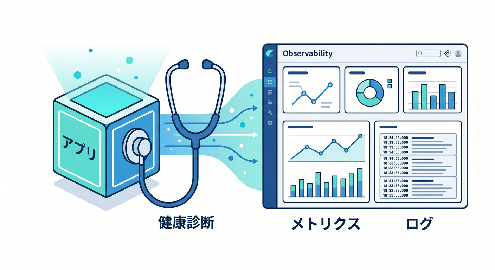
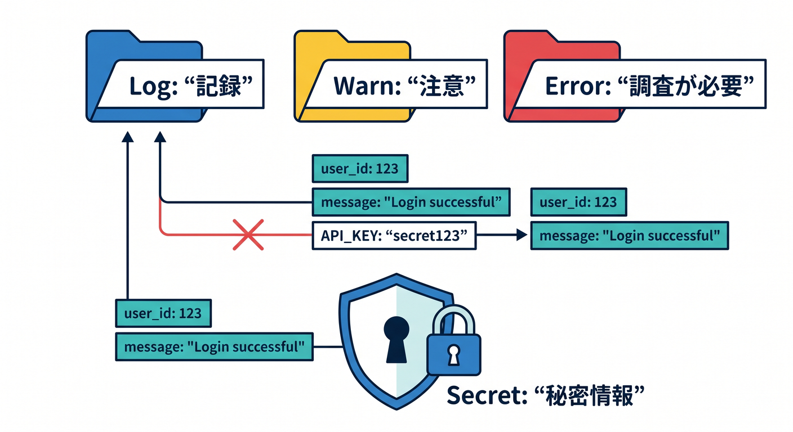
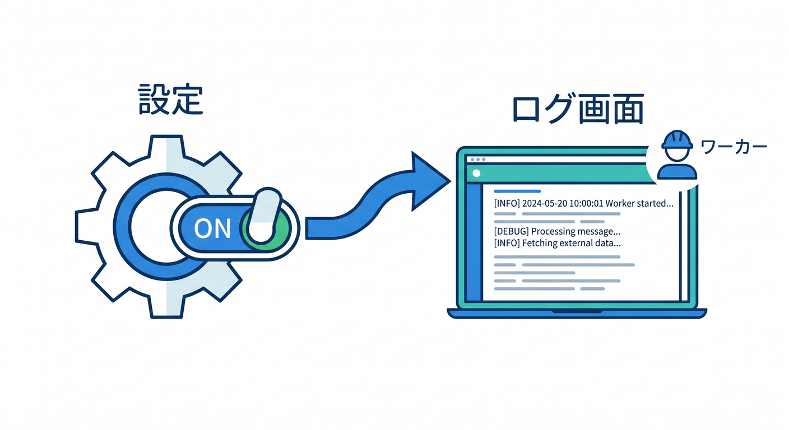
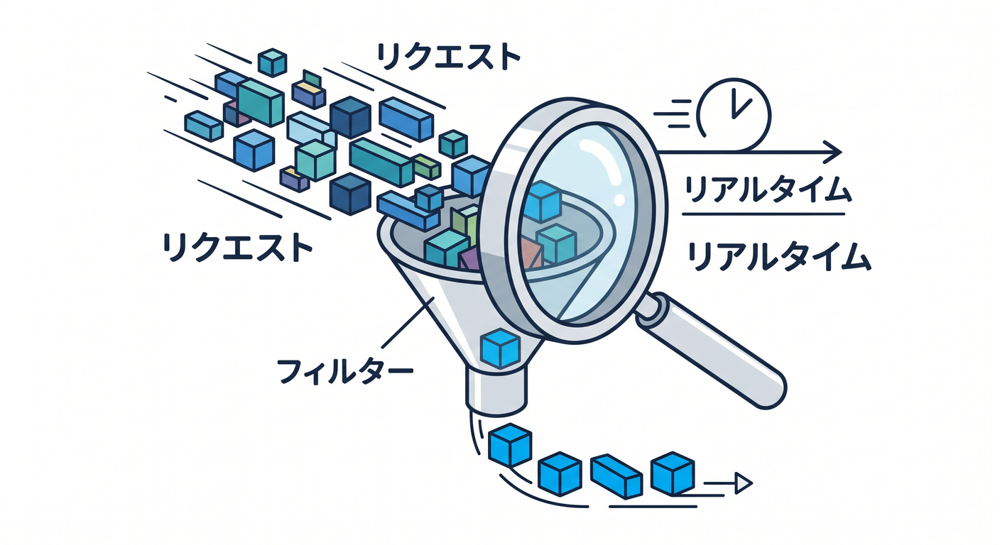
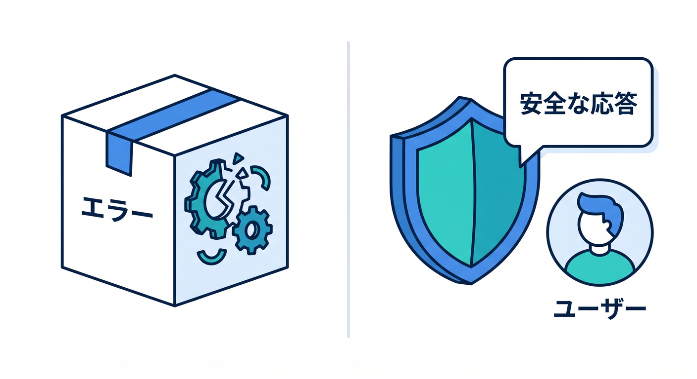
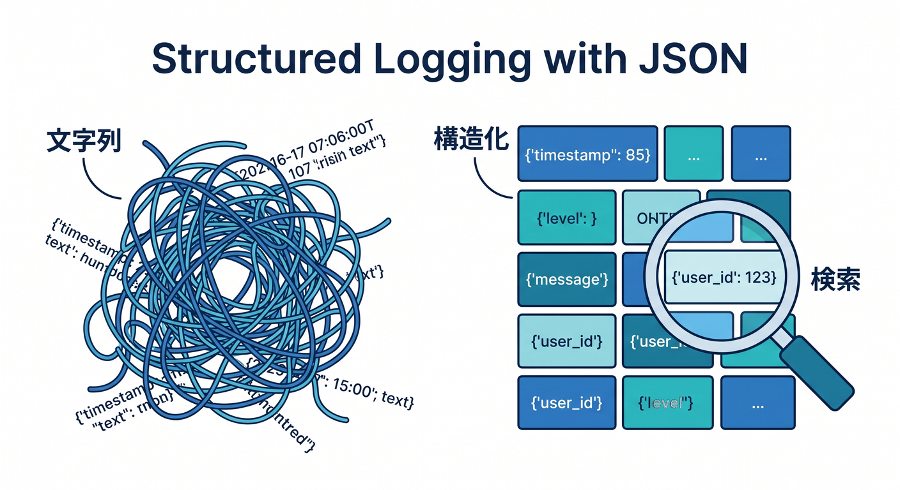
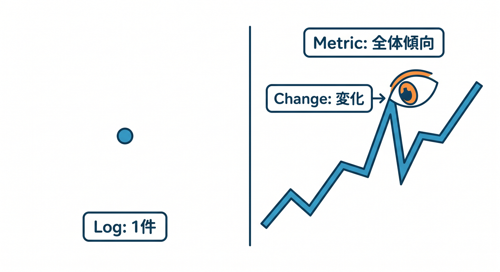

# Cloudflare Workers Logs・Observability・障害対応 15章アウトライン 📈🔎✨

確認日: 2026-04-24  
主な確認先: Cloudflare Workers Observability / Workers Logs / Real-time Logs / Tail Workers / Console API / Errors and Exceptions / Metrics and Analytics / Workers Trace Events / Logpush / Analytics Engine 公式ドキュメント

## 第1章　作ったアプリを“見る力”を育てよう 📈

アプリは作って終わりではありません。  
本番では、動いているか、遅くないか、エラーが出ていないかを見る力が必要です。  
Cloudflare Workersには、logs、metrics、analytics、errorsなどの観測機能があります。  
この章では、observabilityを「アプリの健康診断」として理解します 😊  
この章のゴールは、運用で何を見るべきかを説明できることです ✅

## 第2章　console.logから始めよう 📝

最初の観測は `console.log()` です。  
Workersでは `console.log()`、`console.warn()`、`console.error()` がログとして扱われます。  
ただし、何でもログに出すと読みづらくなり、個人情報やsecret漏えいの危険もあります。  
ログレベル、jobId、requestIdを意識した書き方を学びます 🔐  
この章のゴールは、安全で読めるログを書けることです。

## 第3章　Workers Logsを有効化して見よう 👀

Workers Logsは、Workerの実行ログをDashboardやReal-time Logsで確認する入口です。  
公式ドキュメントでは、Workerにobservability設定を追加してログを書き込む方法が案内されています。  
`wrangler.jsonc` に `observability.enabled` を設定し、デプロイ後にログを見ます。  
まずは小さなAPIでログが表示されるところを確認します 🧪  
この章のゴールは、Workers Logsを有効にして確認できることです。

## 第4章　Real-time Logsとwrangler tailで追いかけよう ⚡

開発中や障害調査では、リアルタイムでログを見たい場面があります。  
Cloudflare dashboardのReal-time Logsや、`npx wrangler tail` が役に立ちます。  
リクエストを投げながら、ログ、例外、ステータスを確認します。  
フィルタを使って、対象Workerやエラーだけを見やすくします 🔎  
この章のゴールは、動いているWorkerのログをリアルタイムに追えることです。

## 第5章　エラーと例外を読めるようになろう 🧯

Workersで失敗すると、JavaScript例外、HTTP 500、Cloudflareのエラーコードなどが出ます。  
公式ドキュメントでは、WorkersのErrors and Exceptionsで代表的な原因が案内されています。  
`try/catch`、`console.error()`、安全なエラーレスポンスの作り方を学びます。  
ユーザーには詳しすぎる内部情報を返さないようにします 🔐  
この章のゴールは、エラーの読み方と安全な扱いを理解することです。

## 第6章　構造化ログで調査しやすくしよう 🧱

文字列だけのログより、JSON風の構造化ログのほうが調査しやすいです。  
`requestId`、`userId`、`route`、`status`、`durationMs`、`jobId` などを入れます。  
ただし、メールアドレスや本文などの個人情報は出しすぎません。  
同じIDでReact、Worker、Queue、D1の処理を追えるようにします 🪪  
この章のゴールは、あとで検索しやすいログ設計ができることです。

## 第7章　メトリクスとAnalyticsを見よう 📊

ログは1件ずつの出来事、メトリクスは全体の傾向を見るものです。  
Workers Analyticsでは、リクエスト数、エラー、CPU time、実行時間などを確認できます。  
急にエラーが増えた、レスポンスが遅くなった、呼び出しが増えた、という変化を見ます。  
小さなアプリでも、日々の変化を見る習慣を作ります 📈  
この章のゴールは、ログとメトリクスの違いを理解することです。

## 第8章　Analytics Engineで独自イベントを記録しよう 🧮

Workers Analytics Engineは、Workerから独自の分析イベントを書き込める仕組みです。  
公式ドキュメントでは、writesはnon-blockingでWorkerのlatencyを増やさないと案内されています。  
ボタン押下、AI処理時間、アップロード件数など、アプリ独自の数字を記録できます。  
個人を追いすぎない設計と、集計しやすいevent設計を学びます。  
この章のゴールは、独自メトリクスを記録する発想を持つことです。

## 第9章　Tail WorkersとLogpushの役割を知ろう 🚚

ログを外部の監視サービスやストレージへ送る方法として、Tail WorkersやWorkers Logpushがあります。  
Tail Workerはproducer Workerの実行情報を受け取り、外部サービスへ送るような構成で使えます。  
Logpushはログを外部の保存先やSIEMへ送る仕組みです。  
初心者はDashboardとwrangler tailから始め、発展として外部連携を知ります 🧭  
この章のゴールは、ログを外へ運ぶ選択肢を理解することです。

## 第10章　D1・R2・KV・Queuesの運用ログ 🗺️

Workers単体だけでなく、D1、R2、KV、Queuesを使うと調査ポイントが増えます。  
D1のクエリ失敗、R2のobject key不一致、KVの反映タイミング、QueuesのretryやDLQを見ます。  
サービスごとに `jobId` や `requestId` を引き回すと、原因を追いやすくなります。  
この章では、保存先別のログ観点を整理します 🔎  
この章のゴールは、複数サービスをまたぐ障害を追えることです。

## 第11章　AIアプリの観測ポイント 🤖

AIアプリでは、通常のAPIより観測ポイントが増えます。  
AI Gatewayのログ、外部AI APIのstatus、token使用量、rate limit、response timeを見ます。  
Workers AIやVectorize、R2、D1と組み合わせる場合も、jobIdで追跡します。  
プロンプトや個人情報をログへ出しすぎない注意も重要です 🔐  
この章のゴールは、AI機能を安全に観測する視点を持つことです。

## 第12章　障害対応の基本手順を作ろう 🚨

障害時に慌てないため、見る順番を決めておきます。  
まず影響範囲、次にエラー率、次に直近デプロイ、次に外部サービス、最後に個別ログを見ます。  
Cloudflare dashboard、Workers Logs、Analytics、D1やQueuesの状態を順番に確認します。  
小さなrunbookをMarkdownで作る習慣も学びます 📋  
この章のゴールは、障害時の確認手順を説明できることです。

## 第13章　ユーザーに返すエラーを整えよう 🧑‍💻

内部ログとユーザー向けエラーは分けます。  
ログには調査に必要な情報、ユーザーには安全で分かりやすいメッセージを返します。  
`requestId` をレスポンスへ含めると、問い合わせ時にログと照合しやすくなります。  
React画面では、再試行できるエラーと問い合わせが必要なエラーを分けます。  
この章のゴールは、障害時のユーザー体験を悪化させないことです。

## 第14章　Copilotと一緒にログレビューしよう 🤖

GitHub Copilotは、ログ設計や障害対応手順のレビューにも使えます。  
ただし、実ログや個人情報、secretをそのまま貼らないようにします。  
「このWorkerのログにrequestIdとjobIdを追加して」「個人情報を出しすぎていないか見て」など具体的に頼みます。  
AIの回答は、公式ドキュメントと実際のコードで確認します ✅  
この章のゴールは、Copilotを安全な運用レビューに使えることです。

## 第15章　小さな運用ダッシュボードを作ろう 📊

最後は、React + Workers + D1 + Analyticsの小さな運用ダッシュボードを作ります。  
API件数、エラー数、Queue失敗件数、AI処理件数、最近の障害ログを見られる画面を作ります。  
すべてを完璧に作るのではなく、最初に見るべき数字を絞ります。  
本番前には、ログの保存期間、個人情報、アクセス権限、コストを確認します 🔐  
この章のゴールは、作ったアプリを自分で見守れるようになることです。

---

## 参照URL

- https://developers.cloudflare.com/workers/observability/
- https://developers.cloudflare.com/workers/observability/logs/workers-logs/
- https://developers.cloudflare.com/workers/observability/logs/real-time-logs/
- https://developers.cloudflare.com/workers/observability/logs/tail-workers/
- https://developers.cloudflare.com/workers/runtime-apis/console/
- https://developers.cloudflare.com/workers/observability/errors/
- https://developers.cloudflare.com/workers/observability/metrics-and-analytics/
- https://developers.cloudflare.com/workers/runtime-apis/handlers/tail/
- https://developers.cloudflare.com/logs/get-started/
- https://developers.cloudflare.com/workers/examples/analytics-engine/
- https://developers.cloudflare.com/analytics/analytics-engine/
- https://developers.cloudflare.com/queues/configuration/dead-letter-queues/
- https://developers.cloudflare.com/ai-gateway/
