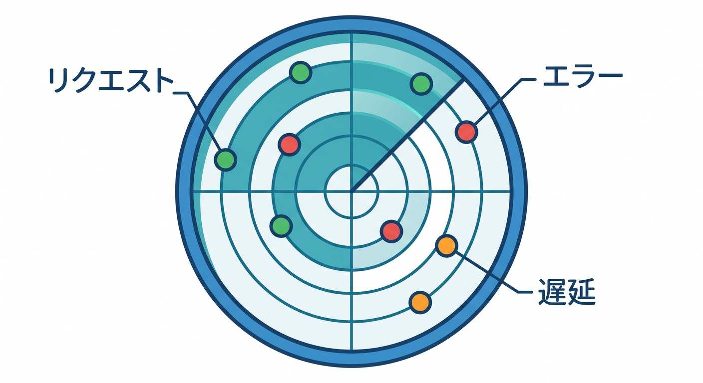
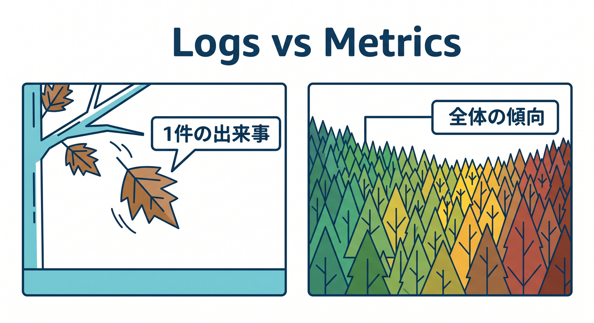
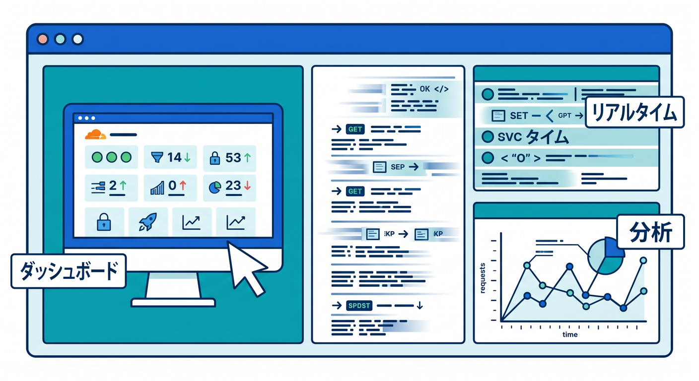
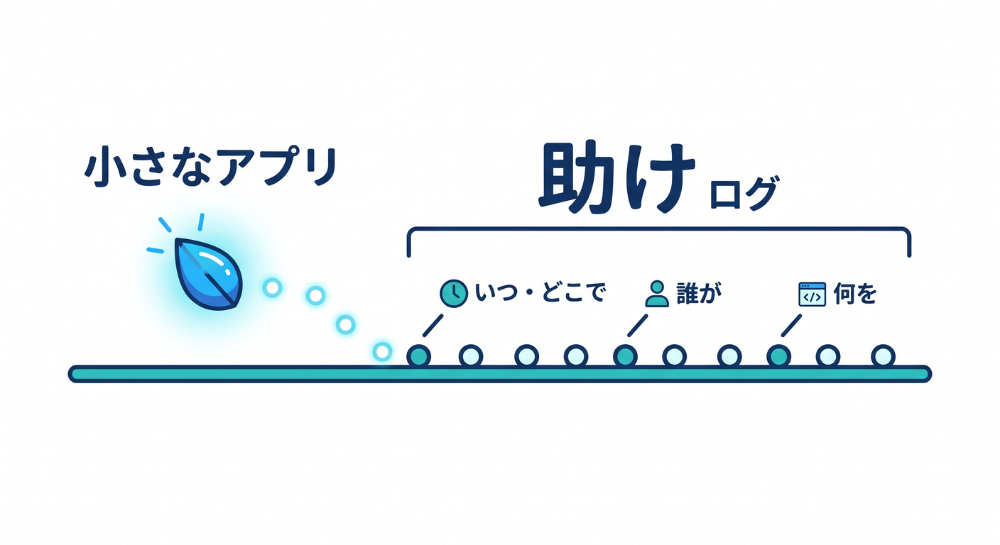
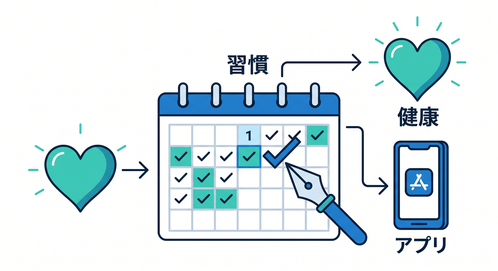

# 第01章：作ったアプリを“見る力”を育てよう 📈

アプリは、作ってデプロイしたら終わりではありません。  
本番でちゃんと動いているか、遅くないか、エラーが出ていないかを見る必要があります。  
この章では、Cloudflare WorkersのObservabilityをやさしく理解します 😊

---

## 1. 観測とは何を見ること？ 👀



運用では、次のようなことを見ます。

- リクエストは来ているか
- エラーは増えていないか
- レスポンスは遅くないか
- 外部APIで失敗していないか
- Queueに失敗が溜まっていないか
- AI APIのrate limitに当たっていないか

コードを書く力と同じくらい、動いているものを見る力が大切です。

---

## 2. LogsとMetricsの違い 🧭



ログとメトリクスは、見るものが少し違います。

```text
Logs → 1件ごとの出来事
Metrics → 全体の傾向
```

たとえば、ある1件のエラー原因を見るならログ。  
エラー率が昨日より増えたかを見るならメトリクスです。

---

## 3. Cloudflareで見る場所 📍



Workersでは、主に次を見ます。

- Workers Logs
- Real-time Logs
- `wrangler tail`
- Workers Analytics
- Errors and Exceptions
- LogpushやTail Workers

最初はDashboardと `wrangler tail` から始めれば十分です。

---

## 4. 小さなアプリでもログは必要 🧱



個人開発や学習アプリでも、ログがあると助かります。

```text
何が起きたか
いつ起きたか
どのAPIで起きたか
どのjobIdで起きたか
```

「なんとなく動かない」を減らせます。

---

## 5. 章末チェック ✅



- 作った後に観測が必要だと分かる
- logsとmetricsの違いが分かる
- Workers LogsやAnalyticsの存在を知っている
- 小さなアプリでもログが大切だと分かる
- 障害時に見る場所を増やせる

この章で覚える一言はこれです。  
**Observabilityは、アプリの健康状態を見るための習慣です 📈**
