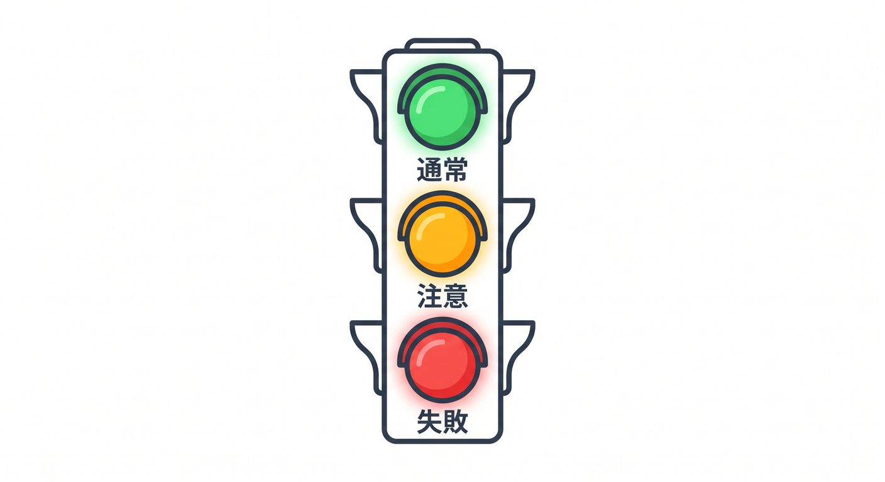
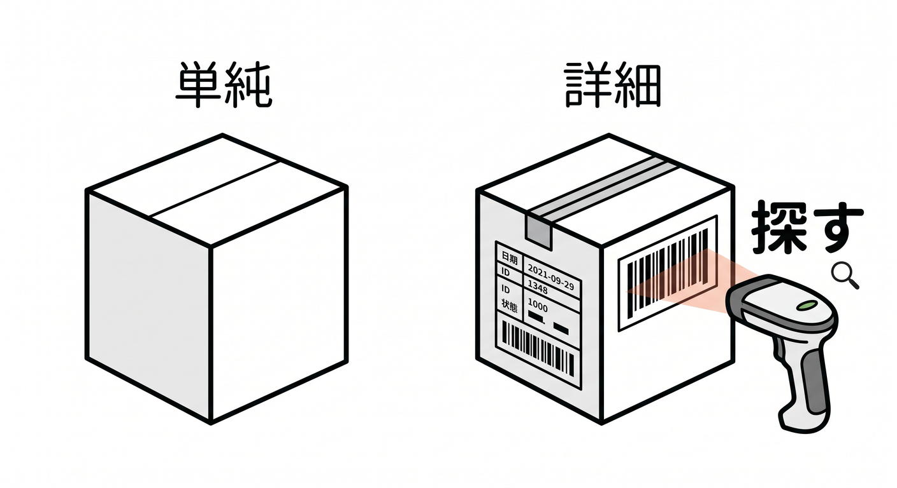
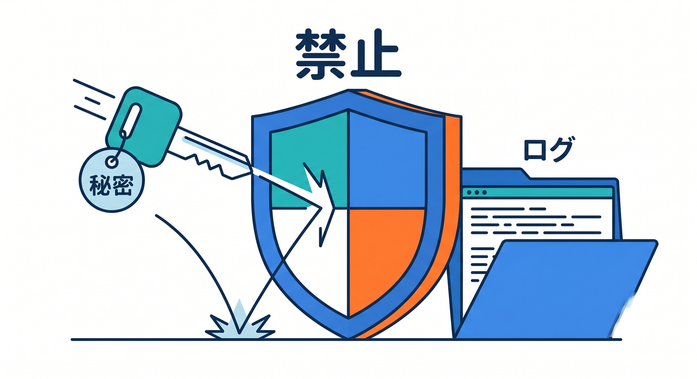
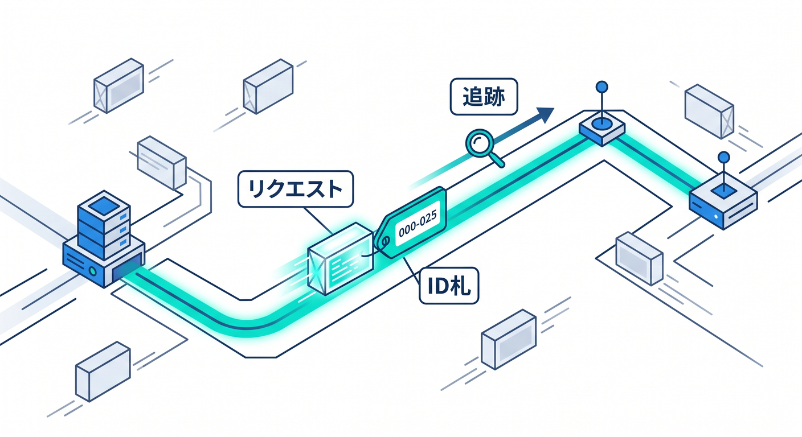
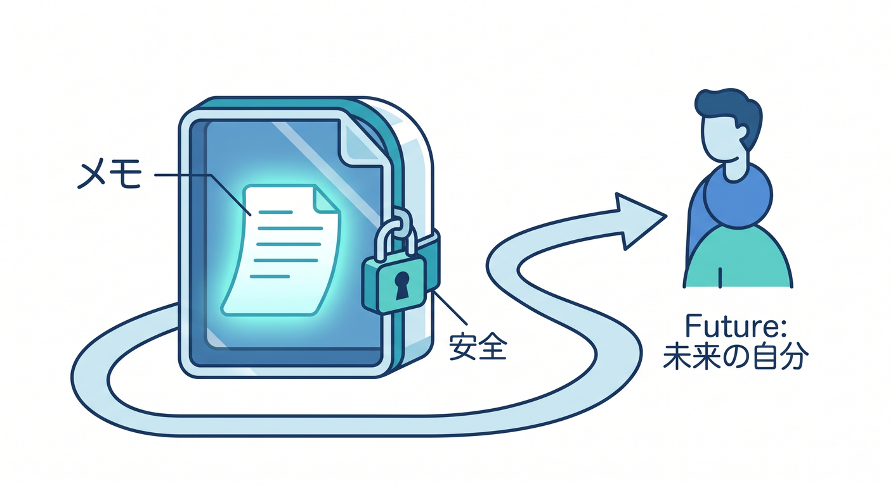

# 第02章：console.logから始めよう 📝

最初のログは `console.log()` で十分です。  
ただし、何を出すか、何を出さないかを決めることが大切です。

---

## 1. 基本のconsole 🧩



Workersでは、次のようなconsole APIを使えます。

```ts
console.log("request started");
console.warn("slow response");
console.error("external api failed");
```

ログの重要度によって使い分けます。

```text
log   → 通常の記録
warn  → 注意したい状態
error → 調査が必要な失敗
```

---

## 2. 文字列だけだと探しにくい 🔎



次のログは、後で探しにくいです。

```ts
console.log("failed");
```

どこで、何が、どのリクエストで失敗したのか分かりません。  
少し情報を足します。

```ts
console.error("request failed", {
  route: "/api/todos",
  requestId,
  status: 500,
});
```

---

## 3. 出してはいけないもの 🔐



ログに何でも出してはいけません。

- APIキー
- password
- secret token
- Cookie全文
- Authorization header
- 個人情報の本文
- AIへの長いプロンプト全文

ログは便利ですが、漏れると困る情報もあります。

---

## 4. requestIdを付ける 🪪



リクエストごとにIDを作ると追跡しやすいです。

```ts
const requestId = crypto.randomUUID();

console.log("request started", {
  requestId,
  method: request.method,
  path: new URL(request.url).pathname,
});
```

エラー時も同じrequestIdを出すと、流れを追えます。

---

## 5. 章末チェック ✅



- `console.log`、`warn`、`error` を使い分けられる
- 文字列だけのログが探しにくいと分かる
- secretや個人情報を出さないと分かる
- requestIdで追跡できる
- ログは安全性も考えて書くと分かる

この章で覚える一言はこれです。  
**ログは“あとで調べる自分”へのメモですが、秘密は書かないようにします 📝**
