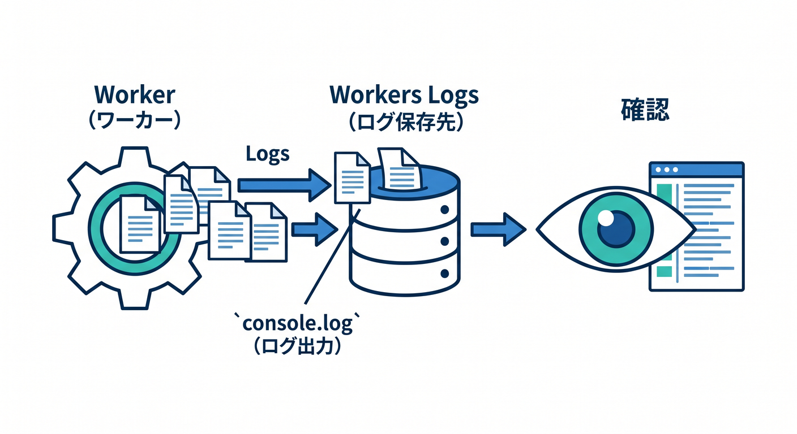
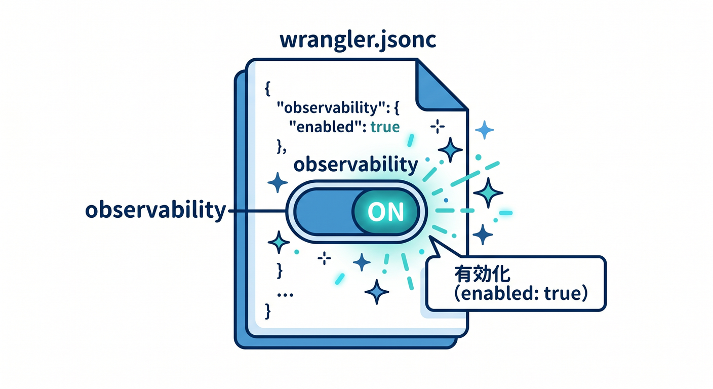
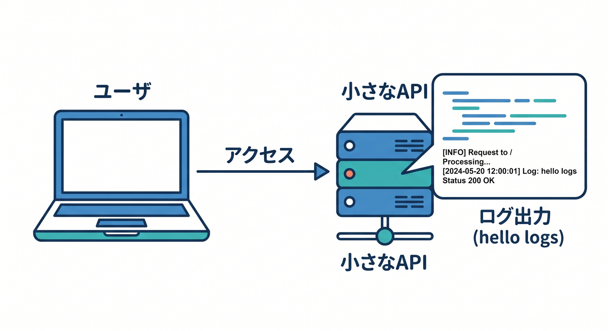
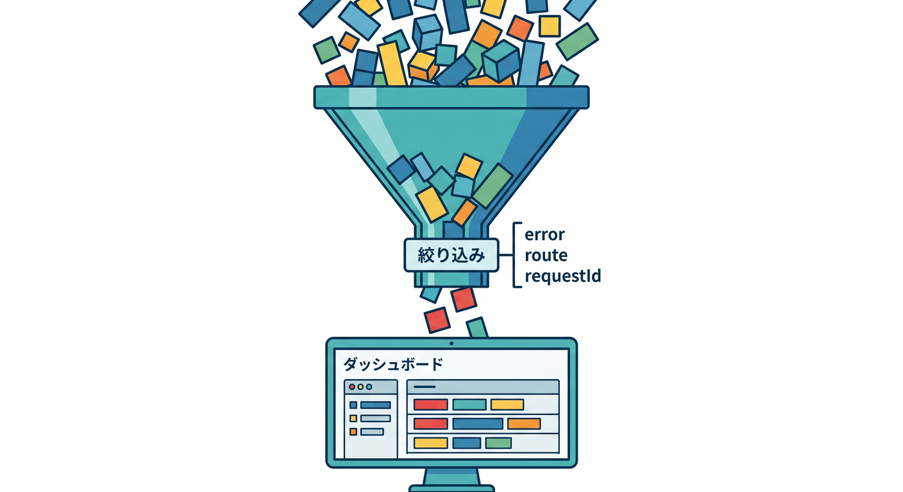
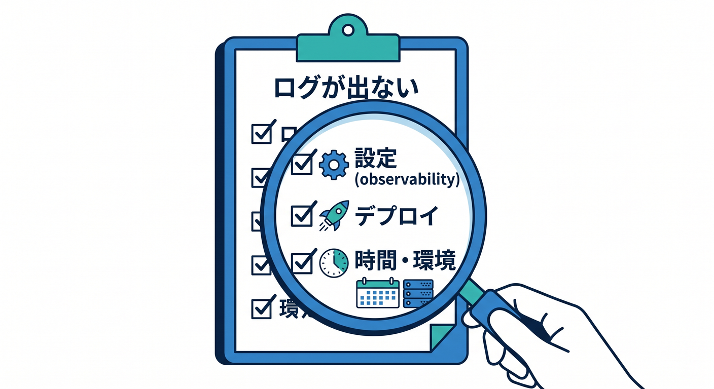
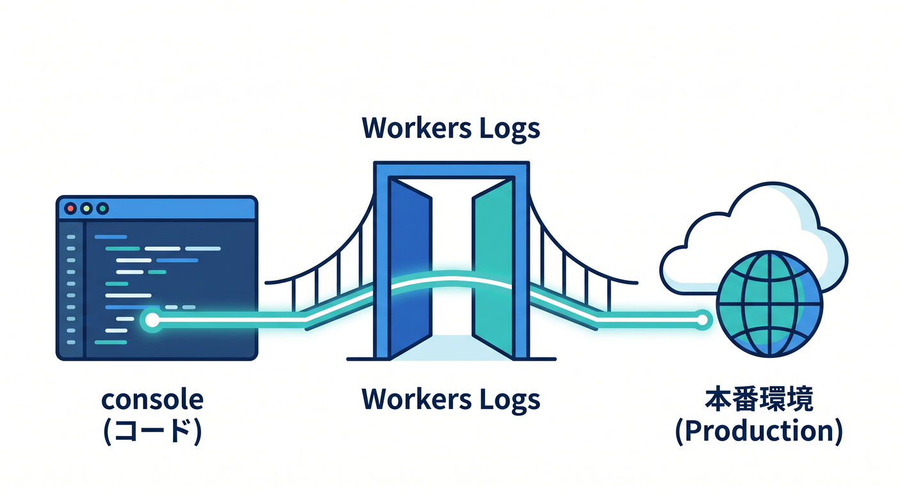

# 第03章：Workers Logsを有効化して見よう 👀

`console.log()` を書いたら、次はそれを見る場所が必要です。  
Cloudflare Workers Logsを使うと、Workerのログを確認できます。



---

## 1. observabilityを有効にする ⚙️

公式ドキュメントでは、WorkerがWorkers Logsへ書き込むためにobservability設定を追加する方法が案内されています。

```jsonc
{
  "observability": {
    "enabled": true
  }
}
```

`wrangler.jsonc` に設定し、デプロイ後にログを確認します。



---

## 2. 小さなAPIで試す 🧪

まずはログだけ出すAPIを作ります。

```ts
export default {
  async fetch(request): Promise<Response> {
    const path = new URL(request.url).pathname;

    console.log("hello logs", { path });

    return Response.json({ ok: true });
  },
} satisfies ExportedHandler;
```

デプロイ後にアクセスして、ログが見えるか確認します。



---

## 3. Dashboardで見る 📊

Cloudflare dashboardからWorkerのObservabilityやLogsを開きます。  
Worker名、時間範囲、ログレベル、メッセージなどで絞り込みます。

```text
見たいもの:
- 直近のリクエスト
- errorログ
- 特定requestId
- 特定route
```

最初は直近5分を見るだけでも十分です。



---

## 4. ログが出ないとき 🔎

ログが見えない場合は、次を確認します。

- `observability.enabled` があるか
- デプロイ済みか
- 見ているWorkerが合っているか
- 時間範囲が合っているか
- 対象APIへ本当にアクセスしたか

ログ調査も、確認順を決めると落ち着いて進められます。



---

## 5. 章末チェック ✅

- Workers Logsを見るにはobservability設定が必要だと分かる
- `wrangler.jsonc` に設定を書ける
- 小さなAPIでログを試せる
- Dashboardでログを確認できる
- ログが出ないときの確認ポイントが分かる

この章で覚える一言はこれです。  
**Workers Logsは、consoleに書いた出来事を本番で確認する入口です 👀**


