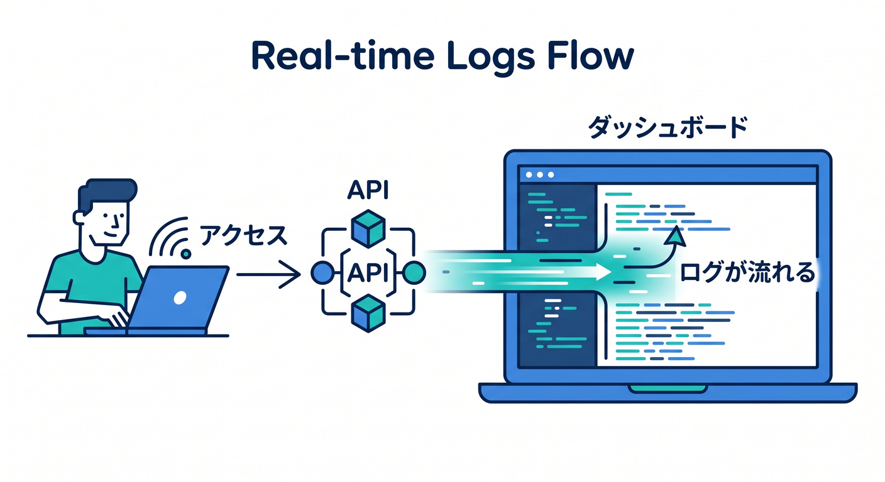
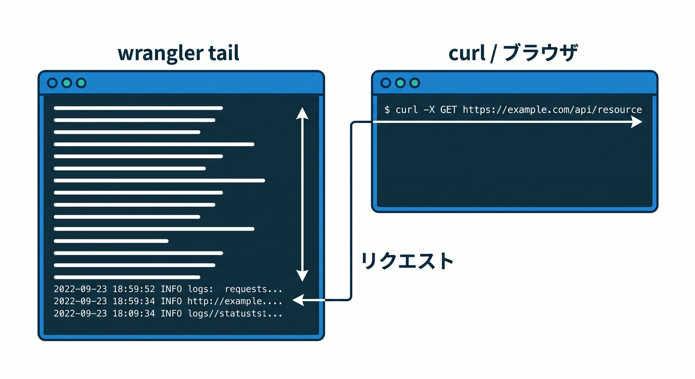
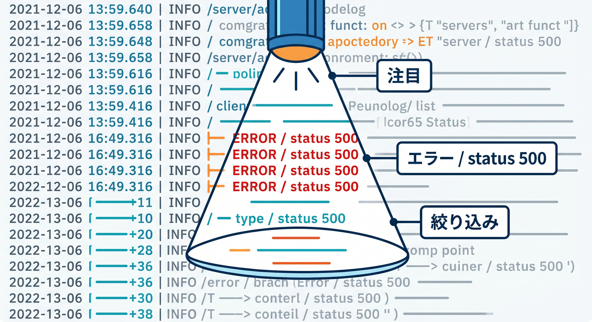
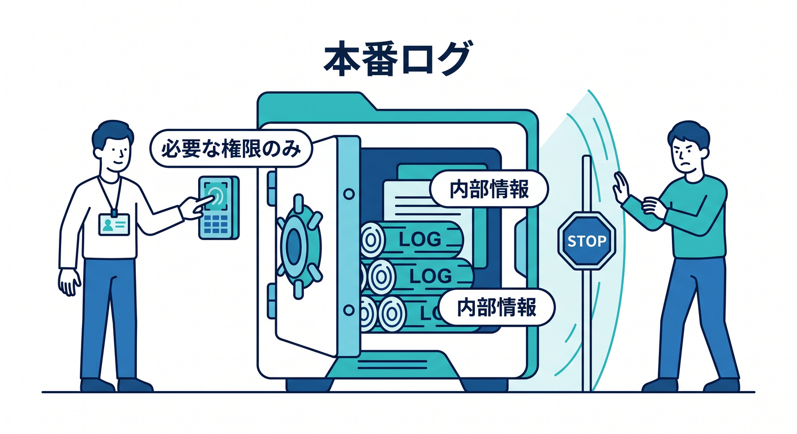

# 第04章：Real-time Logsとwrangler tailで追いかけよう ⚡

障害調査や開発中は、今まさに出ているログを見たいことがあります。  
そのときはReal-time Logsや `wrangler tail` が役に立ちます。

---

## 1. Real-time Logsとは 👀

Real-time Logsは、実行中のWorkerログをリアルタイムに確認するための機能です。  
Dashboardから対象Workerを選び、直近のログを追いかけます。

```text
APIへアクセス
  ↓
Dashboardでログが流れる
```

実際にリクエストしながら見ると、かなり分かりやすいです。



---

## 2. wrangler tailを使う 🧰

ターミナルで見るなら `wrangler tail` を使います。

```powershell
npx wrangler tail
```

Windows / VS Code環境では、ターミナルを2つ開くと便利です。

```text
ターミナル1 → wrangler tail
ターミナル2 → curlやブラウザでAPI確認
```



---

## 3. エラーだけに注目する 🔎

ログが多いと、全部読むのは大変です。  
まずはエラーや特定routeに絞ります。

```text
見る順番:
1. errorログ
2. status 500
3. 特定requestId
4. 特定route
```

絞り込みながら原因へ近づきます。



---

## 4. 本番での注意 🔐

本番ログを見る人は、必要な権限だけにします。  
ログにはユーザー情報や処理内容が含まれることがあります。

```text
ログを見られる人 = アプリの内部情報を見られる人
```

チーム開発では権限管理も運用の一部です。



---

## 5. 章末チェック ✅

- Real-time Logsの役割が分かる
- `npx wrangler tail` を使える
- リクエストしながらログを追える
- エラーやrouteで絞る発想がある
- 本番ログの権限管理に注意できる

この章で覚える一言はこれです。  
**リアルタイムログは、今起きていることをその場で追うための道具です ⚡**


