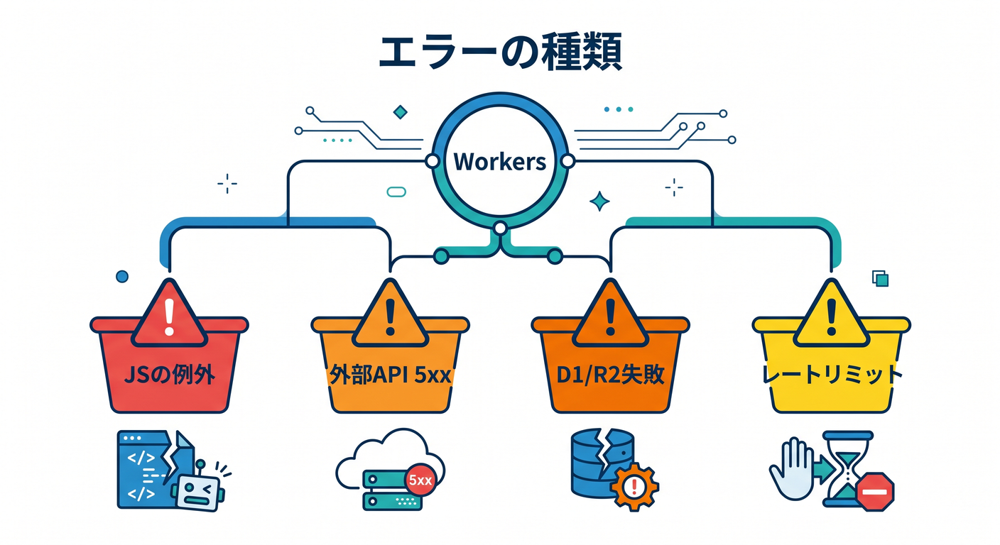
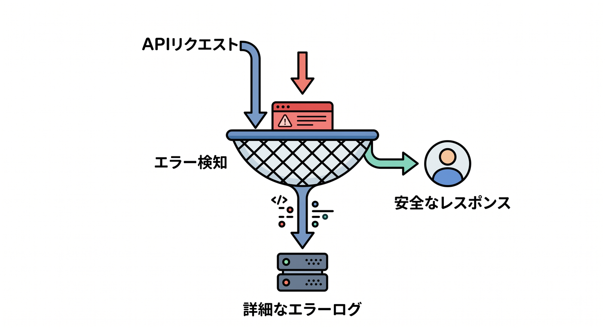
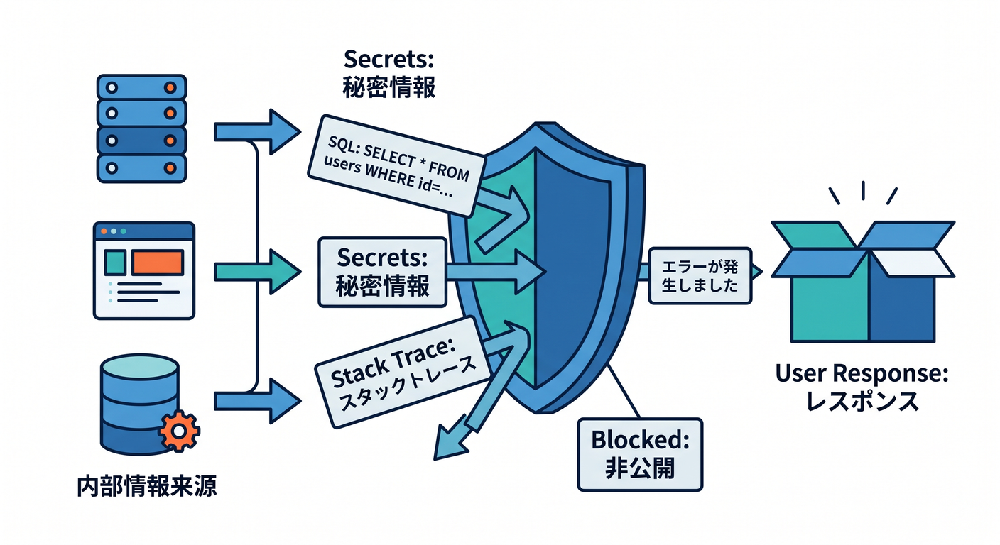
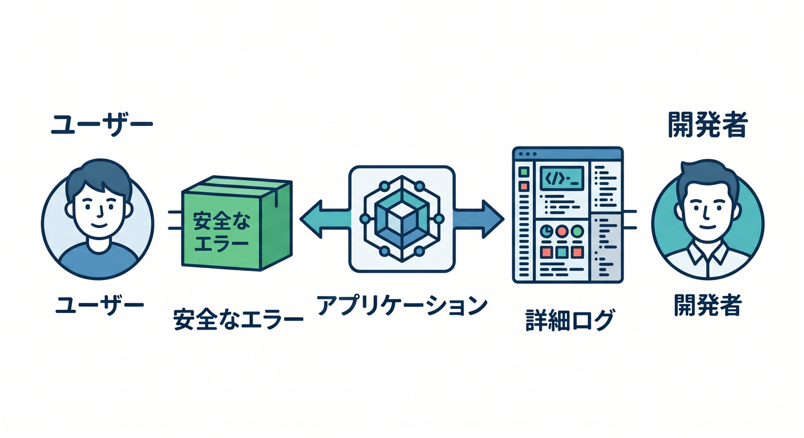

# 第05章：エラーと例外を読めるようになろう 🧯

本番運用では、エラーを怖がるより、読めるようになることが大切です。  
この章では、Workersでよく見るエラーの扱い方を学びます。

---

## 1. エラーの種類 🧭



よくある失敗には種類があります。

- JavaScriptの例外
- JSON parse error
- D1やR2の操作失敗
- 外部APIの5xx
- 認証エラー
- Rate limit
- Workerの実行時エラー

まず「どの種類か」を分けると調査しやすいです。

---

## 2. try/catchでログを残す 📝



APIの入口でエラーを捕まえます。

```ts
export default {
  async fetch(request, env): Promise<Response> {
    const requestId = crypto.randomUUID();

    try {
      return await handleRequest(request, env, requestId);
    } catch (error) {
      console.error("request failed", {
        requestId,
        error: error instanceof Error ? error.message : String(error),
      });

      return Response.json(
        { error: "Internal server error", requestId },
        { status: 500 }
      );
    }
  },
} satisfies ExportedHandler<Env>;
```

内部詳細はログへ、ユーザーには安全なメッセージを返します。


---

## 3. ユーザーに内部情報を返さない 🔐



次のような情報は、レスポンスへ出しすぎないようにします。

- SQL全文
- stack trace
- secret名や設定値
- 外部APIの詳細レスポンス
- 個人情報

調査用にはrequestIdを返し、詳しい情報はログで見ます。

---

## 4. 代表的なWorkersエラーを調べる 🔎


Cloudflare公式のErrors and Exceptionsには、Workersの代表的なエラーがまとめられています。  
エラーコードやメッセージで検索し、原因候補を確認します。

```text
エラー文を読む
  ↓
公式ドキュメントで調べる
  ↓
直近の変更と照らす
```

推測だけで決めつけないのが大切です。

---

## 5. 章末チェック ✅

- エラーの種類を分けて考えられる
- `try/catch` でログを残せる
- ユーザー向けエラーと内部ログを分けられる
- requestIdを返す意味が分かる
- 公式ドキュメントでエラーを調べられる

この章で覚える一言はこれです。  
**エラーは、ユーザーには安全に、開発者には調査できる形で扱います 🧯**


