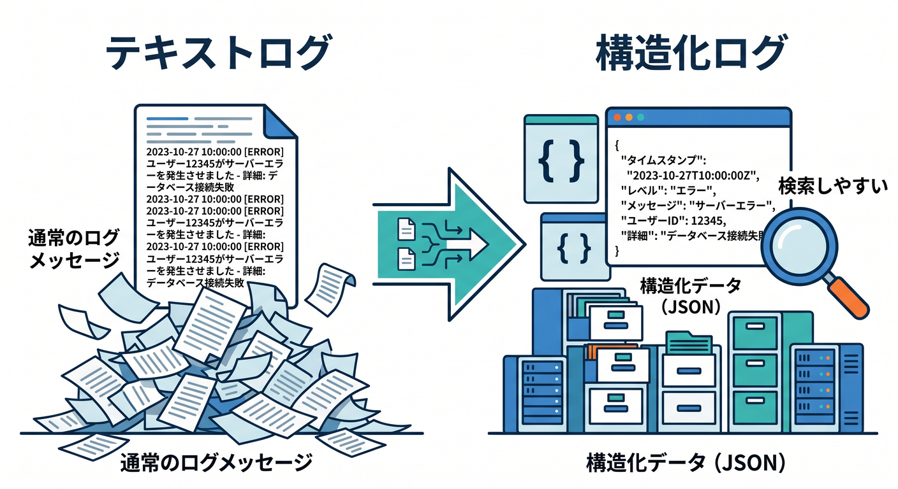
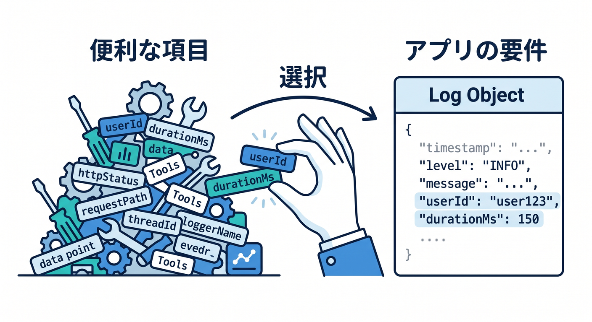
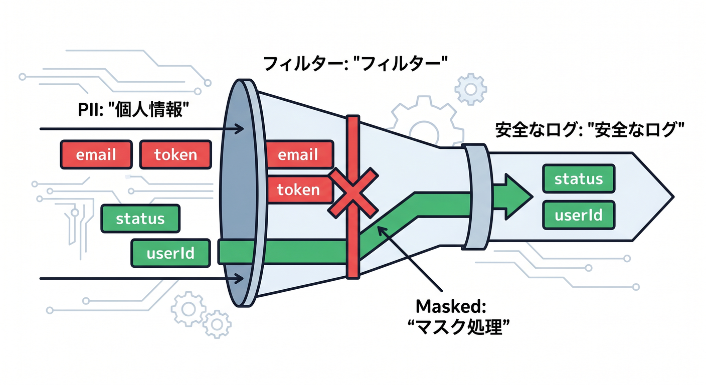
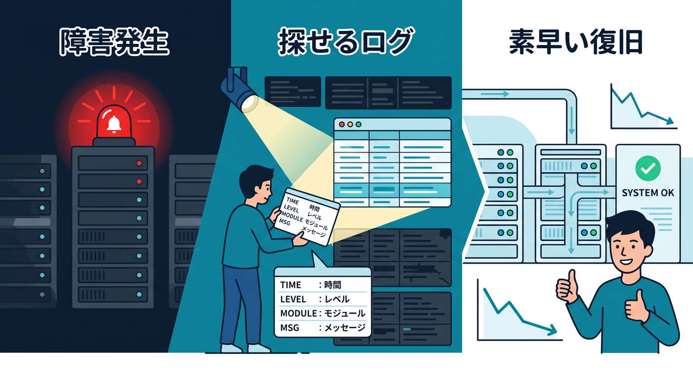

# 第06章：構造化ログで調査しやすくしよう 🧱

ログは、あとで検索しやすい形にしておくと強いです。  
文字だけでなく、意味のある項目を持たせるのが構造化ログです。

---

## 1. 構造化ログの例 📝



次のように、オブジェクトで情報を出します。

```ts
console.log("api request completed", {
  requestId,
  route: "/api/todos",
  method: "POST",
  status: 201,
  durationMs: 42,
});
```

あとで `requestId` や `route` で探しやすくなります。


---

## 2. 入れると便利な項目 🪪



よく使う項目です。

- requestId
- jobId
- userId
- route
- method
- status
- durationMs
- queueName
- objectKey
- modelName

アプリごとに必要なものを選びます。

---

## 3. 個人情報を出しすぎない 🔐



便利だからといって、何でもログに出しません。

```text
出しやすい: userId, jobId, status
注意する: email, name, prompt, message body
避ける: password, token, Authorization header
```

調査に必要な最小限の情報へ絞ります。

---

## 4. durationMsを測る ⏱️

遅さを調べるには時間を記録します。

```ts
const startedAt = Date.now();

const response = await handleRequest(request, env);

console.log("request finished", {
  requestId,
  durationMs: Date.now() - startedAt,
});

return response;
```

遅いAPIを見つける手がかりになります。


---

## 5. 章末チェック ✅

- 構造化ログの意味が分かる
- requestIdやjobIdをログに入れられる
- 個人情報を出しすぎないと分かる
- durationMsで遅さを調べられる
- あとで検索しやすいログを書ける

この章で覚える一言はこれです。  
**構造化ログは、障害時に“探せるログ”を作るための工夫です 🧱**


