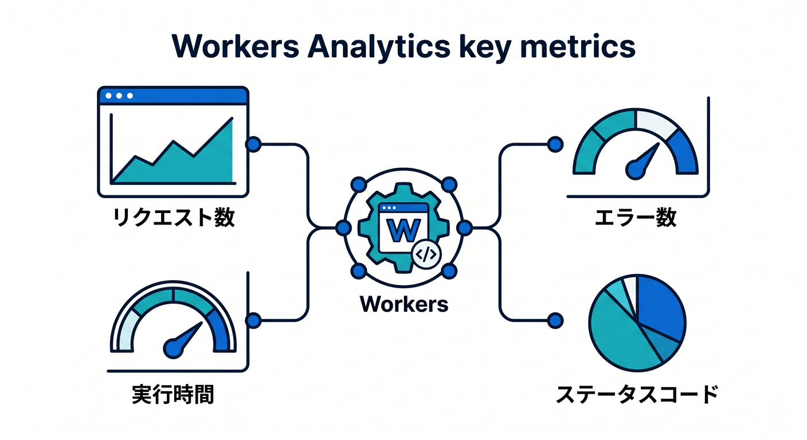
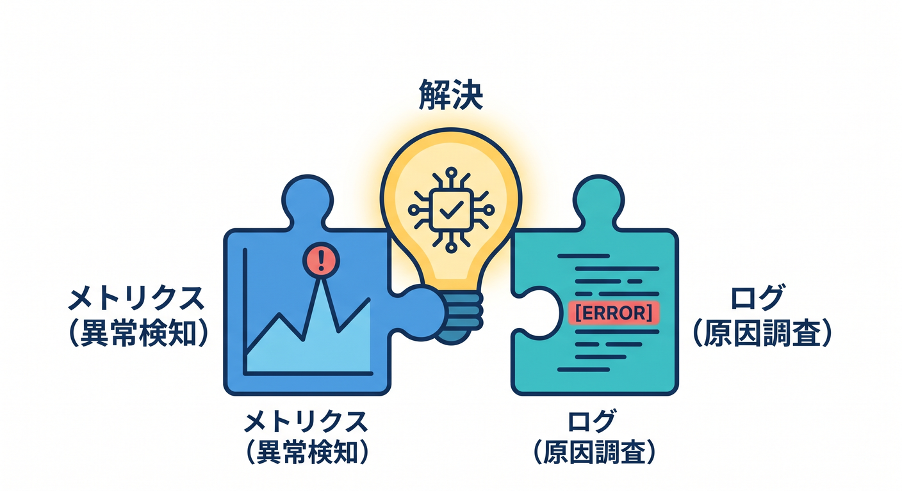

# 第07章：メトリクスとAnalyticsを見よう 📊

ログは1件ごとの出来事を見るものです。  
一方で、メトリクスやAnalyticsは全体の傾向を見るために使います。


---

## 1. メトリクスで見るもの 📈

Workers Analyticsでは、次のような情報を見ます。



- リクエスト数
- エラー数
- 実行時間
- CPU time
- ステータスコード
- サブリクエスト

「昨日より急に増えた」「この時間だけ失敗している」を見つけます。

---

## 2. ログとの違い 🧭

違いを整理します。

```text
ログ:
  2026-04-24 10:01 requestId=abc failed

メトリクス:
  10時台のエラー率が5%に増えた
```

まずメトリクスで異常を見つけ、ログで原因を調べる流れが自然です。


---

## 3. 見る順番 👀

障害かなと思ったら、まず全体を見ます。

```text
1. リクエスト数は増えたか
2. エラー率は上がったか
3. 遅くなったか
4. 特定routeだけか
5. 直近デプロイ後か
```

いきなり1件のログだけ見ると、全体像を見失うことがあります。


---

## 4. 小さな変化を見る 🌱

学習アプリでも、次の変化を見てみます。

- デプロイ後に500が出ていないか
- D1追加後に遅くなっていないか
- AI機能追加後に失敗が増えていないか
- Queue処理後にDLQが増えていないか

小さくても、見る習慣が大事です。


---

## 5. 章末チェック ✅

- メトリクスは全体傾向を見るものだと分かる
- Workers Analyticsで見る項目が分かる
- まず全体、次にログという流れが分かる
- デプロイ後の変化を確認できる
- 小さなアプリでも分析を見る習慣を持てる

この章で覚える一言はこれです。  
**メトリクスで異常を見つけ、ログで原因に近づきます 📊**


