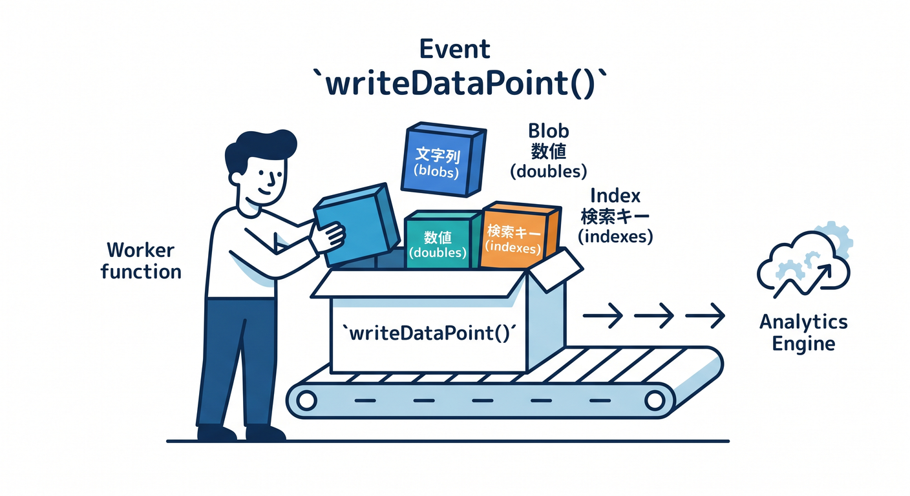
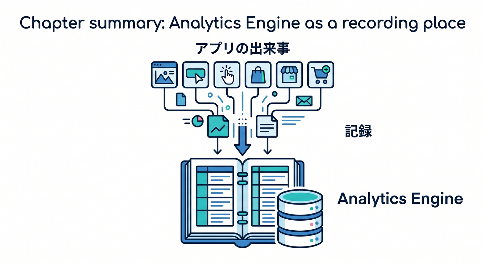

# 第08章：Analytics Engineで独自イベントを記録しよう 🧮

Workers Analyticsで基本的な情報は見られます。  
でも、アプリ独自のイベントを記録したいときはAnalytics Engineが候補になります。

---

## 1. 独自イベントとは 📌

たとえば、次のような数字です。

- Todoが作成された回数
- 画像アップロード件数
- AI要約にかかった時間
- Queue jobの種類
- 検索キーワードの件数
- 管理画面の操作回数

標準メトリクスだけでは見えない、アプリ固有の出来事です。


---

## 2. Analytics Engine binding ⚙️

`wrangler.jsonc` にAnalytics Engineのbindingを書きます。

```jsonc
{
  "analytics_engine_datasets": [
    {
      "binding": "ANALYTICS",
      "dataset": "app_events"
    }
  ]
}
```

Workerでは `env.ANALYTICS` として使います。


---

## 3. イベントを書き込む ✍️

イベントを書き込む例です。



```ts
env.ANALYTICS.writeDataPoint({
  blobs: ["todo_created", userId],
  doubles: [durationMs],
  indexes: [requestId],
});
```

公式ドキュメントでは、Analytics Engineへの書き込みはnon-blockingでWorkerのlatencyを増やさないと案内されています。


---

## 4. 何を記録するかが大事 🧭

何でも記録すればよいわけではありません。

```text
よい: eventType, duration, status, featureName
注意: email, prompt本文, message本文
```

個人を追いすぎない、集計しやすい設計にします。


---

## 5. 章末チェック ✅

- Analytics Engineは独自イベント向きだと分かる
- bindingのイメージが分かる
- `writeDataPoint()` の基本が分かる
- latencyへの影響が小さい設計だと分かる
- 記録する項目を選ぶ必要があると分かる

この章で覚える一言はこれです。  
**Analytics Engineは、アプリ独自の数字をあとで見るための記録場所です 🧮**


