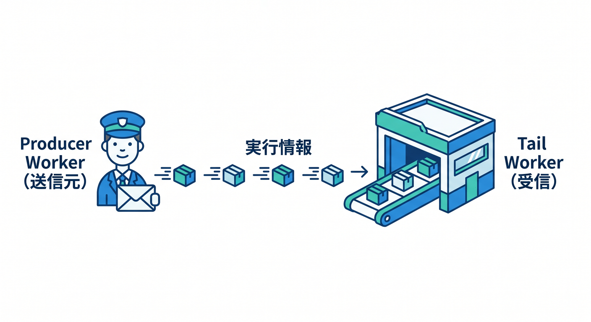
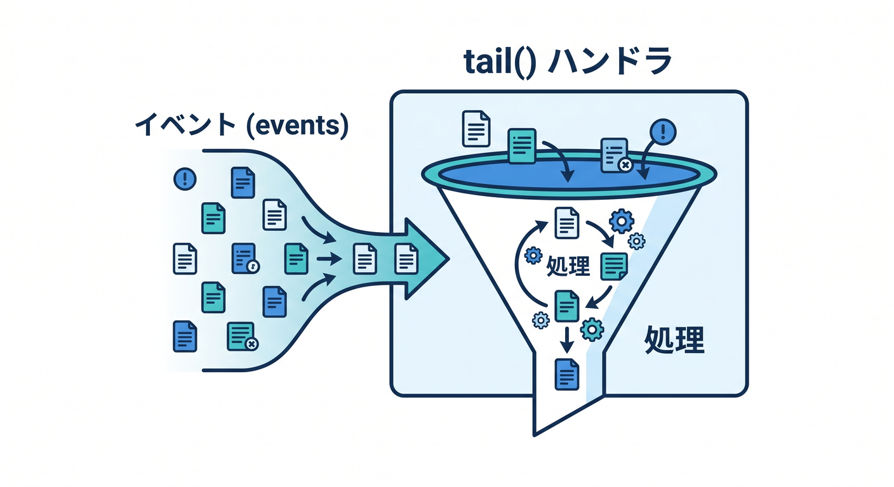
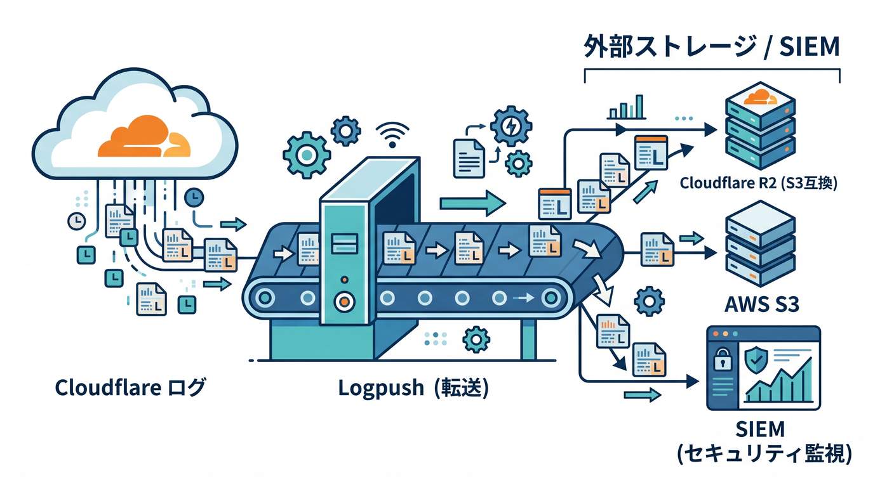
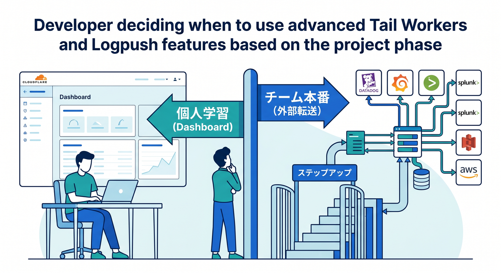
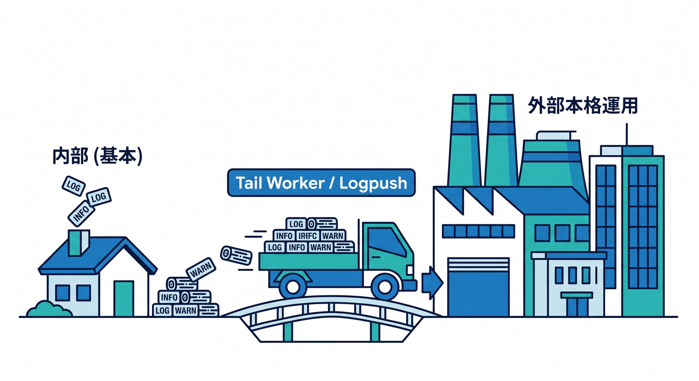

# 第09章：Tail WorkersとLogpushの役割を知ろう 🚚

最初はDashboardや `wrangler tail` で十分です。  
でも本格運用では、ログを外部の監視サービスや保存先へ送りたくなることがあります。


---

## 1. Tail Workersとは 🧵

Tail Workerは、別のWorkerの実行情報を受け取るWorkerです。  
公式ドキュメントでは、producer WorkerのHTTP status、`console.log()`、uncaught exceptionsなどを受け取れると案内されています。



```text
Producer Worker
  ↓ execution info
Tail Worker
  ↓
外部ログサービス
```

ログを加工して送るような発展用途です。

---

## 2. tail() handler 📥

Tail Workerには `tail()` handlerを書きます。



```ts
export default {
  async tail(events): Promise<void> {
    for (const event of events) {
      console.log(event.outcome);
    }
  },
} satisfies ExportedHandler;
```

初心者はまず「そういう仕組みがある」と知るだけで大丈夫です。

---

## 3. Logpushとは 🚚

Logpushは、Cloudflareのログを外部ストレージやSIEM、ログ管理サービスへ送る仕組みです。  
長期保存、横断検索、監査が必要な場合に使います。



```text
Cloudflare logs
  ↓ Logpush
R2 / S3 / SIEM / log platform
```

Workers Trace Events Logpushも選択肢になります。

---

## 4. いつ必要？ 🧭

次のような段階で検討します。



- チームで本番運用している
- 長期保存が必要
- 監査やセキュリティ要件がある
- 複数サービスのログを一緒に検索したい
- 外部監視ツールを使っている

個人学習では、まずDashboardと `wrangler tail` で十分です。

---

## 5. 章末チェック ✅

- Tail Workersの役割が分かる
- `tail()` handlerの存在を知っている
- Logpushは外部へログを送る仕組みだと分かる
- 本格運用で外部ログ連携が必要になると分かる
- 初心者はまず基本ログから始めればよいと分かる

この章で覚える一言はこれです。  
**Tail WorkersとLogpushは、ログを外へ運んで本格運用につなげる仕組みです 🚚**


