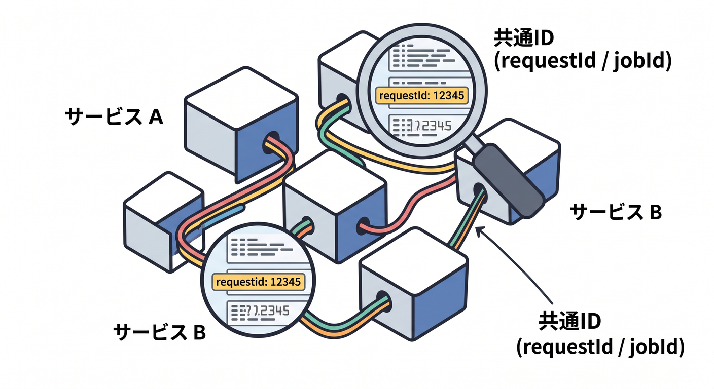

# 第10章：D1・R2・KV・Queuesの運用ログ 🗺️

Workerだけならログは比較的シンプルです。  
でもD1、R2、KV、Queuesを使うと、見る場所と原因候補が増えます。

---

## 1. D1で見ること 🗄️

D1では、SQLやデータ状態を意識します。

- SQLエラー
- migration漏れ
- `prepare().bind()` の値
- UNIQUE制約違反
- 遅いクエリ

ログにはSQL全文より、処理名やrequestIdを出すほうが安全です。

---

## 2. R2で見ること 🪣

R2ではobject keyが重要です。

- keyが間違っていないか
- objectが存在するか
- Content-Typeが正しいか
- public/privateの設計が合っているか
- upload後の後処理が完了したか

ファイル本体ではなく、keyやjobIdをログに出します。

---

## 3. KVで見ること 🧠

KVはeventual consistencyを意識します。

- 書いた直後に別地域で読める前提にしていないか
- key名が正しいか
- expirationやTTLが効いているか
- namespaceが環境ごとに合っているか

「保存したはずなのに読めない」は、設計とタイミングを見ます。

---

## 4. Queuesで見ること 📬

Queuesでは、retryやDLQを見ます。

- messageがenqueueされたか
- consumerが動いたか
- retryが増えていないか
- DLQに入っていないか
- jobIdで二重処理を避けているか

ProducerとConsumerの両方で同じjobIdをログに出すと追いやすいです。

---

## 5. 章末チェック ✅

- D1の運用ログ観点が分かる
- R2ではobject keyを追うと分かる
- KVでは反映タイミングを考えると分かる
- QueuesではretryとDLQを見ると分かる
- requestIdやjobIdをサービス横断で使える

この章で覚える一言はこれです。  
**複数サービスを使うほど、同じIDで処理を追えるログ設計が大切です 🗺️**

