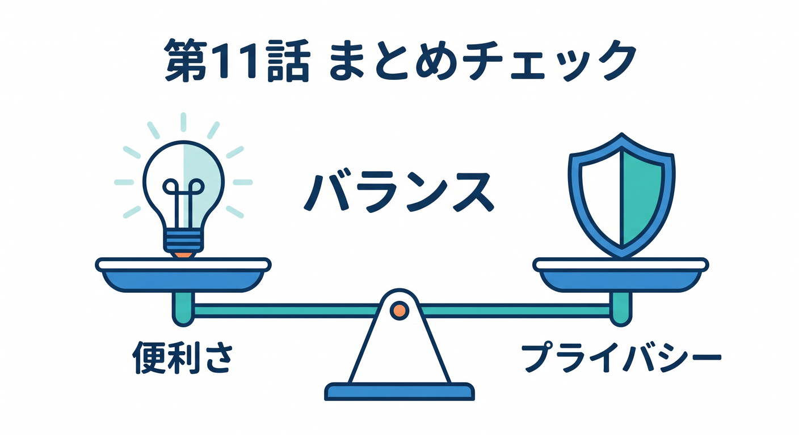
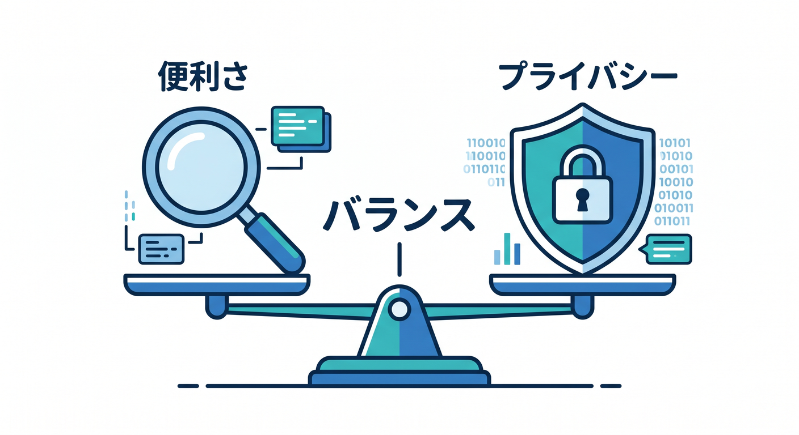

# 第11章：AIアプリの観測ポイント 🤖

AIアプリでは、普通のAPIに加えてAI特有の観測ポイントがあります。  
遅さ、rate limit、token使用量、外部API失敗などを見ます。


---

## 1. AIで見たいもの 👀

AI機能では、次を見ます。

- AI APIのstatus
- response time
- rate limit
- token使用量
- モデル名
- jobId
- retry回数
- ユーザーへの表示状態

ただ動けばよいのではなく、安定して動くかを見ます。


---

## 2. AI Gatewayを使う 🧭

外部AI APIを使う場合、AI Gatewayを通すと観測しやすくなります。

```text
Worker
  ↓
AI Gateway
  ↓
AI provider
```

リクエスト数や失敗、latencyを見やすくなります。


---

## 3. プロンプトをログに出しすぎない 🔐

AIアプリでは、ログにプロンプトを出したくなることがあります。  
でも、ユーザー入力や個人情報が含まれる可能性があります。

```text
出しやすい: jobId, model, status, durationMs
注意: prompt全文, response全文, uploaded text
```

必要ならマスクや要約を考えます。


---

## 4. QueueやWorkflowと一緒に見る 🔁

AI処理は長くなりやすいため、QueuesやWorkflowsと組み合わせることがあります。

```text
Worker API → Queue / Workflow → AI処理 → D1へ状態保存
```

jobIdで全体を追えるようにします。


---

## 5. 章末チェック ✅

- AIアプリ特有の観測ポイントが分かる
- AI Gatewayが観測に役立つと分かる
- プロンプト全文をログへ出しすぎない
- QueueやWorkflowとjobIdでつなげられる
- AI処理のstatusやdurationを見られる

この章で覚える一言はこれです。  
**AIアプリのログは、便利さとプライバシーのバランスを取りながら設計します 🤖**




