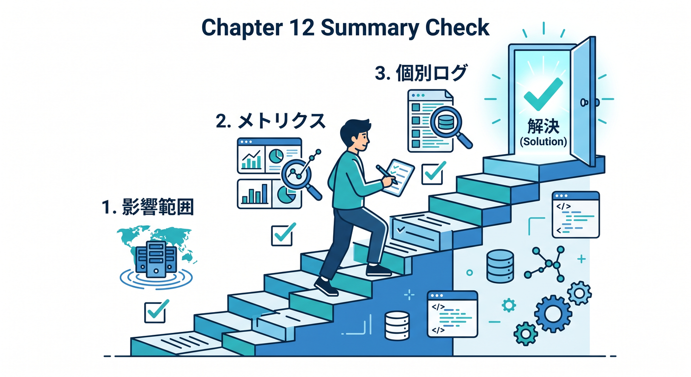
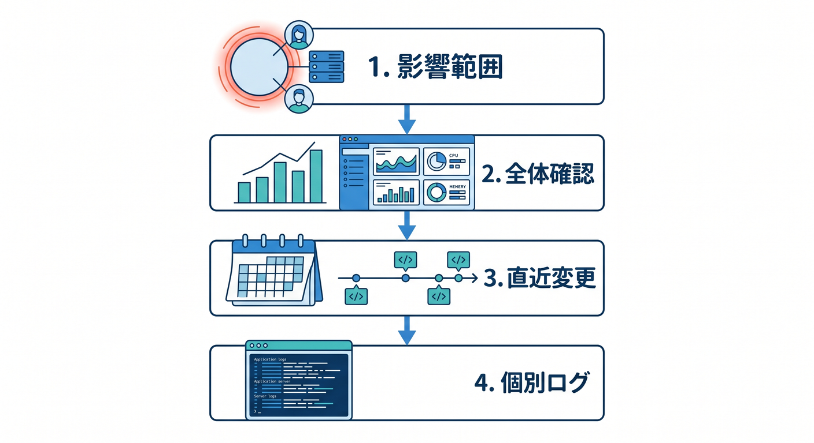

# 第12章：障害対応の基本手順を作ろう 🚨

障害が起きたとき、慌ててログを開くだけだと迷いやすいです。  
見る順番を決めたrunbookを作っておくと落ち着いて対応できます。

---

## 1. まず影響範囲を見る 🧭

最初に知りたいのは「どれくらい困っているか」です。

- 全ユーザーか
- 一部routeだけか
- 特定機能だけか
- 管理画面だけか
- 外部API連携だけか

影響範囲が分かると、優先度を判断しやすくなります。


---

## 2. 次に全体メトリクスを見る 📊

Workers Analyticsで全体を確認します。

```text
エラー率
リクエスト数
実行時間
CPU time
ステータスコード
```

急に変化した時間帯を見つけます。


---

## 3. 直近変更を見る 🧩

障害の直前に何が変わったかを確認します。

- デプロイ
- migration
- wrangler設定
- secret変更
- 外部API設定
- DNSやRoute設定

新しい変更が原因とは限りませんが、有力な手がかりです。


---

## 4. 個別ログで原因へ近づく 🔎

全体像を見たあと、個別ログを見ます。

```text
requestId
jobId
route
status
error message
durationMs
```

同じエラーが繰り返されているか、特定データだけで起きるかを見ます。


---

## 5. 章末チェック ✅

- 障害時は影響範囲から見ると分かる
- メトリクスで全体を確認できる
- 直近変更を確認すると分かる
- 個別ログで原因に近づける
- runbookを作る意味が分かる

この章で覚える一言はこれです。  
**障害対応は、影響範囲 → 全体メトリクス → 直近変更 → 個別ログの順に見ると落ち着きます 🚨**




