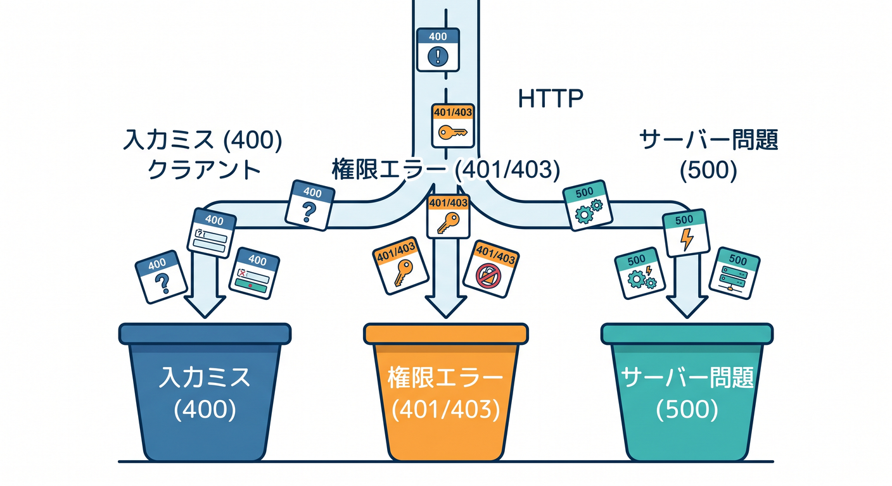
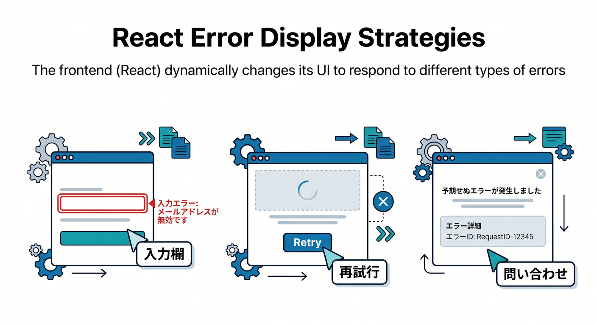

# 第13章：ユーザーに返すエラーを整えよう 🧑‍💻

ログは開発者のための情報です。  
ユーザーに返すエラーは、安全で分かりやすい形にします。

---

## 1. 悪いエラー例 😵

次のようなレスポンスは避けます。


```json
{
  "error": "SQLITE_CONSTRAINT: UNIQUE constraint failed at users.email"
}
```

内部実装が見えすぎています。  
ユーザーには何をすればよいかも分かりにくいです。

---

## 2. よいエラー例 ✅

安全で分かりやすい形にします。


```json
{
  "error": "このメールアドレスはすでに登録されています。",
  "requestId": "req_abc123"
}
```

requestIdがあると、問い合わせ時にログと照合できます。

---

## 3. エラーを分類する 🧭

エラーは分類して返します。


```text
400 → 入力が正しくない
401 → ログインが必要
403 → 権限がない
404 → 見つからない
429 → リクエストが多すぎる
500 → サーバー側の問題
```

React画面でも、この分類に応じて表示を変えます。

---

## 4. React側の表示 ⚛️

Reactでは、再試行できるかどうかも考えます。


```text
入力エラー → 入力欄の近くに表示
一時的なエラー → 再試行ボタン
権限エラー → ログインや権限案内
サーバーエラー → requestId付きで問い合わせ案内
```

ユーザーを置き去りにしないことが大切です。

---

## 5. 章末チェック ✅

- 内部エラーをそのまま返さないと分かる
- requestIdをレスポンスに含められる
- HTTP statusごとに意味を分けられる
- React側でエラー表示を分けられる
- ユーザー体験も運用の一部だと分かる

この章で覚える一言はこれです。  
**ログは詳しく、ユーザー向けエラーは安全で分かりやすくします 🧑‍💻**

