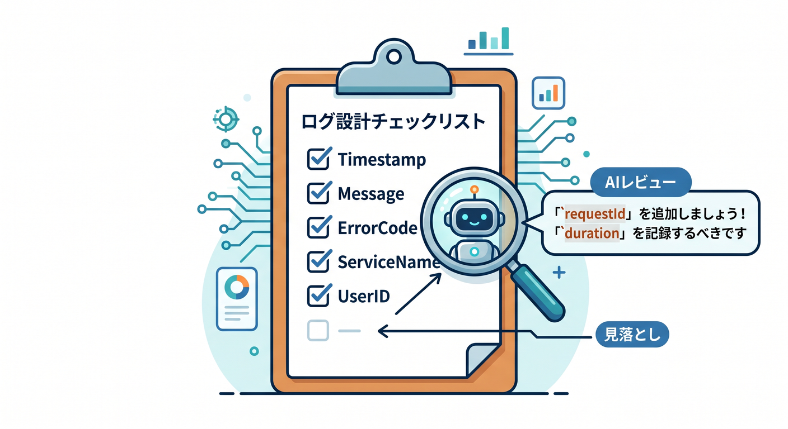
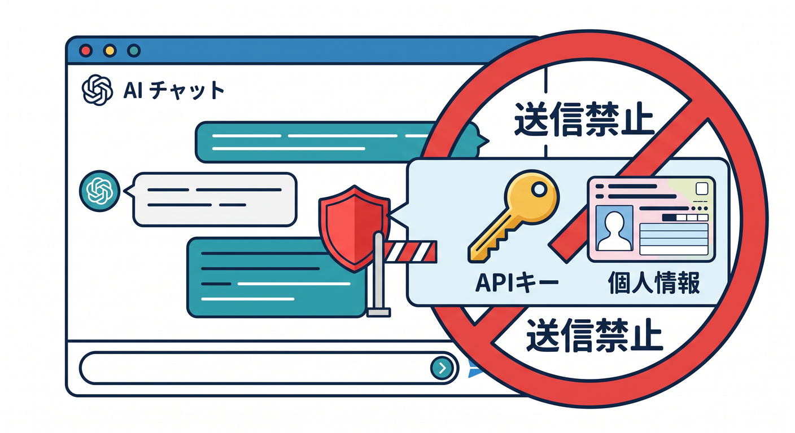

# 第14章：Copilotと一緒にログレビューしよう 🤖

GitHub Copilotは、コードだけでなくログ設計のレビューにも使えます。  
ただし、実ログや個人情報をそのまま貼らないように注意します。

---

## 1. Copilotに頼めること 🧩

たとえば、こんな依頼ができます。


```text
このCloudflare WorkerにrequestId付きの構造化ログを追加してください。
個人情報やsecretをログに出さない方針でお願いします。
```

具体的に頼むほど、使いやすい回答になりやすいです。

---

## 2. ログ項目のレビュー 🔎

ログの項目が足りているか聞けます。


```text
このAPIの障害調査に必要なログ項目をレビューしてください。
route、status、durationMs、requestId、userId、jobIdの観点で見てください。
```

人間が見落としやすい観点を補助してもらいます。

---

## 3. 貼ってはいけないもの 🔐

CopilotやAIチャットへ、次を貼らないようにします。


- APIキー
- 実ユーザーの個人情報
- Authorization header
- Cookie
- 本番の長いログ全文
- AIプロンプト全文

必要ならダミー値に置き換えます。

---

## 4. 回答は必ず確認する ✅

Copilotの提案が常に正しいとは限りません。


```text
公式ドキュメント
型エラー
実際のログ
本番のセキュリティ方針
```

これらと照らして確認します。

---

## 5. 章末チェック ✅

- Copilotにログレビューを頼める
- 具体的な観点を指定できる
- secretや個人情報を貼らない
- ダミー値に置き換えると分かる
- Copilotの回答を確認して使える

この章で覚える一言はこれです。  
**Copilotはログ設計レビューの相棒になりますが、実データは渡さず安全に使います 🤖**

