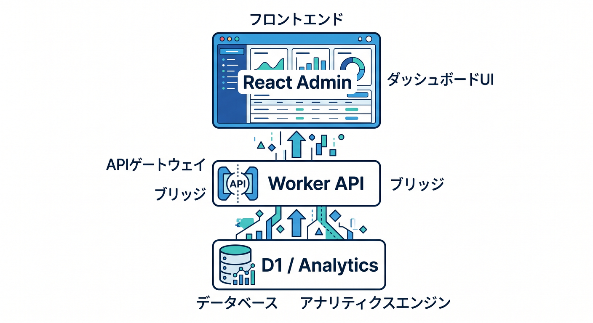
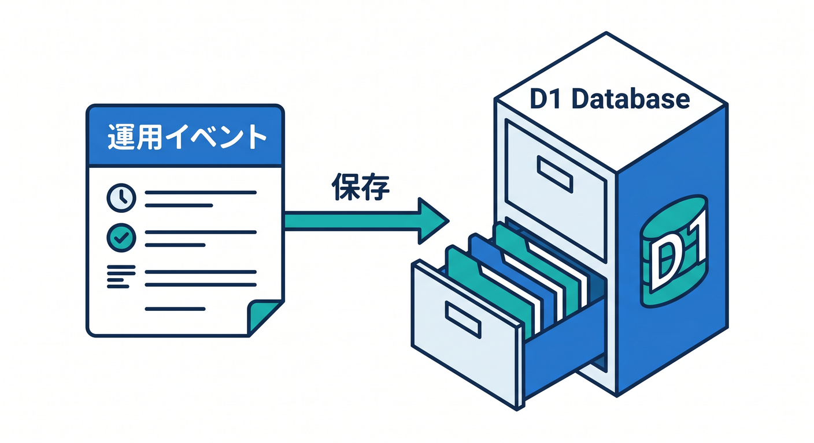
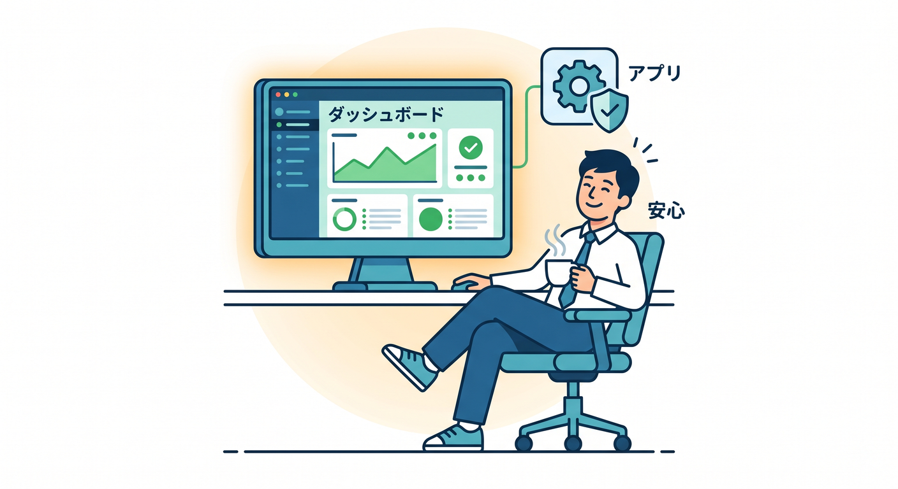

# 第15章：小さな運用ダッシュボードを作ろう 📊

最後は、ここまでの内容を小さな運用ダッシュボードにまとめます。  
作ったアプリを、自分で見守れる状態にするのがゴールです。


---

## 1. ダッシュボードで見るもの 👀

最初は、見る項目を絞ります。

- 今日のAPI件数
- 今日のエラー数
- 平均レスポンス時間
- Queue失敗件数
- AI処理件数
- 最近の障害ログ

全部を表示するより、最初に見るべき数字を並べます。


---

## 2. 全体構成 🧭

構成例です。



```text
React Admin
  ↓
Worker API
  ↓
D1 / Analytics Engine / Queue status
```

管理画面は一般ユーザーに公開せず、認証を必ず入れます。

---

## 3. D1に運用イベントを保存する 🗄️

簡単な運用イベントはD1に保存できます。



```sql
CREATE TABLE app_events (
  id TEXT PRIMARY KEY,
  type TEXT NOT NULL,
  status TEXT NOT NULL,
  created_at TEXT NOT NULL
);
```

本格的な分析はAnalytics EngineやLogpushも検討します。

---

## 4. 本番前チェック 🔐

管理画面には注意が必要です。

- 認証があるか
- 管理者だけ見られるか
- 個人情報を表示しすぎていないか
- ログ保存期間を決めたか
- コストを確認したか
- 監視対象が多すぎないか

運用画面自体も、守るべきアプリの一部です。


---

## 5. 章末チェック ✅

- 運用ダッシュボードで見る項目を選べる
- React + Worker + D1の構成を説明できる
- Analytics EngineやLogpushの発展先が分かる
- 管理画面には認証が必要だと分かる
- 作ったアプリを見守る習慣ができる

この章で覚える一言はこれです。  
**運用ダッシュボードは、アプリを作った後も安心して見守るための画面です 📊**


