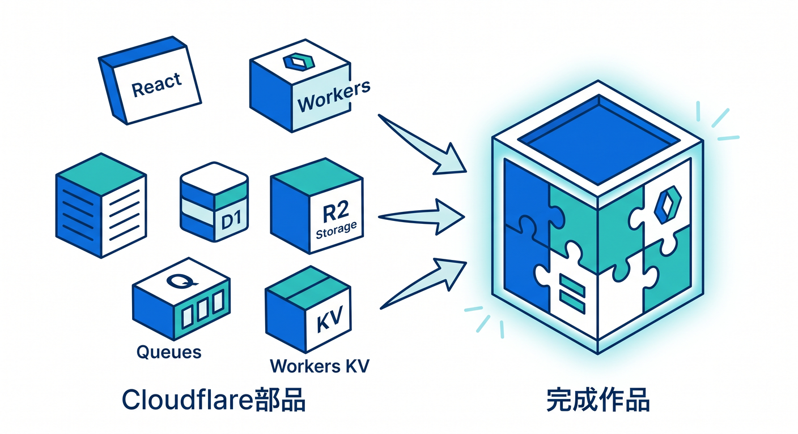
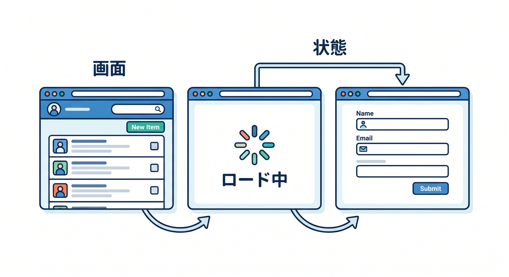
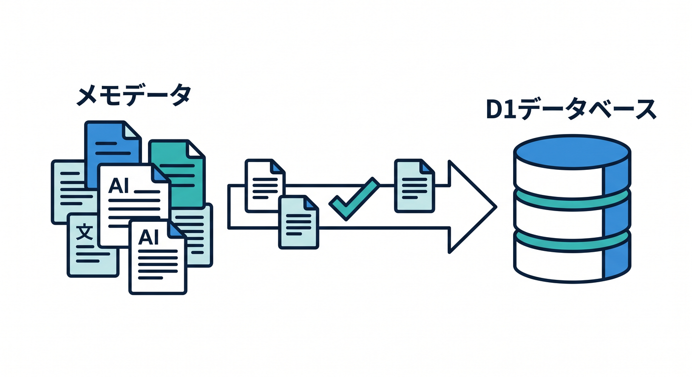
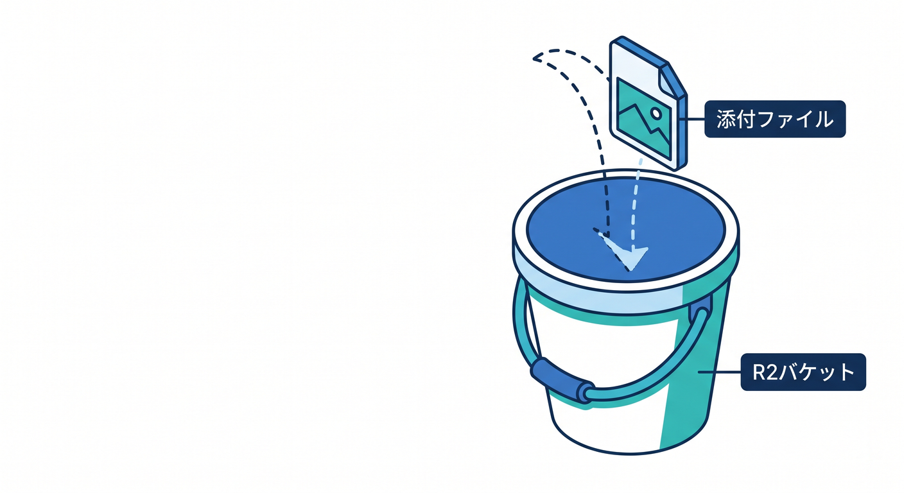
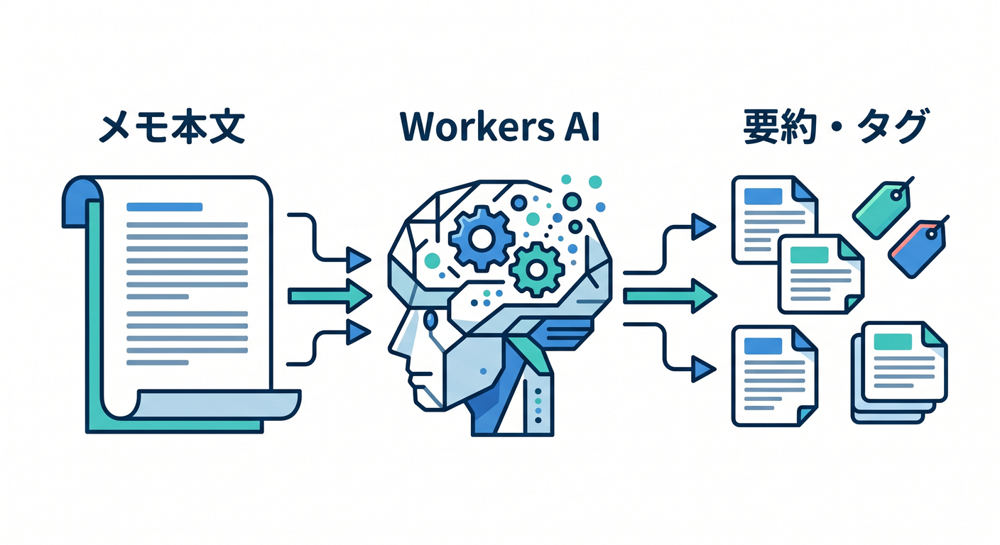
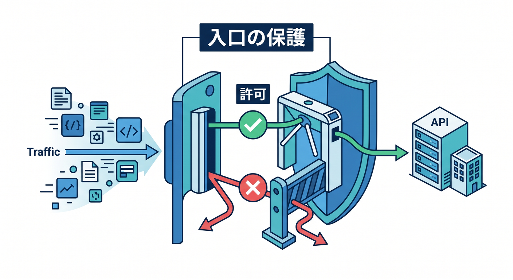
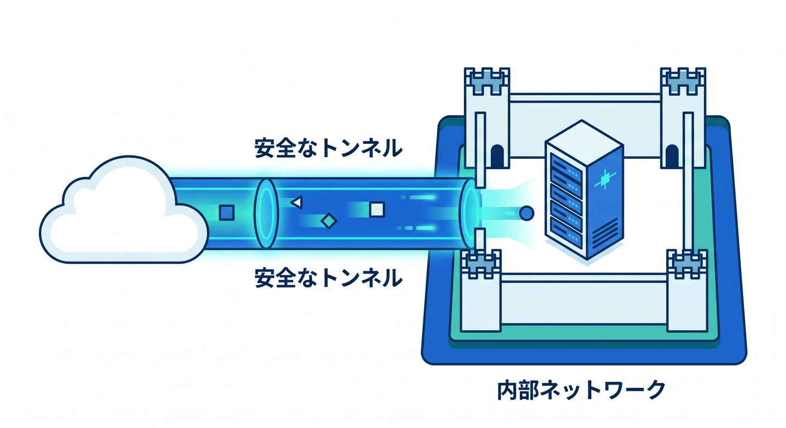

# Cloudflare総仕上げ：作品制作と発展ロードマップ 15章アウトライン 🏁✨

確認日: 2026-04-24  
主な確認先: Cloudflare Workers / Vite plugin / Static assets / D1 / R2 / Workers AI / AI Gateway / Observability / Cloudflare Tunnel / Zero Trust Access / Next.js on Workers / MCP on Workers 公式ドキュメント

## 第1章　ここまでの学びを1本の作品にまとめよう 🏁

最後は、Reactフロント、Workers API、保存機能、AI機能を組み合わせて小さな完成作品を作ります。  
これまで学んだCloudflareの部品を、1つのアプリとしてつなげる章です。  
題材は「AI学習メモ・ドキュメント検索アプリ」にします 📚  
D1、R2、Workers AI、VectorizeやAI Searchの発想、ログ、Rate Limitingまで入れます。  
この章のゴールは、完成作品の全体像を説明できることです ✅

## 第2章　完成作品の要件を決めよう 🧭

最初に、作るものを小さく決めます。  
ユーザーは学習メモを投稿し、AIが要約とタグを作り、あとで検索できます。  
ファイル添付はR2、メタデータはD1、AI処理はWorkers AI、公開はWorkersと独自ドメインを想定します。  
最初から完璧にせず、MVPとして動く範囲を決めます 🌱  
この章のゴールは、作る機能と作らない機能を分けることです。

## 第3章　React画面を設計しよう ⚛️

React側では、メモ一覧、投稿フォーム、詳細画面、AI結果、検索画面を作ります。  
ユーザーが迷わないように、入力、送信中、成功、エラーの状態を丁寧に扱います。  
VS CodeとTypeScriptで型を見ながら、コンポーネントを小さく分けます。  
AI処理中はローディング表示や再試行導線を用意します。  
この章のゴールは、作品として使えるReact画面を組み立てることです。

## 第4章　Workers APIを整理しよう 🌉

WorkerはReactとCloudflareサービスの間に立つAPIです。  
`POST /api/memos`、`GET /api/memos`、`GET /api/memos/:id`、`POST /api/search` のようにrouteを整理します。  
入力チェック、認証の準備、エラーレスポンス、requestId付きログを入れます。  
ReactからD1やR2へ直接触らせず、Workerを入口にします 🔐  
この章のゴールは、作品のAPI設計を説明できることです。

## 第5章　D1でメモとAI結果を保存しよう 🗄️

D1には、メモ本文、タイトル、AI要約、タグ、作成日時、処理状態を保存します。  
migrationsでテーブルを作り、`prepare().bind().run()` で安全に操作します。  
一覧画面用のSELECT、詳細画面用のSELECT、検索結果との連携も考えます。  
AI処理が失敗したときのstatusも保存します 🧯  
この章のゴールは、作品の中心データをD1で管理することです。

## 第6章　R2で添付ファイルを扱おう 🪣

添付画像やPDFはR2へ保存します。  
R2 object keyは、ユーザーID、日付、UUIDを使って管理しやすく作ります。  
D1にはR2 key、ファイル名、Content-Type、サイズなどのメタデータを保存します。  
公開ファイルと非公開ファイルを分け、配信方法を慎重に選びます 🔐  
この章のゴールは、ファイル本体とメタデータを分けて扱えることです。

## 第7章　Workers AIで要約・タグ・クイズを作ろう 🤖

Workers AIで、メモ本文の要約、タグ分類、復習クイズ生成を行います。  
promptは短く具体的にし、JSON形式で返す場合は必ず検証します。  
AI結果はD1へ保存し、失敗時はstatusを `failed` にします。  
prompt全文をログへ出しすぎず、文字数やrequestIdを記録します 📈  
この章のゴールは、AIを作品の便利機能として組み込むことです。

## 第8章　検索を作ろう：まずはD1、発展でVectorize / AI Search 🔎

最初の検索はD1のLIKEやタグ検索で小さく作ります。  
発展として、Workers AIでembeddingを作りVectorizeへ保存し、意味検索へ進みます。  
さらにAI Searchを使うと、managed searchとして自然言語検索を扱いやすくできます。  
検索結果には出典や元メモへのリンクを表示します。  
この章のゴールは、段階的に検索機能を育てることです。

## 第9章　認証・Turnstile・Rate Limitingで入口を守ろう 🔐

作品を公開するなら、入口を守る必要があります。  
AI APIやファイルアップロードはコストや悪用リスクがあるため、Rate LimitingやTurnstileを検討します。  
ログインが必要な機能と、公開してよい機能を分けます。  
将来的にはZero Trust Accessで管理画面を守る発想にもつなげます。  
この章のゴールは、安全に公開するための入口設計を作ることです。

## 第10章　ログ・Observability・障害対応を入れよう 📈

完成作品には、最初からログと観測を入れます。  
Workers Logs、Real-time Logs、Analytics、D1のstatus、QueuesやAI Gatewayのログを見ます。  
requestId、jobId、userId、route、durationMsを構造化ログとして残します。  
障害時の確認手順を小さなrunbookとしてまとめます 🚨  
この章のゴールは、作品を見守れる状態にすることです。

## 第11章　デプロイ・独自ドメイン・本番前チェック 🌐

Wranglerでデプロイし、必要なら独自ドメインやRoutesを設定します。  
環境変数、Secrets、D1/R2 binding、AI binding、compatibility dateを本番用に確認します。  
SSL/TLS、Cache、CORS、エラーページ、404も見ます。  
本番前チェックリストで、壊れやすい点を1つずつ潰します ✅  
この章のゴールは、作品を公開できる品質へ整えることです。

## 第12章　Cloudflare TunnelとZero Trustの次の道 🚇

Cloudflare Tunnelは、公開IPなしでリソースをCloudflareへ安全に接続する仕組みです。  
公式では、`cloudflared` がoutbound-only connectionを作り、HTTPサーバーやSSHなどを安全に接続できると案内されています。  
Zero Trust Accessは、ポリシーで誰がアプリに到達できるかを制御します。  
管理画面、社内ツール、開発中アプリを守る次のステップとして紹介します 🛡️  
この章のゴールは、公開後のセキュアな接続とアクセス制御を理解することです。

## 第13章　Next.js on Workersへ進む道 🧱

React + Workersに慣れたら、Next.js on Workersも発展先になります。  
Cloudflare公式では、Next.jsをWorkersで動かす方法としてOpenNext for Cloudflareが案内されています。  
`nodejs_compat`、compatibility date、assets、`.open-next/worker.js` などの構成を知ります。  
ただし最初はVite + React + Workersで基礎を固めてから進むのがおすすめです。  
この章のゴールは、Next.jsへ進むときの地図を持つことです。

## 第14章　remote MCP server自作へ進む道 🧰

MCPは、AI assistantが外部ツールやデータへ接続するためのプロトコルです。  
Cloudflare公式のLabsやAgents docsでは、Workers上でremote MCP serverを作る流れが案内されています。  
MCP serverは `/mcp` endpointでtoolsを公開し、Cloudflare AccessやOAuthで保護できます。  
学習メモ検索やD1操作をAIから呼べるtoolにする発展例を見ます 🤖  
この章のゴールは、CloudflareでAIツール基盤を作る次の道を知ることです。

## 第15章　卒業制作レビューと発展ロードマップ 🏁

最後に、完成作品をレビューし、次に学ぶ道を整理します。  
コード、UI、API、保存、AI、安全性、ログ、コストをチェックします。  
発展先として、Durable Objectsのリアルタイム機能、Queues/Workflowsの非同期処理、AI Search、Tunnel、Zero Trust、Next.js、MCPを並べます。  
GitHub READMEやポートフォリオ用の説明文も整えます ✨  
この章のゴールは、自分の作品を説明し、次の学習計画を立てられることです。

---

## 参照URL

- https://developers.cloudflare.com/workers/
- https://developers.cloudflare.com/workers/vite-plugin/get-started/
- https://developers.cloudflare.com/workers/static-assets/
- https://developers.cloudflare.com/d1/
- https://developers.cloudflare.com/r2/
- https://developers.cloudflare.com/workers-ai/
- https://developers.cloudflare.com/ai-gateway/
- https://developers.cloudflare.com/workers/observability/
- https://developers.cloudflare.com/cloudflare-one/connections/connect-networks/
- https://developers.cloudflare.com/cloudflare-one/access-controls/policies/
- https://developers.cloudflare.com/workers/framework-guides/web-apps/nextjs/
- https://developers.cloudflare.com/labs/mcp/
- https://developers.cloudflare.com/agents/guides/test-remote-mcp-server/
- https://developers.cloudflare.com/cloudflare-one/access-controls/ai-controls/secure-mcp-servers/
- https://developers.cloudflare.com/agents/model-context-protocol/governance/
