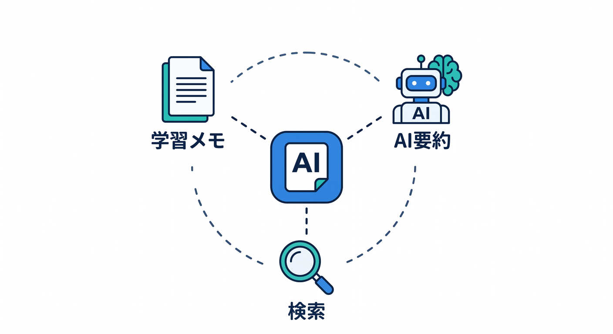
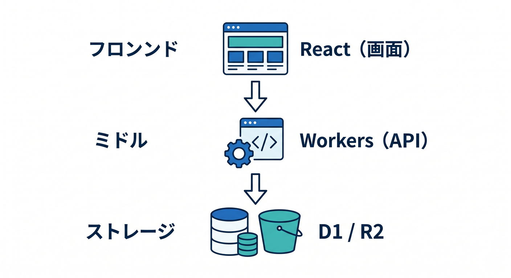
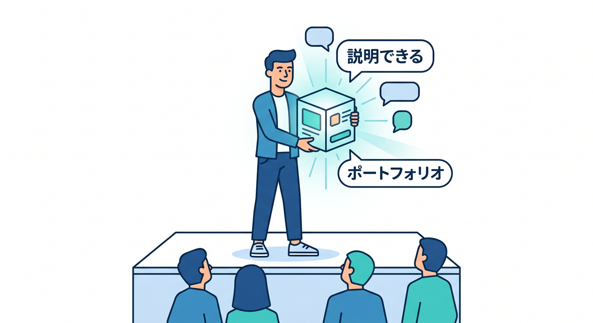
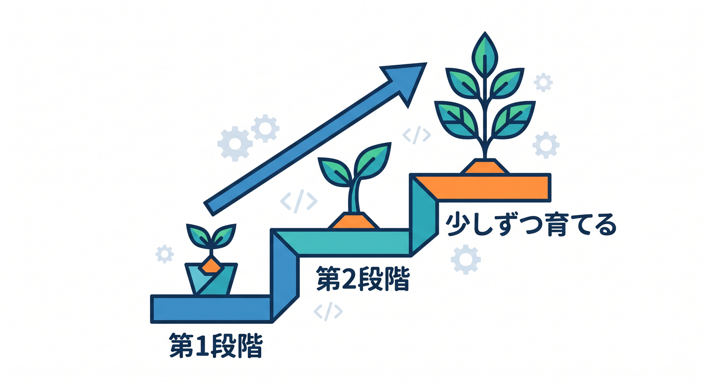
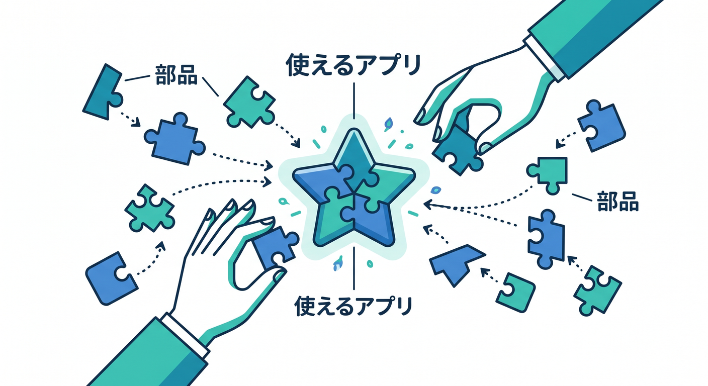

# 第01章：ここまでの学びを1本の作品にまとめよう 🏁

いよいよ総仕上げです。  
ここまで学んだReact、Workers、D1、R2、AI、ログ、安全対策を、1本の作品として組み合わせます 😊

---

## 1. 作る作品 📚



題材は「AI学習メモ・ドキュメント検索アプリ」です。

できることは次の通りです。

- 学習メモを投稿する
- AIが要約する
- AIがタグを付ける
- 添付ファイルを保存する
- メモを検索する
- 管理用にログを見る

小さいですが、Cloudflareの学びをかなり詰め込めます。

---

## 2. 使うCloudflareサービス 🧩



今回の中心です。

```text
React → 画面
Workers → API
D1 → メモとAI結果
R2 → 添付ファイル
Workers AI → 要約・タグ・クイズ
Observability → ログと分析
```

発展でVectorize、AI Search、Queues、Workflowsも足せます。

---

## 3. 完成作品の価値 ✨



この作品ができると、ただのサンプルではなく「説明できるアプリ」になります。

```text
なぜD1を使ったか
なぜR2を使ったか
AIをどこで呼んだか
ログをどう見たか
安全対策をどうしたか
```

ポートフォリオや学習記録にも使いやすいです。

---

## 4. 小さく完成させる 🌱



最初から全部を完璧にしません。

```text
第1段階: メモ投稿と一覧
第2段階: AI要約
第3段階: 添付ファイル
第4段階: 検索
第5段階: ログと公開
```

小さく完成させ、少しずつ育てます。

---

## 5. 章末チェック ✅



- 総仕上げ作品の目的が分かる
- React、Workers、D1、R2、AIの役割を言える
- 小さく完成させる方針が分かる
- 作品として説明する観点が分かる
- 発展先も見えている

この章で覚える一言はこれです。  
**総仕上げでは、Cloudflareの部品を1本の使えるアプリにまとめます 🏁**
