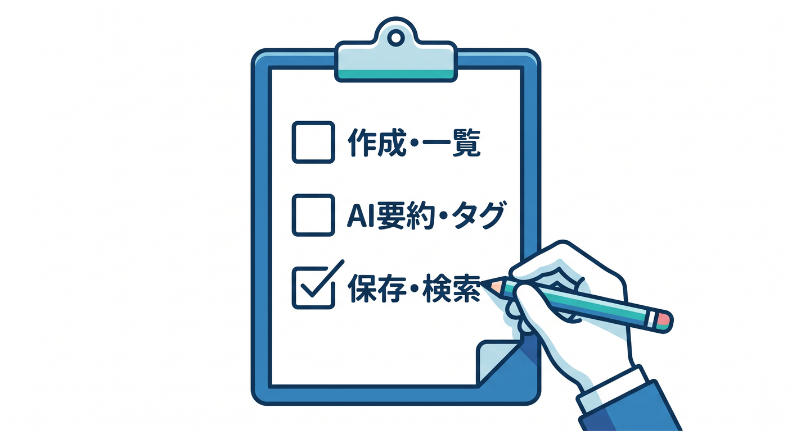
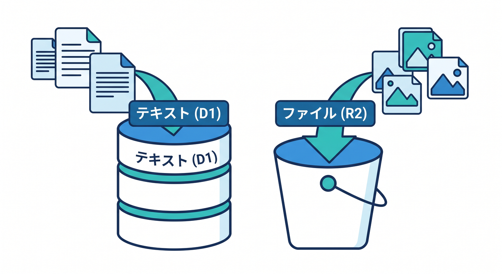
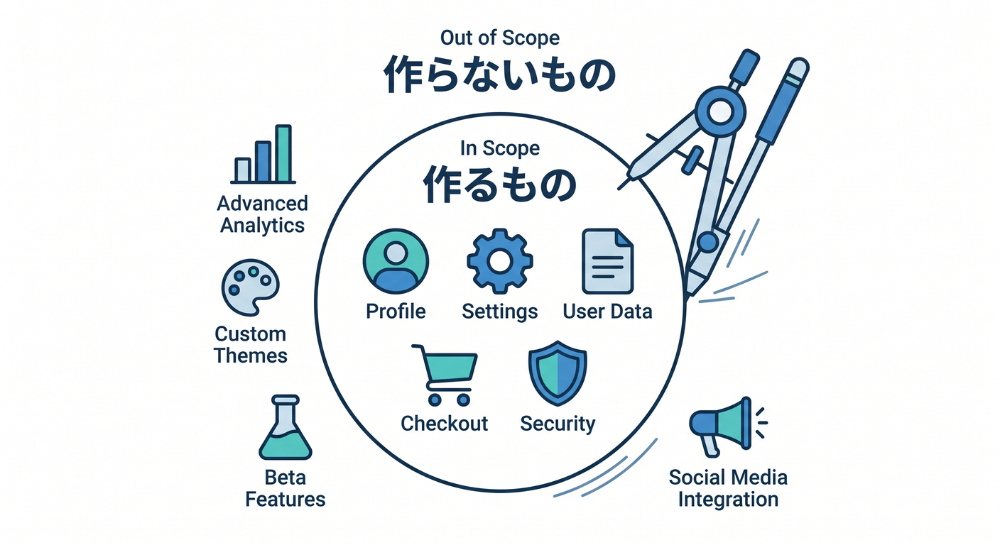

# 第02章：完成作品の要件を決めよう 🧭

作り始める前に、何を作るかを決めます。  
要件を小さく決めると、途中で迷いにくくなります。

---

## 1. MVPを決める 🌱


MVPは、最小限の完成版です。

今回のMVPはこれです。

- メモを作成できる
- メモ一覧を見られる
- メモ詳細を見られる
- AI要約を作れる
- D1に保存できる

最初は添付ファイルや意味検索を後回しにしても大丈夫です。

---

## 2. 作る機能 ✅



最終的には、次を目指します。

```text
メモCRUD
AI要約
AIタグ
復習クイズ
添付ファイル
検索
ログ
公開
```

CRUDはCreate、Read、Update、Deleteのことです。

---

## 3. 作らない機能も決める 🛑


作らないものも決めます。

- 複雑な権限管理
- 課金機能
- リアルタイム共同編集
- 大規模な全文検索
- 完璧な管理画面

総仕上げでは「学習成果をまとめる」ことを優先します。

---

## 4. データの置き場所 🗺️



保存先を決めます。

```text
メモ本文 → D1
AI要約 → D1
タグ → D1
添付ファイル → R2
ファイルメタデータ → D1
```

検索の発展ではVectorizeやAI Searchを検討します。

---

## 5. 章末チェック ✅



- MVPの意味が分かる
- 最初に作る機能を選べる
- 作らない機能を決められる
- D1とR2の役割を分けられる
- 作品の完成ラインを説明できる

この章で覚える一言はこれです。  
**要件は、作るものだけでなく“今は作らないもの”も決めます 🧭**
