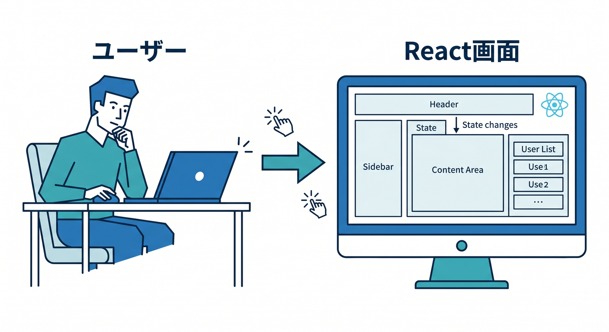
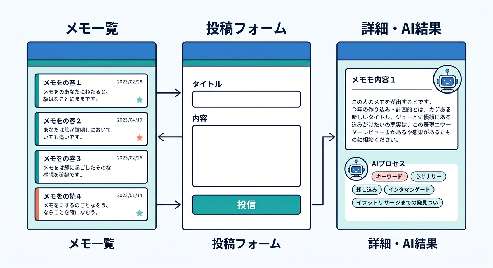
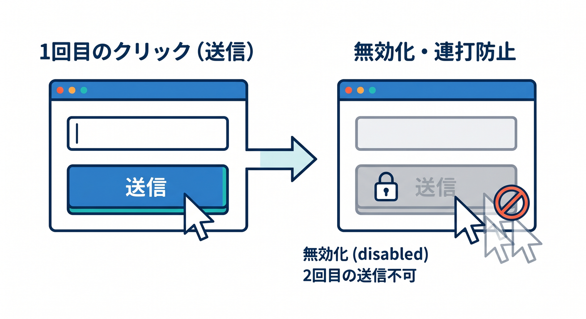
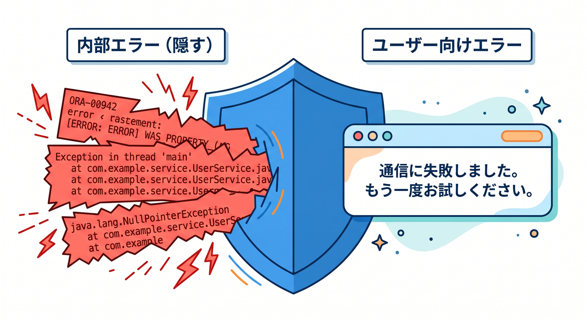
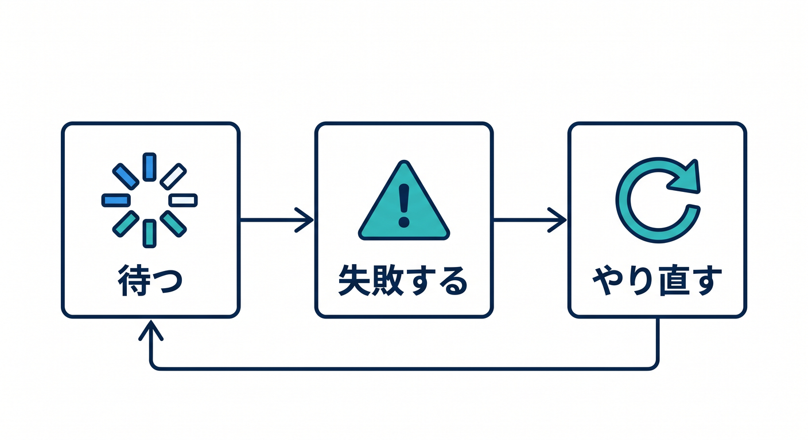

# 第03章：React画面を設計しよう ⚛️

React画面は、ユーザーが作品に触れる場所です。  
機能を詰め込むより、迷わず使える画面にします。



---

## 1. 必要な画面 🧩

最小構成はこれです。

- メモ一覧
- メモ投稿フォーム
- メモ詳細
- AI結果表示
- 検索画面
- エラー表示

最初は1ページ構成でも構いません。



---

## 2. 投稿フォーム ✍️

フォームには、タイトルと本文を入れます。

```ts
type MemoForm = {
  title: string;
  body: string;
};
```

送信中はボタンをdisabledにして、二重送信を防ぎます。



---

## 3. 状態を丁寧に扱う 🧭

Reactでは、状態を用意します。

```ts
const [loading, setLoading] = useState(false);
const [error, setError] = useState("");
const [memos, setMemos] = useState<Memo[]>([]);
```

AI処理は時間がかかることがあるので、ローディング表示が大切です。


---

## 4. エラー表示 🧯

エラーはユーザーに分かる形で出します。

```text
入力が空です
保存に失敗しました
AI要約に失敗しました
もう一度お試しください
```

内部のstack traceやSQLエラーは画面に出しません。



---

## 5. 章末チェック ✅

- 必要な画面を整理できる
- 投稿フォームの状態を設計できる
- loadingとerrorを扱える
- 二重送信を防げる
- ユーザー向けエラーを整えられる

この章で覚える一言はこれです。  
**React画面は、機能だけでなく“待つ・失敗する・やり直す”状態まで設計します ⚛️**


