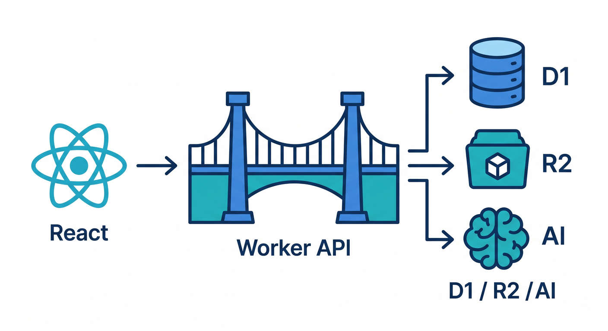
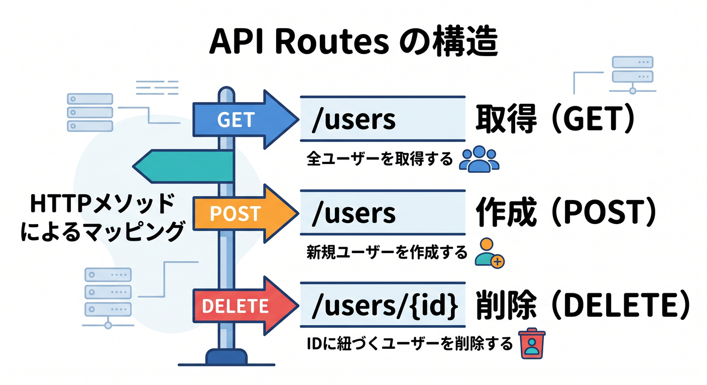
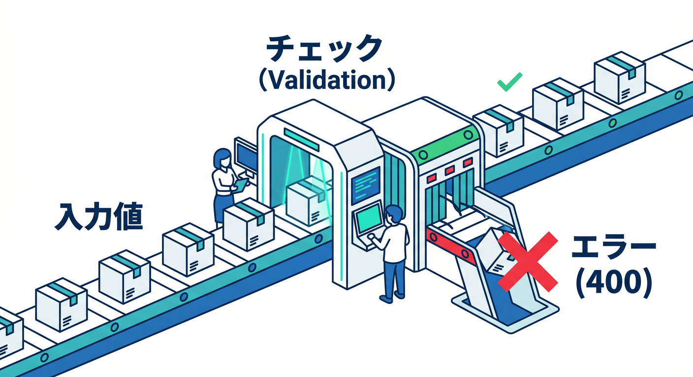
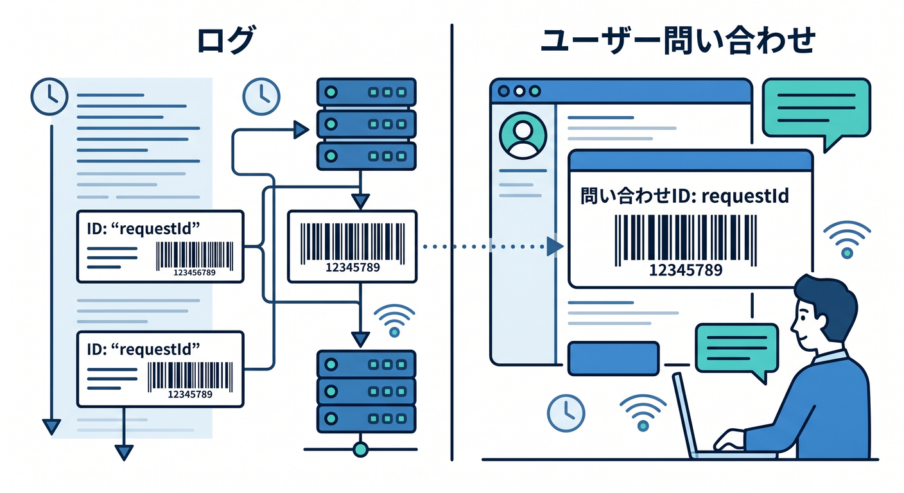
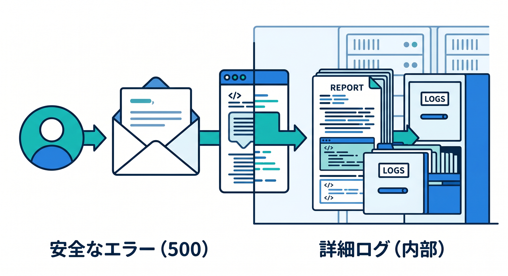
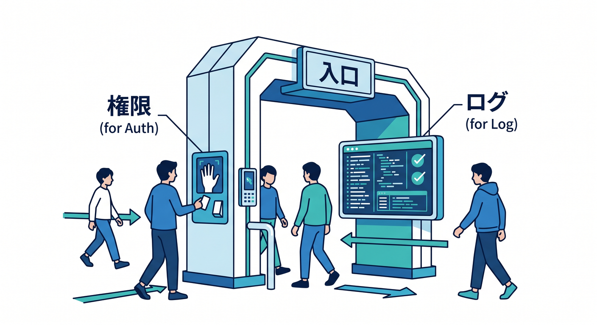

# 第04章：Workers APIを整理しよう 🌉

Workerは、ReactとCloudflareサービスをつなぐ入口です。  
ReactからD1、R2、AIへ直接触らせず、Worker APIに集めます。



---

## 1. API一覧を決める 📋

今回のAPI例です。

```text
GET    /api/memos
POST   /api/memos
GET    /api/memos/:id
DELETE /api/memos/:id
POST   /api/memos/:id/summarize
POST   /api/search
```

routeを先に決めると、React側も作りやすくなります。



---

## 2. 入力チェック 🔐

外から来る値は必ず確認します。

```ts
if (!body.title || body.title.length > 100) {
  return Response.json({ error: "Invalid title" }, { status: 400 });
}

if (!body.body || body.body.length > 5000) {
  return Response.json({ error: "Invalid body" }, { status: 400 });
}
```

AI APIやD1へ渡す前に止めます。



---

## 3. requestIdを付ける 🪪

ログ調査のためにrequestIdを作ります。

```ts
const requestId = crypto.randomUUID();

console.log("request started", {
  requestId,
  path: new URL(request.url).pathname,
});
```

エラー時も同じrequestIdを返すと問い合わせに使えます。



---

## 4. エラーレスポンス 🧯

内部情報を出しすぎない形にします。

```ts
return Response.json(
  { error: "Internal server error", requestId },
  { status: 500 }
);
```

詳しい原因はログで確認します。



---

## 5. 章末チェック ✅

- API routeを整理できる
- Reactから直接D1/R2/AIへ触らせないと分かる
- 入力チェックを入れられる
- requestIdでログを追える
- 安全なエラーレスポンスを返せる

この章で覚える一言はこれです。  
**Worker APIは、アプリの入口として入力・権限・ログをまとめて管理します 🌉**


