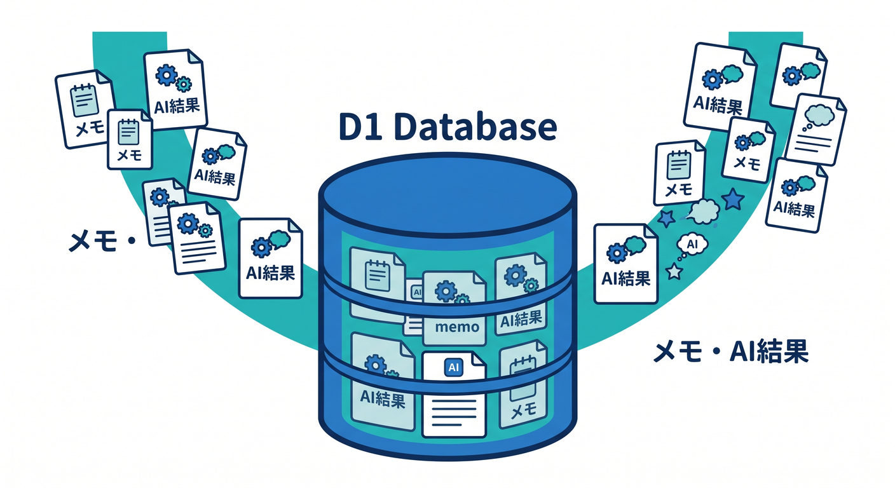
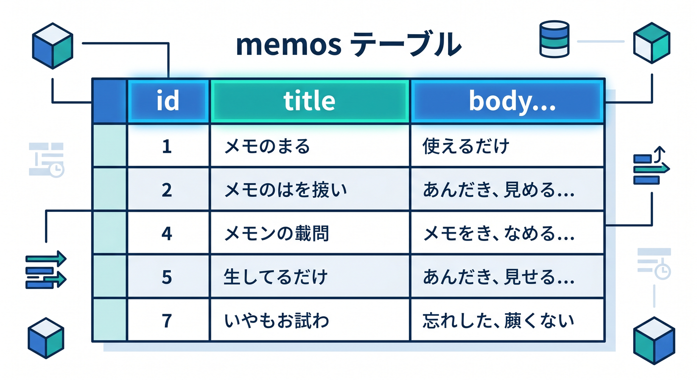
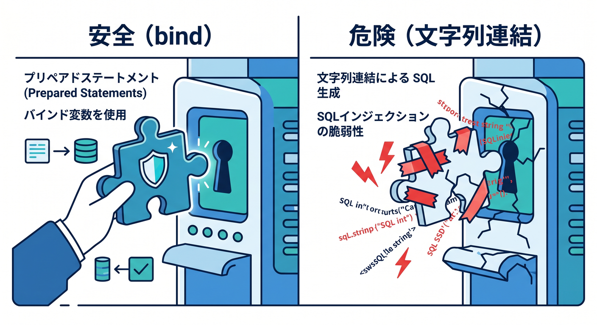
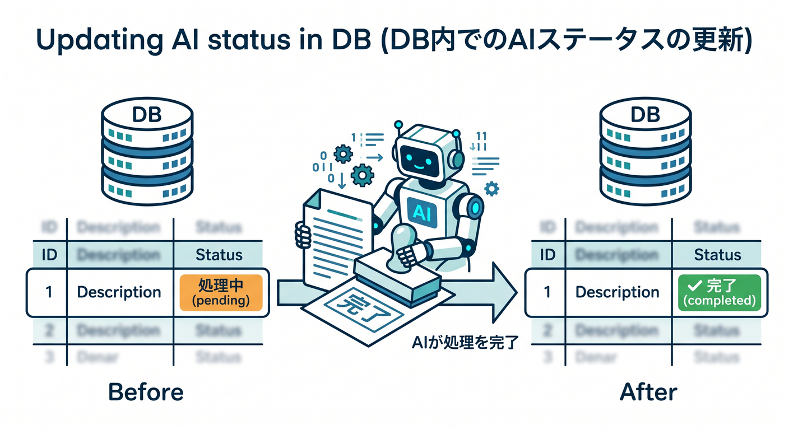

# 第05章：D1でメモとAI結果を保存しよう 🗄️

D1は、今回の作品の中心データを保存する場所です。  
メモ本文、AI要約、タグ、処理状態を管理します。



---

## 1. テーブル設計 🧱

最小のテーブル例です。

```sql
CREATE TABLE memos (
  id TEXT PRIMARY KEY,
  title TEXT NOT NULL,
  body TEXT NOT NULL,
  summary TEXT,
  tags TEXT,
  ai_status TEXT NOT NULL DEFAULT 'pending',
  created_at TEXT NOT NULL,
  updated_at TEXT NOT NULL
);
```

`tags` は最初はJSON文字列でもよいです。



---

## 2. INSERTする ✍️

WorkerからD1へ保存します。

```ts
await env.DB.prepare(
  `INSERT INTO memos (id, title, body, ai_status, created_at, updated_at)
   VALUES (?, ?, ?, ?, ?, ?)`
)
  .bind(id, title, body, "pending", now, now)
  .run();
```

文字列連結でSQLを作らず、`bind()` を使います。



---

## 3. 一覧を取得する 📋

一覧では本文を全部返さず、必要な情報だけ返します。

```sql
SELECT id, title, summary, tags, ai_status, created_at
FROM memos
ORDER BY created_at DESC
LIMIT 50;
```

画面に必要な量だけ返すのが基本です。


---

## 4. AI結果を更新する 🤖

AI要約ができたらD1を更新します。

```ts
await env.DB.prepare(
  `UPDATE memos
   SET summary = ?, tags = ?, ai_status = ?, updated_at = ?
   WHERE id = ?`
)
  .bind(summary, JSON.stringify(tags), "completed", now, memoId)
  .run();
```

失敗時は `failed` にして、画面で再試行できるようにします。



---

## 5. 章末チェック ✅

- D1にメモとAI結果を保存できる
- migrationsでテーブルを作る発想が分かる
- `bind()` で安全にSQLを実行できる
- 一覧用と詳細用で返す情報を分けられる
- AI処理状態をD1で管理できる

この章で覚える一言はこれです。  
**D1は、メモ本文とAI処理結果を管理する作品の中心データベースです 🗄️**


