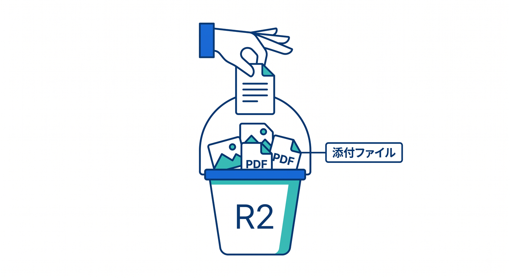
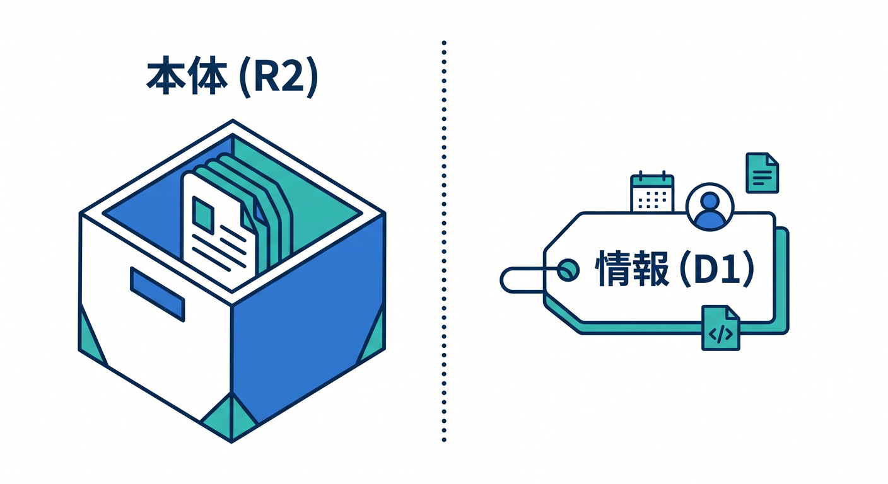
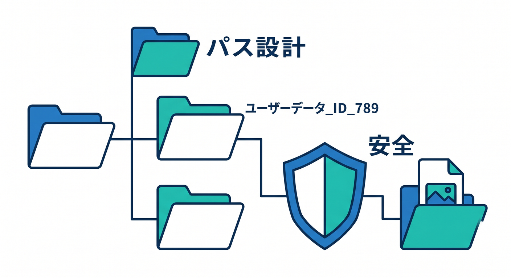
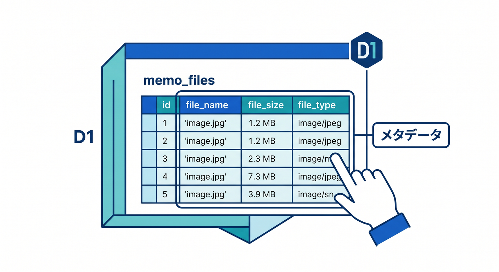
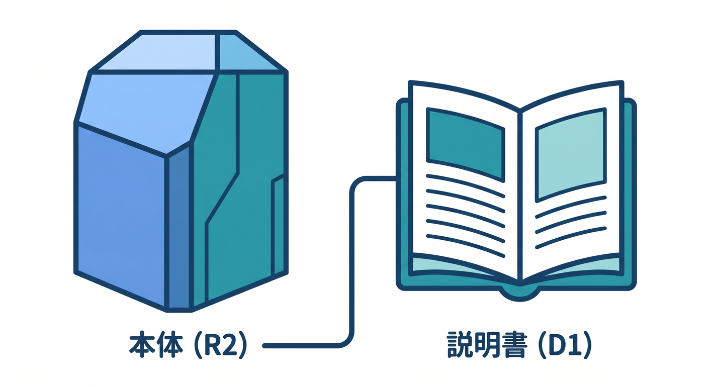

# 第06章：R2で添付ファイルを扱おう 🪣



メモに画像やPDFを添付したい場合、ファイル本体はR2へ置きます。  
D1にはファイル名やR2 keyなどのメタデータを保存します。

---

## 1. 役割分担 🗺️



ファイル本体と情報を分けます。

```text
ファイル本体 → R2
ファイル名・サイズ・Content-Type → D1
```

D1に大きなファイルを入れないのが基本です。

---

## 2. R2 keyを設計する 🏷️



管理しやすいkeyを作ります。

```text
memos/2026/04/{memoId}/{fileId}.pdf
```

個人情報をそのままkeyに入れないようにします。

---

## 3. Worker経由で保存する 📤


Reactから直接何でもR2へ入れず、Workerで確認します。

```text
React
  ↓ upload
Worker
  ↓ Content-Type / size check
R2
```

サイズ、拡張子、Content-Typeをチェックします。

---

## 4. D1にメタデータを保存する 🗄️



添付ファイル用テーブル例です。

```sql
CREATE TABLE memo_files (
  id TEXT PRIMARY KEY,
  memo_id TEXT NOT NULL,
  r2_key TEXT NOT NULL,
  file_name TEXT NOT NULL,
  content_type TEXT NOT NULL,
  size INTEGER NOT NULL,
  created_at TEXT NOT NULL
);
```

検索や一覧はD1、配信はR2という分け方です。

---

## 5. 章末チェック ✅



- ファイル本体はR2へ置くと分かる
- メタデータはD1へ置くと分かる
- 安全なR2 keyを設計できる
- Workerでアップロード前チェックをする
- 公開ファイルと非公開ファイルを分けて考えられる

この章で覚える一言はこれです。  
**R2は添付ファイルの本体、D1はその説明書を持つ場所です 🪣**
