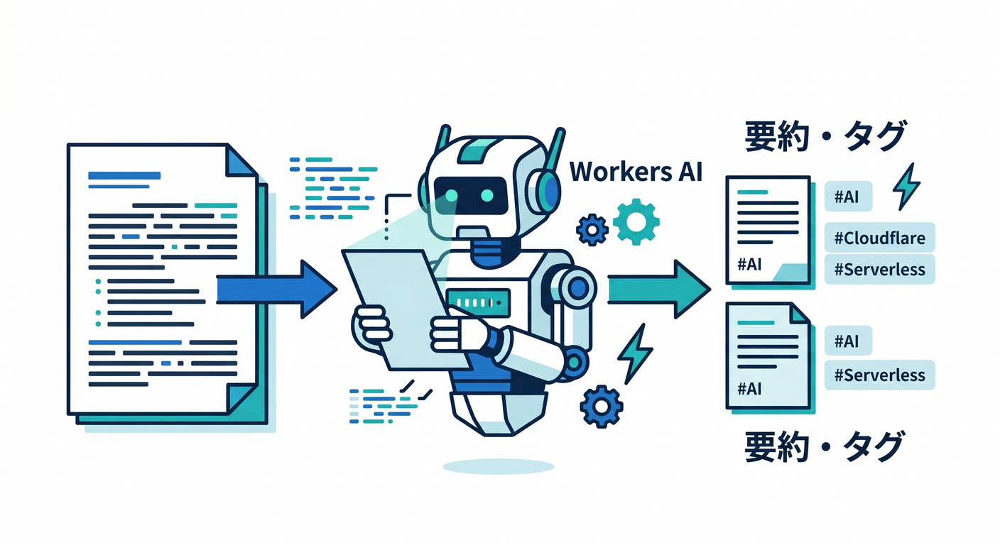
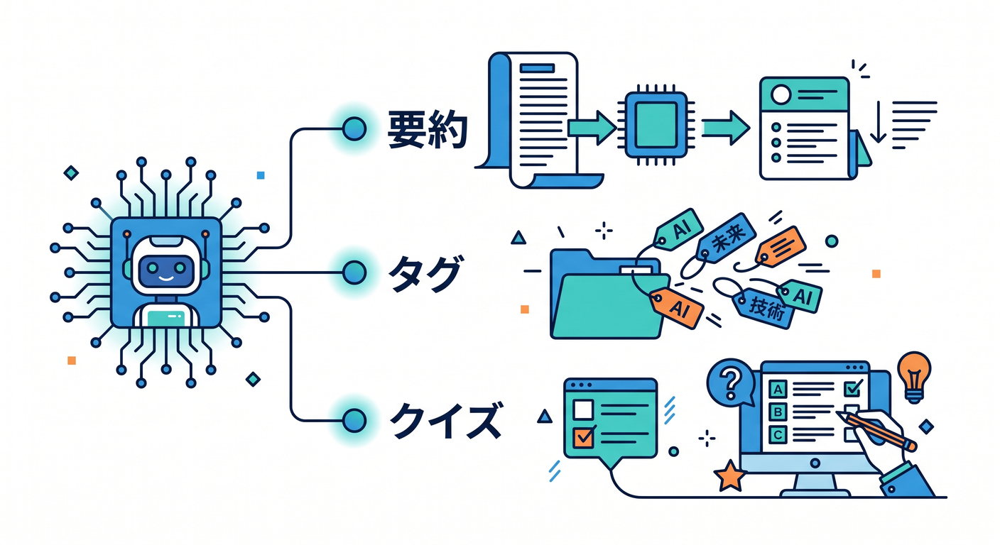
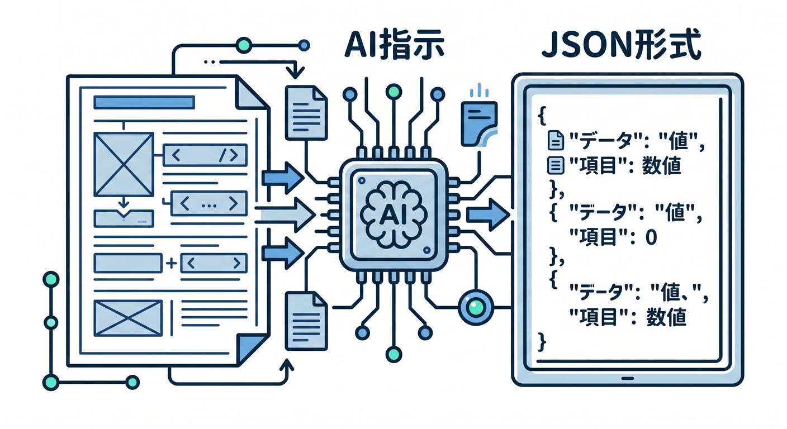
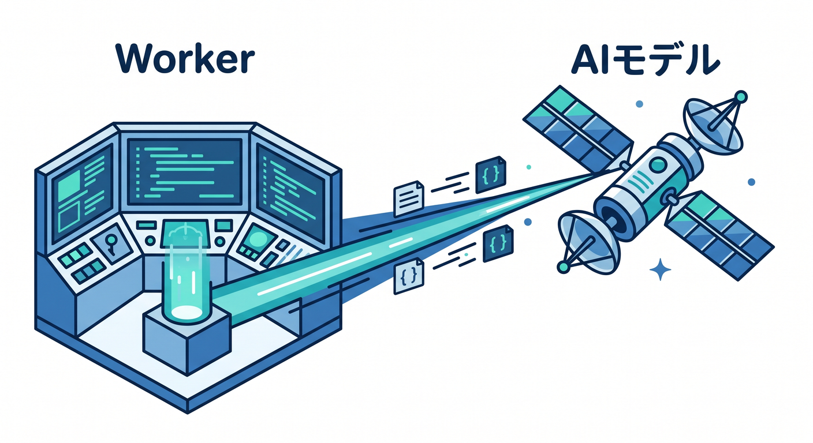
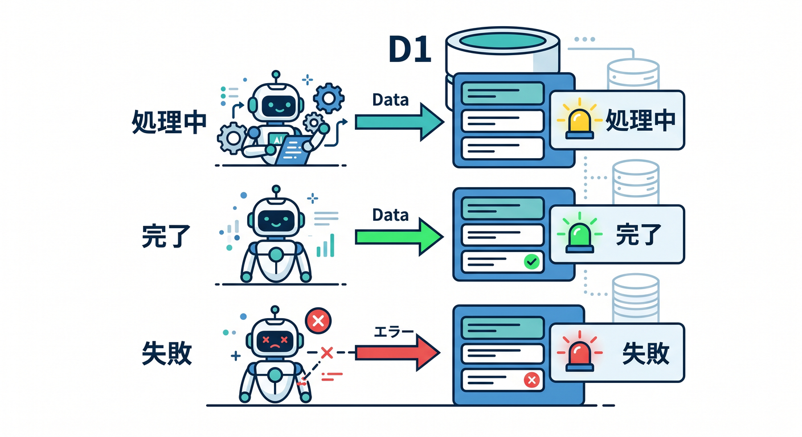
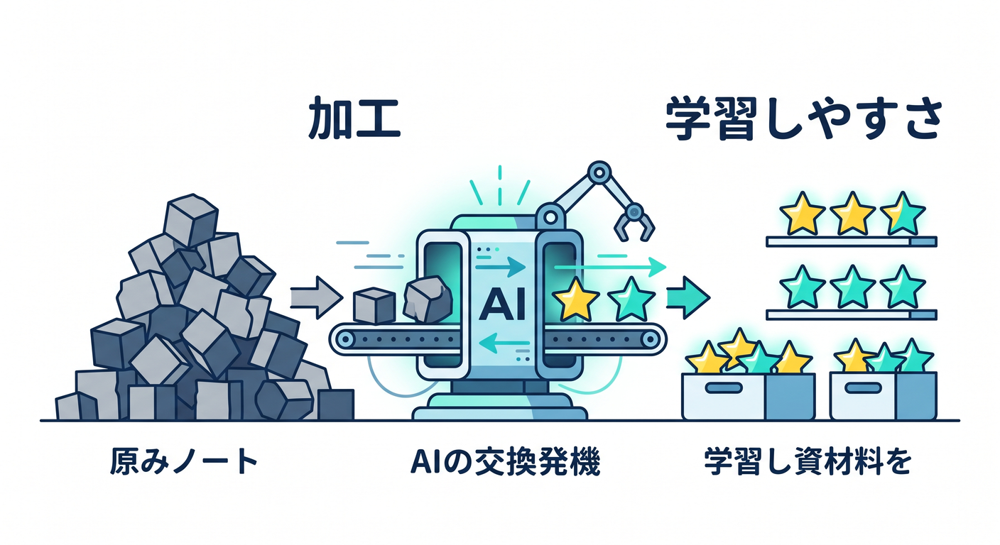

# 第07章：Workers AIで要約・タグ・クイズを作ろう 🤖



メモを保存できたら、Workers AIで便利機能を足します。  
要約、タグ分類、復習クイズ生成は、学習メモアプリと相性がよいです。

---

## 1. AIで作るもの ✨



今回のAI機能です。

- 3行要約
- タグ3つ
- 復習クイズ3問

ユーザーがメモを見返しやすくなります。

---

## 2. promptを作る 🧠



出力形式を決めます。

```text
次の学習メモをもとに、JSONだけで返してください。
{
  "summary": "3行以内の要約",
  "tags": ["タグ1", "タグ2", "タグ3"],
  "quiz": ["問題1", "問題2", "問題3"]
}
```

AI出力は必ず検証します。

---

## 3. Workers AIを呼ぶ 🔌



Workerから呼びます。

```ts
const result = await env.AI.run("@cf/meta/llama-3.1-8b-instruct", {
  prompt,
});
```

モデル名は公式Model Catalogで確認して選びます。

---

## 4. D1へ保存する 🗄️



AI結果をD1へ反映します。

```text
ai_status: processing
ai_status: completed
ai_status: failed
```

失敗してもメモ本体は残るようにします。

---

## 5. 章末チェック ✅



- Workers AIで要約・タグ・クイズを作れる
- promptでJSON形式を指定できる
- AI出力を検証する必要がある
- 結果をD1へ保存できる
- AI失敗時のstatusを管理できる

この章で覚える一言はこれです。  
**Workers AIは、保存したメモを“学びやすい形”へ加工する役割にできます 🤖**
