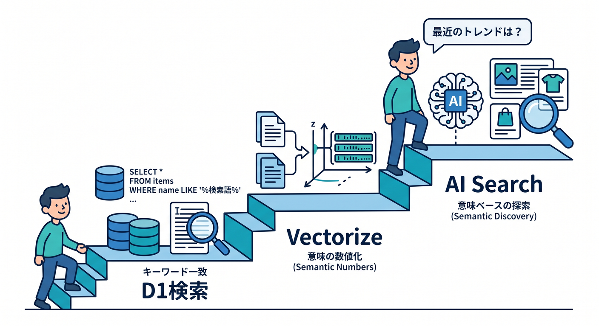
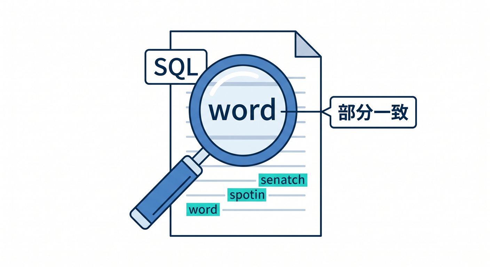
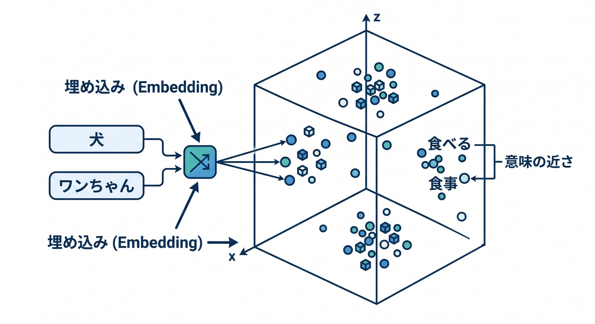
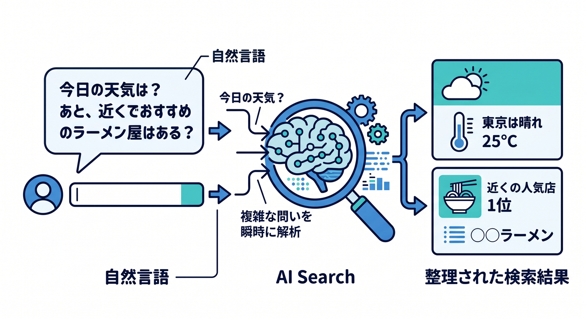
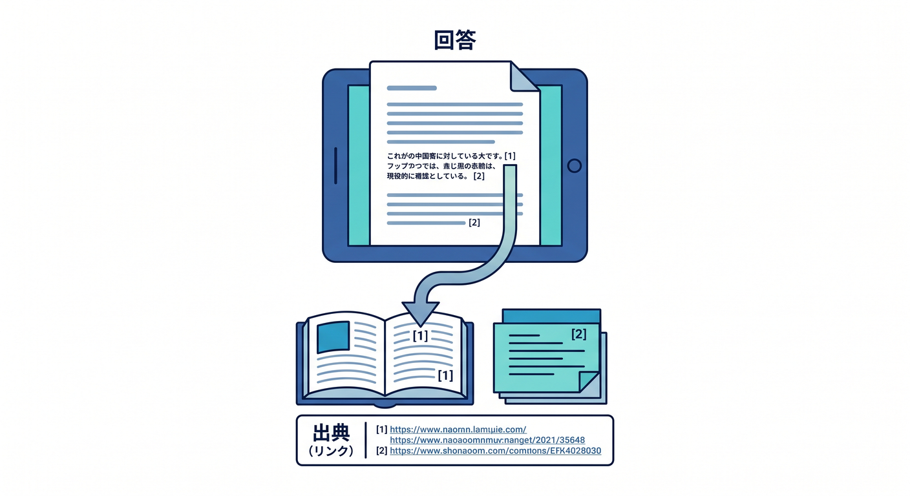
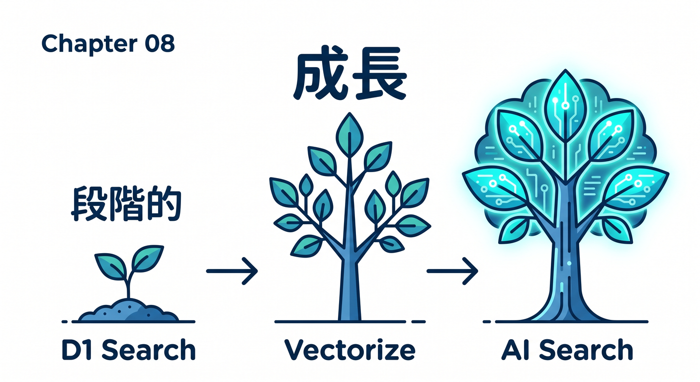

# 第08章：検索を作ろう：まずはD1、発展でVectorize / AI Search 🔎



メモが増えると、検索したくなります。  
最初はD1で小さく作り、発展でVectorizeやAI Searchへ進みます。

---

## 1. D1検索から始める 🌱



最初はタイトルやタグで検索します。

```sql
SELECT id, title, summary, tags
FROM memos
WHERE title LIKE ? OR tags LIKE ?
ORDER BY created_at DESC
LIMIT 20;
```

完全な検索エンジンではありませんが、学習には十分です。

---

## 2. 意味検索へ進む 🧠



「同じ単語はないけど意味が近い」検索にはVectorizeが向いています。

```text
メモ本文 → Workers AIでembedding → Vectorizeへ保存
質問 → embedding → Vectorize query
```

これで意味が近いメモを探せます。

---

## 3. AI Searchへの発展 🔍



AI Searchは、managed searchとして自然言語検索を扱える発展先です。  
自前でchunk分割やindex更新を作る負担を減らせます。

```text
小規模・学習 → D1検索
意味検索を学ぶ → Vectorize
実用検索基盤 → AI Search
```

段階的に選びます。

---

## 4. 出典を表示する 📚



AI検索では、出典表示が大切です。

```text
回答
参考にしたメモ
作成日
リンク
```

ユーザーが元データを確認できるようにします。

---

## 5. 章末チェック ✅



- 最初はD1検索で始められる
- Vectorizeで意味検索へ進める
- AI Searchが発展先だと分かる
- 検索結果に出典を表示できる
- 段階的に検索機能を育てられる

この章で覚える一言はこれです。  
**検索はD1から始め、必要に応じてVectorizeやAI Searchへ育てます 🔎**
