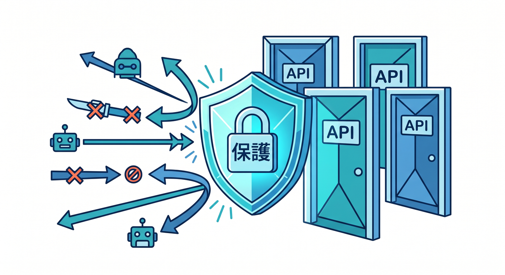
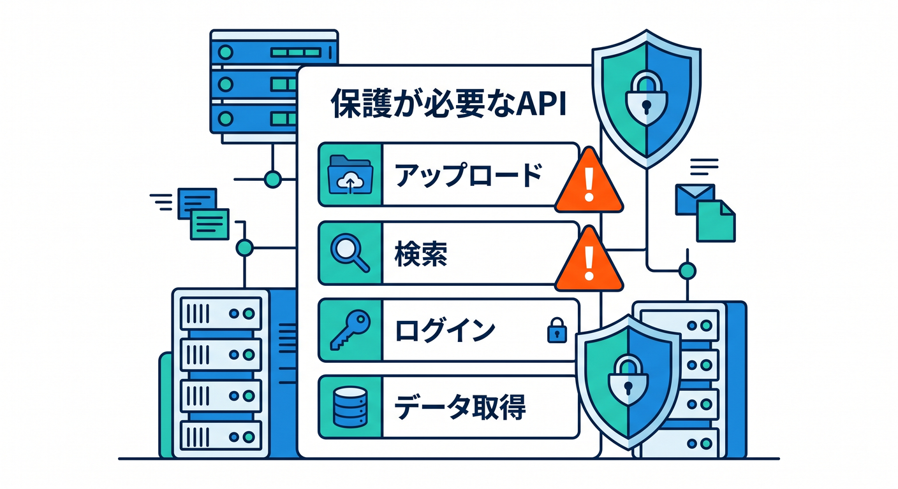
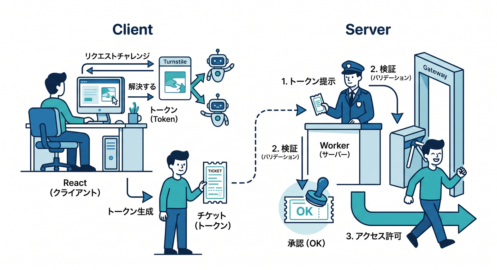
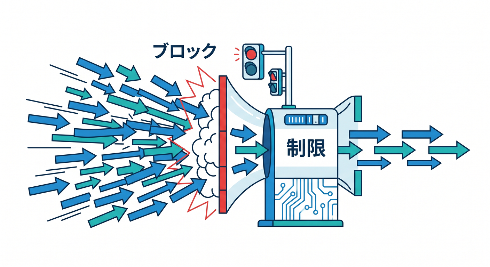
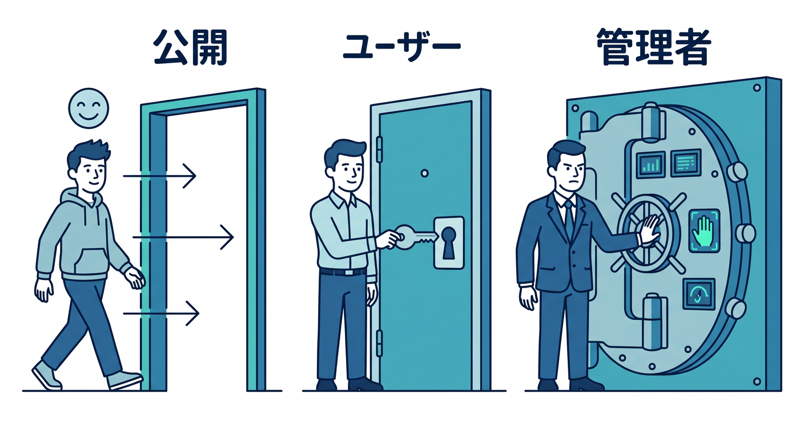
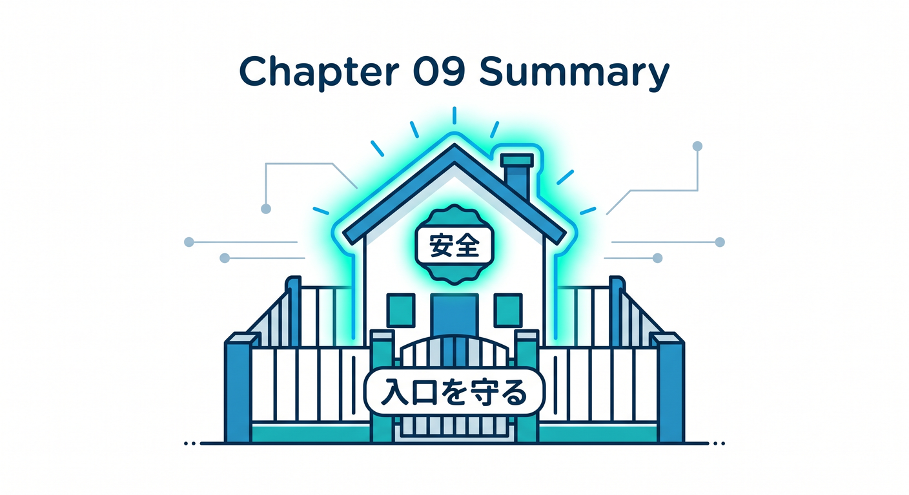

# 第09章：認証・Turnstile・Rate Limitingで入口を守ろう 🔐



作品を公開すると、いろいろな人やbotがアクセスできます。  
AI APIやアップロード機能は特に入口を守る必要があります。

---

## 1. 守りたい入口 🚪



特に注意するAPIです。

- メモ投稿
- ファイルアップロード
- AI要約
- 検索
- 管理画面

コストがかかる処理や、データを書き換える処理は守ります。

---

## 2. Turnstile 🛡️



フォームのbot対策にはTurnstileが候補です。

```text
Reactでtoken取得
  ↓
Workerでserver-side validation
  ↓
OKなら処理
```

AI要約や問い合わせフォームと相性がよいです。

---

## 3. Rate Limiting 🚦



短時間に大量アクセスされるのを防ぎます。

```text
1分に何回まで
1IPに何回まで
特定routeだけ制限
```

AI APIやアップロードAPIは、Rate Limitingを検討します。

---

## 4. 認証の発展 🪪



個人メモを扱うなら、ログインやユーザー管理が必要です。  
学習段階では簡易的な管理画面制限から始め、発展でZero Trust Accessも考えます。

```text
公開ページ → 誰でも
自分のメモ → 認証ユーザー
管理画面 → 管理者だけ
```

---

## 5. 章末チェック ✅



- 守るべきAPIを選べる
- Turnstileの流れが分かる
- Rate Limitingの使いどころが分かる
- 公開機能と認証機能を分けられる
- AI APIはコスト面でも守ると分かる

この章で覚える一言はこれです。  
**公開する作品は、便利な入口ほどしっかり守ります 🔐**
