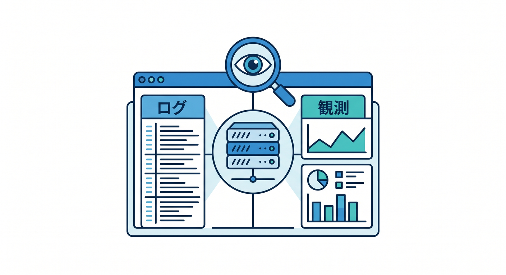
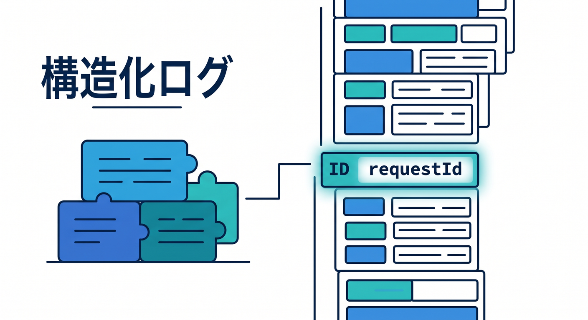
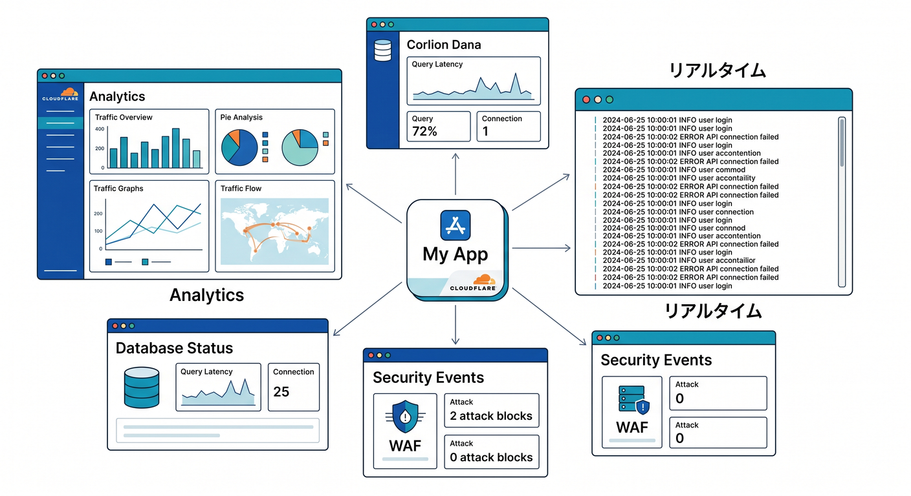
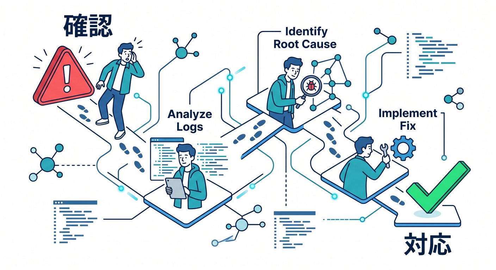
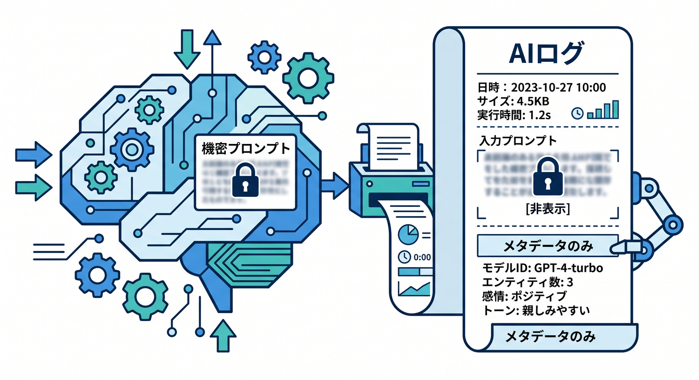
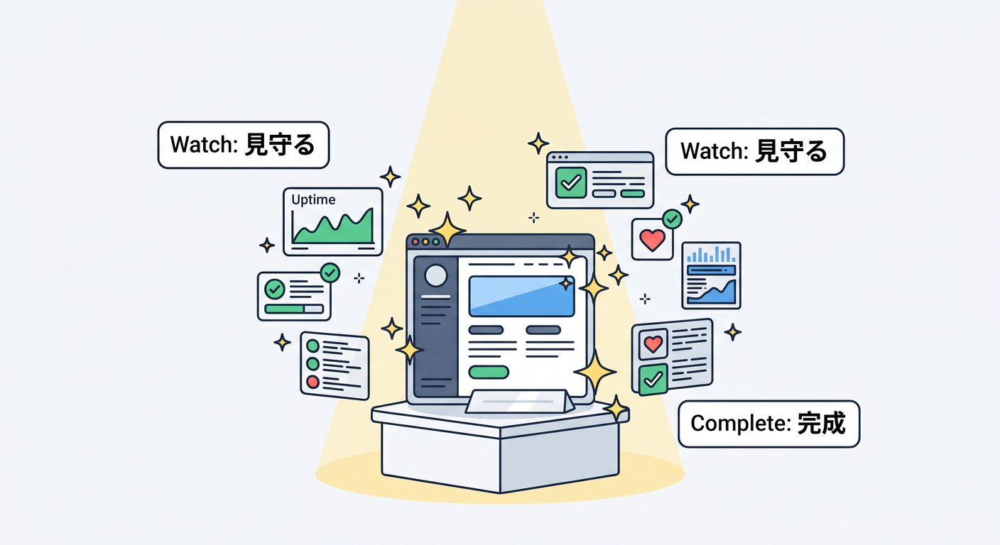

# 第10章：ログ・Observability・障害対応を入れよう 📈



完成作品には、最初からログと観測を入れます。  
動いている状態を見られると、公開後も落ち着いて対応できます。

---

## 1. 構造化ログ 🧱



requestId付きでログを出します。

```ts
console.log("memo created", {
  requestId,
  memoId,
  route: "/api/memos",
  durationMs,
});
```

本文やsecretは出しすぎません。

---

## 2. 見る場所 👀



運用で見る場所です。

- Workers Logs
- Real-time Logs
- Workers Analytics
- AI Gateway Analytics
- D1のstatus
- QueueやWorkflowの状態

まず全体を見てから、個別ログへ進みます。

---

## 3. 障害対応の順番 🚨



小さなrunbookを作ります。

```text
1. 影響範囲を見る
2. エラー率を見る
3. 直近デプロイを見る
4. 外部AIやR2/D1を見る
5. requestIdでログを見る
```

順番を決めると慌てにくいです。

---

## 4. AI処理のログ 🤖



AI処理では、次を記録します。

```text
requestId
memoId
model
promptLength
durationMs
status
```

prompt全文や個人情報は避けます。

---

## 5. 章末チェック ✅



- requestId付きログを書ける
- Workers LogsやAnalyticsを見ると分かる
- AI Gatewayの観測も使える
- 障害対応の順番を説明できる
- prompt全文をログへ出しすぎない

この章で覚える一言はこれです。  
**作品は、作るだけでなく“見守れる状態”にして完成です 📈**
