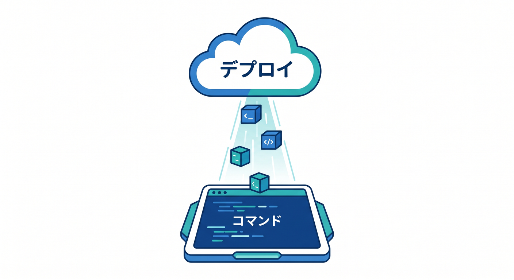
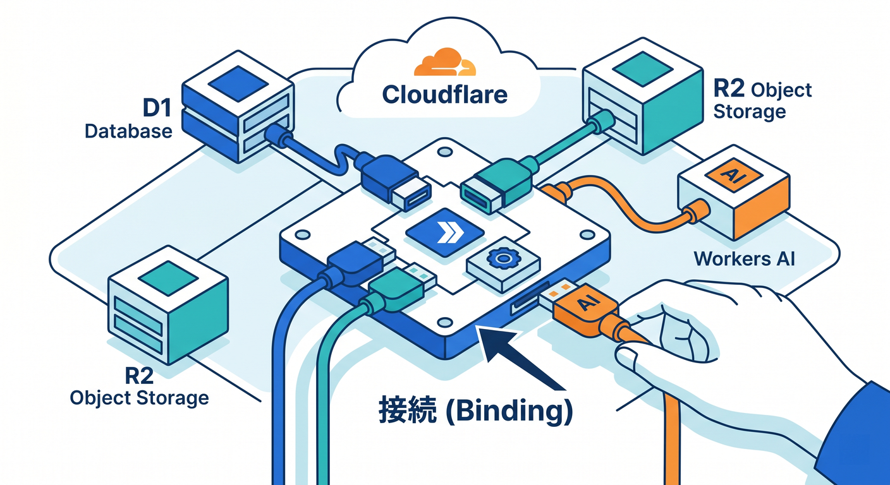
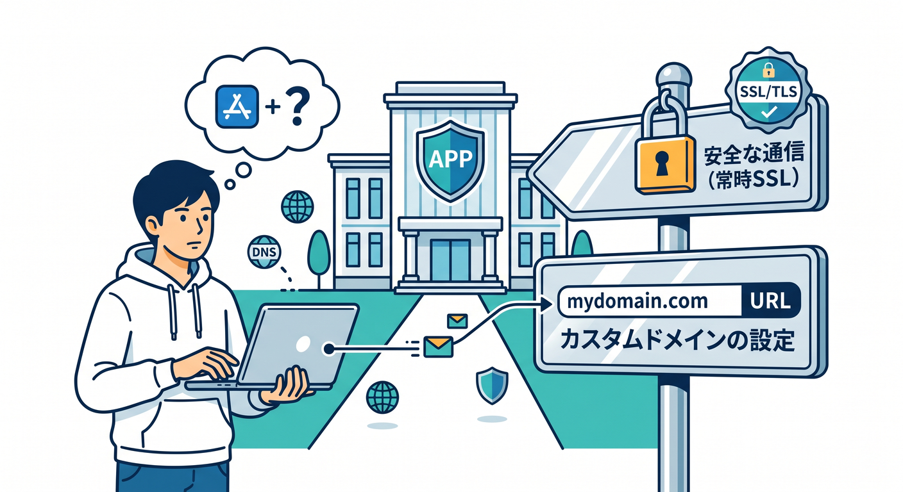
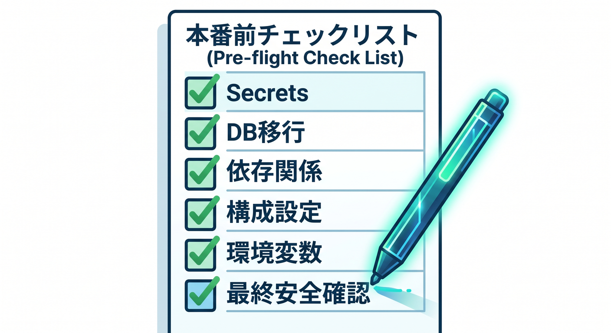

# 第11章：デプロイ・独自ドメイン・本番前チェック 🌐


作品が動いたら、公開準備をします。  
デプロイ前には、設定や安全面を丁寧に確認します。

---

## 1. wrangler deploy 🚀



WorkersはWranglerでデプロイします。

```powershell
npx wrangler deploy
```

デプロイ前に `wrangler.jsonc` のbindingを確認します。

---

## 2. binding確認 ⚙️



必要なbindingを確認します。

```text
D1 DB
R2 bucket
AI binding
KVやVectorize
Secrets
Observability
```

ローカルでは動いたのに本番で動かない原因は、binding漏れが多いです。

---

## 3. 独自ドメイン 🌍



公開するなら、独自ドメインやRoutesを設定します。  
SSL/TLS、Cache、CORS、404ページも確認します。

```text
React静的ファイル
API route
custom domain
SSL/TLS
```

どのURLが何を返すかを整理します。

---

## 4. 本番前チェック ✅



確認リストです。

- Secretsを設定した
- `.dev.vars` を公開していない
- D1 migrationsを適用した
- R2 bucketが正しい
- AI使用量とlimitsを確認した
- Rate Limitingを検討した
- ログに個人情報を出していない

チェックリストで漏れを減らします。

---

## 5. 章末チェック ✅


- `wrangler deploy` で公開できる
- binding漏れを確認できる
- 独自ドメインやRoutesを意識できる
- SecretsやD1 migrationsを確認できる
- 本番前チェックリストを使える

この章で覚える一言はこれです。  
**本番公開は、デプロイコマンドよりも事前チェックが大切です 🌐**
