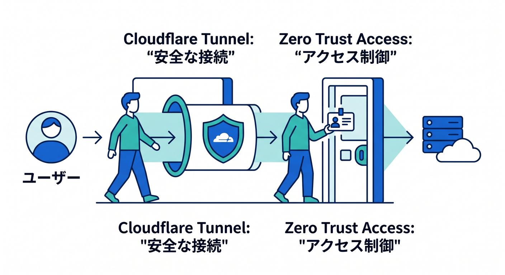
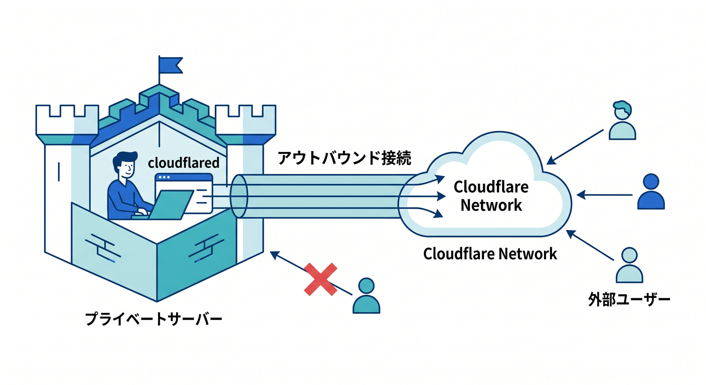
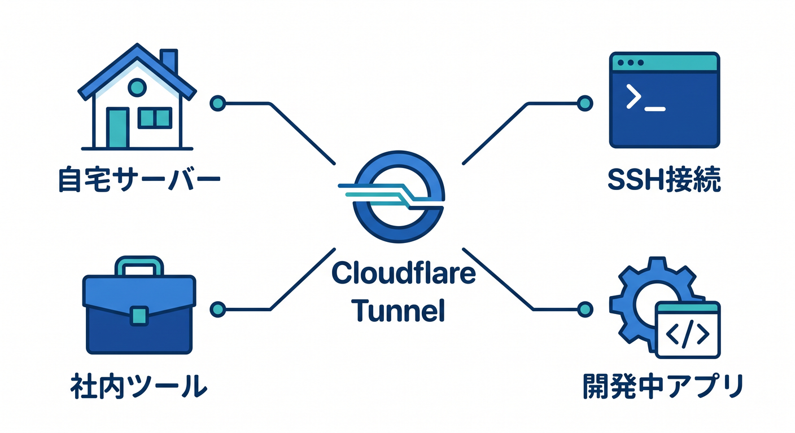
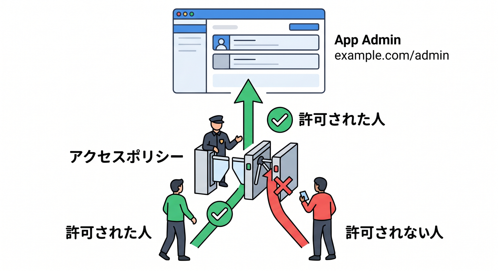
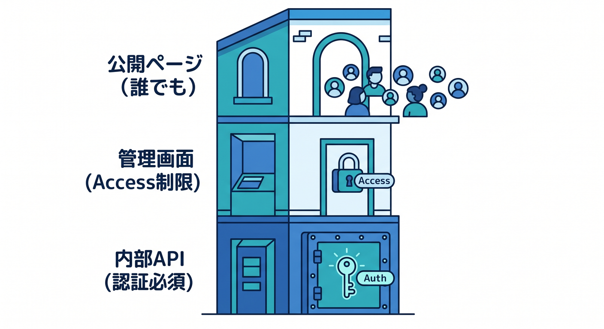

# 第12章：Cloudflare TunnelとZero Trustの次の道 🚇

作品公開の次には、安全な接続やアクセス制御を学ぶ道があります。  
Cloudflare TunnelとZero Trust Accessは、その代表です。



---

## 1. Cloudflare Tunnelとは 🚇

Cloudflare Tunnelは、公開IPなしでリソースをCloudflareへ安全に接続する仕組みです。  
公式ドキュメントでは、`cloudflared` がCloudflare global networkへoutbound-only connectionを作ると案内されています。

```text
private server
  ↓ cloudflared outbound
Cloudflare
  ↓
users
```

外から直接originへ入らせない構成にできます。



---

## 2. 何に使う？ 🧭

Tunnelは次の用途に使えます。

- 自宅サーバーのWebアプリ公開
- SSHへの安全な接続
- 社内ツールの公開
- 開発中アプリの共有
- origin IPを隠した公開

公開ポートを減らせるのが大きな利点です。



---

## 3. Zero Trust Access 🛡️

Accessは、誰がアプリに到達できるかをpolicyで決める仕組みです。

```text
example.com/admin
  ↓
Access policy
  ↓
許可された人だけ通す
```

管理画面や社内ツールを守るのに向いています。



---

## 4. 総仕上げ作品での使い方 🔐

作品の管理画面をAccessで守る発想があります。

```text
公開ページ → 誰でも
管理画面 → Accessで制限
内部API → 認証必須
```

小さな作品でも、公開範囲を分ける練習になります。



---

## 5. 章末チェック ✅

- Tunnelは公開IPなしの安全な接続だと分かる
- `cloudflared` がoutbound-only接続を作ると分かる
- Accessはpolicyで到達可否を決めると分かる
- 管理画面をAccessで守る発想が分かる
- Zero Trustが次の学習テーマだと分かる

この章で覚える一言はこれです。  
**Tunnelは安全な接続、Accessは誰が入れるかを決める仕組みです 🚇**
