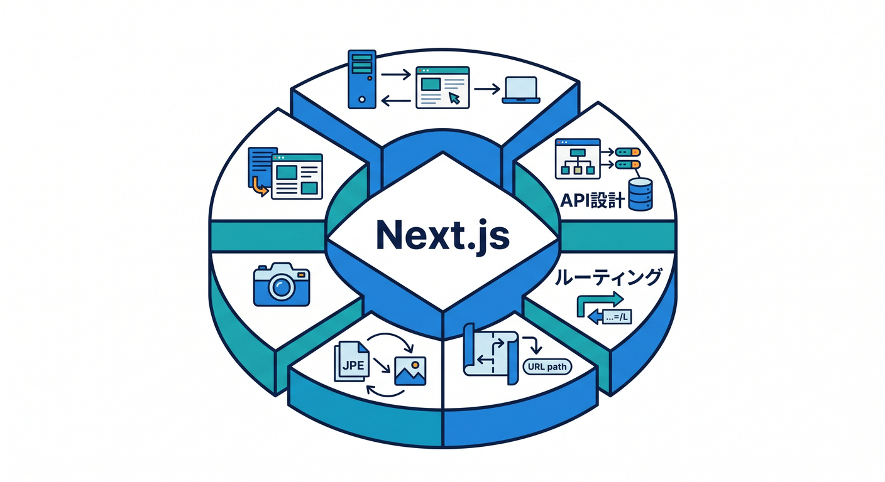
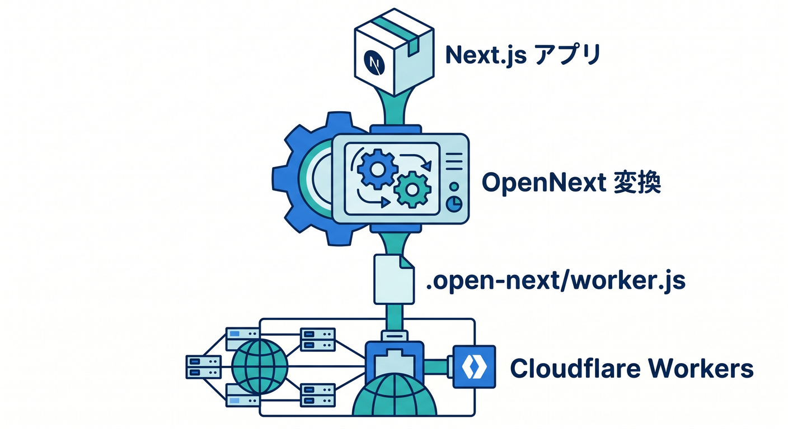
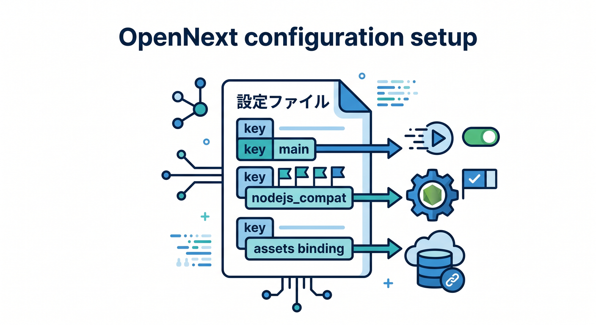
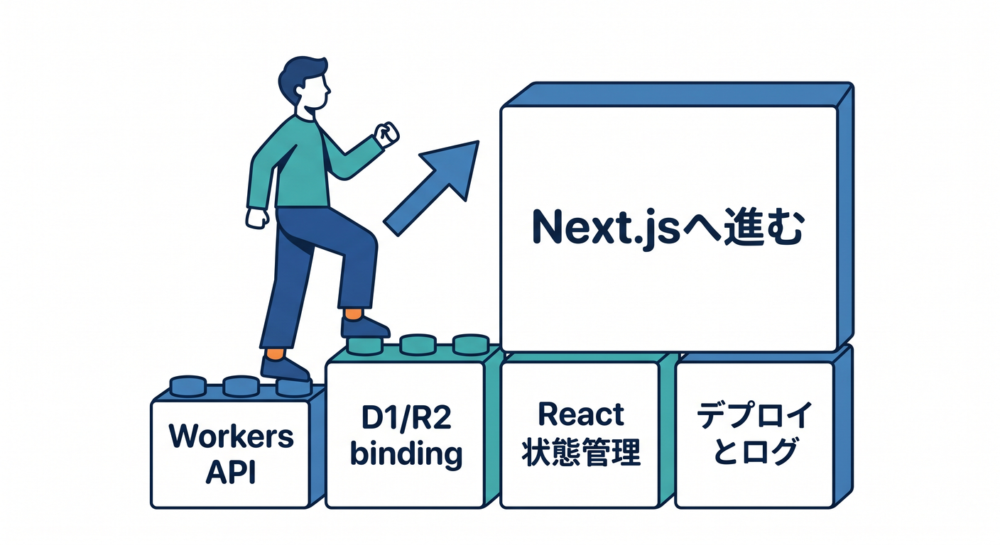

# 第13章：Next.js on Workersへ進む道 🧱

React + Workersに慣れたら、Next.jsへ進む道もあります。  
Cloudflare Workers上でNext.jsを動かす構成は、発展テーマとして面白いです。

---

## 1. Next.jsを使う理由 🧭

Next.jsには、Reactだけより便利な機能があります。

- ルーティング
- SSR
- API設計
- 画像最適化
- フルスタック構成
- App Router

ただし、学習初期はVite + React + Workersのほうが見通しはよいです。



---

## 2. OpenNext for Cloudflare 🧩

Cloudflare公式では、Next.js on Workersの方法としてOpenNext for Cloudflareが案内されています。  
Workers向けにNext.jsアプリを変換して動かす構成です。



```text
Next.js
  ↓ OpenNext
.open-next/worker.js
  ↓
Cloudflare Workers
```

---

## 3. 設定で見るもの ⚙️

公式ドキュメントでは、次のような設定が案内されています。

```jsonc
{
  "main": ".open-next/worker.js",
  "compatibility_flags": ["nodejs_compat"],
  "assets": {
    "directory": ".open-next/assets",
    "binding": "ASSETS"
  }
}
```

compatibility dateも条件を確認します。



---

## 4. いつ進む？ 🌱

次の段階で進むのがおすすめです。

```text
Workers APIが分かる
D1/R2 bindingが分かる
Reactの状態管理が分かる
デプロイとログが分かる
```

基礎があると、Next.jsのトラブルも追いやすくなります。



---

## 5. 章末チェック ✅

- Next.jsが発展先だと分かる
- OpenNext for Cloudflareの存在を知っている
- `.open-next/worker.js` の構成を知っている
- `nodejs_compat` が関係すると分かる
- まずVite + React + Workersで基礎を固めると分かる

この章で覚える一言はこれです。  
**Next.js on Workersは、Cloudflare基礎が分かった後の強力な発展先です 🧱**


