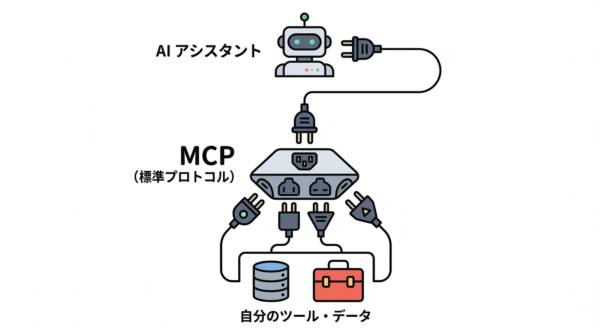
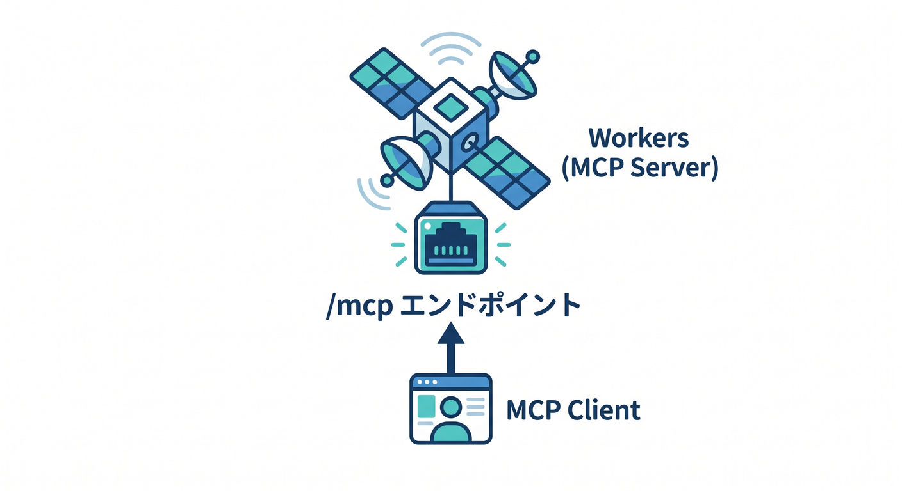
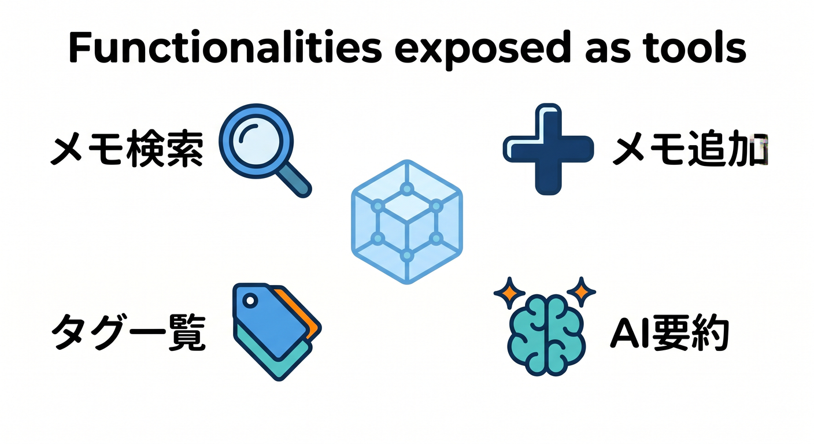
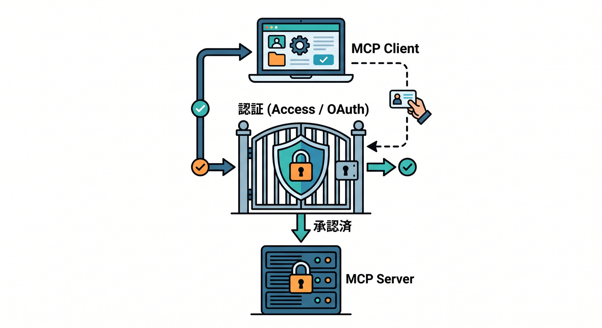
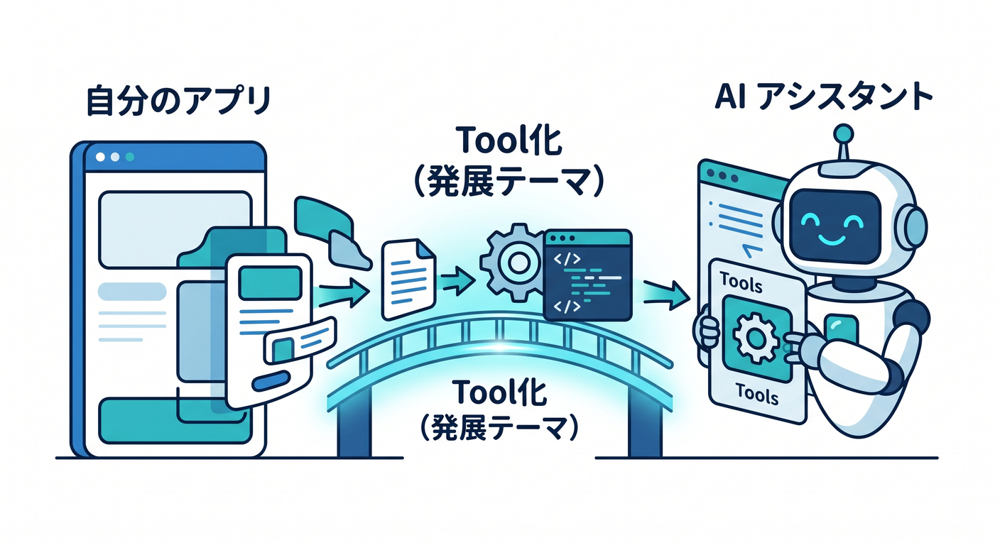

# 第14章：remote MCP server自作へ進む道 🧰

最後の発展テーマとして、remote MCP serverがあります。  
AI assistantがあなたのアプリの機能をtoolとして呼べるようにする道です。

---

## 1. MCPとは 🤖

MCPはModel Context Protocolの略です。  
AI assistantが外部ツールやデータソースへ接続するための標準的な仕組みです。

```text
AI assistant
  ↓ MCP
your tools / data
```

たとえば、メモ検索やD1操作をAIから呼べるtoolにできます。



---

## 2. Cloudflare Workersで作れる 🌐

Cloudflare公式Labsでは、Workers上でMCP serverを作る学習ルートが案内されています。  
remote MCP serverはHTTP endpointとして動き、`/mcp` で接続する構成が出てきます。

```text
Workers
  ↓ /mcp
MCP client
```

世界中から低遅延で使えるtool serverにできます。



---

## 3. 何をtoolにする？ 🧩

総仕上げ作品なら、次のtoolが考えられます。

- メモを検索する
- メモを追加する
- タグ一覧を返す
- AI要約を作る
- R2の添付ファイル一覧を返す

AI assistantから作品の機能を使えるようになります。



---

## 4. AccessやOAuthで守る 🔐

MCP serverは外部から使えるtoolなので、認証が重要です。  
Cloudflare公式docsでは、AccessやOAuthでremote MCP serverを保護する流れが案内されています。

```text
MCP client
  ↓ auth
Cloudflare Access / OAuth
  ↓
MCP server
```

誰でも使えるtoolにしないようにします。



---

## 5. 章末チェック ✅

- MCPはAI assistant用のtool接続だと分かる
- Workers上でremote MCP serverを作れると分かる
- `/mcp` endpointのイメージが分かる
- 自分の作品の機能をtool化できる
- AccessやOAuthで守る必要があると分かる

この章で覚える一言はこれです。  
**remote MCP serverは、自分のCloudflareアプリをAI assistantから使えるtoolにする発展テーマです 🧰**


