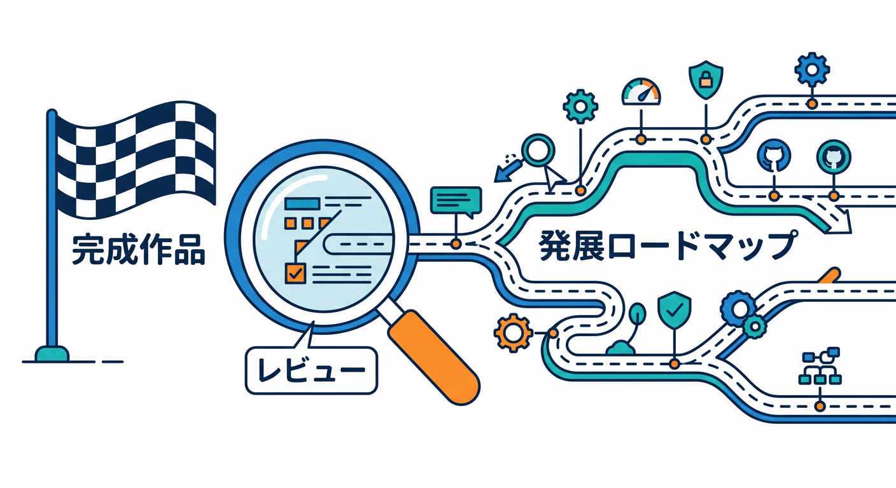
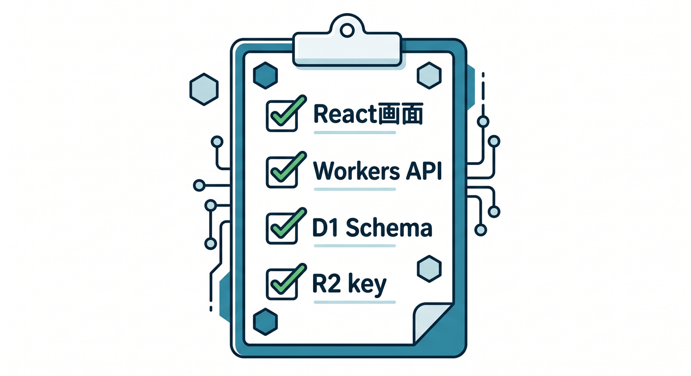
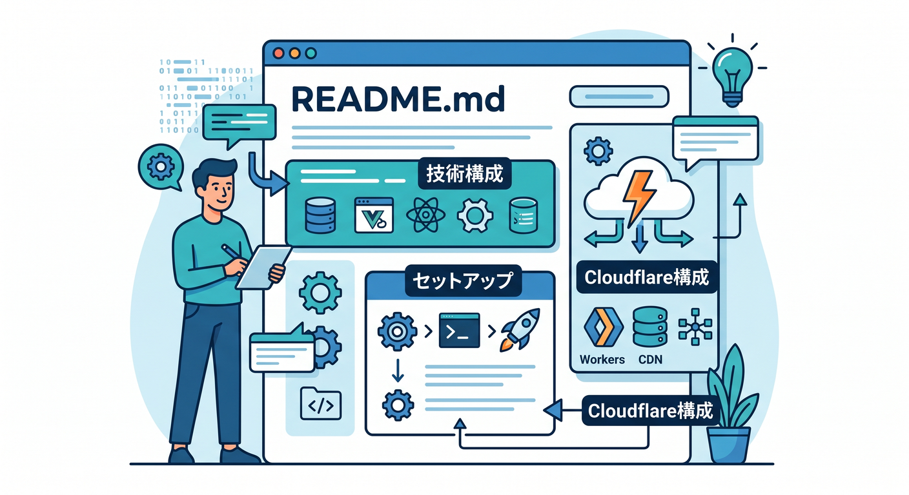
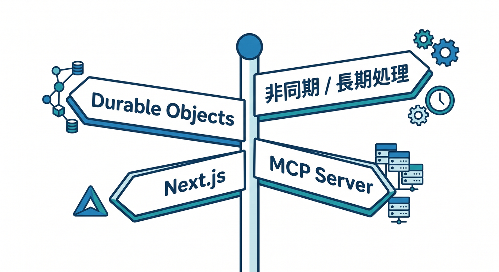
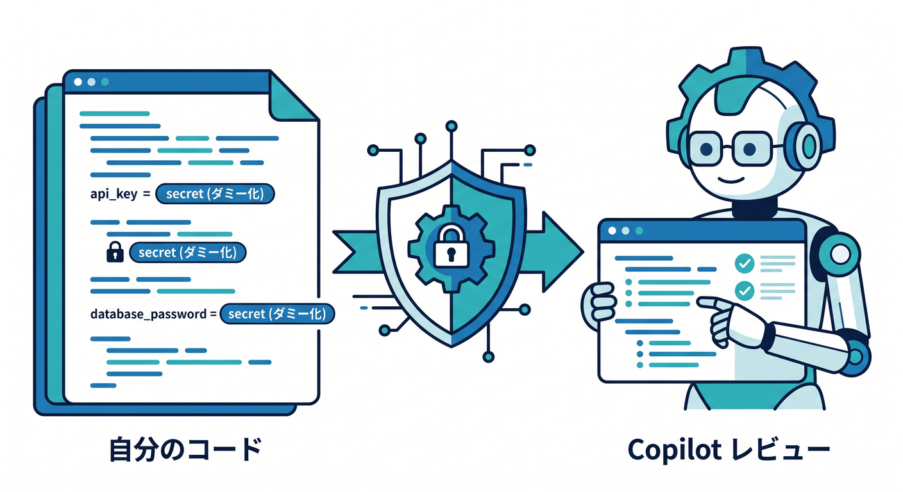
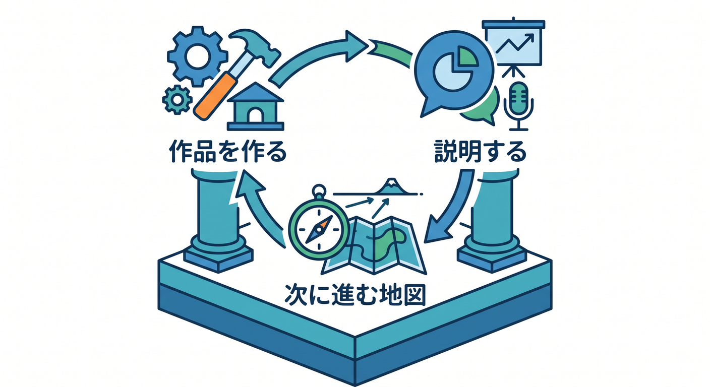

# 第15章：卒業制作レビューと発展ロードマップ 🏁

最後に、完成作品をレビューして、次の学習ルートを整理します。  
ここまで来たら、Cloudflareで小さなフルスタックAIアプリを作る基礎はかなり身についています 😊



---

## 1. 作品レビュー ✅

次の観点で見直します。

- React画面は使いやすいか
- Worker APIは整理されているか
- D1 schemaは分かりやすいか
- R2 keyは安全か
- AI promptは明確か
- ログは追いやすいか
- エラー表示は安全か
- 本番設定は漏れていないか

動くだけでなく、説明できる状態にします。



---

## 2. READMEを書く 📄

作品にはREADMEを用意します。

```text
何を作ったか
使った技術
Cloudflare構成
セットアップ方法
環境変数
デプロイ方法
今後の改善
```

READMEを書くと、自分の理解も整理されます。



---

## 3. 発展ロードマップ 🗺️

次に進む道です。

- Durable Objectsでリアルタイム機能
- Queuesで非同期処理
- Workflowsで長い処理
- Vectorize / AI Searchで意味検索
- TunnelとZero Trustで安全な接続
- Next.js on Workers
- remote MCP server

興味に合わせて選びます。



---

## 4. Copilot最終レビュー 🤖

Copilotにレビューを頼めます。

```text
Cloudflare Workers + React + D1 + R2 + Workers AIで作った学習メモアプリです。
API設計、DB設計、セキュリティ、ログ、AI prompt、デプロイ設定、READMEの観点でレビューしてください。
```

secretや実データは貼らず、必要ならダミー値にします。



---

## 5. 章末チェック ✅

- 完成作品を技術観点でレビューできる
- READMEに構成を書ける
- 次の学習テーマを選べる
- Copilotに安全にレビュー依頼できる
- Cloudflareで作った作品を説明できる

この章で覚える一言はこれです。  
**総仕上げのゴールは、作品を作り、説明し、次に進む地図を持つことです 🏁**


