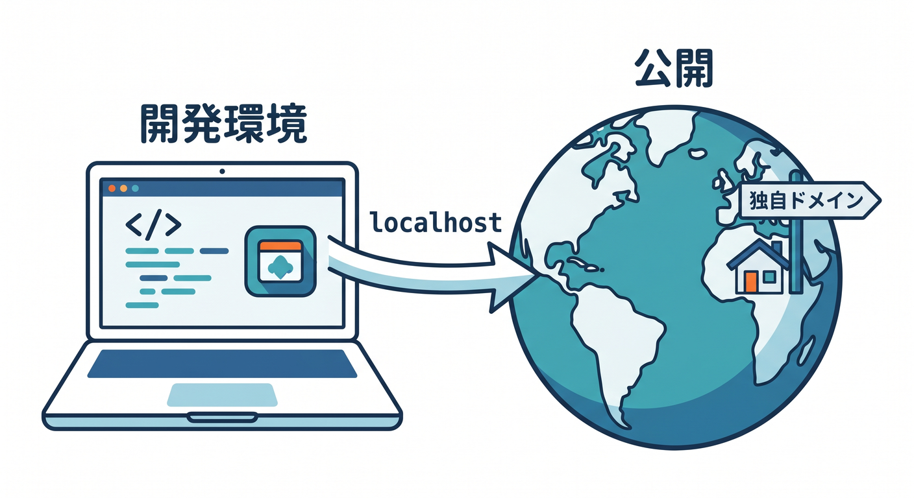
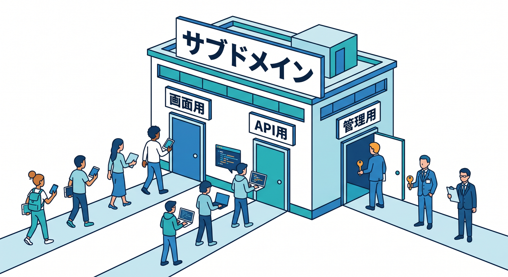
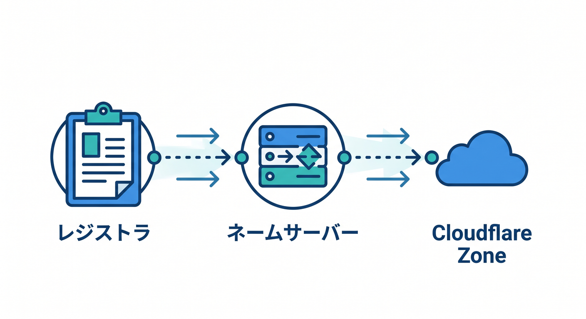
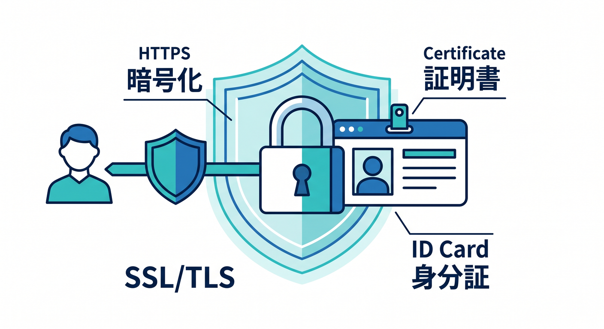
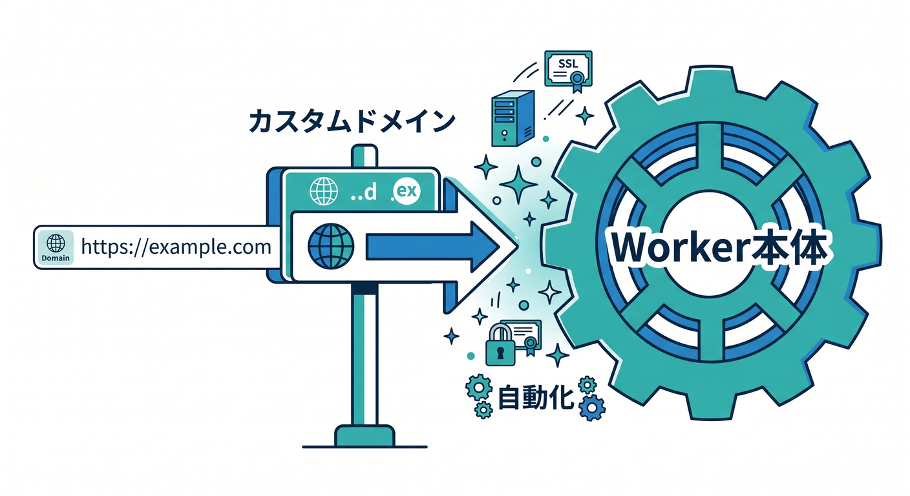
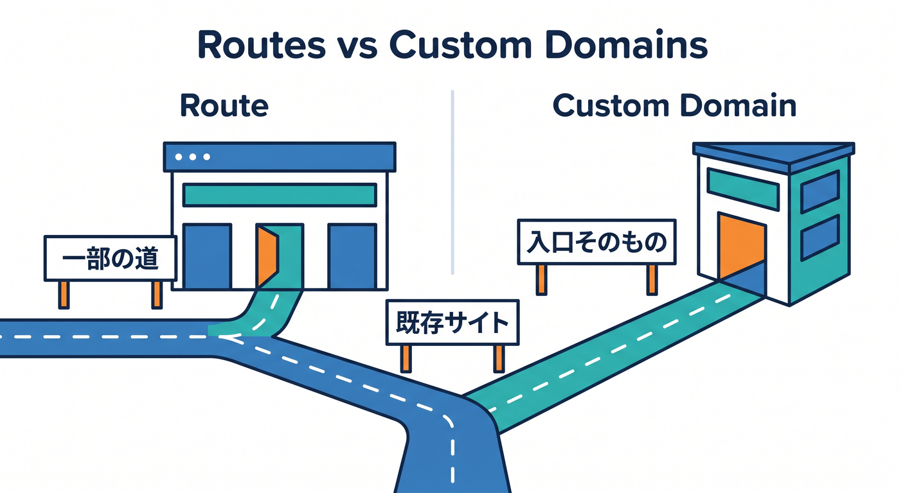

# Cloudflare 公開仕上げ編 15章アウトライン 🌐🔐✨

確認日: 2026-04-24  
主な確認先: Cloudflare Workers / Wrangler / SSL/TLS / AI Gateway / GitHub Copilot + Cloudflare 公式ドキュメント、Node.js公式リリース情報、TypeScript公式ブログ、Next.js公式ブログ

## 第1章　「公開する」ってどういうこと？🌍

まずは、作ったアプリが自分のPCから世界に出るまでの流れを見ます。  
`localhost`、`workers.dev`、独自ドメインの違いを、住所のたとえで整理します 🏠  

公開とは「ファイルを置く」だけでなく、DNS、証明書、経路を整えることだと知ります。  
Cloudflareが間に入ると、アクセスを受ける場所が世界中のEdgeに広がります ⚡  
「ブラウザでURLを開く」裏側に、名前解決とHTTPSの準備があることをつかみます。  
最初は細かい設定名を覚えるより、全体の地図を作ることを優先します 🗺️  
Workersで作ったAPIやReactアプリを、どう見せるかという目線に切り替えます。  
この章のゴールは、「公開＝URLを安全に世界へ案内すること」と言える状態です 🚀

## 第2章　ドメイン名はWeb上の住所だよ 🏷️

独自ドメインは、アプリにわかりやすい看板をつけるための名前です。  
`example.com`、`www.example.com`、`api.example.com` の違いをやさしく見ます 👀  
サブドメインを使うと、画面用、API用、管理用の入口を分けやすくなります。  

Cloudflareでは、ドメインをZoneとして管理する考え方がよく出てきます 🧩  
Zoneは「このドメイン周りの設定をまとめて置く場所」と考えると楽です。  
DNSレコードは、名前と行き先を結びつける案内板のようなものです 🚏  
最初はA、AAAA、CNAMEの細かい差より、「名前をどこへ向けるか」を押さえます。  
この章では、独自ドメインへの苦手意識をかなり小さくします 🌱

## 第3章　DNSをCloudflareに任せる準備をしよう 🧭

独自ドメインをCloudflareで使うには、まずDNS管理の流れを理解します。  
レジストラ、ネームサーバー、Cloudflare Zone の関係を図で整理します 🗂️  

Cloudflareにネームサーバーを向けると、DNS設定をCloudflare側で扱えます。  
ダッシュボードのDNS画面では、レコード名、種類、値、Proxy状態を見ます 👓  
オレンジ雲とグレー雲の違いも、ここで最初に軽く触れます ☁️  
Workers Routesでは、対象ホスト名にproxied DNSレコードが必要になる点が重要です。  
一方でCustom Domainsは、CloudflareがDNSレコードや証明書を用意してくれる流れがあります。  
この章のゴールは、「DNSが怖い設定画面」から「URLの案内表」へ見方を変えることです 😊

## 第4章　HTTPSとSSL/TLSをざっくり理解しよう 🔐

HTTPSは、ブラウザとサービスの会話を暗号化する仕組みです。  
SSL/TLS証明書は「このサイトはこの名前で正しいですよ」という身分証のような役割です 🪪  

Cloudflareを使うと、証明書の発行や更新をかなり自動化できます。  
初心者がつまずきやすいのは、DNS、証明書、Workerのどれが原因か混ざるところです 😵‍💫  
この章では、エラー画面を見たときに慌てないための見分け方を学びます。  
`http://` と `https://` の違い、鍵マーク、証明書の期限も確認します 🔎  
WorkersのCustom Domainsでは、対象ホスト名向けに証明書が生成される流れを押さえます。  
最後に「安全に公開する」は、コードだけでなく通信経路も含むと理解します 🛡️

## 第5章　workers.devで最初の公開確認をしよう 🚀

独自ドメインに入る前に、まず `workers.dev` で公開の感覚をつかみます。  
小さなTypeScript Workerをデプロイし、URLで返事が返るところを確認します 👋  
`wrangler deploy` の役割と、Cloudflare上にコードが置かれる流れを見ます。  
エラーが出たら、Copilot Chatにターミナル出力を読ませて原因を言語化します 🤖  
この段階では、まだドメイン設定で悩まないのがポイントです。  
動くURLを先に作っておくと、後でCustom DomainsやRoutesの違いが理解しやすくなります 🧱  
React + Viteの小さな画面でも、APIだけのWorkerでも題材にできます。  
この章のゴールは、「Cloudflareに公開されたURLを自分で確認できる」ことです ✅

## 第6章　Custom Domainsの考え方をつかもう 🏡

Custom Domainsは、Workerをそのホスト名の本体として公開するための仕組みです。  
たとえば `api.example.com` 全体をWorkerに任せたいときに向いています 🌐  

公式ドキュメントでは、DNS変更や証明書管理を手作業しなくてよい流れとして案内されています。  
Routesと違って、基本的にそのホスト名の全パスをWorkerへ向ける考え方です。  
`wrangler.jsonc` では `routes` に `custom_domain: true` を指定する形を学びます 🧾  
ダッシュボードから設定する方法と、設定ファイルで管理する方法を見比べます。  
「このWorkerをアプリの入口にする」という用途なら、まずCustom Domainsを候補にします。  
この章では、独自ドメイン公開のいちばん素直な道を理解します 🚪

## 第7章　Routesは「既存サイトの前にWorkerを置く」仕組み 🛣️

Routesは、すでにあるWebサイトやoriginの前でWorkerを動かすときに使います。  
たとえば `example.com/api/*` だけWorkerで処理するような使い方です ✂️  
Custom Domainsが「Workerを入口そのものにする」なら、Routesは「一部の道をWorkerに通す」感覚です。  

Routesを使うには、対象ホスト名にCloudflare proxied DNSレコードが必要です ☁️  
ここを忘れると、リクエストがWorkerまで届かず、原因探しが難しくなります。  
`shop.example.com/*` のようなパターン指定を、絵で確認します 🧭  
既存サイトを壊さずに少しずつWorkersを足したい場合に便利です。  
この章のゴールは、Custom DomainsとRoutesを用途で選べるようになることです 🧠

## 第8章　Custom DomainsとRoutesを選ぶ練習をしよう ⚖️

ここでは、具体例を見ながら「どちらを使う？」を練習します。  
`api.example.com` を丸ごとWorkerにしたいならCustom Domainsが自然です 🏡  
`example.com/contact/*` だけフォーム処理をWorkerにしたいならRoutesが合います。  
Reactアプリ、API Worker、既存WordPress、Next.jsアプリなどのパターンを並べます 🧩  
「全体を任せる」「一部だけ差し込む」「既存originがある」の3軸で判断します。  
Copilotに設計相談するときの聞き方も入れます 🤖  
例として「このURL構成ならCustom DomainとRouteのどちらがよい？」と質問します。  
この章のゴールは、設定名ではなく設計意図で判断できることです ✅

## 第9章　ReactアプリとAPIを本番っぽいURLにしよう ⚛️

React + Viteで作った小さな画面と、Workers APIをつなげた状態を題材にします。  
フロントを `app.example.com`、APIを `api.example.com` に分ける構成を考えます 🌐  
Cloudflare Vite Pluginを使うと、React系の開発体験とWorkersの実行環境を近づけやすくなります。  
開発中はHMRで画面をすぐ確認し、本番前はCloudflareのruntimeに近い形でpreviewします 👀  
CORSが出たときの考え方も、ここで軽く触れます。  
同じドメイン配下に置く設計と、サブドメインを分ける設計の違いを見ます 🧭  
Copilotには、`wrangler.jsonc`、`vite.config.ts`、fetch先URLをまとめて確認させます。  
この章のゴールは、「画面とAPIを本番URLでつなぐ感覚」を持つことです 🔗

## 第10章　Next.jsは紹介だけ、Cloudflare中心で見よう ▲

Next.jsは便利ですが、この教材ではCloudflareの公開設計を主役にします。  
Cloudflare Workersでは、OpenNext adapter経由でNext.jsを動かす道があります 🚄  
ただし最初から深いSSRやISRに入りすぎると、独自ドメインの学習がぼやけます。  
ここでは「Next.jsでも最終的にはURL、DNS、証明書、経路が大事」と整理します。  
Next.js公式ではAdapter APIの整備が進み、Cloudflareなど複数プラットフォームとの連携が強まっています 🧰  
Cloudflare側でもNext.js on Workersのガイドが用意されています。  
本格導入は発展編に回し、この章では公開先としての考え方だけ押さえます。  
この章のゴールは、Next.jsを特別扱いしすぎず、Cloudflareの地図に置くことです 🗺️

## 第11章　SSL/TLS設定とリダイレクトを確認しよう 🔁

独自ドメインをつないだら、HTTPSで正しく開けるか確認します。  
ブラウザの鍵マーク、証明書の発行先、有効期限を見てみます 🔐  
`http://` で開いたときに `https://` へ自然に移るかも確認します。  
CloudflareのSSL/TLS画面では、暗号化モードや証明書まわりの設定を扱います 🛠️  
初心者向けには、まず「ブラウザから安全に開けるか」を重視します。  
リダイレクト設定を入れすぎると、ループすることがあるので注意します 🌀  
Copilotには、エラー文と現在のCloudflare設定メモを渡して原因候補を整理させます。  
この章のゴールは、HTTPS公開後の基本チェックが自分でできることです ✅

## 第12章　AI GatewayとWorkers AIの公開URLを安全に扱おう 🤖

AI機能つきAPIを公開するときは、URL設計と秘密情報の扱いがより大切です。  
Workers AIはWorkerのbindingから呼び出せるので、ブラウザ側に秘密情報を出さずに済みます 🔒  
AI Gatewayを挟むと、AIリクエストのログ、分析、キャッシュ、制御を扱いやすくなります。  
`api.example.com/ai/summarize` のような公開APIを例に、入口を設計します 🧠  
ブラウザから直接AIプロバイダーへ投げるのではなく、Workerを安全な中継点にします。  
Rate LimitingやTurnstileと組み合わせると、乱用対策の話にもつなげられます 🛡️  
Copilotには、APIキーが露出していないか、fetch先が適切かをレビューさせます。  
この章のゴールは、AI機能を「公開しても壊れにくい形」にする発想を持つことです 🚦

## 第13章　CopilotとCloudflare MCPで設定を読めるようにしよう 🧑‍💻

Cloudflare公式は、GitHub Copilot向けのCloudflare連携情報やMCP活用を案内しています。  
Copilotに `wrangler.jsonc`、DNS方針、Custom Domain設定の意味を説明させます 🤖  
ただし、AIに操作を丸投げするのではなく、提案を読んで判断する練習にします。  
Cloudflare API MCP ServerやCloudflare Skillsは、Workers、R2、D1、AI、DNSなどの文脈を補助できます 🧰  
VS Code内で「このRoute設定は何を意味する？」と聞く流れを教材に入れます。  
エラー調査では、ログ、設定、期待するURLをセットで渡すと答えが安定します 📝  
AIが古い仕様を言う可能性もあるため、公式ドキュメント確認の習慣も入れます。  
この章のゴールは、AIを先生ではなく「設定を一緒に読む相棒」にすることです 🧭

## 第14章　公開後のトラブルを落ち着いて切り分けよう 🚑

公開後によくある失敗を、DNS、証明書、Route、Workerコードに分けて整理します。  
`ERR_NAME_NOT_RESOLVED` は名前解決、証明書エラーはTLS、404は経路やアプリ側を疑います 🔎  
Workers LogsやObservabilityを見て、リクエストがWorkerまで届いているか確認します。  
届いていないならDNSやRoutes、届いているならコードやレスポンスを調べます 🧪  
`wrangler tail` やダッシュボードのログで、実際のアクセスを追う流れも入れます。  
Copilotには「現象」「期待」「設定」「ログ」をまとめて渡します 🤖  
AI Gatewayを使うAI APIでは、AIリクエスト側のログも確認対象にします。  
この章のゴールは、焦らず上から順に原因を減らせることです 🧯

## 第15章　総仕上げ：独自ドメインで小さな本番アプリを公開しよう 🏁

最後に、React画面、Workers API、AI機能を少し入れた小さなアプリを公開します。  
例として、文章を入力するとWorkers AIで要約し、結果を画面に返すアプリにします ✨  
`app.example.com` と `api.example.com`、または1つのホスト名配下で公開する案を選びます。  
Custom DomainsかRoutesかを、自分で理由つきで決めます 🧠  
HTTPS、DNS、証明書、APIの疎通、ログ確認までをチェックリスト化します。  
Copilotには最終レビューとして、設定漏れ、秘密情報、公開URL、CORSを確認させます 🧑‍💻  
完成後は、友人にURLを渡して見てもらえる状態を目指します。  
この章のゴールは、「Cloudflareで本番らしく公開できた」と自信を持てることです 🎉

## 参照URL 🔗

- Cloudflare Workers Custom Domains: https://developers.cloudflare.com/workers/configuration/routing/custom-domains/
- Cloudflare Wrangler Configuration / routes: https://developers.cloudflare.com/workers/wrangler/configuration/
- Cloudflare Workers Best Practices: https://developers.cloudflare.com/workers/best-practices/workers-best-practices/
- Cloudflare Workers Vite Plugin Tutorial: https://developers.cloudflare.com/workers/vite-plugin/tutorial/
- Cloudflare GitHub Copilot + Cloudflare: https://developers.cloudflare.com/agent-setup/github-copilot/
- Cloudflare AI Gateway Workers AI provider: https://developers.cloudflare.com/ai-gateway/usage/providers/workersai/
- Cloudflare Workers Next.js guide: https://developers.cloudflare.com/workers/frameworks/framework-guides/nextjs/
- Node.js Releases: https://nodejs.org/en/about/releases/
- TypeScript 6.0 announcement: https://devblogs.microsoft.com/typescript/announcing-typescript-6-0/
- Next.js Across Platforms / Adapter API: https://nextjs.org/blog/nextjs-across-platforms
