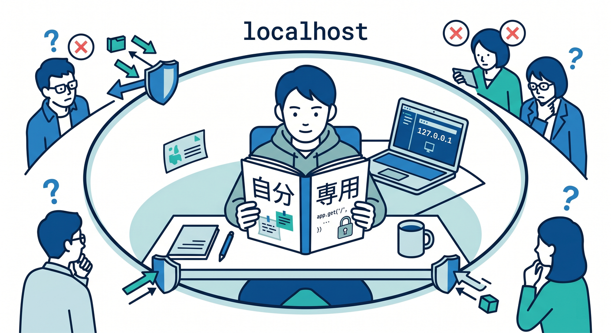
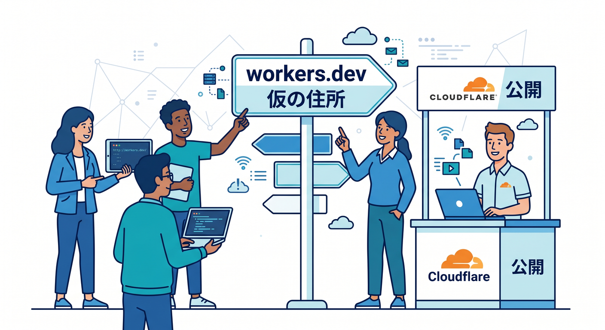
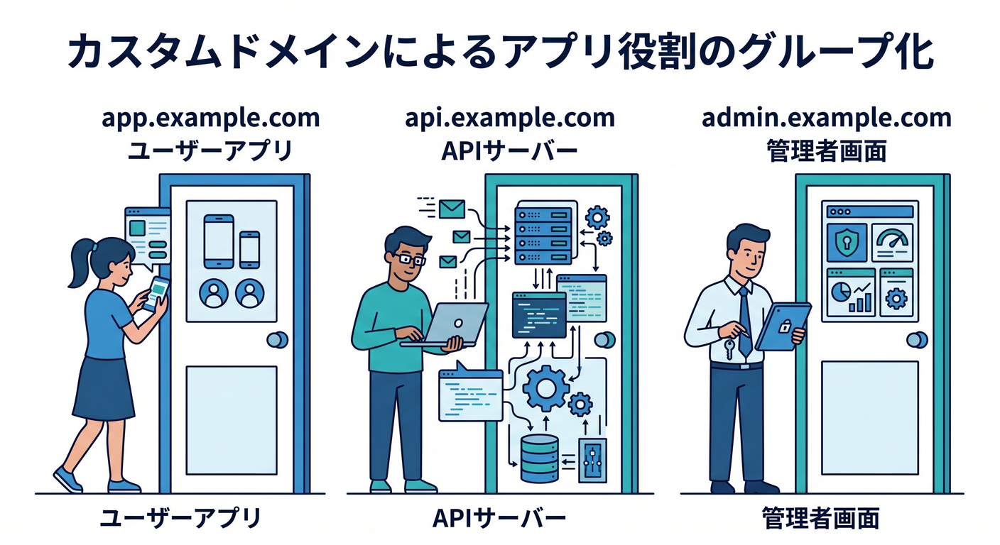
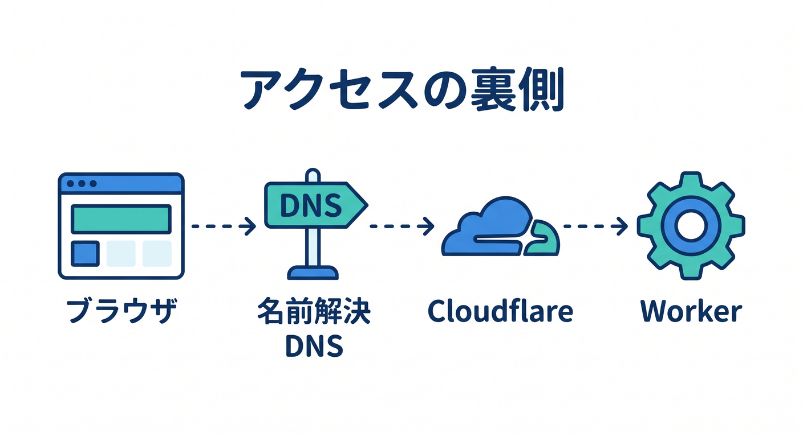
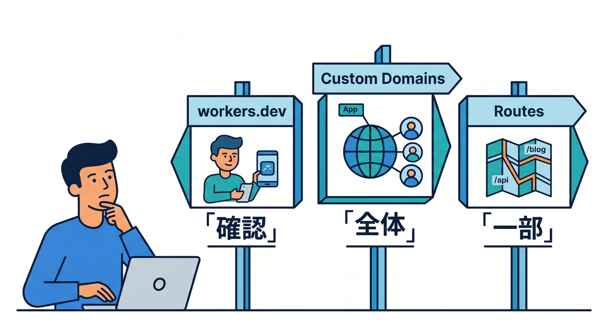

# 第01章：「公開する」ってどういうこと？🌍🚀

Cloudflareでアプリを作っていると、最初は `localhost` で動かすことが多いです。  
でも `localhost` は、自分のPCの中だけの住所です。友だちに送っても、先生に見せても、その人のブラウザからは開けません 😅  
この章では、アプリが「自分のPCの中」から「世界中のブラウザで見られる場所」へ出ていく流れを、ゆっくり整理します。

---

## 1. `localhost` は自分の部屋の中の住所 🏠

`npm run dev` や `wrangler dev` を実行すると、よく `http://localhost:xxxx` のようなURLが出ます。  
これは「今このPCの中で動いている開発用サーバー」を指しています。

たとえるなら、`localhost` は自分の机の上に置いたノートです 📓  

自分はすぐ読めますが、外の人は読めません。  
だから、開発中の確認には便利ですが、公開URLではありません。

ここで大事なのは、`localhost` で動くことと、本番公開できることは別のステップだという点です。  
まず自分のPCで動かし、次にCloudflare上へデプロイし、最後に公開URLで確認します。

---

## 2. `workers.dev` はCloudflareが用意してくれる仮の公開住所 🌐

Cloudflare Workersをデプロイすると、まず `xxxxx.workers.dev` のようなURLで確認できます。  
これはCloudflareが用意してくれる公開用の住所です。


独自ドメインを持っていなくても、ここで「自分のコードがCloudflare上で動いている」ことを確認できます ✨  
いきなりDNSやSSL/TLSを触る前に、まず `workers.dev` で公開体験をするのが安全です。

この段階で確認したいことはシンプルです。

1. ブラウザでURLを開けるか
2. APIならJSONが返るか
3. React画面なら表示が崩れていないか
4. エラーが出たときにログを見られるか

`workers.dev` は、独自ドメイン公開前の練習場だと思うと分かりやすいです 🏟️

---

## 3. 独自ドメインはアプリに名前をつけること 🏷️

`workers.dev` のURLでも公開はできます。  
でも、実際の作品やサービスでは `app.example.com` や `api.example.com` のような名前で見せたくなります。

これが独自ドメインです。  
独自ドメインを使うと、アプリにちゃんとした看板がつきます 🪧

たとえば、次のように役割を分けられます。

- `example.com`: メインサイト
- `app.example.com`: Reactアプリ
- `api.example.com`: Workers API
- `admin.example.com`: 管理画面


この名前をどのWorkerやサイトへ向けるかを決めるのが、公開設定の大事な部分です。

---

## 4. 公開にはDNS・経路・HTTPSが関わる 🧭🔐

アプリを公開するときは、コードだけでは終わりません。  
ブラウザがURLを開いたとき、裏側ではだいたい次の流れが起きます。

1. ブラウザが `api.example.com` を見に行く
2. DNSが「その名前はどこに向かえばいいか」を教える
3. Cloudflareがリクエストを受け取る
4. Custom DomainやRouteの設定に従ってWorkerへ流す
5. Workerがレスポンスを返す
6. HTTPSで安全にブラウザへ届く


つまり公開とは、コードを置くことだけではありません。  
名前、行き先、通信の安全性をそろえる作業です 🌍

---

## 5. この教材で見る3つの公開パターン 🧩

この公開仕上げ編では、主に3つのパターンを扱います。

**workers.devで確認する**  
最初の公開確認です。独自ドメインなしで動作を見ます。

**Custom Domainsで公開する**  
`api.example.com` のようなホスト名全体をWorkerに任せる形です。  
CloudflareがDNSレコードや証明書を自動で面倒見てくれる流れがあり、初心者にはかなり分かりやすいです。

**Routesで公開する**  
`example.com/api/*` のように、既存サイトの一部だけWorkerへ通す形です。  
すでにWebサイトがある場合に便利です。


---

## 6. Copilotには「今どの段階か」を説明してもらおう 🤖

公開まわりで混乱したら、Copilotにこう聞くと整理しやすいです。

```text
このCloudflare Workersプロジェクトは、localhost、workers.dev、独自ドメイン公開のどの段階にありますか？
wrangler.jsonc と現在のURLを見て、次に確認すべきことを初心者向けに説明してください。
```

AIに答えを丸投げするより、「今どこにいるか」を説明してもらうのがコツです。  
公開設定は、迷子にならないことがとても大事です 🗺️

---

## 7. 章末チェック ✅

- `localhost` は自分のPC内の開発用URLだと分かる
- `workers.dev` はCloudflare上での仮の公開URLだと分かる
- 独自ドメインはアプリに分かりやすい名前をつけることだと分かる
- 公開にはDNS、経路、HTTPSが関わると分かる
- Custom DomainsとRoutesをこれから学ぶ理由が分かる

この章で覚える一言はこれです。  
**公開とは、アプリに安全なURLをつけて、世界中のブラウザから届くようにすることです 🌍✨**

