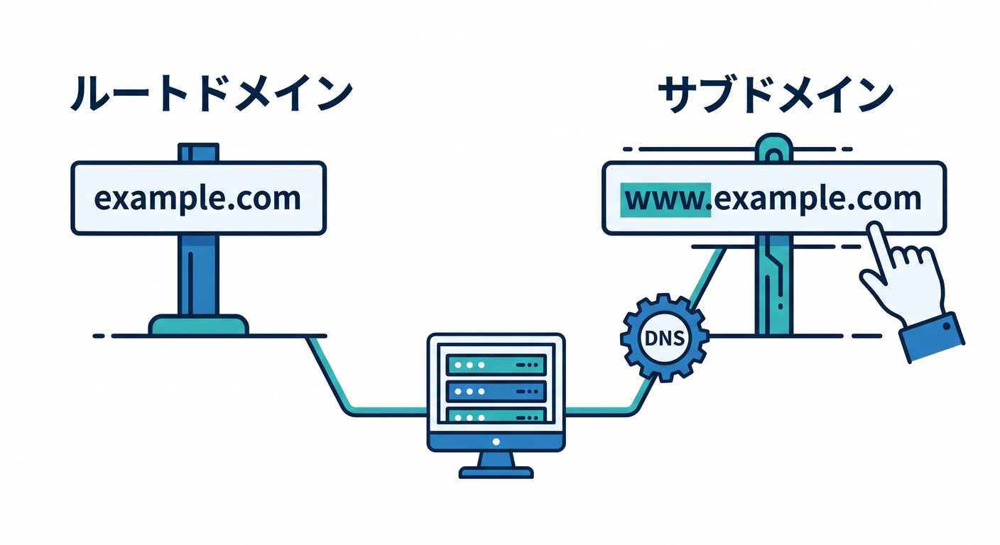
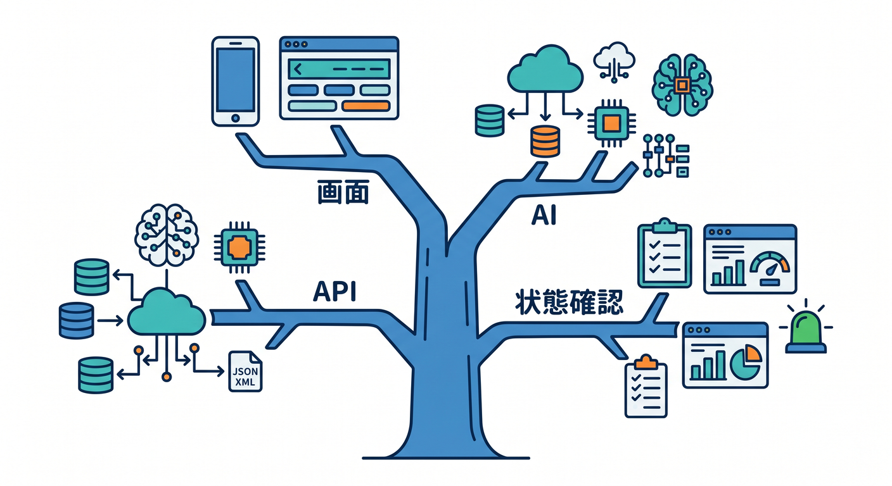
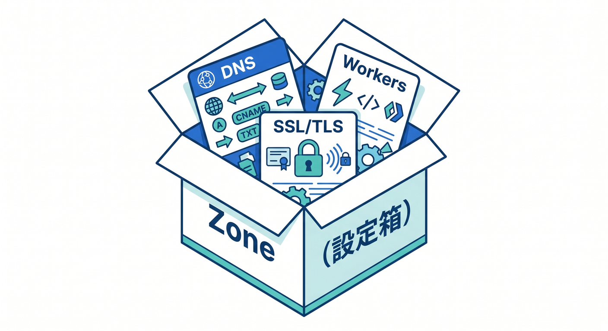
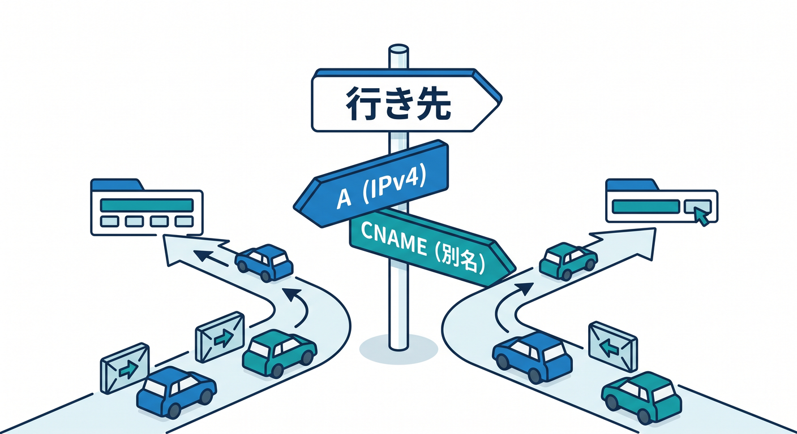

# 第02章：ドメイン名はWeb上の住所だよ 🏷️🌐

独自ドメインを学ぶとき、最初に出てくるのが `example.com` のような名前です。  
この名前は、Web上で人間が覚えやすい住所です。  
数字だらけのIPアドレスを毎回入力するのは大変なので、私たちはドメイン名を使っています 😊


---

## 1. ドメイン名は「人間向けの住所」🏠

WebサイトやAPIには、最終的にはどこかの行き先があります。  
でも、その行き先を毎回IPアドレスで覚えるのは現実的ではありません。

そこで使うのがドメイン名です。

- `example.com`
- `cloudflare.com`
- `api.example.com`
- `www.example.com`

こういう名前があるおかげで、人間は分かりやすいURLでアクセスできます。  
Cloudflareは、この名前と行き先の関係を管理する場所にもなります。

---

## 2. `example.com` と `www.example.com` は別の名前 👀

初心者がよく混乱するところですが、`example.com` と `www.example.com` は同じように見えて別のホスト名です。

`example.com` はルート、またはapex domainと呼ばれることがあります。  
`www.example.com` は `www` というサブドメインです。


同じように、次の名前もそれぞれ別物です。

- `app.example.com`
- `api.example.com`
- `admin.example.com`
- `docs.example.com`

Cloudflareで公開設定をするときは、「どの名前を、どのアプリへ向けるのか」をはっきりさせる必要があります 🧭

---

## 3. サブドメインを分けると役割が見えやすい 🧩

アプリが少し大きくなると、1つのドメインの中で役割を分けたくなります。

たとえば、学習用アプリなら次のようにできます。

- `app.example.com`: Reactの画面
- `api.example.com`: Workers API
- `ai.example.com`: AI機能のAPI
- `status.example.com`: 状態確認ページ


こうすると、URLを見ただけで役割が分かりやすくなります ✨  
また、Custom Domainsを使って、サブドメインごとに別のWorkerを割り当てることも考えやすくなります。

最初は1つのWorkerで十分ですが、URL設計としてサブドメインを知っておくと後で便利です。

---

## 4. Zoneは「そのドメインの設定箱」📦

Cloudflareでは、ドメインを追加するとZoneとして管理します。  
Zoneは、そのドメインに関する設定をまとめて置く箱です。

たとえば `example.com` というZoneの中には、次のような設定が入ります。

- DNSレコード
- SSL/TLS設定
- Cache Rules
- WAFなどのセキュリティ設定
- Workers Routes

つまりZoneは「このドメイン周りの設定をまとめた管理エリア」です。  
Cloudflareのダッシュボードでドメインをクリックすると、そのZoneの中に入るイメージです 🏢


---

## 5. DNSレコードは「名前と行き先の案内板」🚏

DNSレコードは、ドメイン名と行き先を結びつけます。

よく見る種類は次の通りです。

- A: 名前をIPv4アドレスへ向ける
- AAAA: 名前をIPv6アドレスへ向ける
- CNAME: 名前を別の名前へ向ける
- TXT: 認証や設定情報を置く

初心者のうちは、種類を完璧に暗記しなくて大丈夫です。  
まずは「DNSレコードは、名前の行き先表なんだ」と理解しましょう 🗺️


CloudflareのRoutesでは、対象ホスト名にproxied DNSレコードが必要になる場面があります。  
一方、WorkersのCustom Domainsでは、CloudflareがDNSレコード作成や証明書発行を助けてくれる流れがあります。

---

## 6. ドメイン設計の小さな練習 ✍️

次のようなアプリを作るとします。

文章を入力すると、Workers AIで要約してくれるReactアプリです。

このとき、URL設計はたとえばこうできます。

- `app.example.com`: ユーザーが開く画面
- `api.example.com`: 要約API

または、小さなアプリならこうしてもよいです。

- `summary.example.com`: 画面もAPIもまとめる

どちらが正解というより、アプリの規模と分かりやすさで決めます。  
この教材では、まず分かりやすいサブドメイン設計を使って学びます 😊

---

## 7. Copilotに聞くならこう聞こう 🤖

```text
このアプリをCloudflareで公開したいです。
React画面、Workers API、AI機能があります。
初心者にも分かりやすいサブドメイン設計を3案出して、それぞれのメリットを説明してください。
```

Copilotに「URLの案」を出してもらうと、自分では思いつかなかった分け方に気づけます。  
ただし、最終的に採用するURLは、自分が説明できる形にしましょう。

---

## 8. 章末チェック ✅

- ドメイン名は人間向けの住所だと分かる
- `example.com` と `www.example.com` は別の名前だと分かる
- サブドメインで役割を分けられる
- CloudflareのZoneはドメイン設定の箱だと分かる
- DNSレコードは名前と行き先の案内板だと分かる

この章で覚える一言はこれです。  
**ドメイン設計は、アプリの入口に分かりやすい看板をつける作業です 🪧✨**

