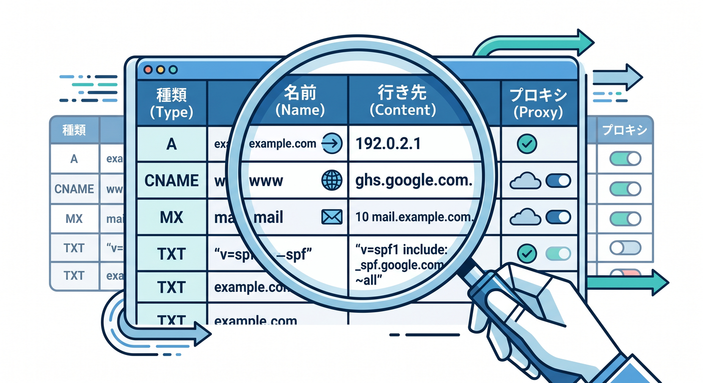
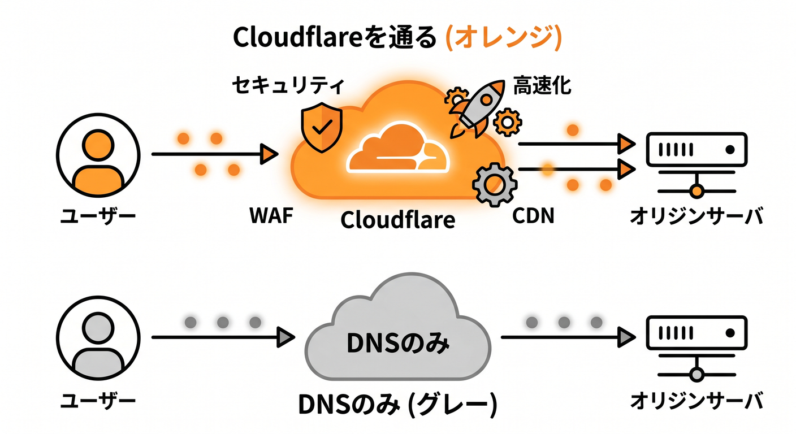
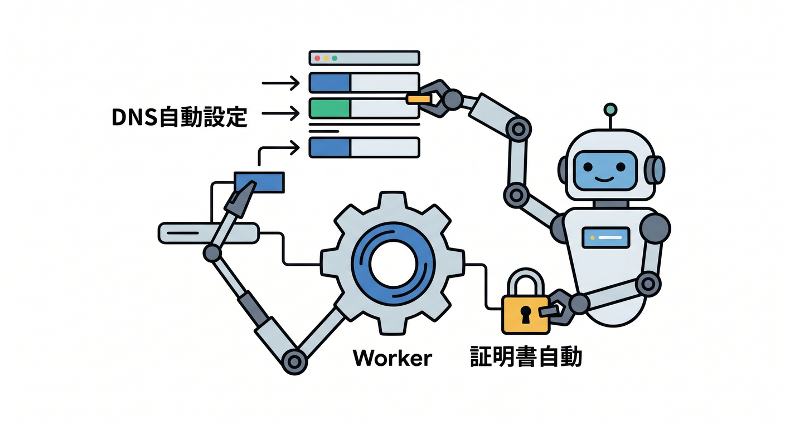
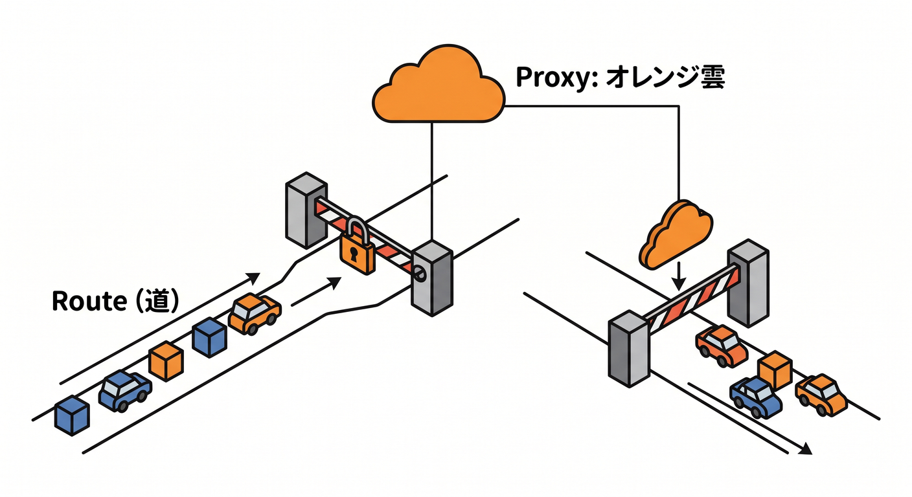

# 第03章：DNSをCloudflareに任せる準備をしよう 🧭☁️

独自ドメインをCloudflareで扱うには、DNSの考え方が必要です。  
ただし、最初から細かい専門用語を全部覚える必要はありません。  
この章では「ドメインをCloudflareに任せるとは何をすることか」を、実作業の流れに沿って見ます 🌱

---

## 1. レジストラとCloudflareは役割が違う 🏢

ドメインを買った場所を、レジストラと呼びます。  
たとえば、お名前.com、Google Domainsから移行したサービス、Namecheapなどがこの役割です。

レジストラは、ざっくり言うと「ドメインの所有を管理する場所」です。  
一方Cloudflareは、そのドメインのDNS、HTTPS、キャッシュ、Workers連携などを管理できます。

つまり、次のように考えると分かりやすいです。

- レジストラ: ドメインを買った不動産屋さん 🏘️
- Cloudflare: その住所の交通整理と警備をする管理会社 🚦


Cloudflareを使うときは、ドメインのネームサーバーをCloudflareへ向ける作業がよく出てきます。

---

## 2. ネームサーバーは「DNSを誰に聞くか」の設定 📣

ブラウザが `example.com` を開くとき、まず「この名前の行き先を誰に聞けばいい？」という流れになります。  
その問い合わせ先がネームサーバーです。


Cloudflareにドメインを追加すると、Cloudflare用のネームサーバーが2つ提示されます。  
それをレジストラ側に設定すると、以後そのドメインのDNS管理をCloudflare側で行えるようになります。

この変更はすぐ反映されることもありますが、時間がかかることもあります ⏳  
DNSは世界中に情報が広がる仕組みなので、反映待ちがあるのは普通です。

---

## 3. CloudflareのDNS画面で見るもの 👀

CloudflareのDNS Records画面では、主に次の項目を見ます。

- Type: A、AAAA、CNAME、TXTなど
- Name: `api` や `www` などの名前
- Content: 行き先
- Proxy status: オレンジ雲かグレー雲か
- TTL: DNS情報の保存時間

初心者が最初に注目するのは、Name、Type、Content、Proxy statusで十分です。  

特にWorkers Routesでは、対象ホスト名がCloudflareを通る状態、つまりproxiedになっていることが重要になります ☁️

---

## 4. オレンジ雲とグレー雲のイメージ ☁️

CloudflareのDNS画面では、雲のアイコンが出てきます。

**オレンジ雲**  
アクセスがCloudflareを通ります。キャッシュ、セキュリティ、Workers RoutesなどのCloudflare機能を使いやすくなります。

**グレー雲**  
DNSだけCloudflareで管理し、通信はCloudflareを通しません。


RoutesでWorkerを動かしたい場合、対象のホスト名はCloudflareを通る必要があります。  
つまり、オレンジ雲の考え方がかなり大事です 🟠

Custom Domainsの場合は、CloudflareがDNSレコードや証明書の準備を助ける流れがあるため、Routesより初心者に分かりやすい場面があります。

---

## 5. Custom DomainsとDNSの関係 🏡

WorkersのCustom Domainsは、Workerを特定のホスト名のoriginとして使う仕組みです。  
たとえば `api.example.com` を丸ごとWorkerにしたい場合に使います。

公式ドキュメントでは、Custom Domainを設定するとCloudflareがDNSレコードを作成し、必要な証明書も発行する流れが案内されています。  
そのため、初心者が「Workerをこの名前で公開したい」と考えるなら、まずCustom Domainsを候補にすると分かりやすいです。


ただし、どのZoneのどのホスト名に設定しているかは必ず確認しましょう。  
`api.example.com` に設定したつもりが `app.example.com` を見ていた、というミスはよくあります 😵‍💫

---

## 6. RoutesとDNSの関係 🛣️

Routesは、既存のホスト名やパスの一部にWorkerを差し込む仕組みです。  
たとえば `example.com/api/*` だけWorkerで処理したい場合です。

Routesでは、対象ホスト名にCloudflare proxied DNSレコードが必要です。  
レコードがないと、そもそもリクエストがCloudflareまで届かないことがあります。


つまりRoutesのトラブルでは、コードより先にDNSを見る場面があります 🔎  
「Workerが動かない」と思っていたら、実は名前がCloudflareを通っていなかった、ということもあります。

---

## 7. Windowsで確認するときのコマンド 🪟

DNSがどう見えているかを軽く確認したいときは、PowerShellで次のように試せます。

```powershell
Resolve-DnsName api.example.com
```

また、ブラウザで開けるかを見るだけでなく、どの名前を確認しているのかをメモしておくと安全です。

```text
確認したURL:
期待する行き先:
CloudflareのZone:
DNSレコード:
Custom DomainまたはRoute:
```

このメモをCopilotに渡すと、切り分けがかなり楽になります 🧑‍💻

---

## 8. 章末チェック ✅

- レジストラとCloudflareの役割の違いが分かる
- ネームサーバーはDNSの問い合わせ先だと分かる
- CloudflareのDNS Records画面で見る項目が分かる
- オレンジ雲とグレー雲の違いが分かる
- Custom DomainsとRoutesでDNSの関係が違うと分かる

この章で覚える一言はこれです。  
**DNSは、ドメイン名をCloudflareとアプリへつなぐ案内図です 🗺️☁️**

