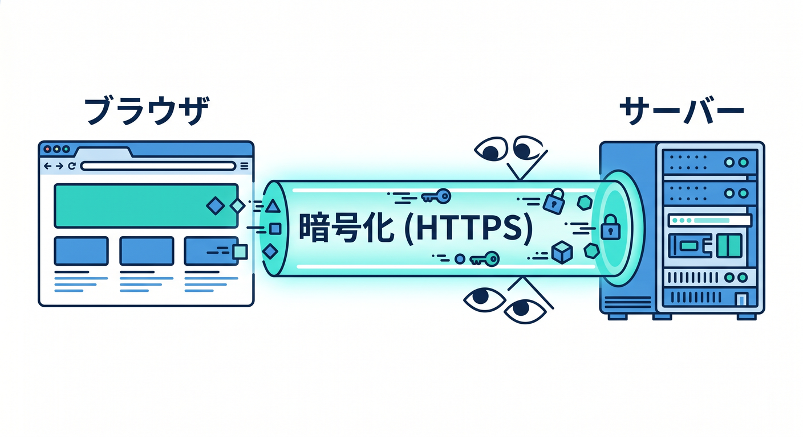
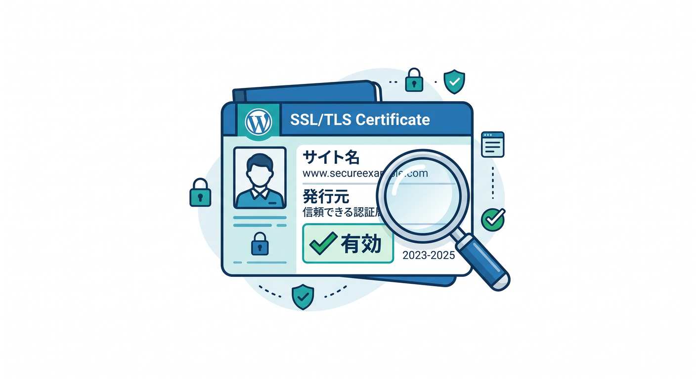
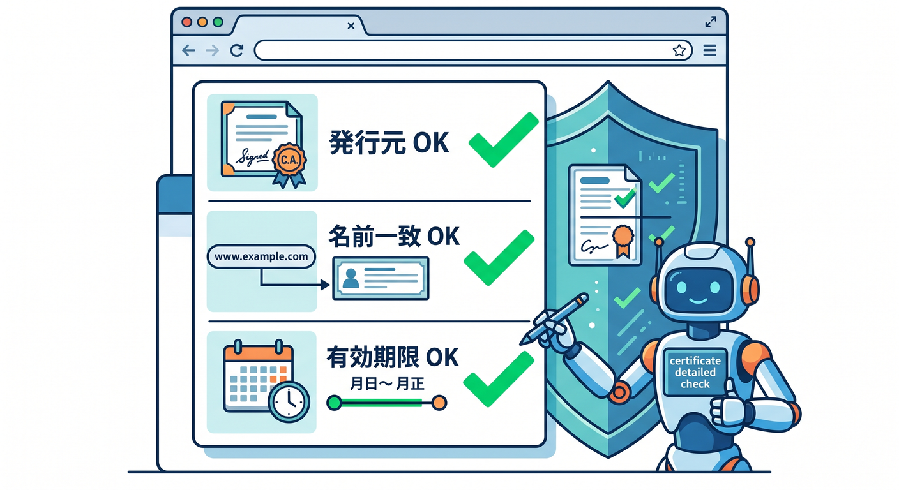
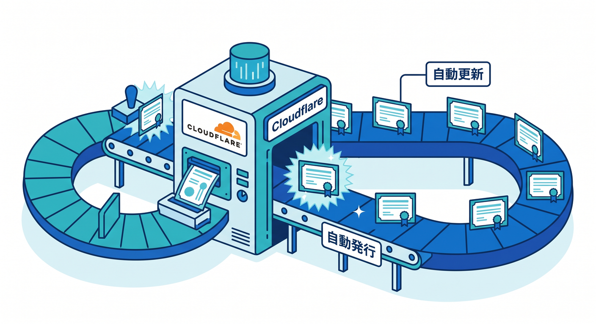
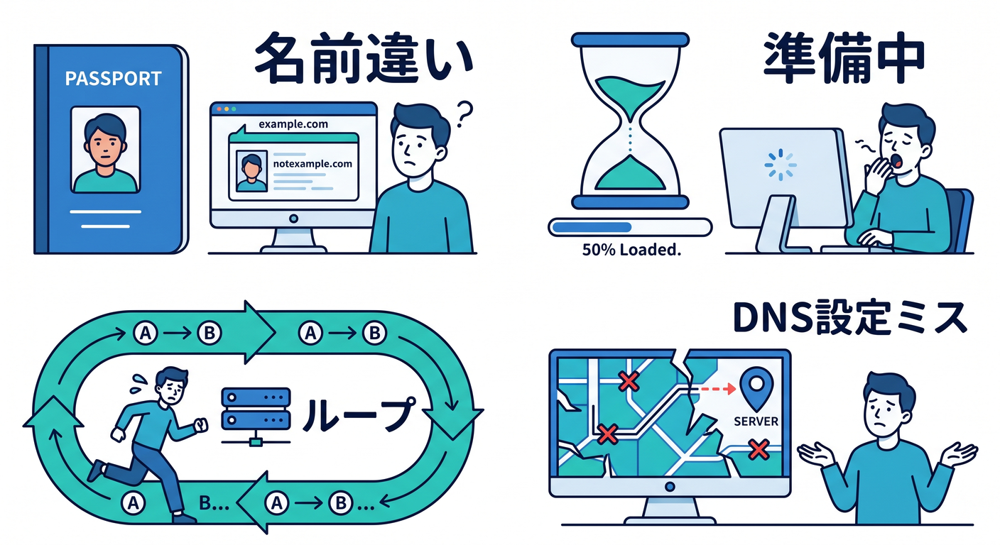
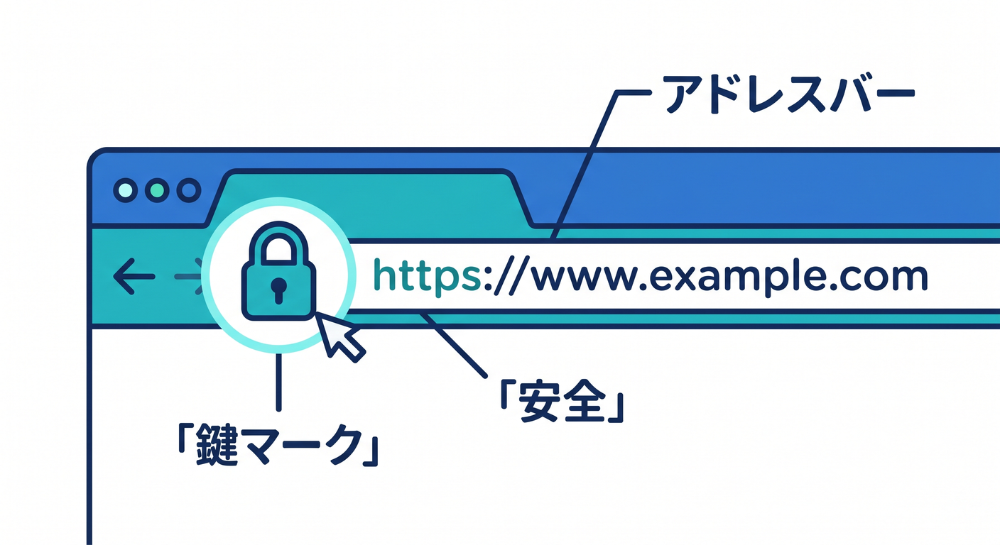

# 第04章：HTTPSとSSL/TLSをざっくり理解しよう 🔐✨

独自ドメインで公開するとき、必ず出てくるのがHTTPSとSSL/TLSです。  
名前だけ見ると難しそうですが、初心者のうちは「安全な通信のための仕組み」と押さえれば大丈夫です 😊  
この章では、証明書エラーで慌てないための基本を学びます。

---

## 1. HTTPSは安全な会話の通路 🛡️

ブラウザでURLを見ると、`http://` と `https://` があります。  
今のWebでは、基本的に `https://` が標準です。

HTTPSは、ブラウザとサーバーの会話を暗号化します。  
途中で内容をのぞかれたり、改ざんされたりしにくくするための仕組みです。


たとえば、ログイン、フォーム送信、AIへの文章送信などでは、HTTPSがとても大事です。  
Cloudflareで公開するアプリも、最終的にはHTTPSで安全に開ける状態を目指します 🔐

---

## 2. SSL/TLS証明書はサイトの身分証 🪪

HTTPSで通信するには、証明書が必要です。  
証明書は「このサイトはこの名前で正しいですよ」と示す身分証のようなものです。


ブラウザは、証明書を見て次のようなことを確認します。

- この証明書は信頼できる発行元か
- URLの名前と証明書の名前が合っているか
- 有効期限が切れていないか
- 通信を暗号化できるか


証明書に問題があると、ブラウザに警告が出ます。  
初心者には怖く見えますが、見るべきポイントを分ければ落ち着いて対応できます。

---

## 3. Cloudflareは証明書まわりをかなり助けてくれる ☁️

Cloudflareを使う大きなメリットの1つは、証明書管理をかなり自動化できることです。  
WorkersのCustom Domainsでは、対象ホスト名向けの証明書が生成される流れがあります。


つまり、自分で証明書ファイルを作って、サーバーに置いて、期限更新して、という作業をしなくてよい場面が多いです 🎉  
この自動化のおかげで、初心者でも独自ドメインのHTTPS公開へ進みやすくなります。

ただし、証明書が発行されるまで少し待つことはあります。  
設定直後にうまく開けない場合でも、数分待ってから再確認するのがよいです。

---

## 4. よくあるHTTPSまわりのエラー 😵‍💫

公開直後によくあるのは、次のようなトラブルです。

**証明書の名前が違う**  
`api.example.com` を開いているのに、証明書が別の名前向けになっている状態です。

**証明書がまだ準備中**  
設定直後で、Cloudflare側の証明書発行が完了していない状態です。

**リダイレクトがループしている**  
HTTPからHTTPSへ移動する設定や、origin側の設定がかみ合わず、ぐるぐる回る状態です。

**DNSがそもそも違う場所を向いている**  
HTTPSの問題に見えて、実はDNSの問題ということもあります。


エラー名だけで判断せず、DNS、証明書、Route、Workerの順に確認しましょう 🔎

---

## 5. ブラウザで確認するポイント 👀

HTTPS公開後は、ブラウザで次のことを確認します。

1. `https://api.example.com` で開けるか
2. 鍵マークが出ているか
3. 証明書の名前が開いているホスト名と合っているか
4. `http://` で開いたときに `https://` へ移動するか
5. 警告画面が出ないか

ChromeやEdgeでは、アドレスバーの左側から証明書情報を確認できます。  
難しい設定画面に入る前に、まずブラウザから見える状態を確認しましょう。


---

## 6. Copilotにはエラー文をそのまま渡そう 🤖

HTTPSエラーは、文章を見ればかなり原因候補を絞れます。  
Copilotには次のように聞くとよいです。

```text
Cloudflareで独自ドメインを設定しましたが、HTTPSでエラーが出ています。
エラー文は以下です。
---
ここにブラウザのエラー文を貼る
---
DNS、証明書、Route、Workerコードのどこを順番に確認すべきか、初心者向けに説明してください。
```

エラー文、開いたURL、設定したCustom DomainまたはRouteをセットで渡すのがポイントです。

---

## 7. 章末チェック ✅

- HTTPSは通信を安全にする仕組みだと分かる
- SSL/TLS証明書はサイトの身分証のようなものだと分かる
- Cloudflareが証明書発行を助けてくれる場面があると分かる
- HTTPSエラーはDNSやRouteの問題に見えることもあると分かる
- ブラウザで鍵マークと証明書を確認できる

この章で覚える一言はこれです。  
**HTTPS公開は、ユーザーに安心してURLを開いてもらうための入口整備です 🔐🌐**

