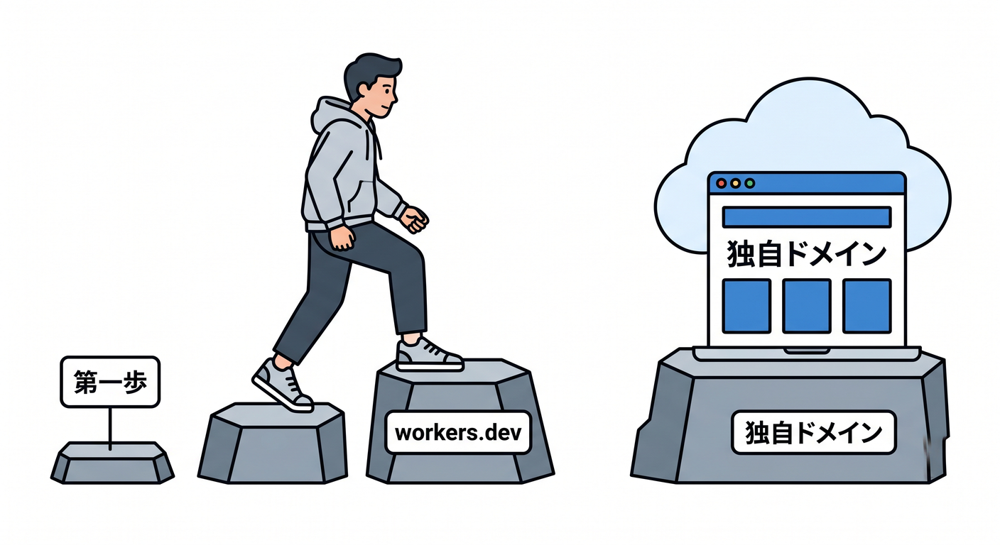
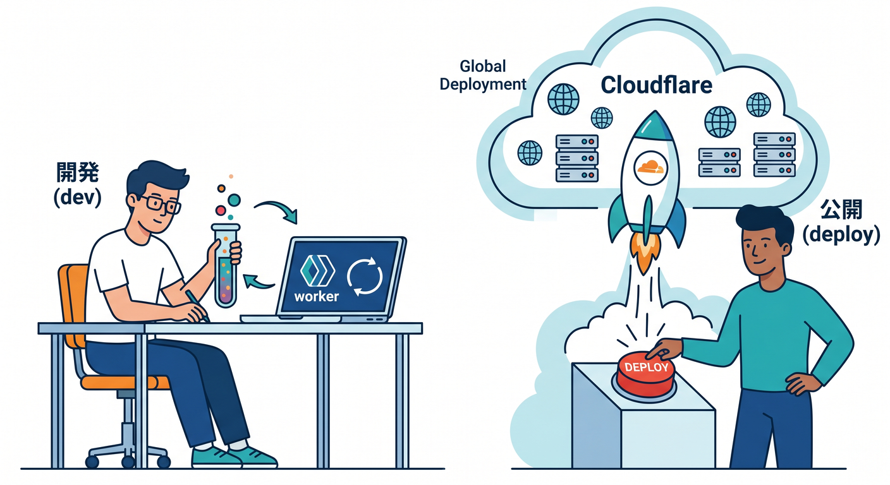
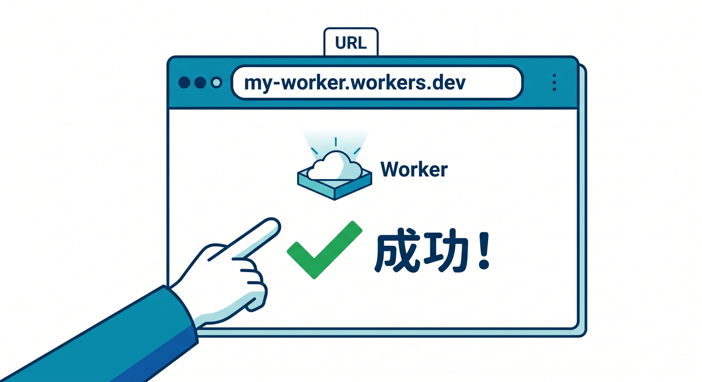
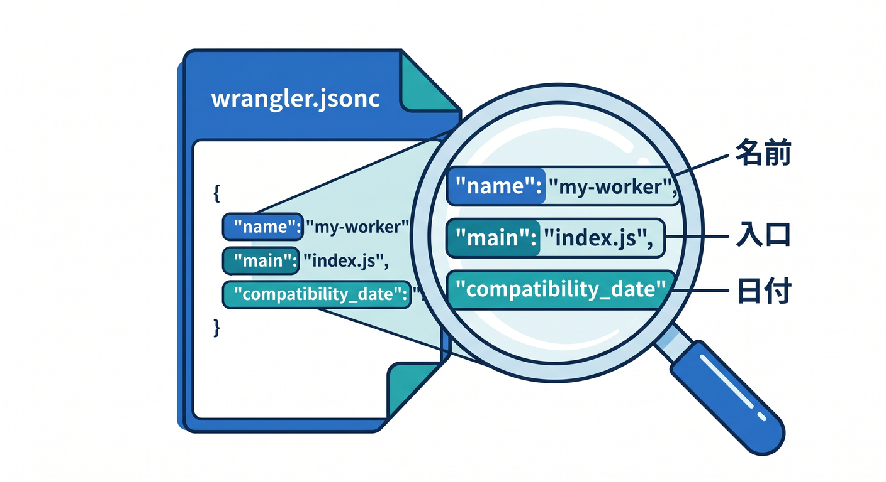
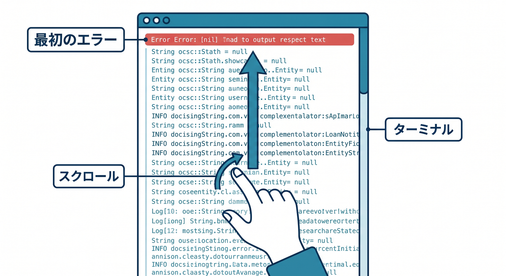

# 第05章：workers.devで最初の公開確認をしよう 🚀☁️

独自ドメインに進む前に、まず `workers.dev` で公開を体験します。  
ここで大事なのは、DNSや証明書に入る前に「WorkerがCloudflare上で動く」ことを確認することです。  
小さく成功してから、独自ドメインへ進みましょう 😊


---

## 1. まずは最小のWorkerを用意する 🧑‍💻

最初の題材は、HTMLやJSONを返すだけの小さなWorkerで十分です。  
たとえば、TypeScriptのWorkerなら次のようなイメージです。

```ts
export default {
  async fetch(request: Request): Promise<Response> {
    return new Response("Hello from Cloudflare Workers!");
  },
};
```

この時点では、ReactもAIもデータベースも不要です。  
まずは「Cloudflare上で自分のコードが返事をする」ことに集中します。


---

## 2. `wrangler dev` と `wrangler deploy` の違い 🛠️

`wrangler dev` は、開発中に動作確認するためのコマンドです。  
ローカル、またはCloudflareに近い環境でWorkerを試せます。

一方、`wrangler deploy` はCloudflareへ実際にデプロイするコマンドです。

```powershell
npx wrangler dev
```

```powershell
npx wrangler deploy
```

まず `dev` で確認し、問題なければ `deploy` する、という流れを体に入れましょう 🏃‍♂️


---

## 3. `workers.dev` URLで開いてみる 🌐

デプロイが成功すると、`workers.dev` のURLが表示されます。  
ブラウザでそのURLを開いて、レスポンスが返るか確認します。

確認することは次の通りです。

- 404ではないか
- 500エラーではないか
- 期待した文字やJSONが表示されるか
- ブラウザの更新で安定して返るか

ここで成功していれば、Worker本体はCloudflare上で動いています。  
独自ドメインの問題と、Workerコードの問題を分けて考えられるようになります。


---

## 4. `wrangler.jsonc` をざっくり読む 🧾

Workerの公開には、`wrangler.jsonc` がよく関わります。  
最初に見るポイントはこのあたりです。

```jsonc
{
  "name": "my-worker",
  "main": "src/index.ts",
  "compatibility_date": "2026-04-24"
}
```

`name` はWorkerの名前です。  
`main` は入口になるファイルです。  
`compatibility_date` はCloudflare Workersの互換性日付です。

独自ドメイン設定はあとで追加します。  
この章では、まず最小構成で動くことを確認しましょう。


---

## 5. エラーが出たらログを見る 🔎

デプロイや実行でエラーが出たら、ターミナル出力を見ます。  
よくあるのは次のようなミスです。

- `main` のパスが違う
- TypeScriptの型エラー
- `wrangler` のログインができていない
- Cloudflareアカウントやプロジェクトの選択が違う

エラー文は短く見えても、原因のヒントが入っています。  
スクロールして最初のエラー行を探すのがコツです。


---

## 6. Copilotにターミナル出力を読ませる 🤖

エラーが長いときは、Copilotに整理してもらいましょう。

```text
以下は `npx wrangler deploy` のエラーです。
初心者にも分かるように、原因候補と次に確認するファイルを教えてください。

---
ここにエラー出力を貼る
---
```

ただし、APIトークンや秘密情報が含まれていないかは確認してください。  
公開してよいログだけを渡すのが基本です 🔐

---

## 7. 章末チェック ✅

- `wrangler dev` と `wrangler deploy` の違いが分かる
- `workers.dev` URLでWorkerを確認できる
- `wrangler.jsonc` の基本項目を読める
- 独自ドメイン前にWorker単体を確認する意味が分かる
- エラー時にターミナル出力を見る習慣がつく

この章で覚える一言はこれです。  
**独自ドメインの前に、まず `workers.dev` でWorker本体の動作を確認しよう 🚀**

