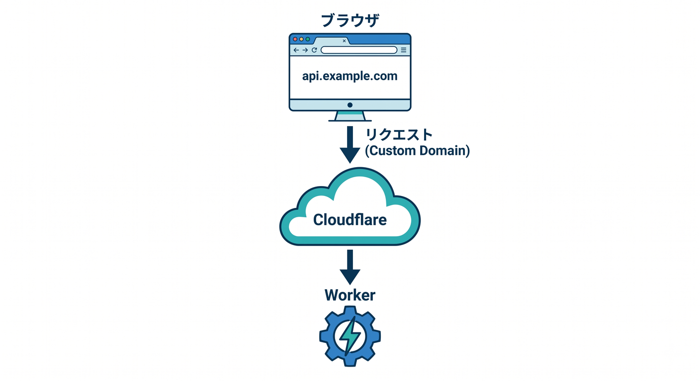
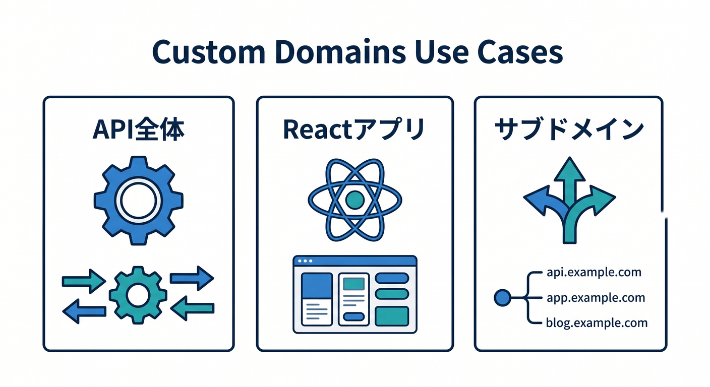
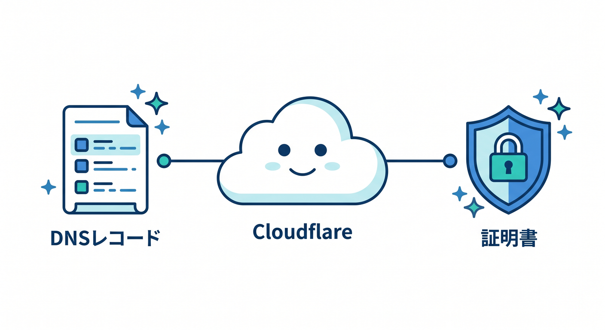
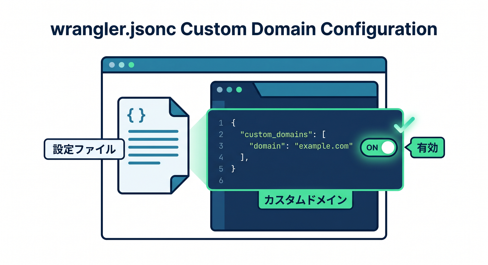
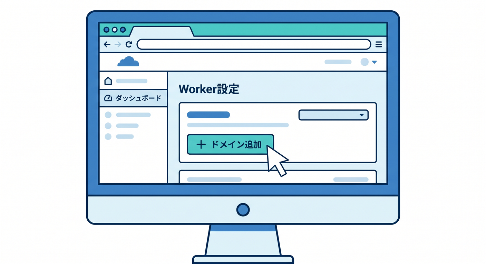

# 第06章：Custom Domainsの考え方をつかもう 🏡🌐

Custom Domainsは、Cloudflare Workersを独自ドメインで公開するための分かりやすい方法です。  
特に `api.example.com` のようなホスト名全体をWorkerに任せたいときに向いています。  
この章では、Routesと混ざらないように「Custom Domainsは何をするものか」を丁寧に見ます 😊

---

## 1. Custom DomainsはWorkerをホスト名の本体にする仕組み 🏠

Custom Domainsでは、Workerがそのホスト名のoriginのように振る舞います。  
たとえば `api.example.com` をCustom DomainとしてWorkerに設定すると、`api.example.com` へのリクエストはWorkerに届きます。

イメージはこうです。

```text
ブラウザ
  ↓
https://api.example.com
  ↓
Cloudflare
  ↓
Worker
```



この場合、`api.example.com/users` も `api.example.com/ai/summarize` も、同じWorkerの中で処理できます。

---

## 2. Custom Domainsが向いている場面 ✅

Custom Domainsは、次のような場面に向いています。

- `api.example.com` 全体をWorkers APIにしたい
- `app.example.com` をWorkerで配信するReactアプリにしたい
- 既存のoriginサーバーがなく、Workerだけで完結したい
- サブドメインごとにWorkerを分けたい

公式ドキュメントでも、Workerをインターネットへ接続し、常に通信したい外部originがない場合にCustom Domainsが自然な選択肢として案内されています。



つまり、初心者が「このWorkerをこの独自ドメインで公開したい」と思ったら、まずCustom Domainsを検討するとよいです 🧭

---

## 3. CloudflareがDNSと証明書を助けてくれる ✨

Custom Domainを設定すると、CloudflareがDNSレコードを作成し、必要な証明書を発行する流れがあります。  
ここが初心者にとって大きなメリットです。

手作業でCNAMEを作って、証明書を別で準備して、期限を気にして、という負担が小さくなります。  
もちろん設定画面で状態確認は必要ですが、公開までの道がかなり短くなります 🚀



ただし、CloudflareのZone内のホスト名である必要があります。  
`example.com` をCloudflareで管理していないのに、`api.example.com` を突然Custom Domainにすることはできません。

---

## 4. `wrangler.jsonc` で書く例 🧾

Custom Domainは、設定ファイルで管理することもできます。  
例は次のような形です。

```jsonc
{
  "name": "my-api",
  "main": "src/index.ts",
  "compatibility_date": "2026-04-24",
  "routes": [
    {
      "pattern": "api.example.com",
      "custom_domain": true
    }
  ]
}
```

ここで大事なのは、`custom_domain: true` です。  
これがあることで、通常のRouteではなくCustom Domainとして扱う意図がはっきりします。



設定をファイルに残すと、あとで見返しやすく、Copilotにも説明させやすくなります 🤖

---

## 5. ダッシュボードから設定する方法もある 👀

CloudflareダッシュボードからもCustom Domainを追加できます。  
Workers & Pagesで対象Workerを開き、SettingsやDomains & Routes周辺から追加する流れです。

初心者には、最初はダッシュボードで設定して画面の意味をつかむのもよいです。  
慣れてきたら `wrangler.jsonc` に寄せると、設定の履歴管理がしやすくなります。



どちらを使う場合でも、確認するポイントは同じです。

- どのWorkerに設定したか
- どのZoneのホスト名か
- 証明書が発行されているか
- ブラウザでHTTPS表示できるか

---

## 6. Custom Domainsで注意すること ⚠️

Custom Domainsは便利ですが、万能ではありません。  
特に、既存のWebサイトの一部だけWorkerにしたい場合はRoutesのほうが合うことがあります。

たとえば `example.com` は既存サイトとして残し、`example.com/api/*` だけWorkerで処理したいならRoutesを検討します。  
Custom Domainsは、基本的にホスト名全体をWorkerへ任せる発想です。


また、設定したホスト名を間違えると、意図しないURLがWorkerに向いてしまいます。  
本番ドメインを触るときは、最初に `test.example.com` や `api-dev.example.com` で練習すると安全です 🧪

---

## 7. Copilotに設定を説明させる 🤖

`wrangler.jsonc` にCustom Domainを書いたら、Copilotに確認させましょう。

```text
この wrangler.jsonc の routes 設定を初心者向けに説明してください。
Custom Domainとして正しく読めるか、Routesとの違いも含めて確認してください。
```

AIに「正しいですか？」だけ聞くより、「どのように解釈されるか」を説明させるほうが理解につながります。


---

## 8. 章末チェック ✅

- Custom DomainsはWorkerをホスト名の本体にする仕組みだと分かる
- `api.example.com` のようなサブドメイン全体に向いていると分かる
- CloudflareがDNSや証明書を助けてくれる流れがあると分かる
- `custom_domain: true` の意味が分かる
- 一部パスだけならRoutesも検討すると分かる

この章で覚える一言はこれです。  
**Custom Domainsは「この名前の入口をWorkerに任せる」ためのいちばん素直な公開方法です 🏡✨**

