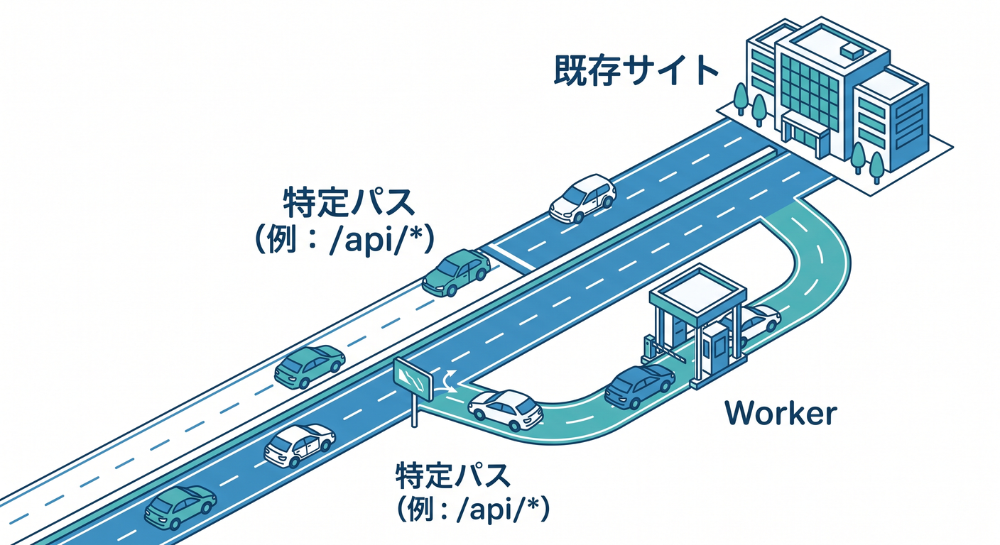
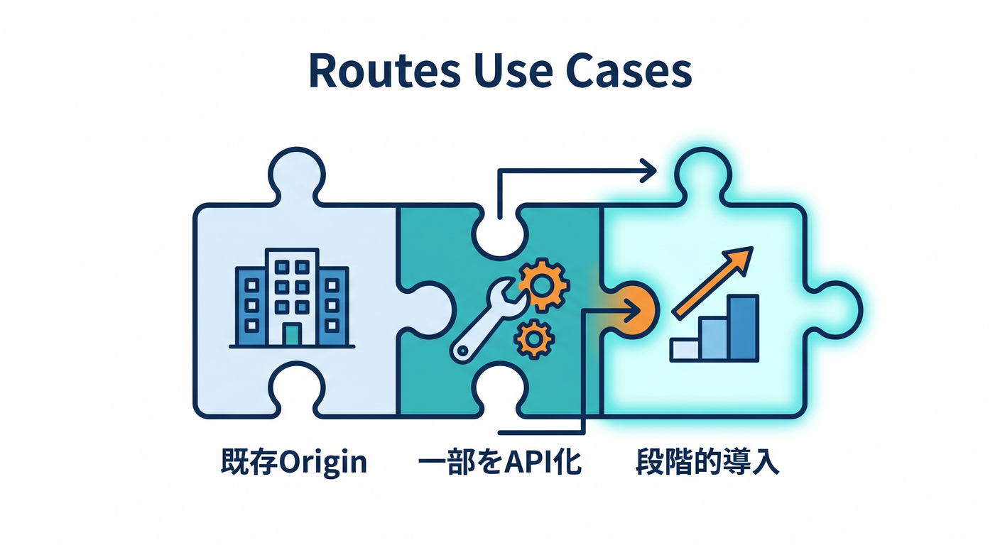
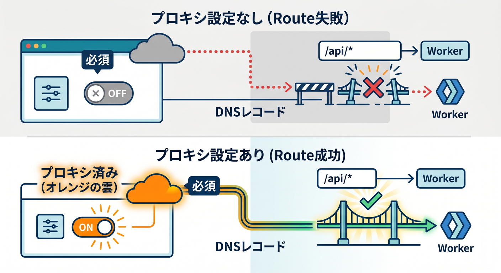
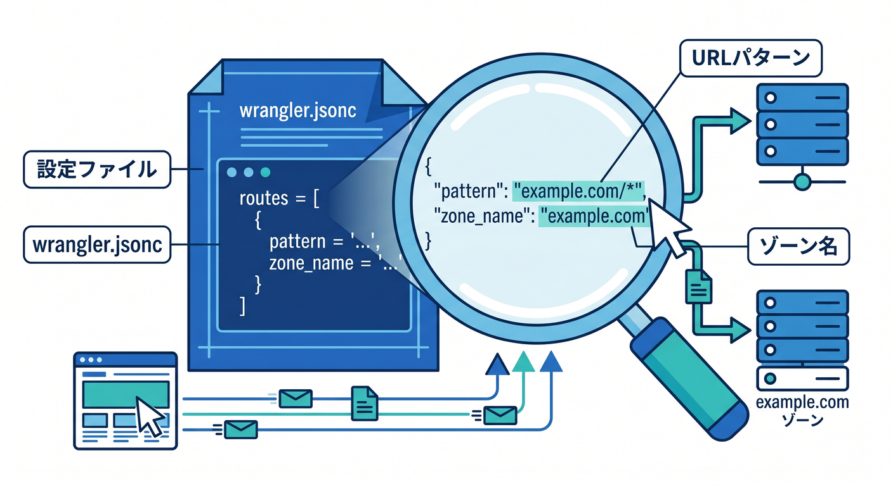
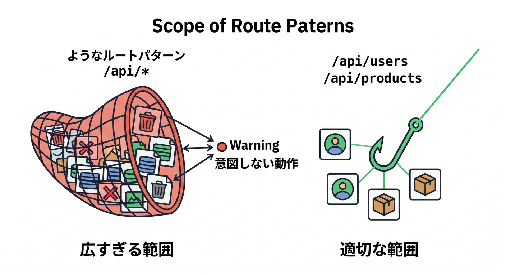
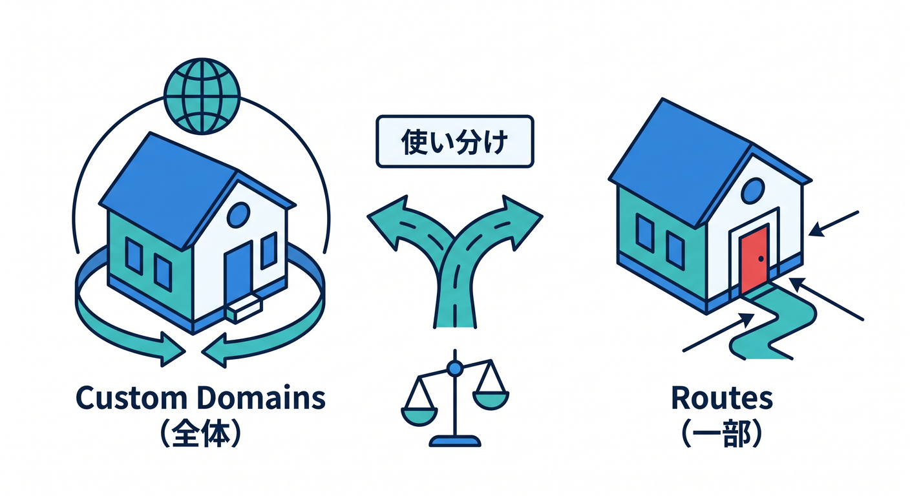

# 第07章：Routesは「既存サイトの前にWorkerを置く」仕組み 🛣️☁️

Routesは、Custom Domainsとよく混ざります。  
でも役割はかなり違います。  
Routesは、すでにあるサイトやoriginの前で、特定のURLだけWorkerを動かしたいときに使う仕組みです 🧭

---

## 1. Routesは「通り道にWorkerを差し込む」イメージ 🚦

Routesでは、URLのパターンに合ったリクエストだけWorkerを通します。  
たとえば次のような形です。

```text
example.com/api/*
```

このRouteを設定すると、`example.com/api/users` や `example.com/api/summary` のようなURLでWorkerを動かせます。  
一方、`example.com/about` や `example.com/blog` は既存サイトへ流す、といった設計ができます。



つまりRoutesは、サイト全体をWorkerにするというより、特定の道だけWorkerへ案内する仕組みです 🛣️

---

## 2. Routesが向いている場面 ✅

Routesは次のような場面に向いています。

- 既存サイトの一部だけWorkerで処理したい
- `/api/*` だけWorkers APIにしたい
- `/form/*` だけTurnstileやRate Limitingと組み合わせたい
- 既存originを残したまま、段階的にCloudflare Workersを導入したい

たとえば、すでに `example.com` でWordPressが動いているとします。  
そこに `example.com/api/*` だけWorkerを追加したいなら、Routesはかなり自然です。



既存サイトを壊さず、少しずつWorkersを足せるのがRoutesの強みです 🌱

---

## 3. Routesにはproxied DNSレコードが必要 ☁️

Routesで初心者がつまずきやすいのがDNSです。  
Routesを使うには、対象ホスト名にCloudflare proxied DNSレコードが必要です。

つまり、`example.com/api/*` でRouteを作るなら、`example.com` がCloudflareを通っている必要があります。  
DNSレコードがない、またはグレー雲でCloudflareを通っていない場合、Workerまで届かないことがあります。



この場合、Workerコードをいくら直しても解決しません。  
まずDNS画面で、対象ホスト名がCloudflareを通る状態になっているか確認します 🔎

---

## 4. `wrangler.jsonc` で書く例 🧾

Routesは、`wrangler.jsonc` に次のように書けます。

```jsonc
{
  "name": "my-route-worker",
  "main": "src/index.ts",
  "compatibility_date": "2026-04-24",
  "routes": [
    {
      "pattern": "example.com/api/*",
      "zone_name": "example.com"
    }
  ]
}
```

Custom Domainの例と違い、`custom_domain: true` はありません。  
ここでは `pattern` にパス付きのURLパターンを書いています。



この違いを見るだけでも、Custom DomainsとRoutesの目的の違いが分かります。

---

## 5. Routeのパターンは慎重に考える 🧠

Routeのパターンは、どのリクエストがWorkerへ行くかを決めます。  
ここを広くしすぎると、意図しないページまでWorkerに流れることがあります。

たとえば、次の2つはかなり意味が違います。

```text
example.com/*
example.com/api/*
```

`example.com/*` はサイト全体に近い範囲です。  
`example.com/api/*` はAPI配下だけです。



初心者のうちは、必要な範囲だけに絞るほうが安全です 🎯

---

## 6. Custom Domainsとの違いをもう一度整理 ⚖️

**Custom Domains**  
`api.example.com` のようなホスト名全体をWorkerに任せる。

**Routes**  
`example.com/api/*` のような一部のパスだけWorkerに通す。

どちらが上位という話ではありません。  
使いたいURL構成と、既存originがあるかどうかで選びます。



迷ったら、次のように考えると楽です。

- Workerが入口そのものならCustom Domains
- 既存サイトの一部に差し込むならRoutes

---

## 7. Copilotに聞くならこう聞こう 🤖

```text
次のURL構成では、Custom DomainsとRoutesのどちらが向いていますか？

- 既存サイト: example.com
- 追加したいAPI: example.com/api/*
- Worker名: my-api-worker

理由と、wrangler.jsonc の設定例を初心者向けに説明してください。
```

設計相談では、既存サイトがあるか、どのパスをWorkerにしたいかを必ず伝えましょう。


---

## 8. 章末チェック ✅

- Routesは特定URLパターンにWorkerを差し込む仕組みだと分かる
- 既存サイトの一部だけWorker化したいときに向いている
- proxied DNSレコードが必要になると分かる
- Routeのパターンを広くしすぎる危険が分かる
- Custom Domainsとの違いを説明できる

この章で覚える一言はこれです。  
**Routesは、既存サイトの通り道にWorkerを置くための仕組みです 🛣️✨**

