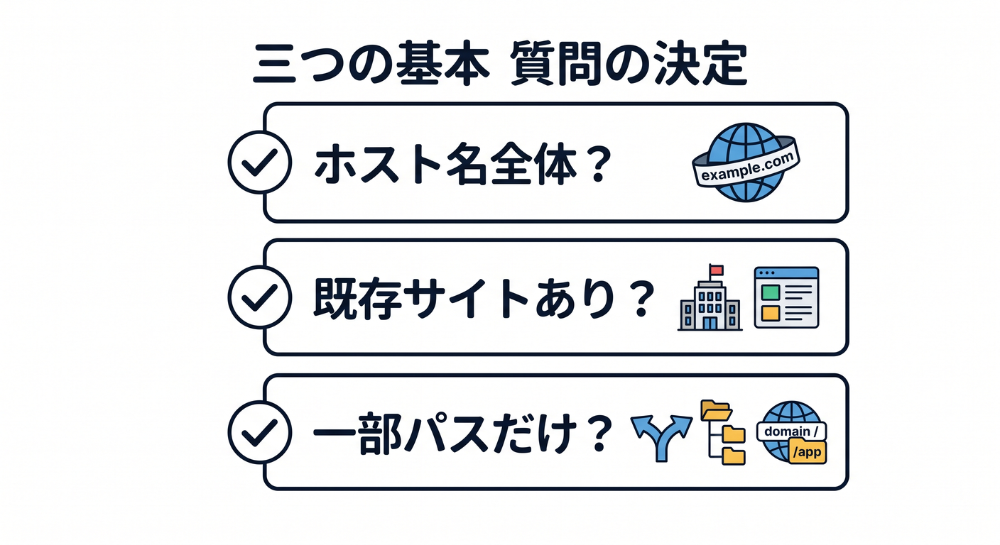
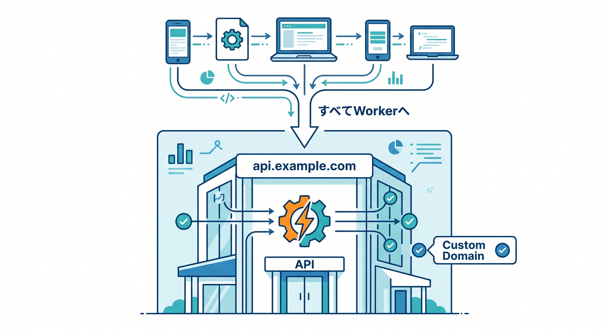
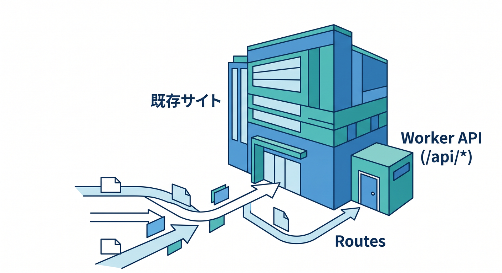
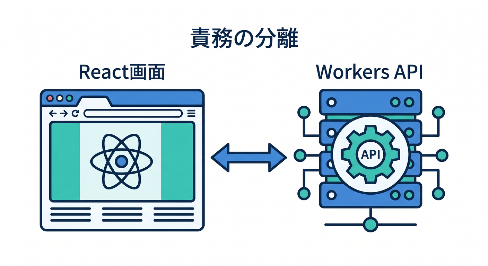
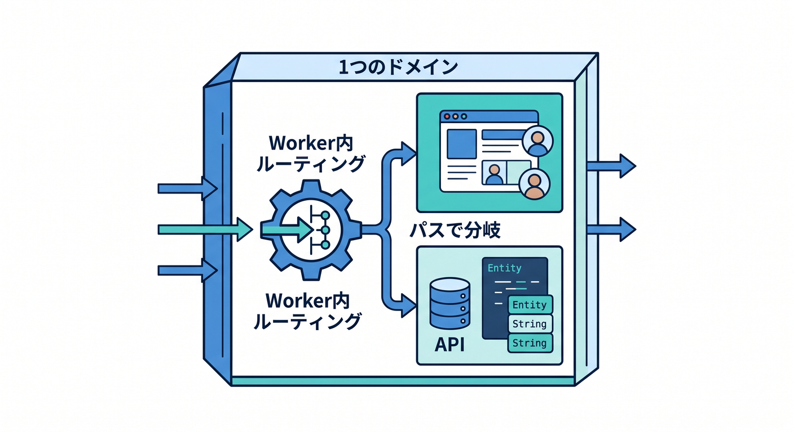
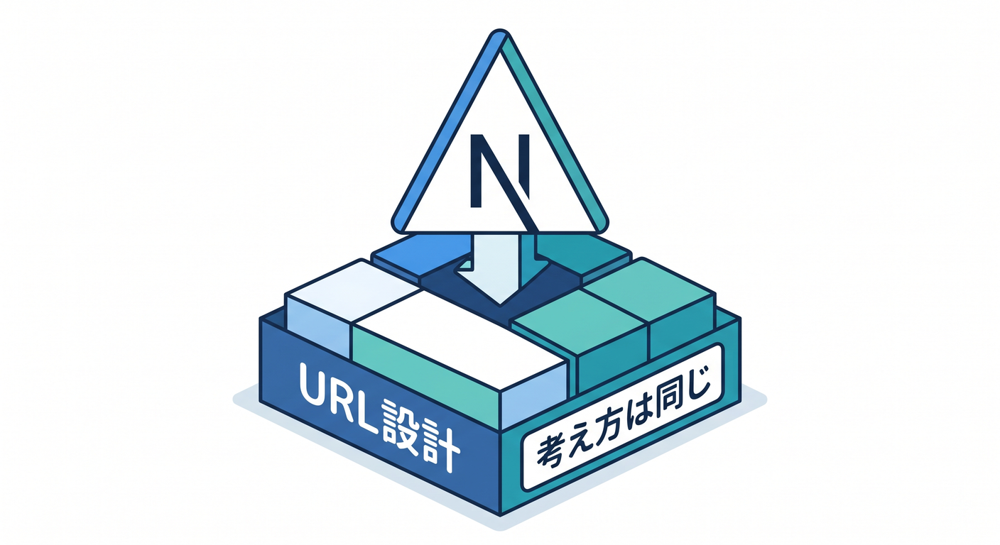

# 第08章：Custom DomainsとRoutesを選ぶ練習をしよう ⚖️🧠

ここまでで、Custom DomainsとRoutesの考え方を学びました。  
でも実際の開発では、「で、今回はどっち？」と迷うことがよくあります。  
この章では具体例を見ながら、用途で選ぶ練習をします 😊

---

## 1. 判断の基本は3つだけ 🧭

まず、次の3つを確認します。

1. Workerにホスト名全体を任せたいか
2. 既存のWebサイトやoriginがあるか
3. 一部のパスだけWorkerで処理したいか

ホスト名全体を任せたいならCustom Domainsが自然です。  
既存サイトの一部だけWorkerにしたいならRoutesが自然です。



設定名から考えるより、URLの設計意図から考えるのがポイントです。

---

## 2. 例1：`api.example.com` を丸ごとAPIにしたい 🏡

この場合はCustom Domainsが向いています。

```text
api.example.com
api.example.com/users
api.example.com/ai/summarize
```

どのパスも同じWorkerで処理したいなら、ホスト名全体をWorkerに任せるほうが分かりやすいです。

`wrangler.jsonc` の例です。

```jsonc
{
  "routes": [
    {
      "pattern": "api.example.com",
      "custom_domain": true
    }
  ]
}
```



API専用サブドメインは、学習用にも実務用にも整理しやすい形です 🔗

---

## 3. 例2：`example.com/api/*` だけWorkerにしたい 🛣️

この場合はRoutesが向いています。

```text
example.com/        → 既存サイト
example.com/blog    → 既存サイト
example.com/api/*   → Worker
```

既存サイトを残しながら、APIだけWorkersで作る形です。  
この場合、`example.com` にCloudflare proxied DNSレコードが必要になります。

`wrangler.jsonc` の例です。

```jsonc
{
  "routes": [
    {
      "pattern": "example.com/api/*",
      "zone_name": "example.com"
    }
  ]
}
```



既存サイトを壊さず、少しだけCloudflare Workersを足したいときに便利です 🌱

---

## 4. 例3：Reactアプリを `app.example.com` に出したい ⚛️

React + ViteのアプリをCloudflare Workersで配信するなら、Custom Domainsが分かりやすいです。

```text
app.example.com
```

画面全体をそのホスト名で見せたいからです。  
さらにAPIを分けるなら、次のような構成もできます。

```text
app.example.com → React画面
api.example.com → Workers API
```



この形は、フロントとAPIの責任が分かりやすいです。  
ただし、別サブドメインになるのでCORSの考え方も必要になります。

---

## 5. 例4：1つのドメインで画面もAPIもまとめたい 🧩

小さなアプリなら、1つのホスト名にまとめる構成もあります。

```text
summary.example.com/        → React画面
summary.example.com/api/*   → API
```

この場合、Custom Domainで `summary.example.com` をWorkerに向け、Worker内でパスを見て処理を分ける方法があります。

たとえば、Worker内で次のように考えます。

```text
/api/summarize → API処理
それ以外       → 静的アセットや画面
```



小さな作品制作では、この構成がシンプルで分かりやすいことがあります ✨

---

## 6. 例5：Next.jsはどう考える？ ▲

Next.jsをCloudflare Workersで動かす場合も、公開URLの考え方は同じです。  
Next.jsそのものに深く入る前に、まず「どのホスト名で見せるか」を決めます。

たとえば、Next.jsアプリ全体を `www.example.com` で公開するなら、Custom Domainの考え方が自然です。  
既存サイトの一部だけNext.jsやWorkerにしたいなら、Routesの発想が出てきます。

この教材ではNext.jsを主役にしません。  
Cloudflareの公開設計を理解するための例として扱います 🧭



---

## 7. 判断表 ✅

迷ったら、次の表で考えます。

| やりたいこと | 向いている設定 |
|---|---|
| `api.example.com` 全体をWorkerにしたい | Custom Domains |
| `app.example.com` 全体をReactアプリにしたい | Custom Domains |
| `example.com/api/*` だけWorkerにしたい | Routes |
| 既存サイトの前で一部だけ処理したい | Routes |
| Workerだけで完結する新規アプリ | Custom Domains |


最初はこの表だけでも十分です。  
細かい例外は、実際に必要になってから学べばOKです 🌱

---

## 8. 章末チェック ✅

- Custom DomainsとRoutesを用途で選べる
- ホスト名全体ならCustom Domainsと判断できる
- 一部パスだけならRoutesと判断できる
- 既存originがあるかどうかを確認できる
- ReactやAPIのURL設計を自分で考えられる

この章で覚える一言はこれです。  
**公開設定は、設定名ではなく「どのURLを誰に任せるか」で選びます ⚖️✨**

